<!-- TOC -->

- [LinkedIn and Git](#linkedin-and-git)
- [Python Experience - ML, LLM and related](#python-experience---ml-llm-and-related)
- [Python experience - ANSYS Commercially shipped products](#python-experience---ansys-commercially-shipped-products)
- [OSS contributions](#oss-contributions)
- [K8s](#k8s)
- [NLP](#nlp)
- [LLMs](#llms)
    - [LLM - Hydra](#llm---hydra)
    - [LLM - Medusa](#llm---medusa)
    - [LLM - Tool calling](#llm---tool-calling)
    - [LLM - Agentic / Pregel](#llm---agentic--pregel)
- [Why Rust](#why-rust)
- [Frontend](#frontend)

```mermaid
timeline
                    
    ❌Scala Stack: C++ → Scala
         : Scala
         : ScalaJS
         : scalablytyped
         : LiftWeb/Play
         : LaminarJS                  
         : HTML/CSS
         : Python
         : zio
         : zio-http
         : zio-grpc

    Rust Stack: Scala → Rust
         : Python
         : Rust
         : React
         : ReactNative
         : MaterialUI/CSS
         : Typescript 
         : JsonRPC
         : OAuth2

    Arch/Deploy: Web/Mobile
         : API Gateway <br> REST/JsonRPC 
         : Gateway ⇄ Worker
         : React web
         : ReactNative mobile
         : WSL2/Linux
         : Microk8s
         : ➕ TGI/vLLM/Ollama
         : ➕ Huggingface Candle
         : ➕ K8s
         : ➕ EDA / KEDA / KNative ❓

    NLP  : POS
         : Semantic Relationship
         : Dependency Parsing
         : CoRef resolution
         : TANL <br>SLM Seq-to-seq
         : LLM Multi shot in-context
         : HuggingFace
         : Spacy

    DL   : Regular networks
         : Transfer learning
         : PEFT/LORA
         : ➕Multi-head hydra
         : ➕Medusa/Hydra branched heads

    LLM  : Prompting
         : COT
         : Tool calling
         : Agentic flow
         : ➕ Diffusion and GAN as agent
         : ➕Unsloth/HF/LORA fine tunes         
         : ❌ LangGraph
         : ❌ LlamaIndex
         : LangSmith / Phoenix Arize ❓
         : Agents node <br>Custom Pregel
         : ➕ Pregel dynamic topology changes
         : ➕ Graph level observability
         : ➕ Batch Graph Optimization
         : ➕ Deepseek/o3 reasoning
```

<!-- /TOC -->

---

The R&D portion of my sabbatical was spent learning about ML/GenAI/LLM: by working toward a project delivered via web services. My goal was to explore and build up enough solutioning vocabulary in this new and exciting space: building a test-bed for experimentation was the first step. To keep me focused, I had chosen a concrete use cases of **text → animation** _(3D skeletal/IKE)_. The journey into these domains entailed a lot of switchbacks between breadth-first discovery and depth-first drill-downs. I also periodicaly refocussed on end-to-end progress so I wouldn't get stuck in rabbit holes. Consequently, many threads of exploratory study were being juggled, back-burnered, resumed or abandoned. The rapidly evolving landscape, while exciting, was also exhausting and frequently obsoleted my plans. Ultimately though, an agentic runtime based on a Pregel implementation seemed to be a key enabler: something that offered tantalizing possibilities for graph evolution and optimization in an LLM centered world.

## LinkedIn and Git

 - [LinkedIn Profile](https://www.linkedin.com/in/vamsidharjuvvigunta/)
 - [Github](https://github.com/vamsi-juvvi)

## Python Experience - ML, LLM and related

 - Exploring Prompting techniques via OpenAI's chat interface in python. Deeplearning.ai courses.
 - Parse the IMSDB _(dataset on HF containing movie scripts)_ into structured output using `gpt-4o-mini`. That eventually failed because OpenAI thought it violated a content-filter. Switched to writing a traditional ANTLR based parser to read the format instead (also using python)
 - Exploring word embedding models and APIs
 - Explore Gradio
 - Explore various parts of an NLP pipeline

## Python experience - ANSYS Commercially shipped products 

I have good experience in production quality python code. I initiated and created the Python scripting framework used by all of Ansoft's simulation products _(Now ANSYS. Ansoft has been folded into ANSYS's electromagnetic simulation suite)_. The infrastructure work I did for this effort was non-trivial. Note that ANSYS/Ansoft has a huge installed base and used in practically every engineering, electronics and circuit-design company.
 - C++ runtime hosting .NET Runtime, taking care of keeping UI thread unblocked etc.
 - .NET runtime hosting the IronPython runtime
 - Bootstrapping _(think BIOS)_ C++ function pointers over to .NET and .NET functions over to C++. Both stored as opaque handles. An initial python module loaded at init time continues the initialization in python space.
 - Python modules to prepare the programming environment for the scripting scenario _(logging, obtaining the main control object, alerts etc)_
 - COM objects _(out C++ side scripting interface)_ were dynamically introspected at runtime and the definition is sent out as XML to the IronPython side. Heavy uses of `hasattr()`, `getattr()`, `setattr()` and `__call__` convert this XML into callable interfaces. Custom implementation of `doc` and `help` to explore the methods in various objects was also provided.
 - Python calls would be marshalled across to C++ as command sepecifications and executed on the COM servers on the C++ side

On top of this, I replaced Ansoft's existing C _(dynamically loaded shared libs)_ plugins with Python plugins. Each plugin surface utilized it's own AppDomain _(.NET isolation concept)_ and had it's own python initialization modules and base-classes that the scripting user could extend. Later toward 2018 or so, I started an effort to convert the underlying COM objects into gRPC protobufs and custom python code-generation from the proto files.

 - [The VB to IronPython translation document that I authored](https://www.youtube.com/watch?v=OSvnPwr6WhI) at the 1min mark.
 - [Python script recording](https://www.youtube.com/watch?v=0p6o3kjOnAI) around the 2 min mark  _(I also maintained the 3D rendering infrastructure, the math expressions parsing and created/maintained our custom Antlr based parser for the in-house micro-services)_.
 - [Ansoft post-processing plots]() at 3:27 mark, 5:08 mark shows some sample screens of the post-processing. I am the primary author of all the plotting and on-plot measurement tools _(OpenGL, C++)_. Quite proud of the longevity of my code and how well it all turned out. The [eye diagrams](http://www.mweda.com/designer/ansoft-designer/reports/EyeMeasurements.htm) and their measurements in particular.

## OSS contributions

  - **rust-web-app** 
    - [architecture notes on github](https://github.com/vamsi-juvvi/rust-web-app/tree/main/docs/00_base-rust-web-app)
    - Refactor rust-web-app
      - [Design/Coding docs](https://github.com/vamsi-juvvi/rust-web-app/tree/main/docs/01_refactor_lib_rpc_lib_web)
      - [Jeremy Chones video describing the PRs - 2 Cool Pull Requests for Rust Web App Blueprint](https://www.youtube.com/watch?v=MHwpSZA2uNA) 
    - [👉 PR: Adding gateway/worker architecture](https://github.com/vamsi-juvvi/rust-web-app/pull/1) needed the previously done refactoring split. I then proceeded to build a prototype _(which I use as my main testbed)_ that takes a `Gateway` which routes incoming RPC calls to different workers based on URL.
      - [Design docs](https://github.com/vamsi-juvvi/rust-web-app/tree/main/docs/02_worker_architecture)
 - **rust-genai**
   - [👉 PR: Adding function calling to OpenAI/Groq adapters ](https://github.com/vamsi-juvvi/rust-genai/pull/1) _this was ultimately not merged as the author Jeremy Chone wanted to go a different direction_
     - [Design/Code docs for the PR](https://github.com/vamsi-juvvi/rust-genai/blob/function_calling_openai/docs/add-function-calling/0-AddingFunctionCallingToGenAI.md) extensively documented this as it was an unsolicited PR into another author's repo and there were a lot of changes: I wanted to show that I had taken plenty of care to be a good guest.
     - [👉 Documentation for get_weather tool calling example](https://github.com/vamsi-juvvi/rust-genai/blob/function_calling_openai/docs/add-function-calling/c06-code-and-traces.md) compares OpenAI's references python impl with the rust one I created.
     - [👉 Documentation for set_temperature IOT tool calling example](https://github.com/vamsi-juvvi/rust-genai/blob/function_calling_openai/docs/add-function-calling/c07-code-and-traces.md) a more complex example that requires the LLM to sequence two tool calls in the right order.
 - **React frontend to Rust Web App** (WIP) 
   - Sample react front-end with athentication, session and refresh tokens, OAuth2 google/github auth with examples hitting various backend jsonrpc authenticated APIs.
   
## K8s

Concluding in early 2022 that K8s offered the most flexible way of deploying services, I decided to build one in my home-lab. A major consideration against using google or amazon's K8s during the learning phase was that I might end up with wayward resource usage and ruinously high bills.

 - Custom air-cooled 32 core Threadripper and 2x GPUs in a 4U case. 4U cases don't accomodate tall fans and normally need water cooling with threadripper/epyc CPUs, however, custom high rpm push/pull fans and large static pressure intake fans helped keep it running cool with a short cooler.
 - 6 small 4 core NUCs, 10Gbe/SFP/QSFP neworking and a 10Gbe NAS to handle k8s volume claims.
 - Ubuntu `MAAS` to provision the bare metal fleet. The key to using off the shelf PCs/servers: incorporating a networked PDU _(controlled via snmp)_ to overcome the lack of BMCs _(like iDRAC, vPro, iLO etc)_. 
 - Ubuntu `juju` to deploy K8s and then Kubeflow on the cluster
 - Custom `juju` charm to make a local NFS volume claim work: only serious block-storage based plugins were available in 2022.

The cluster and bare metal management worked great. Late 2023 though, WSL2 on windows enabled `systemd` and consequently I could install `microk8s`: that and a local docker registry running on WSL2 completed my deployment environment. Around that time, WSL2 also gained CUDA acceleration via host GPU. This meant that I used my dev WSLs over my clusters and the cluster remained unused. However, the learning was valuable.

Actually deploying on K8s, while theoretically nice-to-have, turned out to not be conducive to fast dev iterations:

 - Docker images take a long time to upload
 - Deliberate planning is needed to build docker images in layers so only the top-most layer is modified on edits: this enables relatively fast push and pull.
 - Local docker registry needed to avoid going to docker.com proper which will take forever unless you have a very fast upload pipe
 - [Ubuntu MAAS - setting up a bare-metal cluster](./K8s/1-maas-onprem-cloud.md)
 - [Setting up Microk8s](./K8s/1-microk8s.md)
 - [Ubuntu Juju](./K8s/2-juju.md)
 - [Using Juju to deploy K8s](./K8s/3-juju-k8s.md)
 - [Juju and Storage](./K8s/4-juju-k8s-storage.md)
 - [Juju and RemoteNFS charm](./K8s/4-juju-remotenfs-charm.md)
 - [KServe based deployment of a BERT Sentiment classifier on K8s](./K8s/K8s_Deploy_HuggingFace_Sentiment_KServe.md)

## NLP

> Mostly taken a backseat to LLM usage but I have a lot of jupyter notebooks and notes. Can share if needed

Pre-ChatGPT era, NLU needed one to grok NLP. Study areas included dependency parsing, POS and CoRef resolution. Explored Spacy, Stanza and some HuggingFace libraries.

Early papers suggested that BERT and the like were not particularly great at NLP tasks _(latency, accuracy)_. However, later on, there was this great paper out of Amazon [Structured prediction as translation between augmented natural Languages (TANL)](https://arxiv.org/pdf/2101.05779) that modeled traditional NLP problems as a seq-to-seq translation [amazon-science/tanl](https://github.com/amazon-science/tanl). They use a fine-tuning of FLAN and ended up with a small inference model that can be run locally. My goal was to extract the annotations and annotation parsing they used, and subsequently, employ them in multi-shot/in-context learning or in fine-tuning of current models like quantized versions of Qwen or Llama.

 - [Github Fork of TANL- Notes, Plan and Progress on use of TANL research code](https://github.com/vamsi-juvvi/tanl/blob/main/notebooks/TANL.md)
 - [Github Fork of TANL - Collection of notebooks to explore TANL annotations](https://github.com/vamsi-juvvi/tanl/tree/main/notebooks)

With all the LLM hype, Late 2023, I started switching periodically to see what the latest LLM stuff could do and at some point decided to explore how much could be done with plain LLM API calls. My conclusion: focus predominanty on LLMs but keep traditional NLP in mind too.

>Basic NLP tasks can still be relevant in the LLM era. You want low latency, predictability vs creativity and synthesis: however, you can take advantage of language understanding baked into the SLM/LLM. Since you typically have task-specific fine-tuning _(POS, NER, CoRef, SRL etc)_, it is worth a look to see if a multi-headed approach can put each of these tasks into separate fork all sharing the same backbone. The hope is that a single forward pass will yield multiple task-specific outcomes and avoid the latency/cost of multiple forward passes.
>
> NLP tasks like NER are also valuable in RAG for better query embedding.

## LLMs

LLMs have been a big focus area the last two years.

 - Initially, simple prompting of OpenAI in notebooks to explore things
 - Expanding to tool usage
   - Simple OpenAI tools
   - My rust stack included the `rust-genai` crate: a way to send a prompt/context to any of N LLM end point. It did not have tool support. I forked it, added tool-calling support for OpenAI and sent a PR.
 - Prompt optimization techniques   
   - Prompt engineering had a lot of hype and newer techniques were constantly being introduced: _(think step by step)_. However, parallelly, a body of research showed that there was a lot of gains to be had in machine optimizing prompts. The takeaway: 
     - Treat the graph containing the prompt and it's outputs as a graph.
     - Genetic evolution _(via LLM)_ of the prompt provides input samples/variations
     - LLM as judge evaluates which of the N inputs produced the best output, LLM based differentiability! 
     - Thus we have a forward pass, differentiability and a backward pass to bake the gradient in.
     - Pointed toward the power of a system design vs a lone LLM.
 - Agentic networks  
   - Since single-prompt use-cases were simply degenerate, single-node, agentic networks, decided to start with a framework where I could start from prompts and evolve into a graph.
   - Pointers to `pregel` lead to a study of neo4j's and databrick's pregel interfaces. Recognizing that pregel's super-step structure allowed for graph morphing between super-steps, I decided to build my own so I could keep that possibility center. Not only can you use agents in a graph, but you can change the graph dynamically _(LLM or JIT Optimization driven)_ throughout the execution. Tantalizing possibilities.
 - My notes   
   - [LLM Agents.md](./LLM/LLM_Agents.md) includes agent frameworks and pregel
   - [LLM AutomaticPromptOptimization.md](./LLM/LLM_AutomaticPromptOptimization.md)
   - [LLM FineTuning.md](./LLM/LLM_FineTuning.md)
   - [LLM FLAN_InstructionTunedT5.md](./LLM/LLM_FLAN_InstructionTunedT5.md)
   - [LLM LearnPrompting_Advanced_2024.md](./LLM/LLM_LearnPrompting_Advanced_2024.md)
   - [LLM LearnPrompting_Agents_2024.md](./LLM/LLM_LearnPrompting_Agents_2024.md)
   - [LLM LearnPrompting_Intermediate_2024.md](./LLM/LLM_LearnPrompting_Intermediate_2024.md)
   - [LLM LearnPrompting_Basic_2024.md](./LLM/LLM_LearnPrompting_Basic_2024.md)
   - [LLM MultiPersonaSelfCollaboration_2024.md](./LLM/LLM_MultiPersonaSelfCollaboration_2024.md)
   - [LLM PreventPromptInjection.md](./LLM/LLM_PreventPromptInjection.md)
   - [LLM Prompt_LLMCreatesBlueprint.md](./LLM/LLM_Prompt_LLMCreatesBlueprint.md)
   - [LLM Prompt_LLMCreatesBlueprint_Teaching.md](./LLM/LLM_Prompt_LLMCreatesBlueprint_Teaching.md)
   

### LLM - Hydra 
 - https://pyimagesearch.com/2022/08/17/multi-task-learning-and-hydranets-with-pytorch/
 - https://github.com/extremebird/Hydra is a gem. Tons of stuff in there to chew on for a long time.
 - [multi-head LORA for PEFT](https://arxiv.org/pdf/2309.06922)

When they talk about _Hydra_, it seems to be a _small H: hydra_: a split, utilizing the adapter model (_so two heads_). Not the actual HydraNet arch from Karpathy's AI talk which talks about multiple actual outputs from the same shared backbone.

Still, seems useful. Primarily:
 - `Paralell Adapter` learns new patterns based on fine-tuning data
 - `Series Adapater` learns to combine existing/latent pre-trained knowledge in new ways for the target task

### LLM - Medusa

An architecture along the lines of Karpathy's HydraNet _([used in Tesla FSD's inference with sensor fusion - 7 min mark](https://www.youtube.com/watch?v=3SypMvnQT_s))_

[Medusa: Simple framework for accelerating LLM generation with multiple decoding heads](https://www.together.ai/blog/medusa)

This is based on [Stern et al., 2018](https://arxiv.org/abs/1811.03115) but that paper is about LLM architectures and paralellizing the token generation streams. This way multiple streams are generated in paralell and only one of them is selected. In grammar terms, conceptually going with a lookahead-assertion but where possible, branches are evaluated parallelly.

### LLM - Tool calling

   - Contributed a PR [👉 Adding function calling to OpenAI/Groq adapters ](https://github.com/vamsi-juvvi/rust-genai/pull/1) adding tool-call support to the `rust-genai` library.
     - tools are modeled as Rust closures/lambdas that take a single struct param
     - struct param and function automatically converted to the JSON schema that OpenAPI requires for tool definitions.
     - The changes were extensive and hence heavily documented, however, ultimately, the main author (Jeremy Chone) declined to merge and decided to go a different route.
   - Feb 2024, orphaned my fork of genai and rebuilt it as a layer based on genai's new tool call support.

### LLM - Agentic / Pregel

   - Agentic hype was off the charts starting mid 2024
   - The underlying insight was that systems incorporating LLMs offered vast scope for tuning, control and optimization: the prompts used by individual nodes in such systems tend to be simpler and demanded less of an LLM _(consequently can use smaller LLMs)_.
   - The exact definition of an agent is almost beside the point, any executable node/function will do as a node in the graph.
   - Prompt Optimization and custom ensemble-of-experts, GANs etc all could be composed into a system: endless possibilities.
   - A simple prompting use-case is just a degenerate, single-node network. Thus, I decided to base future efforts on fleshing out an agentic framework.
   - Explored LangChain/LangGraph and LLamaIndex. Ultimately was disappointed, among other things _(shared input context with risk of races, outputs were dict slices into the same big dict, collision headaches)_, they had hidden the `Pregel` basis of their graphs. I thought this oversimplified the APIs and hid the possibilities of runtime graph evolution _(among other pregel properties)_.
   - Built my own `Pregel` implementation in rust sticking close to the original papers _(neo4j and databricks have their own pregel APIs which were instructive)_
     - Pure message passing eliminates data races
     - Each `super-step` involves async execution of a subset of nodes and a join that waits for all. _(With a possibility of any-of, all-of, a/b in the join)_
     - All super-step outputs are usable as graph-outputs instead of forcing a synthetic stop node into the graph.
     - Direct messaging outside of restricting data flow along edges
     - graph-level instrumentation to attach token/latency costs to edges and allow for graph algos to find shortest-paths/cheapest-cost at runtime based on server latency and such. Not sure if this will end up being practical but the possibility exists. Such evolution can be explored if you don't bury the graph structure under your APIs.

## Why Rust

Around early 2024, I decided to abandon scala and switch to Rust. Among the many things that made me move.
 - Scala's lack of atleast one well documented and supported stack _(twitter's finagle/finch, liftweb, play, scalatra etc)_
 - Multiple competing and political moadic effects libraries _(zio, cats)_
 - Disintegration of lightbend
 - Talk of direct-scala, direct-zio muddying the waters with upcoming syntax changes
 - _J. De Goes_, The Zio guy, switching to rust
 - The number of extremely smart people around rust
 - Microsoft and Linux adoption of rust
 - HuggingFace's fast tokenizers were written in rust
 - HuggingFace's candle is an all-rust runtime for any HF model you can download.
 - Well supported web frameworks _(axum)_ with excellent ergonomics and DX.
 - WebAssembly, WebView based desktop apps, WebServers cover the many widely used deployment platforms: all based on the same library code. This holds a lot of promise. With AI PC's expected to come soon, the idea of your GPU accelerated code running on the browser via WebAssembly or as a desktop app via Tauri all with the same underlying library/crates sounds like a valuable possibility.
 - The beauty of functional coding, no garbage collection and no category-theory fanaticism that sometimes infects scala/zio/cats groups.
 - All you need is VSCode!
 - [2024 Rust start and OSS contributions](./Rust/Rust_2024_StartAndOSS.md) 
 - [2025 Loving intermediate rust](./Rust/Rust_2025_Intermediate.md)
      
## Frontend

I have some experience with front-end development. Current experience in the web domain is with a React stack _(past experience ranged from plain HTML/CSS to ScalaJS and Laminar)_.

 - React/Js/Ts/CSS for front-end _(previously ScalaJS & Laminar)_
 - ReactNative for Mobile
 - Both communicating over JsonRPC to backend server and authN via JWT _(OAuth2 is WIP)_

[👉 Code - The React Frontend which talks to my rust web-server](./React/frontend/)