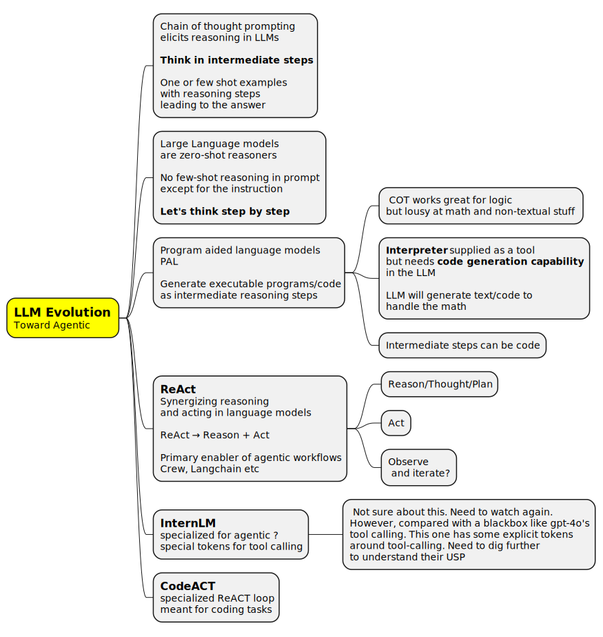
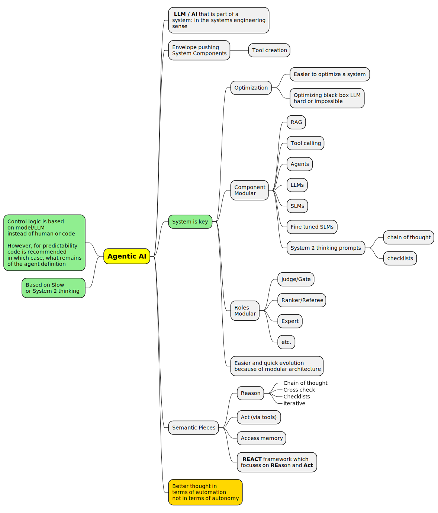
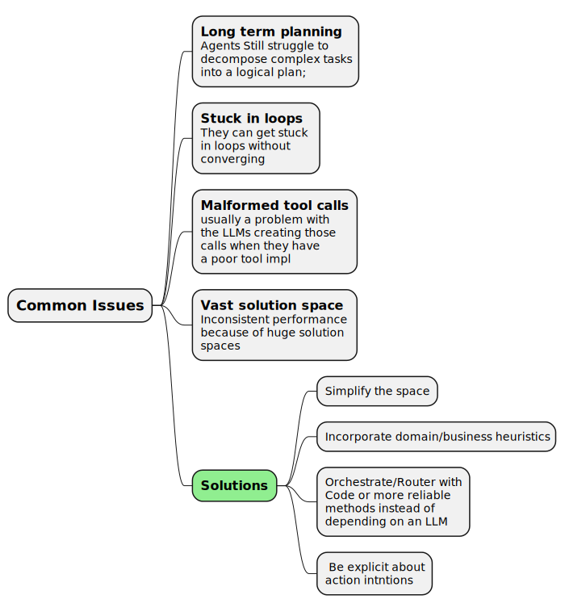
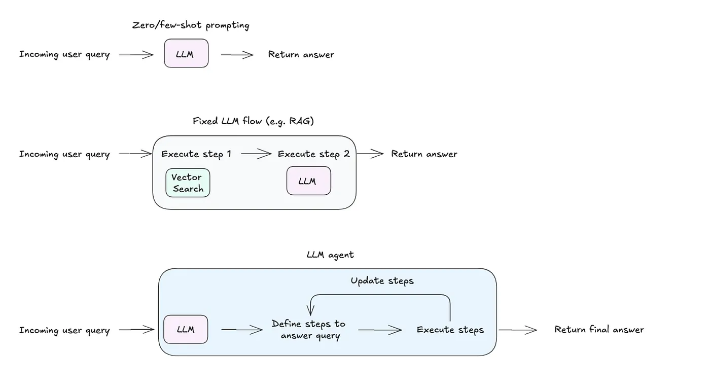
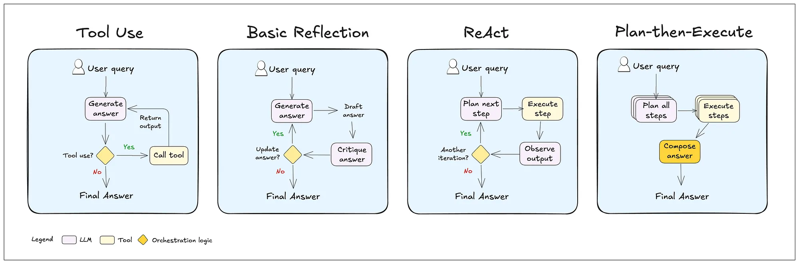
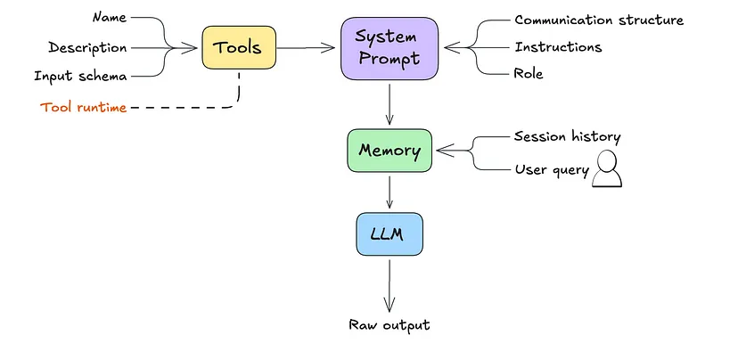
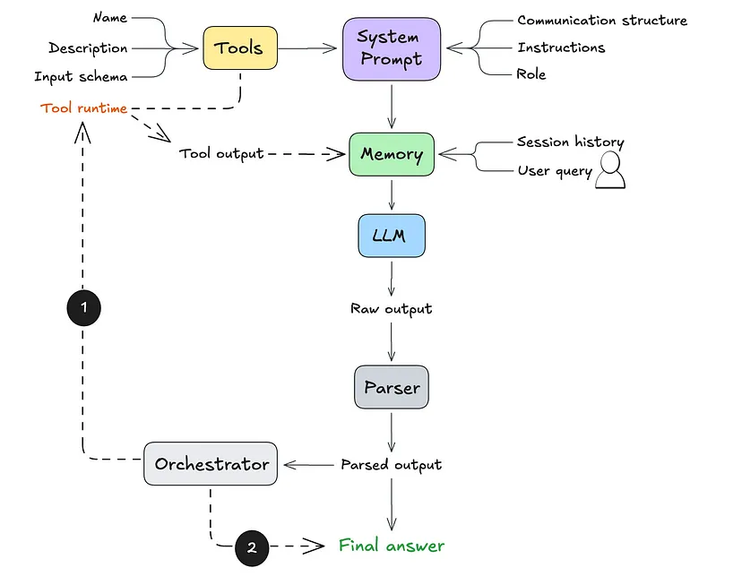

# LLM Agents

**Resources**
 
 - [2024 - Aparna Dhinkaran - Claiming ReAct is dead](https://towardsdatascience.com/navigating-the-new-types-of-llm-agents-and-architectures-309382ce9f88)
 - [2023 - ReAct: Synergizing Reasoning and Acting in Language Models](https://arxiv.org/pdf/2210.03629)
 - [Jay Alammar on LLM Agents with tool use](https://www.youtube.com/watch?v=5drn2DO7gNY)
 - [IBM Overview video](https://www.youtube.com/watch?v=F8NKVhkZZWI)

The concept of `agents` evolved from various efforts to work around LLM limitations and compound the capabilities by utilizing multiple LLMs in a system.

Some of the relevant points along the path to agents are listed below.



# LLM research findings which enable agents

[Donato Capitella - LLM Chronicles #6.4: LLM Agents with ReAct (Reason + Act)](https://www.youtube.com/watch?v=WKTNxaZJf4Y)



The papers referenced. All roughly circa 2022 mostly by Google. Some by CMU.

 - [Chain-of-Thought Prompting Elicits Reasoning in Large Language Models](https://arxiv.org/abs/2201.11903)
 - [Large Language Models are Zero-Shot Reasoners](https://arxiv.org/abs/2205.11916)
 - [PAL: Program-aided Language Models](https://arxiv.org/abs/2211.10435)
 - [ReAct: Synergizing Reasoning and Acting in Language Models](https://arxiv.org/abs/2210.03629)
 - [InternLM: Executable Code Actions Elicit Better LLM Agents](https://arxiv.org/pdf/2402.01030), [github](https://github.com/InternLM/InternLM)
 - [OpenDevin CodeACT](https://xwang.dev/blog/2024/opendevin)


## What is an Agent

The definition seems very loose. 

**The wishful definition**: Agents are AI components that can effectively replace a specialized human: a high level description of a task is all that is needed. Everything else a person would do, the `agent` should:

 - research
 - plan
 - build helper tools as needed
 - execute
 - collaborate with other experts
 - check and validate the output


**The reality** : Agents are software systems which are more than simply feeding a prompt to an LLM

 - Tool call
 - RAG and refinement
 - Other LLMs providing feedback and keeping the main LLM on track
 - Other LLMs providing an ad-hoc MOE
 - These are on a spectrum and folks call everything an agent.

The accepted definition these days (Oct 2024) is somewhere in the middle




[Maya Murad - How to build a general-purpose agent](https://towardsdatascience.com/build-a-general-purpose-ai-agent-c40be49e7400) has this nice progression.



 - A simple prompt and one-shot LLM call is an agent _(a highly degenerate one)_
  - System prompt
  - user prompts
  - memory _(chat session)_
 - Add on as many of the pieces as needed
   - Tool calling
   - router/planner
   - memory
   - feedback
   - execution graph to feed other pieces or other agents   

It can evolved along the following directions _(these are standard. Nothing stops you from inserting any block in the graph)_




### Agent flow - Prompt plus memory



 - When using a chat end-point, memory is simply the histoyr of the interactions starting from the system prompt
 - So `System Prompt + User Prompt + Memory` is pretty much the most basic degenerate version of an agent.

### Agent flow - Prompt plus memory plus orchestrator



## Pregel

Google came out with something called `pregel` as a framework for executing tasks on a graph. This is beyond simple data-flow but also control, early termination etc. A lot
of the python agentic frameworks _(graph based)_ similar but not close. For google, this is the theoretical underpinning of their entire page-ranking algorithm. So a huge deal and battle-tested abstraction.

Ultimately, one ends up re-inveting some fraction of this functionality so is it worth starting with a pregel alogorithm built on a graph ?

 - ⬛ Add details of pregel impl from neo4j
 - ⬛ Simple pregel skeleton impl on Rust
   - ⬛ Research and use Graph lib on rust
   - ⬛ Add details of pregel impl from neo4j
   - ⬛ Pregel Nodes
     - data-port in
     - data-port out       
     - control port in-out
     - observability port wrapper..
   - ⬛ Rust structs (Ser/De) and mpsc message passing ? or direct invocation

## Perspective - Aparna Dhinakaran

https://towardsdatascience.com/navigating-the-new-types-of-llm-agents-and-architectures-309382ce9f88


# Building a general-purpose Agent

 [Maya Murad - How to build a general-purpose agent](https://towardsdatascience.com/build-a-general-purpose-ai-agent-c40be49e7400)
 
 **Takeaway**: An AI agent can describe everything from a simple-prompt all the way to an interative process involving multiple models entirely controoled by a model/llm. This makes it a reasonable abstraction to start with _(barebones prompt as it's most degenerate implementation)_ and slowly add pieces as needed.

 Use the following benchmarks to pick the right LLM based on how you want to grow the agent.

 - [Massive Multitask Language Understanding (MMLU)](https://paperswithcode.com/sota/multi-task-language-understanding-on-mmlu) (reasoning)
 - [Berkeley’s Function Calling Leaderboard (tool selection & tool calling)](https://gorilla.cs.berkeley.edu/leaderboard.html)
 - [HumanEval](https://evalplus.github.io/leaderboard.html) and [BigCodeBench](https://huggingface.co/spaces/bigcode/bigcode-models-leaderboard) coding.

---

[Aparna Dhinakaran - Choosing between LLM agent frameworks](https://towardsdatascience.com/choosing-between-llm-agent-frameworks-69019493b259)
 


## Examples from BEE agent framework

This is taken from [Maya Murad - How to build a general-purpose agent](https://towardsdatascience.com/build-a-general-purpose-ai-agent-c40be49e7400). Bee is from IBM.

### Bee system prompt

```
# Communication structure
You communicate only in instruction lines. The format is: "Instruction: expected output". You must only use these instruction lines and must not enter empty lines or anything else between instruction lines.
You must skip the instruction lines Function Name, Function Input and Function Output if no function calling is required.

Message: User's message. You never use this instruction line.
Thought: A single-line plan of how to answer the user's message. It must be immediately followed by Final Answer.
Thought: A single-line step-by-step plan of how to answer the user's message. You can use the available functions defined above. This instruction line must be immediately followed by Function Name if one of the available functions defined above needs to be called, or by Final Answer. Do not provide the answer here.
Function Name: Name of the function. This instruction line must be immediately followed by Function Input.
Function Input: Function parameters. Empty object is a valid parameter.
Function Output: Output of the function in JSON format.
Thought: Continue your thinking process.
Final Answer: Answer the user or ask for more information or clarification. It must always be preceded by Thought.

## Examples
Message: Can you translate "How are you" into French?
Thought: The user wants to translate a text into French. I can do that.
Final Answer: Comment vas-tu?
```

 - Markdown format
 - Looks ridiculously complicated. Seems like it should be split into multiple calls to maybe different LLMs.


### Bee instructions

```
# Instructions
User can only see the Final Answer, all answers must be provided there.
You must always use the communication structure and instructions defined above. Do not forget that Thought must be a single-line immediately followed by Final Answer.
You must always use the communication structure and instructions defined above. Do not forget that Thought must be a single-line immediately followed by either Function Name or Final Answer.
Functions must be used to retrieve factual or historical information to answer the message.
If the user suggests using a function that is not available, answer that the function is not available. You can suggest alternatives if appropriate.
When the message is unclear or you need more information from the user, ask in Final Answer.

# Your capabilities
Prefer to use these capabilities over functions.
- You understand these languages: English, Spanish, French.
- You can translate and summarize, even long documents.

# Notes
- If you don't know the answer, say that you don't know.
- The current time and date in ISO format can be found in the last message.
- When answering the user, use friendly formats for time and date.
- Use markdown syntax for formatting code snippets, links, JSON, tables, images, files.
- Sometimes, things don't go as planned. Functions may not provide useful information on the first few tries. You should always try a few different approaches before declaring the problem unsolvable.
- When the function doesn't give you what you were asking for, you must either use another function or a different function input.
  - When using search engines, you try different formulations of the query, possibly even in a different language.
- You cannot do complex calculations, computations, or data manipulations without using functions.m
```