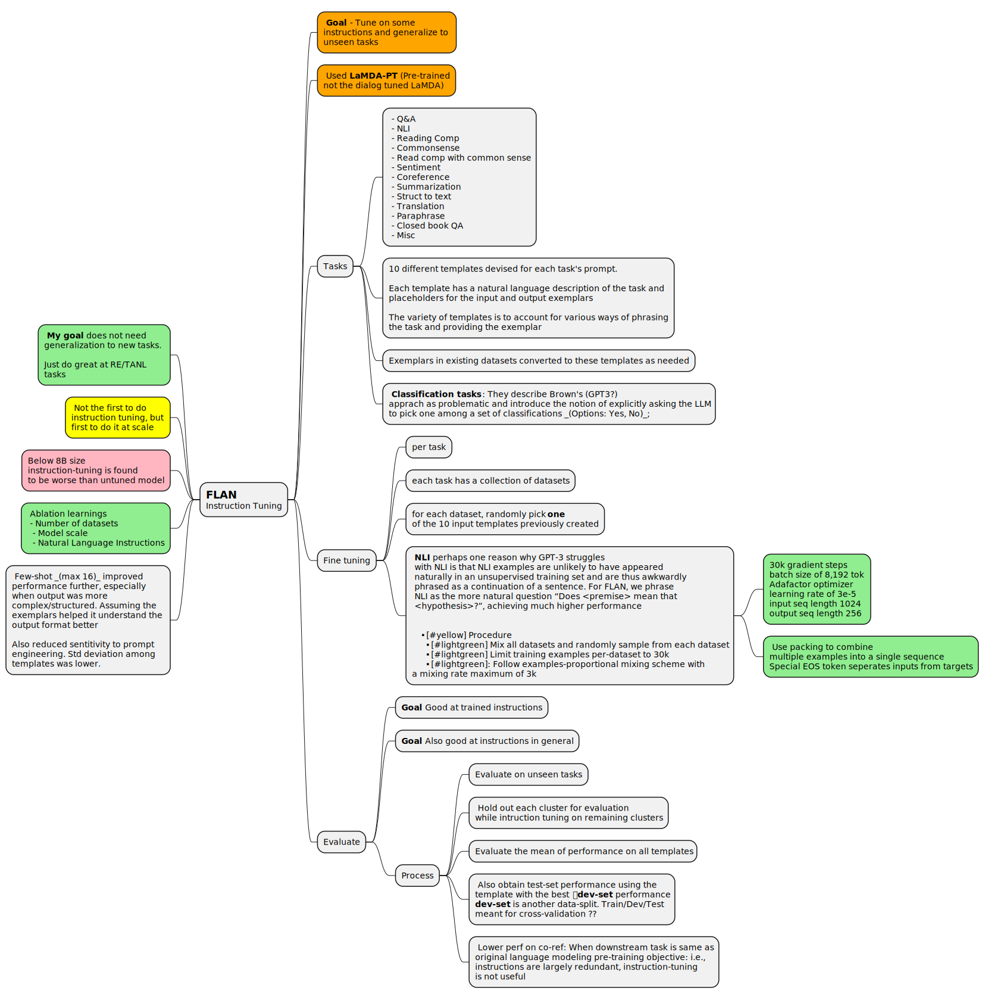
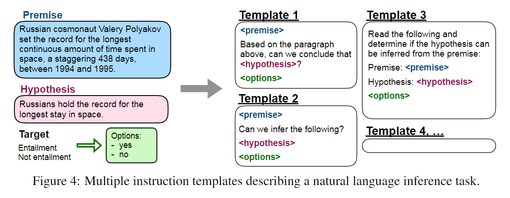
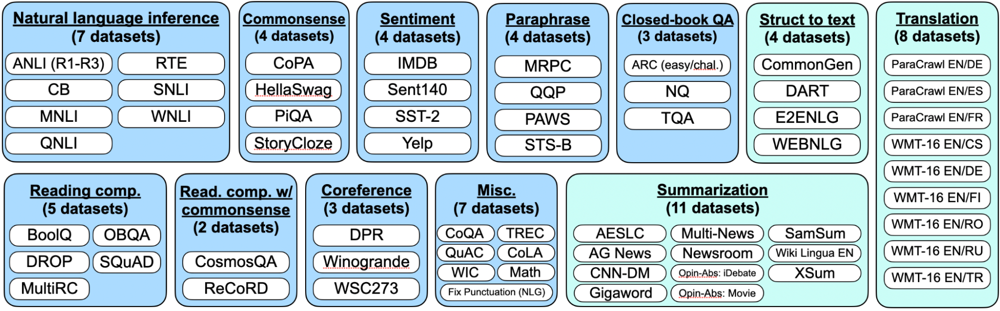
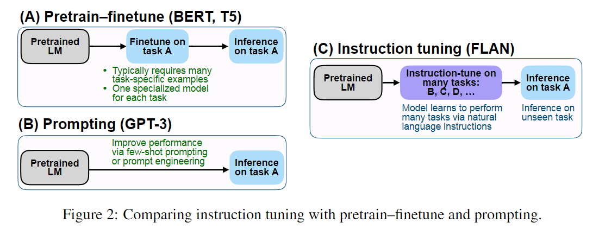

# Flan t5 - Instruction tuning T5

 - [Fine tuned language models are zero-shot learners](https://arxiv.org/pdf/2109.01652.pdf)
 - https://research.google/blog/introducing-flan-more-generalizable-language-models-with-instruction-fine-tuning/

> Asks the question: **does finetuning a model on a collection of tasks phrased as instructions improve its performance on unseen tasks?**
>
>This technique formulates a task based on text that a language model might have seen during training. The model then _generates_ the answer by _completing the text_.
>
> The `zero-shot` comes from the fact that the model was trained generally (_pre-trained on a large corpus Same objectives as BERT ?_). It can then use the knowledge encoded in it's weights to tackle new tasks purely based on language understanding.
>
>
> 👉 Tips to learn from how they generalize and how to avoid overfitting. Likely applies heavily to any fine-tune approaches.

# Motivation

The recent two-papers I have read about [Relation Extraction](./LLM_RelationExtraction.md) both fine-tune FLan-T5 to perform. _Wadhwa_ uses `flan-t5-large` which is 770M as opposed to XX billion param LLMs. The inference should be blazing fast.

However, while [Paolini et al](./LLM_RelationExtraction_2021_Paolini.md) have a github codebase which might tell me how they approached their data-prep and finetuning, [Wadhwa et al.](./LLM_RelationExtraction_2023_wadhwa.md) have no code examples.

I want to see how quickly I can finetune flan on colab.

# Learnings

 - **Classification tasks**: They describe Brown's (GPT3?)
apprach as problematic and introduce the notion of explicitly asking the LLM
to pick one among a set of classifications _(Options: Yes, No)_
 - Many different forms _(10)_ of prompt templates to avoid locking the task into one specific prompt
 - Multi-task learning dataset sampling ? [See Multitask mixing issue on HF](https://github.com/huggingface/datasets/issues/217)
   - **Examples-proportional mixing scheme** - Sample from tasks proportional to their dataset size. **T5 guys use this**
     - T5 guys say they use this with a mixing-rate maximum of 3k: This means _In this mixing scheme, a mixing rate maximum of 3,000 means that a dataset does not receive additional sampling weight for examples in excess of 3,000_     
   - **Equal mixing** - - Sample uniformly from each task _(Performs worst according to the T5 guys)_
   - **Temperature-scaled mixing** - The generalized approach used by multilingual BERT which uses a temperature T, where the mixing rate of each task is raised to the power 1/T and renormalized. When T=1 this is equivalent to equal mixing, and becomes closer to equal mixing with increasing T


# Resources

 - [yt - History of T5 models and flan](https://www.youtube.com/watch?v=SHMsdAPo2Ls)
 - [google-research/FLAN on github](https://github.com/google-research/FLAN)
   - Flan (2021)
   - Flan-T5 & Flan-PaLM (later)
   - All the templates they are use are in https://github.com/google-research/FLAN/blob/main/flan/v2/flan_templates_branched.py 
 - [See Multitask mixing issue on HF](https://github.com/huggingface/datasets/issues/217) _Opened in 2020 and still open as of 09/2024. Ended with comment to use [interleave_datasets](https://huggingface.co/docs/datasets/v3.0.0/en/package_reference/main_classes#datasets.interleave_datasets) with approp sampling code_.
 - [Notebook - Multi_task_Training_with_Transformers_NLP](https://colab.research.google.com/github/zphang/zphang.github.io/blob/master/files/notebooks/Multi_task_Training_with_Transformers_NLP.ipynb)

# Previous work drawbacks 

Drawback to previous approaches [2020 - Language models are few shot learners (GPT3)](../NLP/pdfs/2020%20-%20Language%20models%20are%20few%20shot%20learners.pdf) was that input prompts needed to look like training prompts. Works on some tasks but not generalized to other natural-language inference tasks.

This `flan` paper contrasts with drawbacks of `GPT-3`. The GPT3 paper is long. However, good to have a rough understanding of what they did and how these guys improved on it. 

Quick scan seems to indicate that the training was on text completion (BERT like). It either needed one sentence or multiple (_few-shot in-context learning_).

> One potential reason
is that, without few-shot exemplars, it is harder for models to perform well on prompts that are not
similar to the format of the pretraining data

# Summary



# Data prep for instruction tuning
> FLAN instead fine-tunes the model on a large set of varied instructions that use a simple and intuitive description of the task, such as “Classify this movie review as positive or negative,” or “Translate this sentence to Danish.”
>
>Creating a dataset of instructions from scratch to fine-tune the model would take a considerable amount of resources. Therefore, we instead make use of templates to transform existing datasets into an instructional format.



Here the main pattern they introduced (_which everyone is using these days_) is to take a format in existing datasets and convert them to a `prompt format`. The name `template` has been used directly by hugging-face in their chat-template format: this provides an intermediate format which is then translated to the requirements of many different LLMs.

To complete this, The part left out seems to be that the LLM inference code adds a `assistant:` (_usually added as chatLM token_) bit which does two things
 - indicate to the LLM that user input has ended
 - get the LLM to start predicting the next token

The final prompt might look like the following (_using chatML notation_): it then asks the LLM to complete the text.

```
<|user:|>
Read the following and determine if the hypothesis can be inferred from the premise:

Premise: ...

Hypothesis: ....

Options:
 - Yes
 - No

<|assistant|>:
```

 - 👉 Each **task** got 10 handcrafted templates
   - Template has task description in natual language
   - Template has input and outputs
   - The variations among the 10 are in how the task description is phrased and how the input/output exemplars are introduced
 - At training time, one of the 10 templates is picked at random for each dataset. _Note that each task has multiple datasets, so one of the 10 randomly picked for each of those datasets_.   

# Evaluating Instruction tuned models

> To compare FLAN against other techniques in a meaningful way, we used established benchmark datasets to compare the performance of our model with existing models. Also, we evaluated how FLAN performs without having seen any examples from that dataset during training.
>
> However, if we trained on datasets that were too similar to an evaluation dataset, that might still skew the performance results. For example, training on one question-answering dataset might help the model do better on another question-answering dataset. Because of this, we group all datasets into clusters by type of task and hold out not just the training data for the dataset, but the entire task cluster to which the dataset belongs.
> 
> We grouped our datasets into the clusters below.



> For example, as shown in Figure 1, to evaluate FLAN’s ability to perform
natural language inference, we instruction tune the model on a range of other NLP tasks such as
commonsense reasoning, translation, and sentiment analysis. As this setup ensures that FLAN has
not seen any natural language inference tasks in instruction tuning, we then evaluate its ability to
perform zero-shot natural language inference.



this mean
 - Show that this generalizes to new tasks purely during evaluation
 - Mutiple models are created, each finetunes by holding out on one category and evaluated on that category.
 - Generating the production model however, train on all datasets. _My guess_.
 - What about overfitting by using too-many fine-tune inputs ?

# Output space

# Ablation - The role of instructions

They tried to see if the model will perform just as well without instructions _(testing the hypothesis that the gains came just from the multi-task nature of the inputs)_. For translation tasks, this took the following form.

 - **no template** setup is simple input + output
   - input _The dog runs_
   - output _Le Chien court_
 - **dataset name** setup where name of the task and dataset is added to the input
   - input _[Translation: WMT'14 to French] The dog runs_
   - output _Le Chien court_

These two ablations compared with the original finetune _Please translate this sentence to French: 'The dog runs'_ 

**Conclusion** both these ablations performed way worse than the finetune templates. Note that for the _no template_ setup, the FLAN templates were used for evaluation, otherwise, the LM will not know what task to perform, translation, say.

# FAQ - How do the FLAN instructions differ from GPT-3 or T5 prompts?

GPT-3 prompting is done in a way such that the prompt looks like data that the model has been pretrained on, and the model finishes the continuation. T5 prompts are mostly just a tag for the dataset, which would not work in the zero-shot setting. In contrast, the prompts that we use for FLAN are similar to what would be used to ask a human to perform the task. For instance, given an input for an NLI task, these would be the prompts.

**T5 prompt:**

```
cb hypothesis_: At my age you will probably have learnt one lesson.
premise: It’s not certain how many lessons you’ll learn by your thirties.
```

**GPT-3 prompt**

```
At my age you will probably have learnt one lesson.
question: It’s not certain how many lessons you’ll learn by your
thirties. true, false, or neither? answer:
```

**FLAN prompt**

```
Premise: At my age you will probably have learnt one lesson.
Hypothesis: It’s not certain how many lessons you’ll learn by your
thirties.
Does the premise entail the hypothesis?
```

So because FLAN prompts are formulated as responding to an instruction, they do not work well for pretrained language models without finetuning. Performance was near zero for most generation tasks. For instance, given the input “‘The dog runs.’ Translate this sentence to French.”, LaMDA-PT continues with ”The dog runs after the cat” instead of actually translating the sentence. Hence, we used the established GPT-3 prompts for our LaMDA-PT baselines.

# FAQ - What are some limitations/failure cases of FLAN?

While we qualitatively find that FLAN responds well to most tasks, it does fail on some simple tasks. For instance, as shown in Figure 22, FLAN fails at the very simple task of returning the second word in a sentence, and also incorrectly translates a question to Danish when asked to answer the question in Danish. Additional limitations include a context length of only 1024 tokens (which is not enough for most summarization tasks), and that the model was mostly trained on English data.

# FAQ - Are the ten unique templates per dataset or per task cluster?

The ten unique templates are for each dataset and not for a task cluster. This is because datasets in the same task cluster often differed slightly (e.g., “is this movie review positive” vs “is this yelp review positive”).

# Flan templates

I found all the templates they used at https://github.com/google-research/FLAN/blob/main/flan/v2/flan_templates_branched.py. The translate templates for instances look like below. In a dictorinary indexed by the name of the dataset looks like.

```python
    "wmt16_translate": [
        ("{sent1}\n\nTranslate to {lang2}", "{sent2}"),
        ("{sent2}\n\nTranslate to {lang1}", "{sent1}"),
        ("{sent2}\n\nCould you please translate this to {lang1}?", "{sent1}"),
        ("{sent2}\n\nTranslate this to {lang1}?", "{sent1}"),
        ("Translate to {lang2}:\n\n{sent1}", "{sent2}"),
        ("Translate the following sentence to {lang2}:\n{sent1}", "{sent2}"),
        ("How is \"{sent1}\" said in {lang2}?", "{sent2}"),
        ("Translate \"{sent1}\" to {lang2}?", "{sent2}"),
        ("Write a sentence not in {lang1}.", "{sent2}"),
        ("{sent2}\n\nWhich language is this?", "{lang2}"),
    ],
```