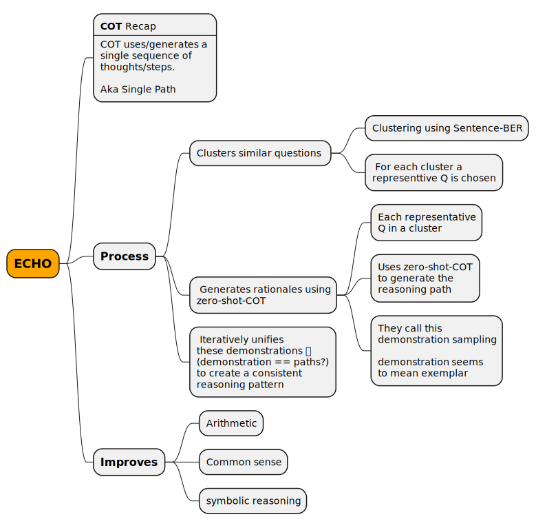
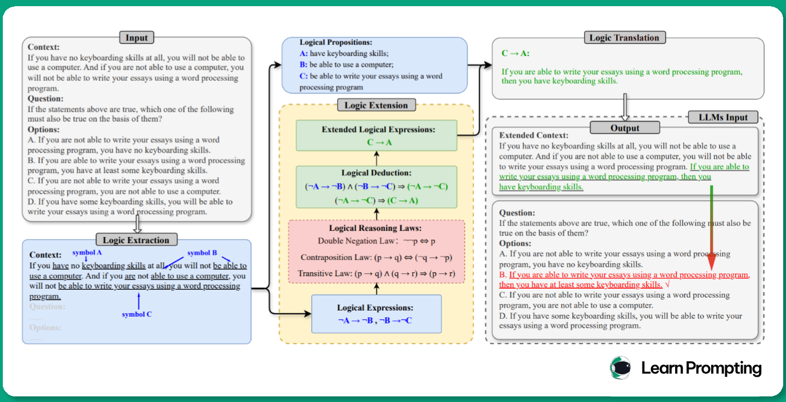

# Learn Prompting - Advanced

> Note: Move these into more generic reference about prompting.

# New Techniques

https://learnprompting.org/docs/new_techniques/introduction

## Self Harmonized Chain of thought - ECHO

 - [ArXiv Paper PDF](https://www.arxiv.org/abs/2409.04057)
 - [Github](https://github.com/Xalp/ECHO)
   - Quite active. Updates last week
   - 20X improvement recently with paralell inference on OpenAI
 - ⬛ Read the paper and follow code

Aka `ECHO`

ECHO Improves over COT in the following way
 - COT is a single reasoning path _(one sequence of thoughts, a path )_
 - ECHO
   - creates multiple reasoning paths ?
   - refines them into a cohesive approach
   - does this dynamically using a self-harmonizing process



## Logic of thought - LOT

 - [ArXiv paper PDF](https://arxiv.org/abs/2409.17539)
 - Seems to be all LLM with no external tools needed
 - ⬛ Read the paper




### Logic extraction prompt

```
Please use uppercase English letters such as A, B, C, etc. to identify all possible propositions. Do not include negative tones such as "not" in the propositions. For example, if the sentence is "It is not bored," you should use "A: bored" to represent it.
Next, for each proposition, use the symbol to represent its negative form. For example, the negative form of proposition A can be expressed as A.
Now, please carefully analyze the context and find causal relationship between propositions seriously. A causal expression is only established when the context directly supports this relationship. Use arrows (→) to indicate causal relationships, for example, "If A, then B", "B if A" and "A causes B" etc. can be represented as A → B.
Finally, output propositions and causal expressions.
[You input]
```

### Logic Extersion

👉 this seems to be a major thing. See the paper for deets I guess.

### Logic translation prompt

```
[Output from Phase 2]
Please use the provided propositions to translate each expression into a complete sentence.
¬A represents the negation of proposition A, the arrow (→) represents the causal relationship, and A → B represents if A, then B.
Only output the sentences in a paragraph!
```