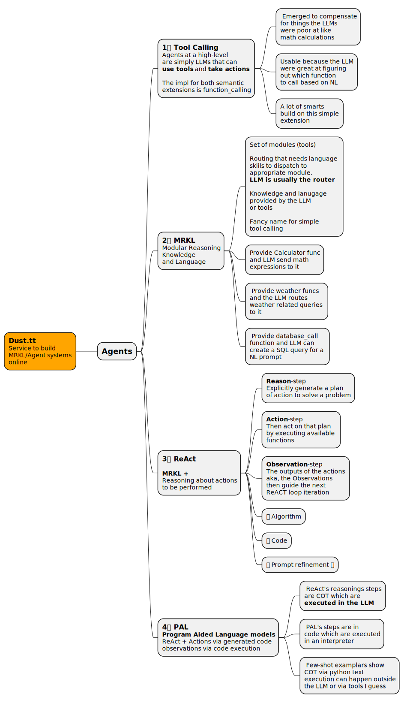

# Learn Prompting - Agents

 - 2023
    - [ReAct: Synergizing Reasoning and Acting in Language Models](https://arxiv.org/pdf/2210.03629)
 - 2022
   - [Jurassic-X: Crossing the neuro-symbolic chasm with the MRKL system](https://www.ai21.com/blog/jurassic-x-crossing-the-neuro-symbolic-chasm-with-the-mrkl-system)
   - [MRKL Systems: A modular, neuro-symbolic architecture that combines large language models, external knowledge sources and discrete reasoning](https://arxiv.org/pdf/2205.00445) 



## PAL

One example of the prompting

```python
MATH_PROMPT = '''
Q: There were nine computers in the server room. Five more computers were installed each day, from Monday to Thursday. How many computers are now in the server room?

# solution in Python:
"""There were nine computers in the server room. Five more computers were installed each day, from Monday to Thursday. How many computers are now in the server room?"""
computers_initial = 9
computers_per_day = 5
num_days = 4  # 4 days between Monday and Thursday
computers_added = computers_per_day * num_days
computers_total = computers_initial + computers_added
result = computers_total
return result


Q: Shawn has five toys. For Christmas, he got two toys each from his mom and dad. How many toys does he have now?

# solution in Python:
"""Shawn has five toys. For Christmas, he got two toys each from his mom and dad. How many toys does he have now?"""
toys_initial = 5
mom_toys = 2
dad_toys = 2
total_received = mom_toys + dad_toys
total_toys = toys_initial + total_received
result = total_toys


Q: Jason had 20 lollipops. He gave Denny some lollipops. Now Jason has 12 lollipops. How many lollipops did Jason give to Denny?

# solution in Python:
"""Jason had 20 lollipops. He gave Denny some lollipops. Now Jason has 12 lollipops. How many lollipops did Jason give to Denny?"""
jason_lollipops_initial = 20
jason_lollipops_after = 12
denny_lollipops = jason_lollipops_initial - jason_lollipops_after
result = denny_lollipops

Q: {question}

# solution in Python:
'''
```

Setup and execution in langchain.

```python
!pip install langchain==0.0.26
!pip install openai
from langchain.llms import OpenAI
import os
os.environ["OPENAI_API_KEY"] = "sk-YOUR_KEY_HERE"

llm = OpenAI(model_name='text-davinci-002', temperature=0)
llm_out = llm(MATH_PROMPT.format(question=question))
print(llm_out)
```

