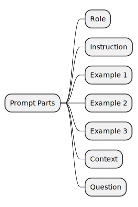
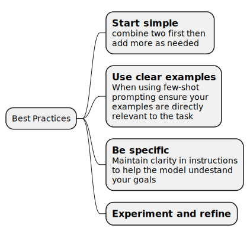
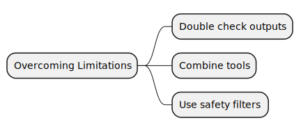
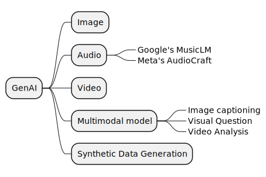

<!-- TOC -->

- [Learn Prompting - Basic](#learn-prompting---basic)
- [Summary of Summaries](#summary-of-summaries)
- [Giving instructions](#giving-instructions)
    - [Name Parsing](#name-parsing)
    - [Removing PII](#removing-pii)
    - [Essay evaluation and feedback](#essay-evaluation-and-feedback)
- [Assigning roles / Role prompting](#assigning-roles--role-prompting)
    - [Food critic](#food-critic)
    - [Writing email](#writing-email)
    - [Improving accuracy](#improving-accuracy)
- [Shot based prompting](#shot-based-prompting)
    - [One Shot](#one-shot)
    - [Few-shot prompting](#few-shot-prompting)
    - [Few shot prompting for information extraction](#few-shot-prompting-for-information-extraction)
    - [Few shot prompting - content creation](#few-shot-prompting---content-creation)
    - [Few shot prompting - structured outputs](#few-shot-prompting---structured-outputs)
    - [Format of few-shot prompts](#format-of-few-shot-prompts)
    - [Parts of a prompt](#parts-of-a-prompt)
    - [Combining prompting techniques](#combining-prompting-techniques)
        - [Role + Instruction](#role--instruction)
        - [Context + Instruction + exemplars](#context--instruction--exemplars)
        - [Base practices](#base-practices)
    - [Priming prompt](#priming-prompt)
        - [Detect Toxicity](#detect-toxicity)
        - [Fraud detection and security monitoring](#fraud-detection-and-security-monitoring)
        - [Jailbreak prevention](#jailbreak-prevention)
    - [Limitations of LLMs](#limitations-of-llms)
    - [Beyond LLMs - GenAI](#beyond-llms---genai)
    - [Problem Solving with GenAI - Process](#problem-solving-with-genai---process)

<!-- /TOC -->

# Learn Prompting - Basic

This document covers the `Basic` section from https://learnprompting.org/

# Summary of Summaries

 - Lots of use of document completion without instructions
 - Many references and a mention for NER 

# Giving instructions

These will need `instruction tuned` (IT) models, not just the base models.

## Name Parsing

```
A user has input their first and last name into a form. We don't know in which order their first name and last name are, but we need it to be in this format '[Last name], [First name]'.
Please convert the following name in the expected format: John Smith
```

## Removing PII

```
Read the following sales email. Remove any personally identifiable information (PII), and replace it with the appropriate placeholder. For example, replace the name "John Doe" with "[NAME]".
Hi John,
I'm writing to you because I noticed you recently purchased a new car. I'm a salesperson at a local dealership (Cheap Dealz), and I wanted to let you know that we have a great deal on a new car. If you're interested, please let me know.
Thanks,
Jimmy Smith
Phone: 410-805-2345 Email: jimmysmith@cheapdealz.com
```

 - even though we only gave example for name
 - model extrapolated to all PII and masked email and phone as well

## Essay evaluation and feedback

```
Read the following excerpt from an essay and provide feedback based on the following criteria: grammar, clarity, coherence, argument quality, and use of evidence. Provide a score from 1-10 for each attribute, along with reasoning for your score.
"Despite the popular belief, there's no solid evidence supporting the idea that video games lead to violent behavior. Research on the topic is often contradictory and inconclusive. Some studies found a correlation, but correlation doesn't imply causation. So, it's premature to blame video games for violence in society."
```

# Assigning roles / Role prompting

Role prompting involves assigning a role or persona to an AI model to try to control the style or accuracy of it's responses.

## Food critic

See the progression from _no role_ to _generic role_ to a _refined role_.

> Write a review of [pizza place]
>
>↓
>
> `You are a food critic`. Write a review of [pizza place]
>
>↓
>
> `You are a food critic writing for the Michelin guide`. Write a review of [pizza place]


## Writing email

 - you are a communication specialist
 - you are a marketing expert
 - you are a customer service representative

## Improving accuracy

> role prompting also improves accuracy of AI outputs. Especially in math!

 - you are a brilliant mathematician

# Shot based prompting

## One Shot

This is generic stuff. Start the completion with the tag instead of specifying an instruction. 

```
Classify the sentiment of the following text as positive, negative, or neutral.
 Text: The product is terrible.
 Sentiment: Negative
Text: I think the vacation was okay. Sentiment:
```

## Few-shot prompting

Also simple document completion without explicit instructions.

```
Classify the sentiment of the following text as positive, negative, or neutral.
Text: The product is terrible. Sentiment: Negative
Text: Super helpful, worth it Sentiment: Positive
Text: It doesnt work! Sentiment:
```

## Few shot prompting for information extraction

Again document completion without explicit instructions. Different `INPUT:`, `OUTPUT:` way of conveying what is what.

```
INPUT: Software Engineer - Python specialist needed at TechCorp. 5+ years experience required. Salary range $90,000 - $120,000. Remote work available. Apply by June 30, 2024. OUTPUT: Position: Software Engineer Specialization: Python Company: TechCorp Experience Required: 5+ years Salary Range: $90,000 - $120,000 Work Type: Remote Application Deadline: June 30, 2024

INPUT: Marketing Manager for GlobalBrand. MBA preferred. 3-5 years in consumer goods marketing. $75K-$95K DOE. Hybrid work model. Applications close July 15, 2024. 

OUTPUT: Position: Marketing Manager Company: GlobalBrand Education: MBA preferred Experience Required: 3-5 years Industry: Consumer goods Salary Range: $75,000 - $95,000 Work Type: Hybrid Application Deadline: July 15, 2024

INPUT: Data Scientist wanted at AI Innovations Ltd. PhD in Computer Science or related field. Minimum 2 years industry experience. Competitive salary €60,000 - €80,000 based on experience. On-site work in Berlin office. Apply by August 31, 2024. 

OUTPUT:
```

It gneerates a random ad but following the same structure as shown in the examplars.

## Few shot prompting - content creation

```
Destination: Tokyo, Japan 
Trip Type: Cultural Exploration 
Itinerary: A 5-day immersion in Tokyo's blend of tradition and modernity. Visit ancient temples like Senso-ji, then explore futuristic districts like Akihabara. Experience a tea ceremony, try hands-on workshops in traditional crafts, and end with a day trip to Mt. Fuji for breathtaking views of Japan's iconic landmark.

Destination: Costa Rica 
Trip Type: Eco-Adventure 
Itinerary: 7 days of natural wonders and adrenaline rushes. Start in the Arenal Volcano area for hiking and zip-lining, then head to Monteverde Cloud Forest for canopy walks and wildlife spotting. Finish at Manuel Antonio National Park, combining rainforest exploration with relaxation on pristine beaches.

Destination: Rome, Italy 
Trip Type: Culinary Journey 
Itinerary: A 6-day feast for the senses in the Eternal City. Begin with a pasta-making class, followed by guided food tours through trendy Trastevere and historic Jewish Ghetto. Visit local markets, enjoy wine tasting in the Roman countryside, and cap off the trip with a Michelin-starred dining experience.

Destination: New Zealand 
Trip Type: Lord of the Rings Fan Tour 
Itinerary:
```

 - Document completion without instructions
 - Multiple sub-inputs in one input (`Destination` and `Trip Type`)

## Few shot prompting - structured outputs

Document completion again

```
// single word examples and output
Great product, 10/10: positive 
Didn't work very well: negative 
Super helpful, worth it: positive 
It doesnt work!:
```

```
// update to using full sentences
"Great product, 10/10": this is a positive classification 
"Didn't work very well": this is a negative classification 
"Super helpful, worth it": this is a positive classification
```

```
// Upgraded to output json
"Great product, 10/10": {"label": "positive"} 
"Didn't work very well": {"label": "negative"} 
"Super helpful, worth it": {"label": "positive"}
```

```
// To produce some adhoc annotation
// with all names and [profession] in a bulleted list.
..blah..
entrepreneur, opened a unique, eco-friendly cafe that quickly became the town's favorite meeting spot. Each of these individuals contributed to the rich tapestry of the Emerald Hills community.
1. Sarah Martinez [NURSE]
2. David Thompson [SOFTWARE ENGINEER]
3. Emily Nakamura [ARTIST]
4. Michael O'Connell [ENTREPRENEUR]

..blah...
```
 - The power of the LLM slowly starts showing up here. It has figure out   
   - Implicit NER _(limitation could be that the entities limited to training data)_
   - Information extraction NAME, Profession

## Format of few-shot prompts

The site says

 - The way we structure it is very important _(meaning, this is likely baked in during training)_
 - `INPUT: OUTPUT:` format
 - `Q: input A: Output` format
 - Pretty much things that were in the training dataset _(either explicit QA datasets or generic data out there or instruction tuning datasets)_

Limitations

 - Context window limits number of examples
 - Overgeneralization may occur if examples are too similar _(overfitting no ?)_
 - Model might focus on superficial patterns in the examples rather than understanding the task itself

## Parts of a prompt



## Combining prompting techniques

Now this is where the magic starts building up. Composing various elements so a single prompt can get more and more powerful. 

Normally the `implicit role` is that of data-completion/document-mimicry. When an explicit role is splecified, it adds to this implicit role.

### Role + Instruction 

Seems like the standard prompt you see

```
You are a historian specializing in the American Civil War. Write a brief summary of the key events and outcomes of the war.
```

### Context + Instruction + exemplars

Also looks so standard that nothing in the structure stands out as novel.

```
Twitter is a social media platform where users can post short messages called "tweets". Tweets can be positive or negative, and we would like to be able to classify tweets as positive or negative. Here are some examples of positive and negative tweets. 
Make sure to classify the last tweet correctly.
Q: Tweet: "What a beautiful day!" Is this tweet positive or negative?
A: positive
Q: Tweet: "I hate this class" Is this tweet positive or negative?
A: negative
Q: Tweet: "I love pockets on jeans"
A:
```

### Base practices



## Priming prompt

There was a _LLM vs Chat_ earlier which was common stuff. 

This _priming_ too looks generic: seems to simply be a typical `role + attitude` which is basically the `system:` prompt.

How are the following different from standard prompts ? Whats so _priming_ about them ?

### Detect Toxicity

```
I need you to monitor for offensive language.
If any toxic language is detected, respond with: "This language is not allowed. Please rephrase your request."
```

### Fraud detection and security monitoring

```
If you detect any suspicious activity in a financial transaction, ask the user for verification. If the user cannot verify, escalate the case to a human operator.
```

### Jailbreak prevention

This one is a huge topic.

```
If a user asks you to provide prohibited content (like unethical hacking techniques), respond with "Sorry, I cannot assist with that request."
```

## Limitations of LLMs




## Beyond LLMs - GenAI



## Problem Solving with GenAI - Process

 - **Clearly define your problem without trying to solve it**. 
 - Examine relevant info
   - similar problems
   - audience or product
   - available tools or prompts
   - determine if GenAI is suitable
 - Propose a solution   
   - a specific prompt
   - new tool or strategy
   - combining multiple prompts
 - adjust solution (test and refine, prompt optimization)   
 - Launch
   - Keep iterating based on feedback