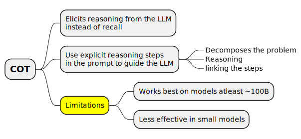
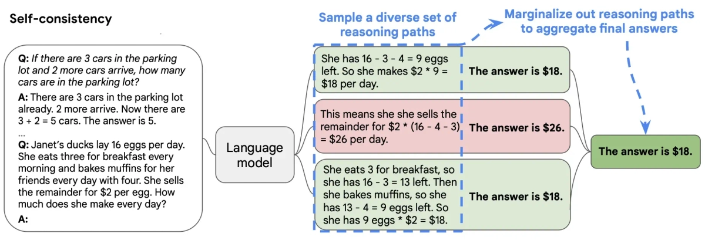
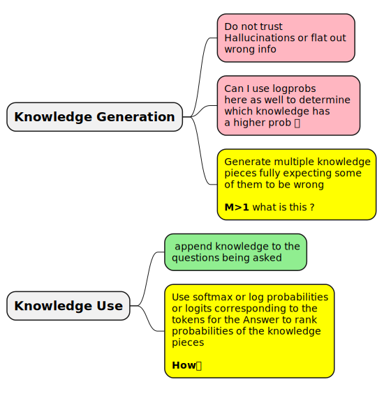
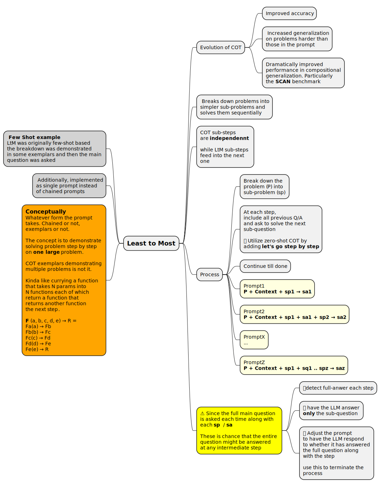
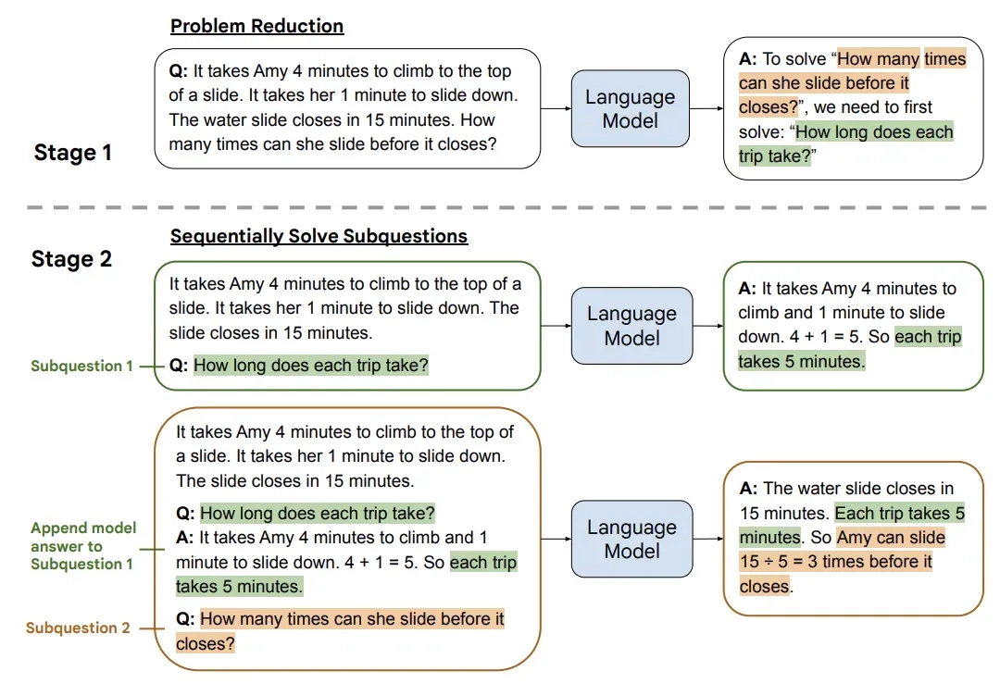
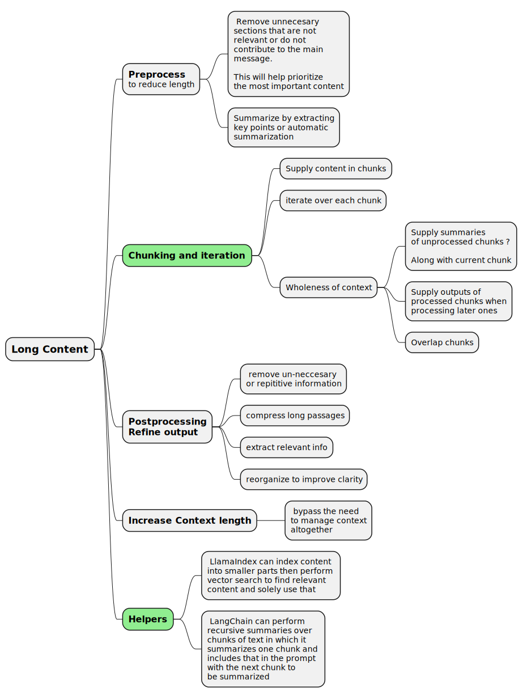
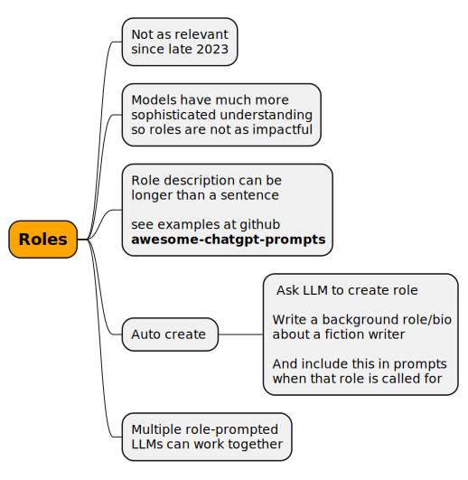
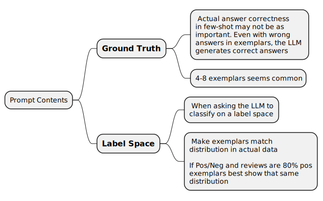
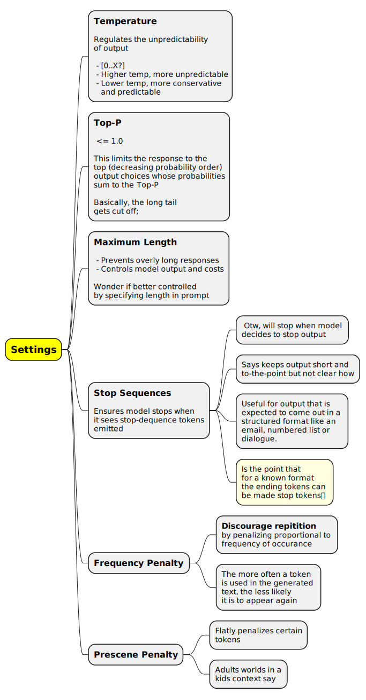

# Learn Prompting - Intermediate

This document covers the `Intermediate` section from https://learnprompting.org/

> Here, you are going to shift your focus from the tasks that GenAI can solve, onto the prompting techniques themselves. According to [The Prompt Report: A Systematic Survey of Prompting Techniques](https://arxiv.org/abs/2406.06608) by 
`Schulhoff, S., et. al.(2024)`:  "a prompting technique is a blueprint that describes how to structure a prompt, prompts, or dynamic sequencing of multiple prompts. A prompting technique may incorporate conditional or branching logic, parallelism, or other architectural considerations spanning multiple prompt".

# Summary 

# Chain Of Thought (COT) Prompting



## Zero-shot COT

> No free lunch though. This is apparently not as effective as explicit COT. However, a great first thing to try.

This tries to see if the model can figure things out. Simply say **Lets think step by step** instead of actually providing the COT.

> 👉 Lots of ablation studies by Kojima et. al. showed that `let's think step by step` worked best. They tried a bunch more like `let's solve this problem by splitting it into steps` or `Let's think about this logically` which were not as effective.

```
Q: A juggler can juggle 16 balls. Half of the balls 
are golf balls and half of the golf balls are blue.
How many golf balls are there?
A: Lets think step by step
```

And thats it. Simply asking it to `think step by step` works for the newer LLMs.

The paper says that the LLM internally creates a COT and then augments the first prompt with the COT before solving the actual problem.

# Self-consistency



 - Boosts reliability by averages multiple responses to the same prompt. _However, high frequency answer is picked, not the avg_.
 - However, does not seem to the same prompt
   - They call it `diverse set of reasoning paths`
   - Seems to be internal to the LLM itself or is the user expected to provide different versions of reasoning/COT for the same problem ?

> Wang et al. discuss a more complex method for selecting the final answer, which deals with the Large Language Model's (LLM) `generated probabilities` for each Chain-of-Thought. However, they do not use this method in their experiments, and majority voting seems to usually have the same or better performance.

# Generated Knowledge

Ref : [Liu, J., Liu, A., Lu, X., Welleck, S., West, P., Bras, R. L., Choi, Y., & Hajishirzi, H. (2021). Generated Knowledge Prompting for Commonsense Reasoning](https://arxiv.org/pdf/2110.08387)

Ask the LLM to generate potentially useful information about a given question/prompt before generating a final response. This can be done in two ways.

I don't know why they have these random names. We could be consistant and name this: `Knowledge chained Instruction` ? Doesnt flow like COT tho. but maybe

 - `Generate Intermediate Knowledge` - GIK
 - `Generate Intermediate Steps`     - GIS
 - `Generate Intermediate Logic`     - GIL

## Single prompt

Where both steps: Generate useful knowledge/research and the prompt/instruction are both in the same prompt.

```
Generate 4 facts about the Kermode bear, then use these facts to write a short blog post using the information:

```

## Dual prompt

```
Generate 4 facts about the Kermode bear:
```

 - Then feed the output of the above into another prompt to write the blog post. 
 - 👉 Apparently more reliable way of producing longer content

## Knowledge generation


It is possible that the generated knowledge could be processed further before integrating it into the prompt. In any case, this seems very closely related to `RAG`. 

Knowldge generation itself can be done in multiple ways i guess

 - Directly asking the LLM to generate relevant knowledge _(relevancy how?)_
 - Indirectly ask it to generate knowledge via few-shot prompting providing exactly what knowledge we seek.

 He uses this example

 ```
 Generate som numerical facts about objects. 
 
 Examples:

 Input: Penguins have <mask> wings.
 Knowledge: Birds have two wings. Pennguin is a kind of bird
 ...
 Input: a typical hman being has <mask> limbs.
 Knowledge: Humna has two arms and two legs.

 Input:{question}
 Knowledge:
```

 - not sure what this is doing exactly.
 - It is listing `<mask>` but not asking the LLM to infer it. However, the Knowledge displays the information the LLM might use to infer it. Seems kinda round about no? _Is the final answer going to be `Answer: <mask>` ?
 - Maybe directly asking the LLM for specific knowledge is too constraining ? This roundabout way allows it to generate all kinds of information.



# Recitation-augmented language models

Ref - [Sun, Z., Wang, X., Tay, Y., Yang, Y., &amp; Zhou, D. (2022). Recitation-Augmented Language Models](https://arxiv.org/pdf/2210.01296)

Similar to generated knowledge: _Few-shot prompt the LLM to generate information and answer in the same step_ unlike the 2 step process for knowledge.

When compared to the single-prompt knowledge use-case. There are exemplars involved that provide the knowledge. Seems like a throwback to older prompts. New names for subtle variations on the same theme. Not clear what the underlying intuition of the difference is. Needs reading of the papers involved to figure this out I think.

# Least to most prompting - LtM

Ref - [Zhou, D., Schärli, N., Hou, L., Wei, J., Scales, N., Wang, X., Schuurmans, D., Cui, C., Bousquet, O., Le, Q., & Chi, E. (2022). Least-to-Most Prompting Enables Complex Reasoning in Large Language Models](https://arxiv.org/pdf/2205.10625)

> Technique inspired by real-world educational strategies for children.



An example that shows the above is listed below.



In a customer-service problem sim (https://learnprompting.org/docs/intermediate/least_to_most)

 - Ask the LLM `what sub-problems must be solved before answering the enquiry`
 - Take the list
 - Then implement the process above

## LtM UseCase - Customer service

The basic prompt: **Q + Context**

```
CUSTOMER INQUIRY:
I just bought a T-shirt from your Arnold collection on March 1st. I saw that it was on discount, so bought a shirt that was originall $30, and got 40% off. I saw that you have a new discount for shirts at 50%. I'm wondering if I can return the shirt and have enough store credit to buy two of your shirts?

INSTRUCTIONS:
You are a customer service agent tasked with kindly responding to customer inquiries. Returns are allowed within 30 days. Today's date is March 29th. There is currently a 50% discount on all shirts. Shirt prices range from $18-$100 at your store. Do not make up any information about discount policies.
```

### Break it down into steps

The basic prompt: **Q + Context + SubProblemInstruct**

```diff
CUSTOMER INQUIRY:
I just bought a T-shirt from your Arnold collection on March 1st. I saw that it was on discount, so bought a shirt that was originall $30, and got 40% off. I saw that you have a new discount for shirts at 50%. I'm wondering if I can return the shirt and have enough store credit to buy two of your shirts?

INSTRUCTIONS:
You are a customer service agent tasked with kindly responding to customer inquiries. Returns are allowed within 30 days. Today's date is March 29th. There is currently a 50% discount on all shirts. Shirt prices range from $18-$100 at your store. Do not make up any information about discount policies.

+ What subproblems must be solved before answering the inquiry?
```

This gives the following answer

```
1. Determine if the customer is within the 30-day return window.
2. Calculate the amount of store credit the customer would receive if they returned the shirt.
3. Calculate the cost of two shirts at the current 50% discount.
4. Determine if the customer has enough store credit to purchase two shirts.
```

### Solve the first step

The basic prompt: **Q + Context + SubProblemInstruct + Subproblem1 + Answer completion**

```diff
CUSTOMER INQUIRY:
I just bought a T-shirt from your Arnold collection on March 1st. I saw that it was on discount, so bought a shirt that was originall $30, and got 40% off. I saw that you have a new discount for shirts at 50%. I'm wondering if I can return the shirt and have enough store credit to buy two of your shirts?

INSTRUCTIONS:
You are a customer service agent tasked with kindly responding to customer inquiries. Returns are allowed within 30 days. Today's date is March 29th. There is currently a 50% discount on all shirts. Shirt prices range from $18-$100 at your store. Do not make up any information about discount policies.

+ Determine if the customer is within the 30-day return window. Let's go step by step.
```

⚠️ This is enough information for it to solve the entire question. A HIL will detect it, otw, the loop should be broken automatically or forced to only answer the question asked. Forcing would make poor use of the LLM's knowledge so **best option is to ask the LLM itself to figure out if it gave the final answer**.

## LtM UseCase - Letter concatenation

The problem to solve here is, given a collection of words, concatenate the last letter of each _(left to right)_ and form a new word. Looks to be surprisingly hard for the LLM to do when you give it a large collection of words.

### Attempt 1 - Few-shot examplars

```
Q: think, machine
A: ke

Q: learning, reasoning, generalization
A: ggn

Q: artificial, intelligence
A: le

Q: transformer, language, vision
A: ren

Q: foo,bar,baz,blip
A:
```

 - Does poorly. Returns `lip` per their example
 - So, tons of patterns to learn from but it learns the wrong thing!
 - 👉 Maybe it was deliberately made to fail since three of the words in the last start with `b`. Maybe an example like that earlier mightve helped it along.

### Attempt 2 - COT

```
Q: think, machine
A: The last letter of "think" is "k". The last letter of "machine" is "e". So "think, machine" is "ke".

Q: learning, reasoning, generalization
A: The last letter of "learning" is "g". The last letter of "reasoning" is "n". The last letter of "generalization" is "n". So "learning, reasoning, generalization" is "ggn".

Q: artificial, intelligence
A: The last letter of "artificial" is "l". The last letter of "intelligence" is "e". So "artificial, intelligence" is "le".

Q: transformer, language, vision
A: The last letter of "transformer" is "r". The last letter of "language" is "e". The last letter of "vision" is "n". So "transformer, language, vision" is "ren".

Q: foo,bar,baz,blip
A:
```

 - Works correctly
 - They say it breaks down at larger sizes. The paper may have more details on this.

> The main difference is that unlike the currying approach where each breakdown is one step of a larger problem, each COT exemplar is a different problem listed the reasoning needed to solved it fully in one step.

### Attempt 3 - LtM

Compared with COT, the few-shot exemplars are conceptually different: they demonstrated breaking each problem down into sub-problems, and **solving 
each sub-problem together with answer from previous sub-problem**.

> I wonder if using the formalism of currying can make this even better.

```
Q: think, machine
A: The last letter of "think" is "k". The last letter of "machine" is "e". Concatenating "k" and "e" gives "ke". So "think, machine" output "ke".

Q: think, machine, learning
A: "think, machine" outputs "ke". The last letter of "learning" is "g". Concatenating "ke" and "g" gives "keg". So "think, machine, learning" is "keg".

Q: transformer, language
A: The last letter of "transformer" is "r". The last letter of "language" is "e". Concatenating "r" and "e" gives "re". So "transformer, language" is "re".

Q: transformer, language, vision
A: "transformer, language" outputs "re". The last letter of "vision" is "n". Concatenating "re" and "n" gives "ren". So "transformer, language, vision" is "ren".

Q: foo,bar,baz,blip,learn,prompting,world,shaking,event,dancefloor,prisma,giraffe
A:
```

Apparently, LtM is 74% accurate on the last letter concatenation problem with 12 words while COT is only 34% accurate. _(they used text-davinci-002: Which as of Dec 2024 is not even available for testing)_

## LtM - Compositional generalization - SCAN

 Ref - [SCAN benchmark - Lake, B. M., &amp; Baroni, M. (2018). Generalization without Systematicity: On the Compositional Skills of Sequence-to-Sequence Recurrent Networks.](https://doi.org/10.48550/arXiv.1711.00350)

> The SCAN benchmark3 requires the model to convert natural language to sequences of actions. For example, the sentence "run left and walk twice" would be translated to "TURN_LEFT + RUN + WALK * 2". Language models perform especially poorly when confronted with sequences that are longer than those in the training set.

At first glance, this might be robotics related! Will see.

### Attempt 1 - FewShot prompting

```
Q: turn left
A: TURN LEFT

Q: turn right
A: TURN RIGHT

Q: jump left
A: TURN LEFT + JUMP

Q: run right
A: TURN RIGHT + RUN

Q: look twice
A: LOOK * 2

Q: run and look twice
A: RUN + LOOK * 2

Q: jump right thrice
A: (TURN RIGHT + JUMP) * 3

Q: walk after run
A: RUN + WALK

Q: turn opposite left
A: TURN LEFT * 2

Q: turn around left
A: TURN LEFT * 4

Q: turn opposite right
A: TURN RIGHT * 2

Q: turn around right
A: TURN RIGHT * 4

Q: walk opposite left
A: TURN LEFT * 2 + WALK

Q: walk around left
A: (TURN LEFT + WALK) * 4

Q: "jump around left twice after walk opposite left thrice" 
A:
```

the model (`text-davinci-003`) _Note that `text-davinci-003` is also an instruct GPT model_. This is old and been replaced by `GPT-3.5-turbo-instruct` mid 2023 and fully deprecated Jan 2024.

Also, this looks lousy. These have encoded natural language instruction. Why is the input so terse to the point of being ambiguous. Amost like someone whose robots woked off of these types of instructions now wants a competition for a Model that works like that. Then hire those guys!

 - `jump right thrice`
   - While jumping turn right ?
   - Turn right and jump _(this is what the expected response is)_
 - `turn oppoite` to mean turn and face the opposite side. 180 degree turn.
 - `turn around` to mean turn a full 360 degrees.
 - compositing these is even worse `walk around left` means while walking, turn left till you make a 360 degree rotation!!   

 Response _(He says it fails but this is correct. No!)_

 ```
 (TURN LEFT * 2 + WALK) * 3 + (TURN LEFT + JUMP) * 2
 ```

### Attempt 2 - LtM - Reduction step

The first prompt is said to `reduce` the input problem into a simpler sequence of steps. This term: `redcution` might have been used in the paper because it doesn't seem to apply here.

He says the prompt uses _compressed python notation_ to save tokens. Will see if that is obvios.

```
Q: look right after look twice
A: "look right after look twice" can be solved by: "look right", "look twice".

Q: jump opposite right thrice and walk
A: "jump opposite right thrice" can be solved by: "jump opposite right", "jump opposite right thrice". "walk" can be solved by: "walk". So, "jump opposite right thrice and walk" can be solved by: "jump opposite right", "jump opposite right thrice", "walk".

Q: run left twice and run right
A: "run left twice" can be solved by: "run left", "run left twice". "run right" can be solved by "run right". So, "run left twice and run right" can be solved by: "run left", "run left twice", "run right".

Q: run opposite right
A: "run opposite right" can be solved by "run opposite right".

Q: look opposite right thrice after walk
A: "look opposite right thrice" can be solved by: "look opposite right", "look opposite right thrice". "walk" can be solved by "walk". So, "look opposite right thrice after walk" can be solved by: "look opposite right", "look opposite right thrice", "walk".

Q: jump around right
A: "jump around right" can be solved by: "jump right", "jump around right". So, "jump around right" can be solved by: "jump right", "jump around right".

Q: look around right thrice and walk
A: "look around right thrice" can be solved by: "look right", "look around right", "look around right thrice". "walk" can be solved by "walk". So, "look around right thrice and walk" can be solved by: "look right", "look around right", "look around right thrice", "walk".

Q: turn right after run right thrice
A: "turn right" can be solved by: "turn right". "run right thrice" can be solved by: "run right", "run right thrice". So, "turn right after run right thrice" can be solved by: "turn right", "run right", "run right thrice".

Q: jump around left twice after walk opposite left thrice
A:
```

 - Ok. Classic LtM where each Q is broken down into a sequence that includes previously broken-down and solved portions.
  - Reduction I guess is another valid term for decomposition with overlapping composition. Need to check if `Curried composition` makes sense _(in that purists won't throw crap at me)_.

**LLM Response**

```
"jump around left twice" can be solved by: "jump left", "jump around left", "jump around left twice". "walk opposite left thrice" can be solved by: "walk opposite left", "walk opposite left thrice". So, "jump around left twice after walk opposite left thrice" can be solved by: "jump left", "jump around left", "jump around left twice", "walk opposite left", "walk opposite left thrice".
```

The reduction looks correct.

### Attempt 2 - LtM - Mapping step

In the second step, the first step's output is used.

```
Q: turn left
A: "turn left" outputs "TURN LEFT".

Q: turn right
A: "turn right" outputs "TURN RIGHT".

Q: jump left
A: The output of "jump left" concatenates: the output of "turn left", the output of "jump". "turn left" outputs "TURN LEFT". "jump" outputs "JUMP". So concatenating the output of "turn left" and the out- put of "jump" leads to "TURN LEFT" + "JUMP". So the output of "jump left" is "TURN LEFT" + "JUMP".

Q: run right
A: The output of "run right" concatenates: the output of "turn right", the output of "run". "turn right" outputs "TURN RIGHT". "run" outputs "RUN". So concatenating the output of "turn right" and the output of "run" leads to "TURN RIGHT" + "RUN". So the output of "run right" is "TURN RIGHT" + "RUN".

Q: look twice
A: The output of "look twice" concatenates: the output of "look", the output of "look". "look" outputs "LOOK". So repeating the output of "look" two times leads to "LOOK" * 2. So the output of "look twice" is "LOOK" * 2.

Q: run and look twice
A: The output of "run and look twice" concatenates: the output of "run", the output of "look twice". "run" outputs "RUN". "look twice" outputs "LOOK" * 2. So concatenating the output of "run" and the output of "look twice" leads to "RUN" + "LOOK" * 2. So the output of "run and look twice" is "RUN" + "LOOK" * 2.

Q: jump right thrice
A: The output of "jump right thrice" concatenates: the output of "jump right", the output of "jump right", the output of "jump right". "jump right" outputs "TURN RIGHT" + "JUMP". So repeating the output of "jump right" three times leads to ("TURN RIGHT" + "JUMP") * 3. So the output of "jump right thrice" is ("TURN RIGHT" + "JUMP") * 3.

Q: walk after run
A: The output of "walk after run" concatenates: the output of "run", the output of "walk". "run" outputs "RUN". "walk" outputs "WALK". So concatenating the output of "run" and the output of "walk" leads to "RUN" + "WALK". So the output of "walk after run" is "RUN" + "WALK".

Q: turn opposite left
A: The output of "turn opposite left" concatenates: the output of "turn left", the output of "turn left". "turn left" outputs "TURN LEFT". So repeating the output of "turn left" twice leads to "TURN LEFT" * 2. So the output of "turn opposite left" is "TURN LEFT" * 2.

Q: turn around left
A: The output of "turn around left" concatenates: the output of "turn left", the output of "turn left", the output of "turn left", the output of "turn left". "turn left" outputs "TURN LEFT". So repeating the output of "turn left" four times leads to "TURN LEFT" * 4. So the output of "turn around left" is "TURN LEFT" * 4.

Q: turn opposite right
A: The output of "turn opposite right" concatenates: the output of "turn right", the output of "turn right". "turn right" outputs "TURN RIGHT". So repeating the output of "turn right" twice leads to "TURN RIGHT" * 2. So the output of "turn opposite right" is "TURN RIGHT" * 2.

Q: turn around right
A: The output of "turn around right" concatenates: the output of "turn right", the output of "turn right", the output of "turn right", the output of "turn right". "turn right" outputs "TURN RIGHT". So repeating the output of "turn right" four times leads to "TURN RIGHT" * 4. So the output of "turn around right" is "TURN RIGHT" * 4.

Q: walk opposite left
A: The output of "walk opposite left" concatenates: the output of "turn opposite left", the output of "walk". "turn opposite left" outputs "TURN LEFT" * 2. "walk" outputs "WALK". So concatenating the output of "turn opposite left" and the output of "walk" leads to "TURN LEFT" * 2 + "WALK". So the output of "walk opposite left" is "TURN LEFT" * 2 + "WALK".

Q: walk around left
A: The output of "walk around left" concatenates: the output of "walk left", the output of "walk left", the output of "walk left", the output of "walk left". "walk left" outputs "TURN LEFT" + "WALK". So repeating the output of "walk around left" four times leads to ("TURN LEFT" + "WALK") * 4. So the output of "walk around left" is ("TURN LEFT" + "WALK") * 4.

Q: "jump around left twice after walk opposite left thrice" 
A:
```

 - Hmm.. I think the website copied the wrong thing from the paper. This is nothing like the previous prompt and does not embed the previous prompt's output.
 - 👉 Read the paper! But I get the idea

**LLM Output**

```
The output of "jump around left twice after walk opposite left thrice" concatenates: the output of "walk opposite left thrice", the output of "jump around left twice". "walk opposite left thrice" outputs "TURN LEFT" * 2 + "WALK" * 3. "jump around left twice" outputs ("TURN LEFT" + "JUMP") * 4. So concatenating the output of "walk opposite left thrice" and the output of "jump around left twice" leads to "TURN LEFT" * 2 + "WALK" * 3 + ("TURN LEFT" + "JUMP") * 4. So the output of "jump around left twice after walk opposite left thrice" is "TURN LEFT" * 2 + "WALK" * 3 + ("TURN LEFT" + "JUMP") * 4.
```

# Dealing with long-form content

This is about dealing with content that just won't fit in the context window available.



# Revisiting Roles in 2024

 Ref - [Unleashing the Emergent Cognitive Synergy in Large Language Models:
A Task-Solving Agent through Multi-Persona Self-Collaboration](https://aclanthology.org/2024.naacl-long.15.pdf)



# Stuff that goes into a prompt

[Min, S., Lyu, X., Holtzman, A., Artetxe, M., Lewis, M., Hajishirzi, H., & Zettlemoyer, L. (2022). Rethinking the Role of Demonstrations: What Makes In-Context Learning Work?](https://arxiv.org/pdf/2202.12837)



# LLM Settings


