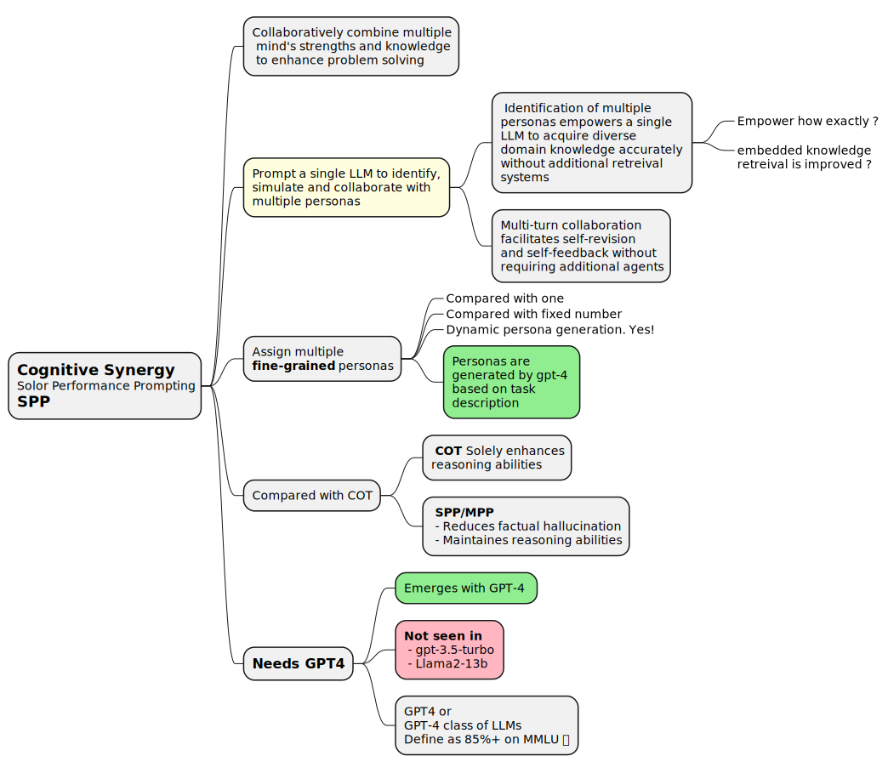
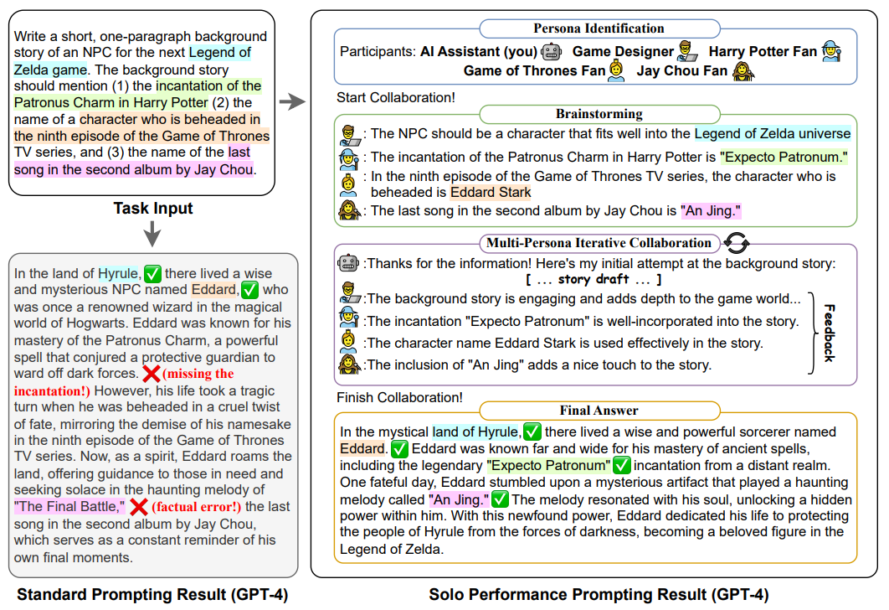
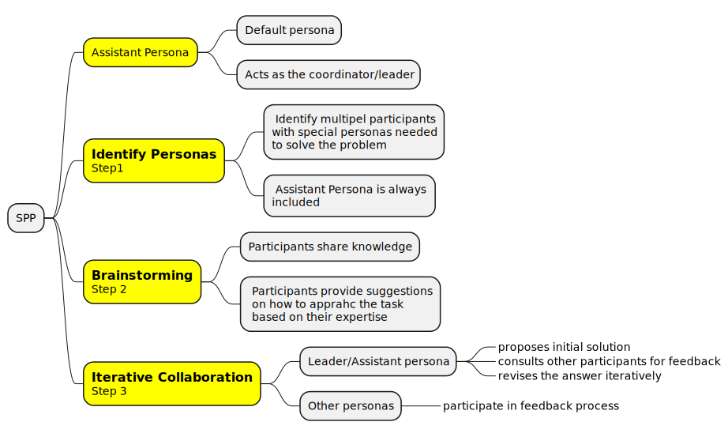

# Unleashing the Emergent Cognitive synergy in LLMs: A task-solving agent through multi-persona self-collaboration

👉 **TODO.. Continue from the paper on Page 4. I am not entirely convinced this is that useful as-is. An actual agentic apprach will be atleast as good as this while being way more flexible. Will get back to this as needed.**

> 👉 Main takeaway is that you can get the effect of multiple-personas and feedback loop based refinement on a single LLM without needing agents. Lack of observability etc when using non-agentic approaches is there but this might be transferable over to agents too.

 - [Arxiv Paper](https://aclanthology.org/2024.naacl-long.15.pdf)
 - [Github - SPP](https://github.com/MikeWangWZHL/Solo-Performance-Prompting)
 - [Github - Three of thought](https://github.com/princeton-nlp/tree-of-thought-llm)
 - [Mention on learnprompting.org](https://learnprompting.org/docs/intermediate/revisiting_roles)

 

 > They call it SPP _(Solo Performance Prompting)_ but the word solo clashes immediately with _multi_ from _Multi Persona_. I will likely only remember it as _MPP: Multi Persona Prompting_ wherease their `solo` likely comes from this being all done in a single LLM. Very confusing!

## Creative writing example
This illustrates the high-level approach.

## SPP Process

👉 **TODO.. Continue from the paper on Page 4. I am not convinced this is that useful. An actual agentic apprach will be atleast as good as this while being way more flexible. Will get back to this as needed.**