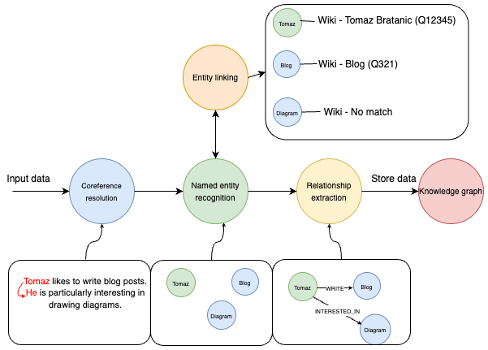

# Relation Extraction

This is a typical NLP topic. I ran into one of these articles on my newsfeed recently (Aug 2024). [Entity Linking and Relationship Extraction With Relik in LlamaIndex](https://neo4j.com/developer-blog/entity-linking-relationship-extraction-relik-llamaindex/). He illustrates the flow using the following image.

 - Classic CoRef resolution stage
 - Followed by NER
   - Followed by **Entity Linking** _which links the entity to something in an existing knowledge base_.
 - Followed by **relationship extraction**   
   - This seems to be like _dependencies_ or [Stanford Dependencies](../NLP/pdfs/Stanford_CoreNLP_Universal_Dependencies_Manual.pdf)
 - And ultimately into a knowledge graph based on these relations. I'd imagine the edges are the relationships while the nodes are the entities.

While looking at his code-bases. Realized that this [github](https://github.com/tomasonjo/blogs/tree/master) is a gem of a resource. Tons of notebooks with references to a large collection of datasets. Those datasets will be great to validate any kind of relationship-extraction work.

# 2023 Paper by Wadhwa et al.

> Revisiting Relation Extraction in the era of Large Language Models by _Wadhwa et al., [2023](https://aclanthology.org/2023.acl-long.868.pdf#page=10&zoom=100,88,677)
> 
> - Improvement over Paolinis approach
> - LLM prompt based
> - LLM Guided training of much smaller _< 1B_ Flan-t5-large model. Super fast and low resource needs.

# 2021 Paper by Giovanni Paolini et al.

> Structured Prediction as Translation between Augmented Natural Languages by _Giovanni Paolini et al._, [2021](https://openreview.net/forum?id=US-TP-xnXI)
>
> Multi-task learning (single head ?) and single model to match or outperform SOTA on 
> - Joint entity and relation extraction (CoNLL04, ADE, NYT and ACE2005 datasets)
> - Relation classification (FewRel and TACRED datasets)
> - Semantic role labeling (CoNLL-2005 and CoNLL-2012)

# Assorted links from elsewhere

 - https://huggingface.co/blog/document-ai