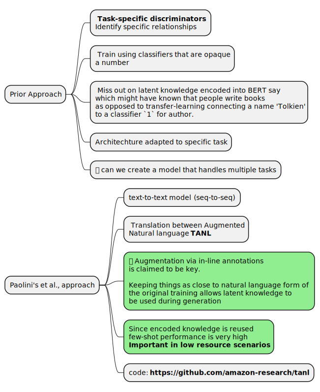
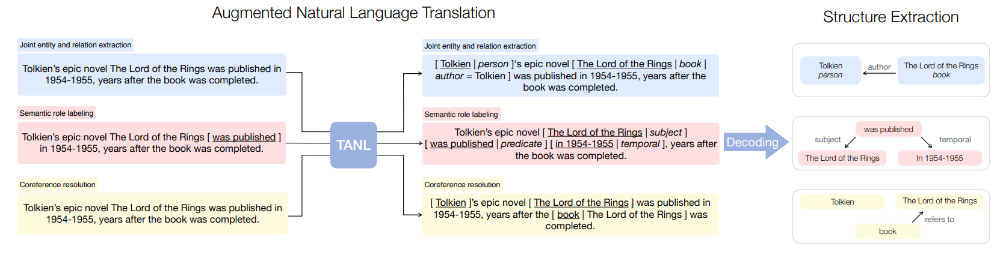
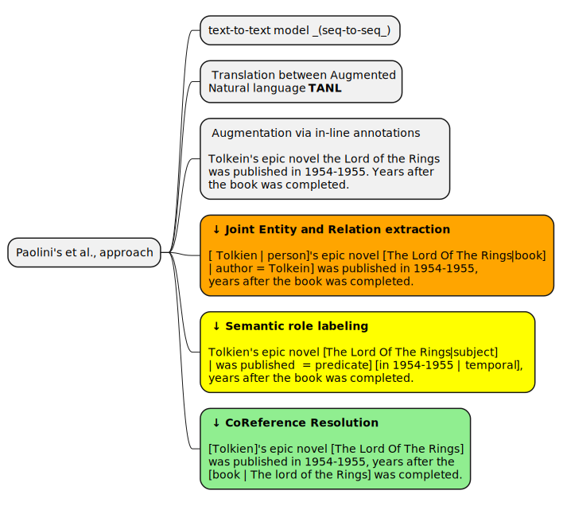

# RelationShip extraction - 2021 Paper by Giovanni Paolini et al.
<!-- TOC -->

- [RelationShip extraction - 2021 Paper by Giovanni Paolini et al.](#relationship-extraction---2021-paper-by-giovanni-paolini-et-al)
    - [Future reading](#future-reading)
- [Prior and new approaches](#prior-and-new-approaches)
- [Goals](#goals)
- [Current approach](#current-approach)
- [Joint entity and relation extraction](#joint-entity-and-relation-extraction)

<!-- /TOC -->
> - Event extraction
> - Dialogue state tracking

## Future reading

 - _Tom B. Brown, Benjamin Mann, Nick Ryder, Melanie Subbiah, Jared Kaplan,Prafulla Dhariwal, Arvind Neelakantan, Pranav Shyam, Girish Sastry, Amanda Askell, Sandhini Agarwal, Ariel Herbert-Voss, Gretchen Krueger, Tom Henighan, Rewon Child, Aditya Ramesh, Daniel M.Ziegler, Jeffrey Wu, Clemens Winter, Christopher Hesse, Mark Chen, Eric Sigler, Mateusz Litwin, Scott Gray, Benjamin Chess, Jack Clark, Christopher Berner, Sam McCandlish, Alec Radford, Ilya Sutskever, and Dario Amodei_. [Language models are few-shot learners - 2020](https://arxiv.org/abs/2005.14165)
 - _Gautier Izacard and Edouard Grave_ [Leveraging passage retrieval with generative models for open domain question answering - 2020](https://arxiv.org/pdf/2007.01282)
 - _Timo Schick and Hinrich Schütze_ [It’s not just size that matters: Small language models are also few-shot learners - 2020](https://arxiv.org/abs/2009.07118) 
 - _TapasNayak, Hwee Tou Ng_ [Effective Modeling of Encoder-Decoder
Architecture for Joint Entity and Relation Extraction](https://ojs.aaai.org/index.php/AAAI/article/view/6374)

# Prior and new approaches

# Goals

 - Structured prediction tasks with the same architecture
 - Leverage any latent knowledge that pre-trained model has about label semantics
 - Model the problem as sequence-to-sequence translation between Augmented natural languages (TANL). _Just from BERT training and language translation modeled as seq-to-seq, I figure this can be used for any language than has a NL representation_

# Current approach

 - Input Text
 - Output 
   - Using an ad-hoc proprietary format
   - Format decoded into 
     - Coref resolutions
     - relationships 
     - Entities & entity relations

Going to read Wadhwa's paper now to see how they do it using GPT3. I can simply use their few-shot promts and get started and come back to this when I want to learn the various training techniques.

**Restarting the read on 8/21/2024**: I anyway need a service that does all this. Today's news is of Google Cloud Run allowing the use of OLLama hosted OSS Models. Thats awesome! So maybe looking at Ollama hosting multiple Flan models or even finetuned Gemma instead of Flan-T5.

# Joint entity and relation extraction

Want to exercise their code for this particular task fist to understand whats going on and then dig into the rest.