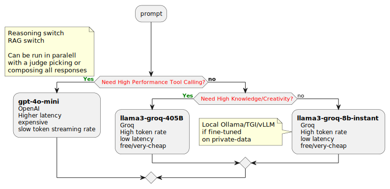

> Angadi asked me to write up a one-page doc about what I have been upto. Will start and then reduce it as needed.

## LLM - Multi LLM Routing 

I am using the `rust-genai` crate which targets multiple LLMs when a model-name is supplied. Straightforward mapping of model-name to provider and an adapter that handles using the right API_Key, end-points and such. 

> _Abstractions matter, especially more recently, since OpenAI's thinking models work in terms of `thinking-effort: "low", "medium", "high"` while Anthropic's allow you to specify an actual token budget! If things cannot be generalized, then one would expect all these to bubble up and make for a fat interface_. At that point, a PR or as a last resort a fork of the `genai` code-base is warranted.

I ran into problems with `Groq`'s tool-preview models when implementing the OpenAI - `get_weather` tool calling example: `gpt-4o-mini` would correctly deduce the units to use based on the city _(`F` for San Jose)_ but `llama-xx-tool-preview` would ask me _Do you want the temperature in Celcius or Fahrenheit_. To be able to use both models _(`gpt-4o-mini` at a cost and higher-latency or `groq's llama-8b-xx-tool-preview` for free and much lower latency)_

Initially, I used a regex to parse the assistant response, but the format of the `do you want it in Fahrenheit or Celcius` kept chaning on me! Subsequently, I decided to use the cheaper `groq-8b-instant` with a simple `Is this a question about temperature units. Answer with a Yes or No with no punctuation`. This allowed me to expect a simple `yes/no` which needed a simple regex.

- [👉 Rust code for get_weather tool calling example](https://github.com/vamsi-juvvi/rust-genai/blob/function_calling_openai/examples/c06-tool-functions.rs)
- [👉 Documentation for get_weather tool calling example](https://github.com/vamsi-juvvi/rust-genai/blob/function_calling_openai/docs/add-function-calling/c06-code-and-traces.md) compares OpenAI's references python impl with the rust one I created.

The full jsonified trace of the prompt flows is listed below _(also included in - [👉 Documentation for get_weather tool calling example](https://github.com/vamsi-juvvi/rust-genai/blob/function_calling_openai/docs/add-function-calling/c06-code-and-traces.md))

