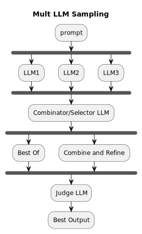

# LLM - Multi LLM Routing 

## Code Links

- [👉 Rust code for get_weather tool calling example](https://github.com/vamsi-juvvi/rust-genai/blob/function_calling_openai/examples/c06-tool-functions.rs)
- [👉 Documentation for get_weather tool calling example](https://github.com/vamsi-juvvi/rust-genai/blob/function_calling_openai/docs/add-function-calling/c06-code-and-traces.md) compares OpenAI's references python impl with the rust one I created.

## Description

I highlight a use-case of employing an LLM to understand another LLM's response _(when using an LLM chat API)_ to automate a conversation. Using an _(usually smaller/cheaper)_ LLM to understand another's response allows robustness under a wide variety of natural language responses from the initial LLM _(all such responses can mean the exact same thing when it comes to predicating a programmatic response)_. Without the second LLM in play, one might have to employ regex based approaches. Any such regex approach will additionally be fragile as the chat-endpoint's built-in randomness will vary the responses over time.

> This approach of using a second LLM can also be used in unit testing natural language reponses. Instead of `assert(LLMResponse.match(...))`, we can use a `assert_LLM("Does the summary of this response match the expectation along the dimensions of ...")` and have our unit tests be stable under the routine variability of generative LLM responses. Assume here that `assert_LLM` employs another LLM to perform summary matching along specific dimensions.

LLM Routing, in of iteself, is a mechanically simple process. Once you have the lay of the LLM-land along certain dimensions: _(cost, context limits, tool calling capabilities, reasoning, reasoing effort, knowledge cut offs, latency etc)_, it is conceptually trivial to build a mechanism to switch between them. The key is often another LLM that predicates the switch based on natural language analysis of the prompt _and intent_. Conceptually, the second LLM is used as a classifier.

---

---
I ran into problems with `Groq`'s tool-preview models when implementing the OpenAI - `get_weather` tool calling example: `gpt-4o-mini` would correctly deduce the units to use based on the city _(`F` for San Jose)_ but `llama-xx-tool-preview` would ask me _Do you want the temperature in Celcius or Fahrenheit_. To be able to use both models _(`gpt-4o-mini` at a cost and higher-latency or `groq's llama-8b-xx-tool-preview` for free and much lower latency)_

Initially, I used a regex to parse the assistant response, but the format of the `do you want it in Fahrenheit or Celcius` kept changing on me! Subsequently, I decided to use the cheaper `groq-8b-instant` with a simple `Is this a question about temperature units. Answer with a Yes or No with no punctuation`. This allowed me to expect a simple `yes/no` which needed a simple regex. Essentially, using an LLM as a classifier: reducing the variability of another LLM's response into one of a class.

The full jsonified trace of the prompt flows is listed below _(also included in - [👉 Documentation for get_weather tool calling example](https://github.com/vamsi-juvvi/rust-genai/blob/function_calling_openai/docs/add-function-calling/c06-code-and-traces.md))_

