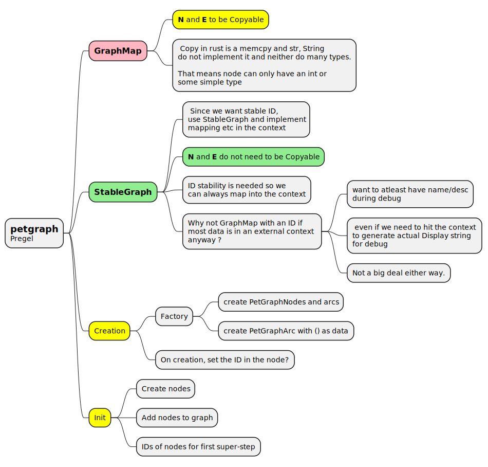
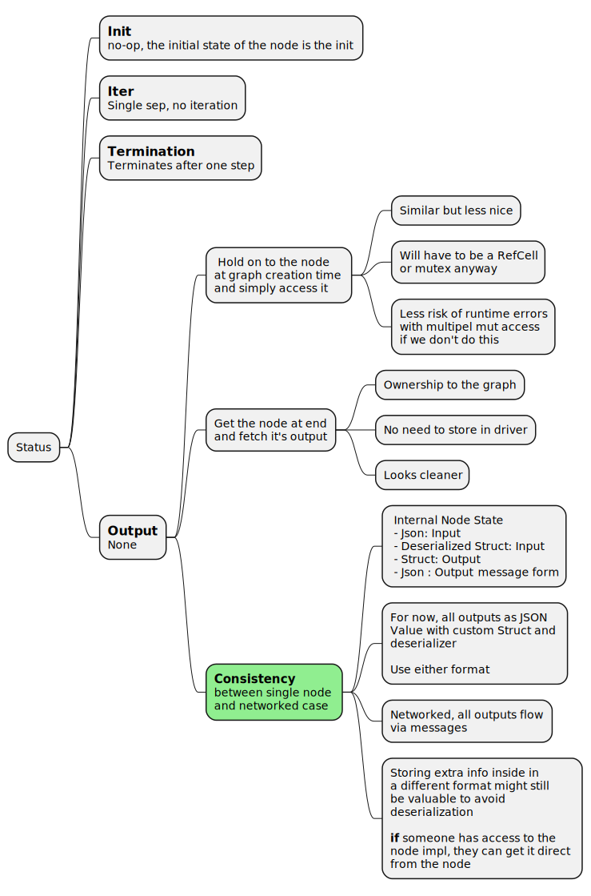

# Pregel Implementation in Rust

 - Ref: https://github.com/weso/pregel-rs


# My implementation

The `pregel-rs` impl seems odd. Either It does not hew closely to the pregel algo terminology _(unlike the neo4j interfaces)_ or maybe the impl was optimized to work with the advantages rust provides. Not clear. I want to see if I can come up with all this from scratch using the Neo4j/databricks interfaces as my guide, using a standard rust graph library. _I will need to quickly wrap up reading the rust book in that cass as library design calls for more indepth knowledge_.

 - **Rust Graph Lib**  [petgraph](https://docs.rs/petgraph/latest/petgraph/)
   - serialization
   - export to graphviz
   - [Tutorial/Review](https://hobbs.cz/rust-play/petgraph_review.html)
 - [SO Thread about Graph with arbitrary stucts](https://stackoverflow.com/questions/72983084/i-created-a-graph-with-petgraph-using-structs-as-nodes-but-i-cant-change-the-va)
 - [Banana - graph visualization C++/Qt](https://github.com/rrwick/Bandage) which uses [OGDF Graph Layout Algorithms in C++](https://github.com/ogdf/ogdf)
 - [Layout - A rust library that renders dot files into images](https://github.com/nadavrot/layout)


```bash
cargo new --lib lib-pregel
cd lib-pregel
cargo add petgraph
```

From a cursory look and using [SO Thread about Graph with arbitrary stucts](https://stackoverflow.com/questions/72983084/i-created-a-graph-with-petgraph-using-structs-as-nodes-but-i-cant-change-the-va) as an example.

 - Use `GraphMap` to get `O(1)` access to nodes since Pregel allows sending messages to any node whose identifier is known, not just those connected to outgoing edges. I could use `DiGraphMap` for directed version of it.
 - Pregel is the algorithm that operates on a graph
   - petgraph works with arbitrary nodes (**N**) and edges (**E**). The semantics involved are
   - pregel to invoke service wrapper by the Node
     - `N.RunNode(PregelExecutionContext) -> EdgeMessages`    
     - Refine based on SRP and OpenClose.
   - pregel to send output of service or init msg along the edge into a node
     - Pregel should be as dumb as possible.
     - Any specialization of how to handle certain edge-types should be in the vertex.
       - Either 
         - `let nop = N.RunNode(PregelExecutionContext) -> NodeOutputProvider`
         - `nop.ProvideOutputToEdge(edge)`
       - However, sometimes, vertices want to send outputs to special nodes beyond the output edges.
         - ..
       - Now what if the node wants to send messages to different nodes at different parts of it's execution?
         - `N.RunNode(PregelExecutionContext)` and then it uses `PregelExecutionContext.GetOutgoingEdges(myNodeId)` to send things along.
         - `N.run_node() -> messageProvider() . send_messages_to(outList)` and then later `N.run_node_and_send_messages()`


## Impl - Petgraph

petgraph seems to be a standard choice in rust graph libraries. So might as well figure some things out. This [Petgraph Review](https://hobbs.cz/rust-play/petgraph_review.html) seems to be a good starting point. He is actually using a rust notebook!


# History

## Start

```rust
trait MessageInbox<M> {
    // Take ownership of msg.
    fn incoming_msg(&self, msg: M) -> ();
}

trait MessageOutbox<M> 
{
    // Semantics are to buffer. WIll see if the name needs changing
    // M's ownership is moved.    
    fn outgoing_msg(&self, msg:M) -> ();
}

trait PregelNode<InMsg, OutMsg> {
    
}
```

## Combine messaging into one

Don't think there is a way to express PregelNode in terms of `MessageInbox` and `MessageOutbox`. Seems vastly simpler to collapse it all as they all belong together anyway.


```rust
trait PregelNode<InMsg, OutMsg> {
    // Take ownership of msg.
    fn take_incoming_msg(&self, msg: InMsg) -> ();

    // Semantics are to buffer. WIll see if the name needs changing
    // M's ownership is moved.    
    fn queue_outgoing_msg(&self, msg: OutMsg) -> ();
}
```

## Concretize Messages

It was tempting to provide a small set of strongly typed message classes and group them into an Enum. I feel that eventually we'll need generic JsonValue in here and allow the nodes to transform `Json->InputMessage` and `OutputMessage->Json`. However, that complexity, generality and expense of conversion is not needed right now. Lets see if get stuck with strongly typed concrete message types first.

```rust
#[derive(Clone, Debug)]
enum PregelMessage {
    Prompt(PromptMessage)
}

trait PregelNodeMessaging {
    // Take ownership of msg.
    fn take_incoming_msg(&mut self, msg: PregelMessage) -> ();

    // Semantics are to buffer. Will see if the name needs changing
    // M's ownership is moved.    
    fn get_outgoing_msgs(&mut self) -> impl Iterator<Item = PregelMessage>;
}
```

## Refine with better names and abstractions

and since I need the outgoing messages taken out, went through some quick revisions

 - Implemented Agent node to have two members of type `VecDequeue<PregelMessage>`
 - One way of taking msgs out would be to 
   - return the vec _which would a move_ and that is disallowed when using `&mut self`
   - you could init a local copy and then `std::mem::swap` but that would also be a move and is disallowed.
   - Stick the vector inside an `Option<>` would work since the Option itself is not being moved but it's contained item is.

Bunch of reading later, ended up with this

```rust
#[derive(Clone, Debug)]
enum PregelMessage {
    Prompt(PromptMessage)
}

trait PregelMessageConsumer {
    fn consume_message(&mut self, msg: PregelMessage);
}

trait PregelMessageDrainable {
    fn drain_all_messages(&mut self, drain: &mut impl PregelMessageConsumer);
}

trait PregelNode 
    : PregelMessageConsumer + PregelMessageDrainable 
{
}
``` 

which was implemented this way

```rust
#[derive(Clone, Debug, Default)]
pub struct AgentNode 
{
    inbox  : VecDeque<PregelMessage>,
    outbox : VecDeque<PregelMessage>
}

impl PregelMessageConsumer for AgentNode {
    fn consume_message(&mut self, msg: PregelMessage) {
        // Implement reduction here ?
        // Store just the one reduced PregelMessage
        self.inbox.push_back(msg);
    }
}

impl PregelMessageDrainable for AgentNode {    
    fn drain_all_messages(&mut self, target: &mut impl PregelMessageConsumer) {
        self.outbox
            .drain(0..)
            .for_each(
                move |x| target.consume_message(x)
            );
    }
}

impl PregelNode for AgentNode {
}
```

## Validate top down - create

Frequently going from the top use case helps to not get stuck with an unworkable low level design or a low level design resulting in terrible use-case DX.

I saw a problem right away in creating the pergraph MapGraph. **Petgraph's MapGraph needs Node, Edge** to be Copyable. VecDequeue is not _(note that Copyable in rust implies bitwise copy)_. Online examples showed non-copyable structs working with `StableGraph`. Will check that.



this then changes code to 

```rust
// pregel_graph_types.rs

#[derive(Clone, PartialEq, PartialOrd, Hash, Debug)]
pub struct PregelPetgraphNode {
    name : String,
    description : String,
    stable_id : i32
}

#[derive(Clone, PartialEq, PartialOrd, Debug)]
pub struct PreglPetgraphArc {
}

//-----------------------------------------------------------
// pregel_messages.rs


//-----------------------------------------------------------
// main.rs
mod pregel;

use pregel::pregel_graph_types::*;
use petgraph::stable_graph::StableDiGraph;

fn main() {
    //-- create graph    
    // MapGraph provides direct access to each node via a map. However
    // it needs Node type to implement Copy. This rules out str/String 
    // and all heap members. So switching to StableGraph and recording a 
    // map outside.    
    let mut graph = StableDiGraph::<PregelPetgraphNode, PreglePetgraphEdge>::new();

    // create the nodes
    let mut llm = PregelPetgraphNode {
        name : "LLM".to_string(),
        description : "".to_string(),
        stable_id : None
    };

    let llmIndex = graph.add_node(&llm);
    llm.stable_id = Some(llmIndex);
}
```

 - Cumbersome, this three step process. Great candidate for hiding inside a `Pregel` instance which encapsulates the graph itself.

### Refactor into a Pregel instance 

Now I am stuck with my lack of overall rust knowledge

 - store `PregetPergraphNode` instance
 - store a reference to it in a HashMap
 - lifetimes
 - Looks like I can use
   - lifetime scoped reference _(not entirely clear to me yet)_
   - `Rc` (refcounted like shared_ptr)
   - `Arc` (like Rc but async ref-counting. _Needs a mutex under it always ?)_
   - `Box` (store a pointer)

Using compiler guided instructions, I came up with this

```rust
pub struct PregelPetgraph<'a> {
    
    id_node_map : HashMap::<NodeIndex, PregelPetgraphNode>,
    graph : StableDiGraph::<&'a PregelPetgraphNode, PregelPetgraphEdge>,
}

impl<'a> PregelPetgraph<'a> {

    pub fn new() -> PregelPetgraph<'a> {
        PregelPetgraph {
            id_node_map : HashMap::new(),
            graph : StableGraph::new()
        }
    }
}
``` 
---

```rust
// pregel_petgraph.rs
pub struct PregelPetgraph {
    
    id_node_map : HashMap::<NodeIndex, Rc<PregelPetgraphNode>>,
    graph : StableDiGraph::<Rc<PregelPetgraphNode>, PregelPetgraphEdge>,
}

impl PregelPetgraph {

    pub fn new() -> PregelPetgraph {
        PregelPetgraph {
            id_node_map : HashMap::new(),
            graph : StableGraph::new(),
        }
    }

    pub fn add_node(&mut self, node: PregelPetgraphNode) -> NodeIndex {  
        // Create a Rc and clone it into both containers      
        let nodeRef = Rc::new(node);
        let id = self.graph.add_node(nodeRef.clone());
        self.id_node_map.insert(id, nodeRef);

        id
    }

    pub fn run_pregel(&mut self) {        

    }    
}

// main.rs
//-- create graph        
   let pg = PregelPetgraph::new();

   // create the nodes
   let llmId = pg.add_node(
       PregelPetgraphNode {
           name : "LLM".to_string(), 
           description : "".to_string()
   });
```

### Single Node - Init, Iter, Termination, Output



```rust
use std::collections::HashMap;
use std::rc::Rc;

use petgraph::prelude::StableDiGraph;
use petgraph::graph::NodeIndex;
use petgraph::Direction::Incoming;

use crate::{PregelPetgraphNode, PregelPetgraphEdge};

//-- Aliases
type RcPregelPetgraphNode = Rc<PregelPetgraphNode>;

pub struct PregelPetgraph {
    
    id_node_map : HashMap::<NodeIndex, RcPregelPetgraphNode>,
    graph : StableDiGraph::<RcPregelPetgraphNode, PregelPetgraphEdge>,
}

impl PregelPetgraph {

    pub fn new() -> PregelPetgraph {
        PregelPetgraph {
            id_node_map : HashMap::new(),
            graph : StableDiGraph::new(),
        }
    }

    pub fn add_node(&mut self, node: PregelPetgraphNode) -> NodeIndex {  
        // Create a Rc and clone it into both containers      
        let nodeRef = Rc::new(node);
        let id = self.graph.add_node(nodeRef.clone());
        self.id_node_map.insert(id, nodeRef);

        id
    }

    pub fn run_pregel(&mut self, max_iter: u32) {        

        for super_step in 0..max_iter {

            let ss_nodes = self.get_superstep_nodes(super_step)                
                .collect::<Vec<_>>();

            if ss_nodes.len() > 0 {

                for id in ss_nodes {
                    match self.graph.node_weight_mut(id) {
                        Some(node) => println!("Processing Node ID#{id:?} = {node:?}"),
                        None => println!("Error: No node for ID#{id:?}")
                    }
                }
            } else {
                println!("Terminating at superstep: {super_step}. No active nodes");
            }
        }
    }       

    /// nodes that will participate in each super-step
    pub fn get_superstep_nodes(&self, super_step: u32) -> impl Iterator<Item=NodeIndex> + '_ { 

        // Initially, simply choose all nodes which have no incoming 
        // edges. Refine later
        if (super_step == 0) {            
            self.graph.externals(Incoming)        
        } else {
            // Since I have only one node. This will do :-)            
            self.graph.externals(Incoming)
        }
    }     

}
```

👆 compiler said that to make the iterator capture the implicit bound in `Externals<'_, ..>` I should add it to the return this way: `impl Iterator<Item=NodeIndex> + '_`. I get the concept of lifetime but don't grok it yet. Abide, I will.

### Output considerations

Every node sends a message out. What the message holds depends on the actual algo in place but for my use cases

 - edges are data-flow pipes
 - Agentic flows, data is simply the output 
 - `message` ⇔ `serialized output`

The only time message/output is produced is when the node is _executed_. Message production and message passing could be considered related but the roles are best kept different as there are different considerations in message-passing like retries etc that are best removed from the node.

 - **Node** Generates Output message
 - **Pregel Algorithm** Sends that message out


```rust
// Role: PregelNode (MessageProducer)
pub trait PregelNode {
    ...

    // Main invocation of the node
    fn exec(ctx: &PregelContext) -> Result<NodeMessage>

    ...
}

// Role: PregelAlgorithm (MessageDelivery)
impl PregelPetgraph {
    ...
    pub fn run_pregel(..) -> Result<> {
        ...
        node.exec(ctxt)
            .and_then(|msg| neightbors_inbox(nodeIdx, msg))?;
    }
}
```

Now, is there any reason to optimize the actual message creation. Most likely, there is a `interal_output_rep.to_json()` serialization going on. Is it worth pushing that out till 
it is actually needed by something like this..

```rust
// Role: Message generation by converting from internal state
pub trait NodeMessageGenerator {
    fn generate_message() -> Result<Value>
}

// Role: Internal concrete output generation
pub trait PregelNode {
    ...

    // Main invocation of the node
    fn exec(ctx: &PregelContext) -> Result<impl NodeMessageGenerator>;

    ...
}

// PregelAlgorithm - Single-node case
//   Role: Message Generation if needed
//   Role: Message transmission
//  
//   No advantage except we can capture 
//      errors from generation and from 
//      message conversion separately
impl PregelPetgraph {
    ...
    pub fn run_pregel(..) -> Result<> {
        ...
        node.exec(ctxt)
            .and_then(|m_gen| m_gen.generate_message())?
            .and_then(|msg| neighbors_inbox(nodeIdx, msg))?;
    }
}

// When paralell though. Some advantage in generating 
// messages only if all nodes in super-step have succeeded
use rayon::prelude::*;

impl PregelPetgraph {
    ...
    pub fn run_pregel(..) -> Result<> {
        ...
        nodes
            .par_iter()
            .map(|node| node.exec(ctxt))
            .collect(..)
            ...        
    }
}
```

👆 Adds indirection and complexity that is not really needed now. Will do once I have a multi-node paralell execution use-case.

## Mutable Nodes in PregelPetgraph

When I was just making the skeleton, I did not actually call any methods on the PergranNode objects. So this worked.

```rust
type RcPregelPetgraphNode = Rc<DynPregelNode>;

pub struct PregelPetgraph {
    id_node_map: HashMap<NodeIndex, RcPregelPetgraphNode>,
    graph: StableDiGraph<RcPregelPetgraphNode, PregelPetgraphEdge>,
}

....
impl PregelPetgraph {
    ...
    pub fn run_pregel(&mut self) {
        let super_step = 0;
        let ctx = PregelContext{};
        let ss_nodes = self.get_superstep_nodes(super_step).collect::<Vec<_>>();

        if ss_nodes.len() > 0 {
            for id in ss_nodes {
                match self.graph.node_weight_mut(id) {
                    Some(node) => println!("Processing Node ID#{id:?}"),
                    None       => println!("Error: No node for ID#{id:?}"),
                }
            }
        } else {
            println!("Terminating at superstep: {super_step}. No active nodes");
        }
    }

```

Now, I want to call a method on Node that takes a `&self`. The only way to `Rc` _(which allows multiple shared copies in **read-only**)_ and mutate it is to use `Rc<RefCell<T>>` and perform runtime borrowing.

So..

```diff
```rust
-type RcPregelPetgraphNode = Rc<DynPregelNode>;
+type RcPregelPetgraphNode = Rc<RefCell<DynPregelNode>>;

pub struct PregelPetgraph {
    id_node_map: HashMap<NodeIndex, RcPregelPetgraphNode>,
    graph: StableDiGraph<RcPregelPetgraphNode, PregelPetgraphEdge>,
}

....
impl PregelPetgraph {
    ...
    pub fn run_pregel(&mut self) {
        let super_step = 0;
        let ctx = PregelContext{};
        let ss_nodes = self.get_superstep_nodes(super_step).collect::<Vec<_>>();

        if ss_nodes.len() > 0 {
            for id in ss_nodes {
                match self.graph.node_weight_mut(id) {
                    Some(node) => {
+                       node.borrow_mut().exec(&ctx);
                        println!("Processing Node ID#{id:?}")
                    },
                    None       => println!("Error: No node for ID#{id:?}"),
                }
            }
        } else {
            println!("Terminating at superstep: {super_step}. No active nodes");
        }
    }

```

## Allowing clients to fetch utputs concrete nodes directly

> Looks like a bad-idea to me. However, if the language allows `Rc<RefCell<T>>`, it is not a big deal to allow a client to hold on to one instance of such an `Rc` right!

## Revisit messaging - init

The main pregel algo described sending init messages to nodes and whichever nodes received them woud be marked active.

I thought that I could skiip this and simply bake initial state into the nodes at start. Kinda like `LangGraph's` state. However, when treating the node's return values as `Result<T>` I was like, how would I restart the graph computation on error ? The nodes could be in a wierd errored-out state. Maybe go back to orignal pregel: simply send an init message out _(target just that node)_. The implications of this are 

> Since this should work for a degenerate case of a single node, the MessageBox should be maintained by the PregelAlgorithm and not depend on incooming edges. So dumbify edges: they are not message passing conduits _(for now atlest)_, they only specify connection and direction.
>
> Another thought about how we can have type safe message passing without a lot of name coupling. Visitor type framerwork might yet be needed but I am thinking
> - Each agentic use-case
>   - Have it's own Enum MessageType which encapsulates all the concrete types it needs. Eg `ScreenWritingOneShotLLMMsg(OneShotLLMMessage)`
>   - The nodes will then do a match on the type they want.
>   - Now, what about foundtional/lib agents: ones built to directly use `OneShotMessage` ? Can they. How will they get the nested  simply use a agent-supplied `to`? The agentic-use-case defines `From` and this supplies us a `to` as well right? Need to check.

## Revisit messaging - Output

If we are doing init messages, it seems to me that outputs should work the same way, via messages.

 - Nodes state is controlled/reset by incoming messages
 - Can consider the collection of messages to be the state. 
   - Nothing stops us from reprocessing those init messages in repeated invocations to produce the same output _(or memoize)_
   - However, pregel explicitly talks about de-activating Nodes if no incoming messages.
     - Drain the input messages then ?
     - Treat it like incoming data-packet which is consumed/processed
     - always generates an output which is stored in outbox awaiting draining.

 ## Consolidating messaging - IO

Even if pregeal specifies that outputs be collected and then sent in as inputs at start of ext super-step. I can totally see all this simply reduced to a plain function call.

 `exec(Vec<inMsg>) -> Result<OutMsg>`

  - Collect input messages _(mail box is with Pregel)_ per node
  - Each superstep
    - call each node and collect it's output
    - Either serially or parallelly
  - When Scale is massive like Google's
    - Central storage of all message data, unbounded memory
    - Best to have each Node store in/out msgs
    - Algo will simply forward thereby having a bounded memory increase 
    - Mostly solved with partitioning.
 
 So how about 

 ```rust
 pub trait PregelMessagePortIn {
    type MessageType;

    // Consumption
    fn take_msg(&mut self, msg: Self::MessageType);
}

pub trait PregelNode : PregelMessagePortIn {
    // The impl will define it's own Error and Message types.
    // These should match with the ones defined for the edges
    // as well.    
    type ErrorType;    

    fn name(&self) -> &String;
    fn description(&self) -> &String;

    // Main invocation of the node    
    fn exec(&self, ctx: &PregelContext) -> std::result::Result<Self::ErrorType, Self::MessageType>;
}
```
↓
```rust
pub trait PregelNode {
    // The impl will define it's own Error and Message types.
    // These should match with the ones defined for the edges
    // as well.    
    type ErrorType;    
    type MessageType;

    fn name(&self) -> &String;
    fn description(&self) -> &String;

    // Main invocation of the node    
    fn exec(&self, 
        ctx: &PregelContext,
        in: Vec<Self::MessageType>) -> std::result::Result<Self::ErrorType, Self::MessageType>;
}
```

Message abstraction and waiting for superstep is all part of the algo, the Node abstraction does not need to expose it. If it turns out that paralell execution requires it, can always bring it back. For now, simplify!

## Rusty - Impl associated type defaults

In C++, I am used to creating typedefs for gnarly types: makes code much easier to read and helps in focusing on the core algo more than the mile long stl type decls. Rust however has some limitations around it _(all for good reasons, I'd assume, but its a pain nevertheless)_

 - ✔️ type aliases at the module level.
 - 👎No type aliases at the struct level
    - Not a big deal as I can do it at the module level.
 - ✔️ `associated type`s at the trait level
    - This is great as the traits are meant to be a collection of behavior/functions and you can neatly express them in semantically meaningful types, whatever those are.
    - Powerful: as rust allows you to specify constraints on these associated types.
    - However
        - 👎 traits have no data fields and you have to impl a trait for a struct. 
        - If that struct were to have multiple data structures using the associated types, how are you going to pre-declare them if you cannot reference the types ?  

tried

```rust
pub trait PregelAlgorithm {
    type NodeTraitType;
    ❌ type SharedNodeType : Box<T = dyn Self::NodeTraitType>; // illegal
    ❌ type SharedNodeType : Box; // has to be trait
    ✔️ type SharedNodeType : Deref; // Works but not useful
    ❌ type SharedNodeType : Deref<Target = dyn Self::NodeTraitType>; // What I wouldbe liked but it says Self::NodeTRaitType is not a type!
    ...
}
```

Best I can do for now is ` type BoxedNodeTraitObjectType : Deref;`

## More rust offness - The Pimpl lives again

> When you implement a trait for a struct, you cannot throw in any helper methods in that same impl blocks. Only those methods listed in the trait can exist in the block!!! What a serious PITA! I want to keep related things close and keep the impl close too. Disappointing lang choice. 

Finally switched to the typical `pimpl` idiomness

```rust
//- Types -------------------------------------------
pub trait PregelAlgorithm

pub(crate) trait PregelAlgorithmImplementation : PregelAlgorithm


//- Public API --------------------------------------
// Public driver exposing the PregelAlgorithm interface
struct PregelDriver {
    impl : PregelPetgraph
}

impl PregelAlgorithm for PregelDriver {
    // simply forward all calls to the underlying impl
    // PregelPetgraph
}

//- Internal Impl ----------------------------------
// Pregel Implementation
pub(crate) struct PregelPetgraph {
    ...
}

impl PregelAlgorithm for PregelPetgraph {

}

impl PregelAlgorithmImpl for PregelPetgraph {

}
```

## Borrow checker forcing coding style! - Multiple mutable references

Take this for instance

```rust
fn run_pregel(&mut self) -> core::result::Result<Vec<Self::Message>, Self::Error> {

        let super_step = 0;
        let ctx = PregelContext{};

        //---- for each super-step
        // Clear out all outbox messages
        // The current ones will be dangling outputs for the previous 
        //   super-step and considered outputs for the entire graph.
        //   We only keep the outputs for the last super-step allowing 
        //   clients to fetch em.
        // All outputs that are connected via edges to other nodes 
        //  would have been transferred to their invox at the end of 
        //  prev super-step
        self.clear_disconnected_outboxes();

        // Get the super-step nodes and bail if any errors here.
        let ss_nodes = self.ss_node_weights(super_step)?;
        let ids = ss_nodes.iter().map(|(id,_)| id.clone()).collect_vec();

        // Take all inbox messages to be sent to the nodes, 
        // TODO: Push ino an ImplContext. This, ss, ss_nodes etc.
        let mut in_msg_map = HashMap::<Self::NodeIndex, Vec<Self::Message>>::new();
        self.drain_inbox_msgs_into(&ids, &mut in_msg_map);

        let (successes, failures):(Vec<_>, Vec<_>) = ss_nodes
            .iter()
            .map(|(id, n)| {
                    let res = n.borrow_mut().exec(
                        &ctx,
                        in_msg_map.remove(id));
                    
                    (id, res)
            })
            .partition_map(|exec_out| match exec_out {
                (i, Ok(res)) => Either::Left((i, res)),
                (i, err) => Either::Right((i, err))
            });
    

        // end of computation
        // Transfer all results into the outbox of the nodes

        todo!()
    }
}
```

`ss_nodes` is returned from `ss_node_weights(&mut self) -> ss_nodes`. The BC assumes that _since the return has the same (implied) lifetime as the `&mut self`, it likely holds a reference to `&mut self`_.

The consequence of this is that, while `ss_nodes` is alive, you cannot hold any other mutable reference to `&self`. So once the `ss_nodes` is created, the `self.drain_inbox_msgs_into` fails with **Cannot hold multiple mutable references to self**.

Tons of posts about this. The simplest solution seems to be to trick the BC/Compiler

 - Remove the returns from these method - _which is so sad. This means I cannot simply chain the calls like I want to_.
 - Send in a mutable argument and put whatever would have been returned inside of it.
   - You are holding a `&mut self` for the duration of the function call
   - But compiler assumes you are done with it when the call returns if there is nothing returned from the function.

So basically

```rust
let ss_nodes = self.ss_node_weights(super_step)?;

↓

struct CalcContext {
    ss_nodes : Vec<dyn Box<PregelNode>>,
}

let mut calc_ctxt : CalcContext{..}
self.ss_node_weights(&mut calc_context);

calc_ctxt.ss_nodes.iter()....
```

## More BC complaints

Tons more issues later, I reorganized the code to keep the BC happy

 - Avoid returning references (either return or into `mut ref` params)
 - Postpone learning about specifying lifetimes for such things, just get things working for now
 - Chaining multiple for_each blocks, each of them using the same mutable member is a serious issue. Essentially, there are multiple `FnMut` involved here implementing the closures and they all want to hold the mutable reference and the BC does not like this. You have to understand the low-level desugaring of `for_each` tounderstand this. Gah!! 
 - I'm sure I'll come up with better strategies as I grok the BC, Lifetimes and such better.

# First working code

Anyway. 🥳🎇, got the whole thing working!! Final code looks like this. Simplified and removed code that I would have otherwise kept _just in case_.

## Refinement

One of the design decisions that allows for reuse of existing components is the following enum

```rust
use crate::agentic::llm::one_shot_chat::{LLMPrompt,LLMPromptResponse};

#[derive(From, Debug, Clone)]
pub enum AgenticMessages {
    #[from]
    AMPrompt(LLMPrompt),

    #[from]
    AMPromptResponse(LLMPromptResponse)
}
```

 - Lib provided `LLMPrompt` and `LLMPromptResponse` used by the `OneShotLLM` node.
 - Gathered into the `AgenticMessage` variants via wrapping.

However, instead of being forced to use this verbose/ugly/distracting wrapped instantiation of the underlying `LLMPrompt`

```rust
AgenticMessages::AMPrompt(LLMPrompt{prompt:"Why is the sky blue".to_string()})
```

The `#[from]`, which automatically generates `From` and `Into` convesions, saves us and I can simply use 

```rust
LLMPrompt{prompt:"Why is the sky blue".to_string()}.into()
```

## Example code


## Interfaces

```rust
pub(crate) trait PregelAlgorithmImpl : PregelAlgorithm {
    type InternalError;    

    // Get the nodes that participate in the given super-step
    fn superstep_node_ids(&self, super_step: u32) 
        -> impl Iterator<Item = Self::NodeIndex> + '_ ;    
    
    fn clear_disconnected_outboxes(&mut self);    

    fn into_run_results(&mut self,
        max_supersteps : u32,
        final_superstep: u32,
        node_errors: &mut Vec<(Self::NodeIndex, Self::Error)>) -> core::result::Result<Self::RunResult, Self::Error>;
}
```

## Add static lifetimes ?

```
error[E0310]: the parameter type `TErr` may not live long enough
   --> rust/projects/learn/agentic/lib-pregel/src/pregel_impl/pregel_petgraph.rs:220:21
    |
220 |                     node_join_set.spawn(f())
    |                     ^^^^^^^^^^^^^^^^^^^^^^^^
    |                     |
    |                     the parameter type `TErr` must be valid for the static lifetime...
    |                     ...so that the type `TErr` will meet its required lifetime bounds
    |
help: consider adding an explicit lifetime bound
    |
69  |     TErr: Send + From<PregelAlgorithmError> + std::fmt::Debug + 'static,
    |                                            Ms                   +++++++++
```

static exploration (See [Rust_Lifetimes_FAQ](../../../docs/Rust_Lifetimes_FAQ.md))

> Having U: 'static means that U contains no references with a lifetime less than 'static. This is required because you want to put a U instance in a structure without lifetimes.

So if you have to assume that `TMsg` and `TErr` can be anything, then `'static` essentially says that they do not contain references or other things that restrict their lifetimes.

## Futures cannot be sent across threads

```rust
error: future cannot be sent between threads safely
   --> rust/projects/learn/agentic/lib-pregel/src/pregel_impl/pregel_petgraph.rs:133:61
    |
133 |       ) -> core::result::Result<Self::RunResult, Self::Error> {
    |  _____________________________________________________________^
134 | |         let node_ctx = Arc::new(Mutex::new(PregelContext {}));
135 | |
136 | |         // Not just final result but we'll use this to store the errors as well.        
...   |
263 | |         self.into_run_results(max_supersteps, superstep, &mut node_errors)
264 | |     }
    | |_____^ future created by async block is not `Send`
    |
note: future is not `Send` as this value is used across an await
   --> rust/projects/learn/agentic/lib-pregel/src/pregel_impl/pregel_petgraph.rs:225:66
    |
216 |             let _abort_handles = node_exec_fns
    |                 -------------- has type `Map<std::slice::Iter<'_, (NodeIndex, {closure@rust/projects/learn/agentic/lib-pregel/src/pregel_impl/pregel_petgraph.rs:189:40: 189:47})>, {closure@rust/projects/learn/agentic/lib-pregel/src/pregel_impl/pregel_petgraph.rs:218:22: 218:36}>` which is not `Send`
...
225 |             while let Some(join_res) = node_join_set.join_next().await {
    |                                                                  ^^^^^ await occurs here, with `_abort_handles` maybe used later
    = note: required for the cast from `Pin<Box<{async block@rust/projects/learn/agentic/lib-pregel/src/pregel_impl/pregel_petgraph.rs:133:61: 264:6}>>` to `Pin<Box<dyn Future<Output = std::result::Result<PregelRunResult<TMsg, TErr, NodeIndex>, TErr>> + Send>>`
help: consider further restricting this bound
    |
68  |     TMsg: Send + Clone + std::fmt::Debug + 'static + std::marker::Sync,
    |                                                    +++++++++++++++++++

```

This is thrown for 

```rust
let async_fn = move || async move {                        
                            let node_inner = node.lock().unwrap();
                            node_inner.exec(node_ctx, input_msgs)
                            .await
                            .map(|r| (id, r))
                            .map_err(|e| (id, e))
                        };
```                        

and the `Future` involved is the async block's output from `PregelNode.exec` `Future< Output = Result>` where `Result = std::result::Result<Self::Message, Self::Error>`. Now, to make this `Sync` for random `TMsg` and `TErr`, they both need to be Sync. Hence the compiler suggestion.

👉 So I  made both `TMsg` and `TErr` `+ Sync`

### MutexGuard is not sync

Then the error changed to `MutexGuard` is not sync. This is the `mutex.lock()` I am using inside the async closure! 

https://stackoverflow.com/questions/67277282/async-function-the-trait-stdmarkersend-is-not-implemented-for-stdsync. ALso see [Rust_Async_MT.md](../../../docs/Rust_Async_MT.md)

Even though Tokio's mutext is also under a sync ns `tokio::sync::Mutex`, it is designed to be async and held across awaits, the change looks like this..

```diff
-use std::sync::Mutex;
+use tokio::sync::Mutex;
...
 let async_fn = move || async move {                        
-                            let node_inner = node.lock().unwrap();
+                            let node_inner = node.lock().await;
                            node_inner.exec(node_ctx, input_msgs)
                            .await
                            .map(|r| (id, r))
                            .map_err(|e| (id, e))
                        };
```

👉 TODO: Document other changes from the Diffs


## Message filtering macros

The original `OneShotChatNode` had the following code for it's input message processing

```rust
fn get_prompt_from_messages(
        &self,
        _ctx: &Arc<Mutex<PregelContext>>,
        in_msgs: Option<Vec<AgenticMessages>>,
    ) -> std::result::Result<LLMPrompt, AgenticError> {
        // We have to have an input. Otherwise, error
        let mut msgs = in_msgs.ok_or(AgenticError::MissingInputMessage(
            "No LLMPrompt msg for OneShotChat".to_string(),
        ))?;

        // Warn about ignored non-prompt messages
        let (mut prompt_msgs, non_prompt_msgs): (Vec<_>, Vec<_>) =
            msgs.drain(..).partition_map(|msg| match msg {
                AgenticMessages::AMPrompt(p) => Either::Left(p),
                np @ _ => Either::Right(np),
            });

        non_prompt_msgs.iter().for_each(|msg| {
            warn!("Non AgenticMessage:{msg:?} ignored by OneShotChat!");
        });

        // Warn about only using one prompt message
        if prompt_msgs.len() > 0 {
            Ok(prompt_msgs.pop().unwrap())
        } else {
            Err(AgenticError::MissingInputMessage(
                "No LLMPrompt msg for OneShotChat".to_string(),
            ))
        }
    }
```

 - Check if any messages are present! AgenticError otw.
 - Split into Handled/Unhandled message types
   - Warn if Unhandled messages > 0
   - Warn if handled messagesa re > 1
 - Take only 1 of the Handled messages
   - Warn about and print out the rest

Now, I am expecting every node impl to use logic like this. Naturally points to refactoring into a utility func.

 - Generics were the first thought!
 - However, while enum type `AgenticMessage` can be a generic parameter, a variant _(that we are filtering on)_ cannot.
 - This means, API will need to still take a filter that matches on the wanted type.

**Starting with 👇**
```rust
fn get_prompt_from_messages(
        &self,
        _ctx: &Arc<Mutex<PregelContext>>,
        in_msgs: Option<Vec<AgenticMessages>>,
    ) -> std::result::Result<LLMPrompt, AgenticError> {

        // We have to have an input. Otherwise, error
        let mut msgs = in_msgs.ok_or(AgenticError::MissingInputMessage(
            "No LLMPrompt msg for OneShotChat".to_string(),
        ))?;

        // Warn about ignored non-prompt messages
        let (mut prompt_msgs, non_prompt_msgs): (Vec<_>, Vec<_>) =
            msgs.drain(..).partition_map(|msg| match msg {
                AgenticMessages::AMPrompt(p) => Either::Left(p),
                np @ _ => Either::Right(np),
            });

        non_prompt_msgs.iter().for_each(|msg| {
            warn!("Non AgenticMessage:{msg:?} ignored by OneShotChat!");
        });

        // Warn about only using one prompt message
        if prompt_msgs.len() > 0 {
            Ok(prompt_msgs.pop().unwrap())
        } else {
            Err(AgenticError::MissingInputMessage(
                "No LLMPrompt msg for OneShotChat".to_string(),
            ))
        }
    }
``` 

Bunch of work on [Rust_Macros.md](../../../docs/Rust_Macros.md) later _(with initial development at [../lang/basic_features/src/macro_enum_match.rs](../lang/basic_features/src/macro_enum_match.rs), I replaced the `get_prompt_from_messages` function with the following call in `exec` itself

```diff
async fn exec(
        &self,
        ctx: Arc<Mutex<PregelContext>>,
+       mut in_msgs: Option<Vec<Self::Message>>,
-       in_msgs: Option<Vec<Self::Message>>,
    ) -> Result<Self::Message, Self::Error> {
        debug!("Exec called on OneShotChat");

-        let msg = self.get_prompt_from_messages(&ctx, in_msgs)?;

+        // Build a closure that filters messages which match 
+        // AgenticMessage::AMPrompt() and returns the wrapped LLMPrompt        
+        let msg = build_block_extract_one_left_partition_warn!(
+              in_msgs,
+              format!("{}[OneShotNode]", self.name),
+              AgenticMessages::AMPrompt(inner @ _),
+              inner)
+              .ok_or(AgenticError::MissingInputMessage(
+                  "No LLMPrompt msg for OneShotChat".to_string()
+              ))?;
        
        trace!("OneShotChat is processing prompt: {msg:?}");
        self.get_chat_response(msg).await
    }
```

## Edges and multiple nodes

✔️ See [examples/02_joke_gen_and_critique.md](./lib-agentic/examples/02_joke_gen_and_critique.md)

## Tool calling

WIP! See [examples/03_tool_calling.md](./lib-agentic/examples/03_tool_calling.md)

> At this point, while looking at some existing Agent examples, It struck me that my current design is type-safe at the level of `AgenticMessage`: however, whether a node accepts a message, what type of message _(or messages)_ it outputs etc are a runtime decision.
?
>
> I wonder if the design should be updated to allow for exposing the MsgTypes somehow so that the graph can validate the edge connections.
>
> I suspect a lot of macro magic can go into this but when it comes to tools and the `GenericTool` say. We want to see if the message the `LLMPrompter` puts out matches the Msg the tool can accept.
>
> For now, backburner this, as long as atleast runtime validation works, I can make progress and get to the point of writing the medium articles and job search.
>
> 👉 Or exchange JSON Schemas to compare. Ask to generate JSOSSchemas of inputs (many) and outputs (many) and instead of generating rust level enums to represent the union types, we can have debug printable json schemas.

How about 

```rust
struct ToolCallMessage {
    schema: Value,            // generated by ..
    tool_call_id: String      // The LLM sends this out to ID each call.
    tool_params : Vec<Value>  // Simple string. Can this be stringified json?
}

struct ToolCallResponse {
    // Mainly for the tool_call_id
    call_msg : ToolCallMessage,

    // just a string but can be stringified json in the most generic case.
    call_response: String
}
```

```diff
pub enum AgenticMessages {
    #[from]
    AMPrompt(LLMPrompt),

    #[from]
    AMPromptResponse(LLMPromptResponse)

+    #[from]
+    AMToolParams(ToolCallMessage),

+    #[from]
+    AMToolResponse(ToolCallResponse),
}
```

### ToolCAlling - Partial

> Completed tool-setup, LLMPrompterNode aware of tool-calls and toolCallMsg sent to GenericToolCall node.

See [03_tool_calling.md](./lib-agentic/examples/03_tool_calling.md) for some additional/different details. However, once I took a look at genai's recent tool support, I decided to simply switch to much of those classes .

 - `Tool`, `ToolCall` and `ToolResponse` for tool support
 - `ChatRequest` in `LLLMPrompt` and now I get
   - History
   - Multi-part prompts
   - Tools etc
   - Build a prompt using system-prompt, user-prompt and tools.

👉 See [this commit]() for all the changes (Too many changes for me to document in detail here. Code diffs are best). Especially, look at the examples in that commit.

### ToolCalling - Complete

> Complete the rest where the ToolCallResponse is sent from GenericToolNode back to LLMPrompter and it incorporates it in the final response. See [examples/03_tool_calling.md](./lib-agentic/examples/03_tool_calling.md)

 - Switched to using genai classes which are complete and on their way to support multi-part
   - ChatContext, history etc
   - Tool, ToolCall, ToolResponse


## Evolve infra - Selecting start nodes

The pregel code made some simplifications but here are some of the major changes once we have a loop in the graph.

 - ⚠️ Start nodes were selected to be externals with no incoming! However, with `Prompter` → `Tool` → `Pormpter`: It is a cycle. So it was always getting 0 nodes.
   - Changed this to select all nodes with incoming msgs (One of them atleast will have an init msg)

```rust
   fn superstep_node_ids(graph: &Self::GraphArcMutexdNodes, 
        id_mbox_map: &Self::NodeIdMailBoxMap,
        super_step: u32) -> Vec<Self::NodeIndex> {
        // Initially, simply choose all nodes which have no incoming
        // edges. Refine later
        if super_step == 0 {
            graph
            .externals(Incoming)
            .collect_vec()
        } else {

            // select all nodes with messages pending in their queue (This will mean 
            // I have to call this after the previous super-step generated msgs are 
            // delivered            
            id_mbox_map
            .iter()
            .filter(|(_k, v)| v.inbox.len() > 0)
            .map(|(k, _v)| k.clone())
            .collect_vec()            
        }
    }
```	

↓

```rust
fn superstep_node_ids(graph: &Self::GraphArcMutexdNodes, 
        id_mbox_map: &Self::NodeIdMailBoxMap,
        super_step: u32) -> Vec<Self::NodeIndex> {

        // select all nodes with messages pending in their queue.
        // Either msgs sent from upstream nodes
        // -or-
        // Init msg
        // Once iteration starts, this will mean that Node Outboxes will have to be delivered along 
        // edges before this method is called.
        let active_nodes = id_mbox_map
            .iter()
            .filter(|(_k, v)| v.inbox.len() > 0)
            .map(|(k, _v)| k.clone())
            .collect_vec();

        // At the start only active nodes are those which have init messages sent to them.
        if super_step == 0 {
            if active_nodes.len() > 0 {
                // Those with InitMessages
                debug!("Have {} nodes with init messages. Marking them as active for step==0", active_nodes.len());
                active_nodes
            }
            else {
                debug!("No Nodes with init msgs in step=0. Selecting Externals with no Incoming as start nodes");
                graph
                .externals(Incoming)
                .collect_vec()
            }            
        } else {
            active_nodes
        }
    }
```

and this looks ok so far

# Evolve infra - Deliver msgs along edges

Similar issue, original code was using `externals` but with a loop, I have no externals. So nothing was getting delivered.

```rust
// Each node that has messages in it's outbox, sends them along it's outgoing edges    
    fn deliver_msgs_along_edges(graph: &Self::GraphArcMutexdNodes, id_mbox_map: &mut Self::NodeIdMailBoxMap)
    {
        // Start with graphs that have no incoming edges. These are the roots        
        for start in graph.externals(petgraph::Direction::Incoming) {
            let mut dfs = Dfs::new(graph, start);

            while let Some(node_id) = dfs.next(graph) {

                // Send messges down connected out-edges. 
                // Do this only (filter) if there are output messages waiting.
                // AND we have outgoing edge. Clone the msgs before sending, try 
                // to optimize the clones.
                // 
                // If no out0going edges, the outbox message is retained and will become 
                // the output of the grap for this super-step.                
                id_mbox_map
                    .get_mut(&node_id)
                    .filter(|mbox| mbox.outbox.len() > 0)
                    .map(|mbox| {
                        let target_nodes:Vec<_> = graph.edges_directed(node_id, Outgoing)
                            .map(|edge_ref| edge_ref.target())
                            .collect_vec();                        

                        // Only drain if there are outgoing nodes. Otw we need to preserve
                        // outgoing msgs since they are part of the graph's output at the end of 
                        // each super-step.
                        if target_nodes.len() > 0 {
                            debug!("{node_id:?} has outgoing msgs to {} nodes! Sending", target_nodes.len());
                            Some((target_nodes, mbox.outbox.drain(..).collect_vec()))                        
                        } else {
                            None
                        }
                    })
                    .flatten()
                    .map(|(nodes, msgs)|{
                        Self::deliver_msgs_to_nodes(msgs, nodes, id_mbox_map);
                    });
            }
        }
    }    
```

 - Use externals (multi root)
 - DFS down each root and cover all connections
 - ⚠️ Does not handle full cycles as there will be no externals

↓

```rust
// Each node that has messages in it's outbox, sends them along it's outgoing edges    
    fn deliver_msgs_along_edges(graph: &Self::GraphArcMutexdNodes, id_mbox_map: &mut Self::NodeIdMailBoxMap)
    {
        // Start with graphs that have no incoming edges. These are the roots        
        let mut start_nodes = graph.externals(petgraph::Direction::Incoming).collect_vec();

        // FIXME: Should we always add roots ? Atleast one root condition!?
        // The basic Prompter -> Tool -> Prompter is a loop with no nodes.
        // Pick any one thing for now.
        if start_nodes.len() == 0 {            
            start_nodes.push(graph.node_indices().next().unwrap());
            trace!("Have no externals. Picking one node to start BFS from: {:?}", start_nodes);
        }

        for start in start_nodes {
            let mut dfs = Dfs::new(graph, start);

            while let Some(node_id) = dfs.next(graph) {
                trace!("Visiting Node[{:?}] in BFS", node_id);
                Self::deliver_msgs_along_edges_for_node(graph, node_id, id_mbox_map);                
            }
        }
    }    

    fn deliver_msgs_along_edges_for_node(graph: &Self::GraphArcMutexdNodes, 
        node_id: Self::NodeIndex,
        id_mbox_map: &mut Self::NodeIdMailBoxMap) 
    {
        // Send messages only (filter for this) if there are output messages waiting.
        // AND we have outgoing edge. Clone the msgs before sending, try 
        // to optimize the clones.
        // 
        // If no outgoing edges, the outbox message is retained and will become 
        // the output of the grap for this super-step.                
        id_mbox_map
            .get_mut(&node_id)
            .filter(|mbox| mbox.outbox.len() > 0)
            .map(|mbox| {
                let target_nodes:Vec<_> = graph.edges_directed(node_id, Outgoing)
                    .map(|edge_ref| edge_ref.target())
                    .collect_vec();                        

                // Only drain if there are outgoing nodes. Otw we need to preserve
                // outgoing msgs since they are part of the graph's output at the end of 
                // each super-step.
                if target_nodes.len() > 0 {
                    debug!("{node_id:?} has outgoing msgs to {} nodes! Sending", target_nodes.len());
                    Some((target_nodes, mbox.outbox.drain(..).collect_vec()))                        
                } else {
                    None
                }
            })
            .flatten()
            .map(|(nodes, msgs)|{
                Self::deliver_msgs_to_nodes(msgs, nodes, id_mbox_map);
            });
    }
```

 - Externals or **pick any one** 
   - _If no externals, means every node has an incoming!. Pick any node and start DFS and I should be able to cover the whole thing. Far from Rigorous though, need a proper graph theory confirmation. For now, works_.

## Improve node DX - Better msg filtering

A combination of macros, and helpers 

```rust
#[macro_export]
macro_rules! build_block_pattern_partition { 

    ($vals:expr, $pattern:pat, $binding:tt) => {
        {
            let (wanted, unwanted) : (Vec<_>, Vec<_>) = $vals.drain(..)
                .partition_map(|v| match v {
                    $pattern => Either::Left($binding),
                    fail @ _ => Either::Right(fail)
                });
            
            (wanted, unwanted)
        }
    };
}
```

&

```rust
impl AgenticMessages 
{
    pub fn func_take_llmprompt_msgs(mut msgs: Vec<AgenticMessages>) 
        -> (Vec<LLMPromptMsg>, Vec<AgenticMessages>) 
    {
        build_block_pattern_partition!(
            msgs,
            AgenticMessages::AMPrompt(inner @ _), inner)
    }

    pub fn func_take_llmresponse_msgs(mut msgs: Vec<AgenticMessages>) 
        -> (Vec<LLMResponseMsg>, Vec<AgenticMessages>) 
    {
        build_block_pattern_partition!(
            msgs,
            AgenticMessages::AMPromptResponse(inner @ _), inner)
    }

    pub fn func_take_toolcall_msgs(mut msgs: Vec<AgenticMessages>) 
        -> (Vec<ToolCallMsg>, Vec<AgenticMessages>) 
    {
        build_block_pattern_partition!(
            msgs,
            AgenticMessages::AMToolCall(inner @ _), inner)
    }

    pub fn func_take_toolresponse_msgs(mut msgs: Vec<AgenticMessages>) 
        -> (Vec<ToolResponseMsg>, Vec<AgenticMessages>) 
    {
        build_block_pattern_partition!(
            msgs,
            AgenticMessages::AMToolResponse(inner @ _), inner)
    }
}
```
&

```rust
pub struct MsgSource<T> {
    pub msgs: Vec<T>,
}

impl<T> MsgSource<T> {

    pub fn new() -> Self {
        MsgSource{ msgs: vec![]}
    }

    pub fn from(src: Vec<T>) -> Self {
        MsgSource{ msgs: src}
    }

    /// Left/Right Split
    /// L : The retained (left) split teed'd off an extended into `taken`. 
    ///     Note that Vec<T> implements the Extend<T> trait
    /// 
    /// T : The remaining ones retained in Self that is also 
    ///     returned to allow further chaining
    pub fn split_take<
        F : Fn(Vec<T>) -> (Vec<L> /*left-side:taken*/, Vec<T> /*right-side:remaining*/),        
        L
        >(mut self, take_into:&mut impl Extend<L>, filter_func:F) -> MsgSource<T> {
            let (take, remain) = filter_func(self.msgs.drain(..).collect());

            take_into.extend(take);

            self.msgs.extend(remain);
            self            
    }

    /// Left/Right Split
    /// L : The retained (left) split teed'd off into `taken`
    /// T : The remaining ones 
    /// 
    /// Returns (Vec<L>, Vec<T>)
    pub fn split_drain<
        F : Fn(Vec<T>) -> (Vec<L> /*left-side:taken*/, Vec<T> /*right-side:remaining*/),
        L
        >(mut self, filter_func:F) -> (Vec<L>, Vec<T>) {
            let (left, right) = filter_func(self.msgs.drain(..).collect());

            (left, right)
    }
}
```

results in this lovely looking usage in `LLMPrompterNode` picking one of `LLMPromptMsg` or `ToolResponse`

```rust
let (mut prompts, mut tool_responses) = in_msgs.ok_or(
            AgenticError::MissingInputMessage("LLMPrompterNode needs input messages".to_string())
        ).and_then(|msgs| {

            let mut prompts        =  Vec::<LLMPromptMsg>::new();
            let mut tool_responses =  Vec::<ToolResponseMsg>::new();

            let _remaining = MsgSource::from(msgs)
                .split_take(
                    &mut prompts, 
                    |mv| AgenticMessages::func_take_llmprompt_msgs(mv))
                .split_take(
                    &mut tool_responses, 
                    |mv| AgenticMessages::func_take_toolresponse_msgs(mv));

            // TODO: Warn if remaining has any
            Ok((prompts, tool_responses))
        })?;        
```