# Generate and Critique

# Final Outputs

> ↪ **"Write your best joke about sailors"**
>
> ↩ Why did the sailor get kicked out of the movie theater?\n\nBecause he was caught anchoring the popcorn!"
>
> ↪ **Give a thorough analysis and critique of the following joke**: _Why did the sailor get kicked out of the movie theater?\n\nBecause he was caught anchoring the popcorn!_
>
> ↩ "A nautical-themed pun! Let's dive into the analysis and critique of this joke.\n\n **Structure:** The joke follows a classic setup-punchline format, where the setup asks a question, and the punchline provides the answer. This structure is tried and true, making it easy for the audience to follow and understand.\n\n**Pun:** The pun is the core of this joke. \"Anchoring the popcorn\" is a clever play on words, combining the nautical term \"anchoring\" (typically associated with securing a ship) with the idea of holding onto popcorn. The pun relies on a vivid mental image of the sailor grasping the popcorn container, creating a humorous connection between the setup and punchline.\n\n**Wordplay:** The joke's strength lies in its wordplay. \"Anchoring\" has a clear connection to sailing, making it a clever and unexpected twist when applied to popcorn. The use of \"anchoring\" instead of a more obvious phrase like \"hoarding\" or \"holding onto\" adds a layer of cleverness and surprise.\n\n**Clarity:** The joke is easy to understand, and the pun is accessible to a wide range of audiences. The language is simple, and the setup is clear, making it easy for listeners to follow along.\n\n**Originality:** While the joke's structure is classic, the specific pun is likely to be new to many people. The combination of a sailor and popcorn in a movie theater creates a unique scenario, making the joke feel fresh and original.\n\n**Criticisms:**\n\n1. **Predictability:** Savvy listeners might see the pun coming, which could reduce the joke's impact. The setup is fairly generic, and some might anticipate a pun involving a nautical term.\n2. **Limited appeal:** The joke's success relies on the audience being familiar with sailing terminology and the concept of anchoring. This might limit the joke's appeal to those without experience with boats or sailing.\n3. **Lack of complexity:** The joke is relatively simple and doesn't have multiple layers or surprises. Some listeners might find it too straightforward or lacking in depth.\n\n**Suggestions for improvement:**\n\n1. **Add a twist:** Consider adding an unexpected twist to the punchline to subvert expectations and create more surprise. For example, \"Because he was caught anchoring the popcorn... and the entire row of seats!\"\n2. **Make the setup more engaging:** Add more detail or character to the setup to make it more interesting and engaging. This could help create a stronger connection with the audience before delivering the punchline.\n3. **Play with language:** Experiment with different wordplay options or clever turns of phrase to create a more memorable and catchy punchline.\n\nOverall, the joke i
>
> 👉 hmm.. Looks like this ran into some max-output-token limits or smn. Output got truncated. Would have been easy to see if this had a UI. 

# Development

Am adapting the _Joke and Critique_ from https://docs.llamaindex.ai/en/stable/module_guides/workflow/. This is described by this main piece of code _(am ignoring the actual messages/events that flow between the workflow items)_

```python
class JokeEvent(Event):
    joke: str


class JokeFlow(Workflow):
    llm = OpenAI()

    @step
    async def generate_joke(self, ev: StartEvent) -> JokeEvent:
        topic = ev.topic

        prompt = f"Write your best joke about {topic}."
        response = await self.llm.acomplete(prompt)
        return JokeEvent(joke=str(response))

    @step
    async def critique_joke(self, ev: JokeEvent) -> StopEvent:
        joke = ev.joke

        prompt = f"Give a thorough analysis and critique of the following joke: {joke}"
        response = await self.llm.acomplete(prompt)
        return StopEvent(result=str(response))


w = JokeFlow(timeout=60, verbose=False)
result = await w.run(topic="pirates")
print(str(result))
```

Implementing this on my pregel _(after the single node one_shot_llm)_ now requires me to add edges connecting nodes. 

```plantuml
@startmindmap
title = Gen and Critique Nodes

* Gen & Critique
** Reuse of existing classes
** Conceptually
***:Get the output of generic LLM 
Transform it into input for another LLM

__node1__.**LLMReponse** →  __node2__.**LLMPrompt**;
*** Common enough so should have easy DX
** Simplest DX
*** Reuse //OneShotChat : PregelNode//
***:✔️ Supply **OutputMapper** as node arg 
❌  **XformEdge** concept;

**[#yellow] **Gen** is a OneShotPrompt
***[#orange] Write your best joke about $TOPIC
***[#orange] **OutputMapper** //LLMResponse// → //LLMPrompt//

**[#yellow] **Critique** is a OneShotPrompt
***[#orange] Give a thorough analysis and critique of the following joke: $JOKE

**[#lightgreen] Code changes

'-----------------------------------
*** ❌ Update //OneShotChat// to
****: override name
----
Identify the same OneShotChat
in a new role;

****: override description
----
Identify the same OneShotChat
in a new role;

****: Provide output mapper func
----
Map LLMReponse to a new LLMPrompt;

'-----------------------------------
***[#lightgreen] ✔️  **New** MsgWrapper 
**** custom name
**** custom description
**** Owned WrappedNode
****: MessageMapping func
----
Map LLMReponse to a new LLMPrompt;

****: Wrapping is most flexible
 - Executes in the same super-step
 - Chaining work take one more super-step
   Doable but why!
 - Retains low-level, single role Nodes;
'------------------------------------
***[#lightgreen] ✔️Add edges as simple connections
***[#lightgreen] ✔️Update PregelAlgorithm and impl

@endmindmap
```


---


## First successful run log

Got it working!

```console
     Running `/home/vamsi/bitbucket/code_general/target/debug/examples/joke_gen_and_critique`
[rust/projects/learn/agentic/lib-agentic/examples/joke_gen_and_critique.rs:37:5] args = [
    "/home/vamsi/bitbucket/code_general/target/debug/examples/joke_gen_and_critique",
]
DEBUG Nodes in super-step:0 -> [[NodeIndex(0)]]
DEBUG Clearing out disconnected outbox contents
DEBUG Taking message: Node NodeIndex(0) ← [[Some([AMPrompt(LLMPrompt { prompt: "Write your best joke about sailors" })])]]
DEBUG ------------------------

DEBUG Exec for NodeIndex(0) with Msgs=
Some([AMPrompt(LLMPrompt { prompt: "Write your best joke about sailors" })])
--------------
DEBUG Generating closure for Node:NodeIndex(0) in super-step:0 with msgs: Some([AMPrompt(LLMPrompt { prompt: "Write your best joke about sailors" })])
DEBUG Waiting for lock in Node:NodeIndex(0)/ExecClosure
DEBUG Calling Node:NodeIndex(0)/ExecClosure
DEBUG Exec called on MsgTransformWrapperNode("JokeGen")
DEBUG Exec called on OneShotChat
DEBUG starting new connection: https://api.groq.com/    
DEBUG connecting to 104.18.2.205:443
DEBUG connected to 104.18.2.205:443
DEBUG pooling idle connection for ("https", api.groq.com)
DEBUG Inner Node suceeded: Transforming it's output Msg: AMPromptResponse(LLMPromptResponse { prompt: "Write your best joke about sailors", response: "Why did the sailor get kicked out of the movie theater?\n\nBecause he was caught anchoring the popcorn!" })
DEBUG Transformed to Msg: AMPrompt(LLMPrompt { prompt: "Give a thorough analysis and critique of the following joke: Why did the sailor get kicked out of the movie theater?\n\nBecause he was caught anchoring the popcorn!" })
DEBUG Returning from Node:NodeIndex(0)/ExecClosure
DEBUG One node-exec completed
DEBUG Node NodeIndex(0)'s exec task returned with Success!
DEBUG NodeIndex(0) has outgoing msgs to 1 nodes! Sending
DEBUG Delivering 1 messages to dest:NodeIndex(1)
DEBUG Messages: [AMPrompt(LLMPrompt { prompt: "Give a thorough analysis and critique of the following joke: Why did the sailor get kicked out of the movie theater?\n\nBecause he was caught anchoring the popcorn!" })]
DEBUG Nodes in super-step:1 -> [[NodeIndex(1)]]
DEBUG Clearing out disconnected outbox contents
DEBUG Taking message: Node NodeIndex(1) ← [[Some([AMPrompt(LLMPrompt { prompt: "Give a thorough analysis and critique of the following joke: Why did the sailor get kicked out of the movie theater?\n\nBecause he was caught anchoring the popcorn!" })])]]
DEBUG ------------------------

DEBUG Exec for NodeIndex(1) with Msgs=
Some([AMPrompt(LLMPrompt { prompt: "Give a thorough analysis and critique of the following joke: Why did the sailor get kicked out of the movie theater?\n\nBecause he was caught anchoring the popcorn!" })])
--------------
DEBUG Generating closure for Node:NodeIndex(1) in super-step:1 with msgs: Some([AMPrompt(LLMPrompt { prompt: "Give a thorough analysis and critique of the following joke: Why did the sailor get kicked out of the movie theater?\n\nBecause he was caught anchoring the popcorn!" })])
DEBUG Waiting for lock in Node:NodeIndex(1)/ExecClosure
DEBUG Calling Node:NodeIndex(1)/ExecClosure
DEBUG Exec called on OneShotChat
DEBUG starting new connection: https://api.groq.com/    
DEBUG connecting to 104.18.2.205:443
DEBUG connected to 104.18.2.205:443
DEBUG pooling idle connection for ("https", api.groq.com)
DEBUG Returning from Node:NodeIndex(1)/ExecClosure
DEBUG One node-exec completed
DEBUG Node NodeIndex(1)'s exec task returned with Success!
DEBUG Terminating superstep loop at superstep: 2. No active nodes!)
 INFO Result is PregelRunResult { per_node_result: {NodeIndex(1): Ok([AMPromptResponse(LLMPromptResponse { prompt: "Give a thorough analysis and critique of the following joke: Why did the sailor get kicked out of the movie theater?\n\nBecause he was caught anchoring the popcorn!", response: "A nautical-themed pun! Let's dive into the analysis and critique of this joke.\n\n**Structure:** The joke follows a classic setup-punchline format, where the setup asks a question, and the punchline provides the answer. This structure is tried and true, making it easy for the audience to follow and understand.\n\n**Pun:** The pun is the core of this joke. \"Anchoring the popcorn\" is a clever play on words, combining the nautical term \"anchoring\" (typically associated with securing a ship) with the idea of holding onto popcorn. The pun relies on a vivid mental image of the sailor grasping the popcorn container, creating a humorous connection between the setup and punchline.\n\n**Wordplay:** The joke's strength lies in its wordplay. \"Anchoring\" has a clear connection to sailing, making it a clever and unexpected twist when applied to popcorn. The use of \"anchoring\" instead of a more obvious phrase like \"hoarding\" or \"holding onto\" adds a layer of cleverness and surprise.\n\n**Clarity:** The joke is easy to understand, and the pun is accessible to a wide range of audiences. The language is simple, and the setup is clear, making it easy for listeners to follow along.\n\n**Originality:** While the joke's structure is classic, the specific pun is likely to be new to many people. The combination of a sailor and popcorn in a movie theater creates a unique scenario, making the joke feel fresh and original.\n\n**Criticisms:**\n\n1. **Predictability:** Savvy listeners might see the pun coming, which could reduce the joke's impact. The setup is fairly generic, and some might anticipate a pun involving a nautical term.\n2. **Limited appeal:** The joke's success relies on the audience being familiar with sailing terminology and the concept of anchoring. This might limit the joke's appeal to those without experience with boats or sailing.\n3. **Lack of complexity:** The joke is relatively simple and doesn't have multiple layers or surprises. Some listeners might find it too straightforward or lacking in depth.\n\n**Suggestions for improvement:**\n\n1. **Add a twist:** Consider adding an unexpected twist to the punchline to subvert expectations and create more surprise. For example, \"Because he was caught anchoring the popcorn... and the entire row of seats!\"\n2. **Make the setup more engaging:** Add more detail or character to the setup to make it more interesting and engaging. This could help create a stronger connection with the audience before delivering the punchline.\n3. **Play with language:** Experiment with different wordplay options or clever turns of phrase to create a more memorable and catchy punchline.\n\nOverall, the joke i
```

## Initial solution

All done 

 - Extending graph with edges
 - Fixing code hardcoded to have 1 nodes to get it to work
 - TransformWrapperNodes to wrap existing LLMPrompterNode _(renamed from LLMOneShotChat)_

However, the ergonomics are not entirely satisfactory!

```rust
let joke_gen_node = Box::new(
        MsgTransformWrapperNode::new(
            "JokeGen", 
            "Asks an LLM to Generate a joke", 
            // We use the standard one-shot node to do the actual LLM prompting
            Box::new(LLMPrompterNode::new()),

            // Then transform it's output into a prompt the connected node that will handle 
            // the prompt
            // @step
            // async def critique_joke(self, ev: JokeEvent) -> StopEvent:
            //     joke = ev.joke
            // 
            //     prompt = f"Give a thorough analysis and critique of the following joke: {joke}"
            //     response = await self.llm.acomplete(prompt)
            //     return StopEvent(result=str(response))
            |llm_response| match llm_response {                
                AgenticMessages::AMPromptResponse(LLMPromptResponse{prompt:_, response:r}) => {
                    Ok(
                        AgenticMessages::AMPrompt(
                            LLMPrompt{prompt: format!(
                                "Give a thorough analysis and critique of the following joke: {r}"
                            ).to_string()}
                    ))
                },
                p@_ => Err(AgenticError::MsgTransformGotUnexpectedMessage { 
                        expected: "AgenticMessages::AMPromptResponse(LLMPromptResponse{..}".to_string(), 
                        got: format!("{:?}", p) })
            })
    );
```

- Most things will be LLM based and a bulk of the nodes will be prompt wranglers. The ergonomics of using an explicit `MsgTransformWrapperNode` like above looks poor. I am leaning toward modifying the `LLMPrompterNode` directly by providing it a responseMapper `FnOnce`. 
- The overall code volume won't change much though, just moving things to what seems to be their natural home.
- Other development ergonomics are better though
  - debug print of node will be easier to understand

 ```rust
 let joke_gen_node = LLMPrompterNode::builder()
    .name("JokeGen")
    .description("Asks an LLM to Generate a joke")
    .llm_response_filter(
            // Then transform it's output into a prompt the connected node that will handle 
            // the prompt
            // @step
            // async def critique_joke(self, ev: JokeEvent) -> StopEvent:
            //     joke = ev.joke
            // 
            //     prompt = f"Give a thorough analysis and critique of the following joke: {joke}"
            //     response = await self.llm.acomplete(prompt)
            //     return StopEvent(result=str(response))
            |llm_response| match llm_response {                
                AgenticMessages::AMPromptResponse(LLMPromptResponse{prompt:_, response:r}) => {
                    Ok(
                        AgenticMessages::AMPrompt(
                            LLMPrompt{prompt: format!(
                                "Give a thorough analysis and critique of the following joke: {r}"
                            ).to_string()}
                    ))
                },
                p@_ => Err(AgenticError::MsgTransformGotUnexpectedMessage { 
                        expected: "AgenticMessages::AMPromptResponse(LLMPromptResponse{..}".to_string(), 
                        got: format!("{:?}", p) })
            }
    ).build();

Box::new(joke_gen_node)    
```

 - Although, looking at the above, I see an argument for the `LlamaIndex` way where they createed a simple `JokeEvent` and `JokeCritiqueEvent` instead of my generic `AMPrompt` etc events.
 - The semantics there were clear that the `step/generate_joke` only accepts a `StartEvent` and the `step/critique_joke` only accepts a `JokeEvent`
 - Even if I plan to create a new `AgenticMessages::JokeStartEvent(LLMPrompt)` & `AgenticMessages::JokeGeneratedEvent(LLMPrompt)`, the underlying LLMPrompt accepts anything that is convertible to a prompt and this `MsgTransformWrapperNode` makes use of that and simply forwards messages down. 
   - It could enforce its own custome messages (_simple to build and simple to filter_)
   - and then convert it to an `AMPrompt(LLMPrompt)`. That way we maintain conceptual cleanliness.
 - I will likely encounter more of these as I build more examples. For now keep things as it is still not clear how I should proceed.


