# Tool Calling Example

Third in the example-driven agentic infra series after 
 - [01_one_shot_llm.rs](./01_one_shot_llm.rs)
 - [02_joke_gen_and_critique.md](./02_joke_gen_and_critique.md)

This is fundamental to any ReAct loops so might as well get it done. 

⚠️ **Risk** I am expecting a bit of time for this one as I have to decide whether I need to use [my fork/API of genai - function calling_openai branch](https://github.com/vamsi-juvvi/rust-genai/tree/function_calling_openai) or Jeremy's []() which is supposed to have gotten function calling support but has no examples.

✔️ Turns out, true to jeremy's usual design aesthetics, this is nice and simple and easy enough to use _(even if only for OpenAI and likely Groq as well as they have the same adapters)_

## Jeremy's function calling support

> I am not particularly married to my [function call fork](https://github.com/vamsi-juvvi/rust-genai/tree/function_calling_openai). It has more than served it's purpose in teaching me function calling basics, getting me comfortable with his code-base, prepping for commit and all that. Enough docs to make for a medium article. It is way more advantageous to me to simply keep pulling in Jeremy's updates _(other API vendors, structured json support, **multi-modal** and so on)_ and not have to maintain my fork.

See [Issue# 24](https://github.com/jeremychone/rust-genai/issues/24)
 - Marked as *planned*
 - Last updated Dec 8 2024 as saying done for OpenAI and please see test
 - ✔️ Completed atleast for OpenAI
 - ✔️ See `common_test_tool_simple_ok` and `common_test_full_flow_ok`  under `tests/support/common_tests.rs`

## genai - common_test_tool_simple_ok

```rust
/// Just making the tool request, and checking the tool call response
/// `complete_check` if for LLMs that are better at giving back the unit and weather.
pub async fn common_test_tool_simple_ok(model: &str, complete_check: bool) -> Result<()> {
	// -- Setup & Fixtures
	let client = Client::default();
	let chat_req = seed_chat_req_tool_simple();

	// -- Exec
	let chat_res = client.exec_chat(model, chat_req, None).await?;

	// -- Check
	let mut tool_calls = chat_res.tool_calls().ok_or("Should have tool calls")?;
	let tool_call = tool_calls.pop().ok_or("Should have at least one tool call")?;
	assert_eq!(tool_call.fn_arguments.x_get_as::<&str>("city")?, "Paris");
	assert_eq!(tool_call.fn_arguments.x_get_as::<&str>("country")?, "France");
	if complete_check {
		// Note: Not all LLM will output the weather (e.g. Anthropic Haiku)
		assert_eq!(tool_call.fn_arguments.x_get_as::<&str>("unit")?, "C");
	}

	Ok(())
}
```

which uses the following (_tests/support/seeders.rs_)

```rust
pub fn seed_chat_req_tool_simple() -> ChatRequest {
	ChatRequest::new(vec![
		// -- Messages (deactivate to see the differences)
		ChatMessage::user("What is the temperature in C, in Paris"),
	])
	.append_tool(Tool::new("get_weather").with_schema(json!({
		"type": "object",
		"properties": {
			"city": {
					"type": "string",
					"description": "The city name"
			},
			"country": {
					"type": "string",
					"description": "The most likely country of this city name"
			},
			"unit": {
					"type": "string",
					"enum": ["C", "F"],
					"description": "The temperature unit of the country. C for Celsius, and F for Fahrenheit"
			}
		},
		"required": ["city", "country", "unit"],
	})))
}
```

OK

 - He is using hand-crafted json-spec. I could do this or use my existing one (or atleast provide a tool to generate the json schema given a struct and populate it using his `fn_arguments.x_get_as::<T>("arg_name")`)
 - Seems straight forward to use his `tool_calls.pop()` which tells me it is a proper `Vec` or similar concrete instance.

## genai - common_test_full_flow_ok

```rust
/// `complete_check` if for LLMs that are better at giving back the unit and weather.
///                  
pub async fn common_test_tool_full_flow_ok(model: &str, complete_check: bool) -> Result<()> {
	// -- Setup & Fixtures
	let client = Client::default();
	let mut chat_req = seed_chat_req_tool_simple();

	// -- Exec first request to get the tool calls
	let chat_res = client.exec_chat(model, chat_req.clone(), None).await?;
	let tool_calls = chat_res.into_tool_calls().ok_or("Should have tool calls in chat_res")?;

	// -- Exec the second request
	// get the tool call id (first one)
	let first_tool_call = tool_calls.first().ok_or("Should have at least one tool call")?;
	let first_tool_call_id = &first_tool_call.call_id;
	// simulate the response
	let tool_response = ToolResponse::new(first_tool_call_id, r#"{"weather": "Sunny", "temperature": "32C"}"#);

	// Add the tool_calls, tool_response
	let chat_req = chat_req.append_message(tool_calls).append_message(tool_response);

	let chat_res = client.exec_chat(model, chat_req.clone(), None).await?;

	// -- Check
	let content = chat_res.content_text_as_str().ok_or("Last response should be message")?;
	assert!(content.contains("Paris"), "Should contain 'Paris'");
	assert!(content.contains("32"), "Should contain '32'");
	if complete_check {
		// Note: Not all LLM will output the weather (e.g. Anthropic Haiku)
		assert!(content.contains("sunny"), "Should contain 'sunny'");
	}

	Ok(())
}

// endregion: --- Tools
```

 - Everything flows very nicely.
 - Like the `let chat_req = chat_req.append_message(tool_calls).append_message(tool_response);` builder style

# lib-agentic tool support

```plantuml
@startmindmap
title = Explore Conceptual directions

*[#lightgrey] = Tool Call\nAgentic

'-- Conceptual exploration ---------
**:Logically, tool-calling is 
an implementation detail of a 
prompt. All tool-calls have to 
be resolved before the LLM can 
actually send its response

**So this seems to belong**
**with the LLMPrompterNode**;

'-- Coupling ----------------------
**:= Coupling

Prompts include definition 
and schema of usable tools
  LLMPrompter ← ToolSpec

LLMPrompter node must have a ToolNode
downstream for it to be correct. If not,
the tool_call will never get a response
and then what ?

**How to model this node** 
**dependency**❓;

***:== Graph dependency-check ❓
 - One iteration to pass messages to 
   everyone. As many super-steps as 
   it takes and as many iterations as 
   it needs

 - Second to validate the collection 
   of messages received;

***:== resolve-auto-dependency ❓
 - Simiar to dep-check except 
   resolve as well.
 - **AutoConnectMsg(**
    **Vec<SpecificMessage>**
   **)**;   
****:Automatically attach a 
node instance that can 
accept that message instance,
not just the type. We could have 
many ToolNode instances;

****:But then that ToolInstance 
then needs to connect 
back to the prompter

What is the general concept here. 
**AutoConnectOneWay** ❓
  //Leave dangling ?//
  //Look to sink into some other node-chain ?//
**AutoConnectRoundTrip** ✔️
  //Like a function-call//
  //Concrete & simple semantics//;

***:== Mandatory
Fail if dependency cannot be created;

'-- Implied Dynamic toplogy ----------
** = Demands dynamic topology
***:Graph accept Input message
which usually is a starting prompt;
***: In general prompt will include 
any permissible list of tools;
***:mid-run Msg prompt can change 
list of tools;
***: We have to be able to add tool 
nodes dynamically;
*** Requirement of **GraphControlMessage** ❓

'=====================================
'= Conclusions on left
'=====================================
left side

**[#lightgreen]: + **GraphControlMessage**
sent out by Nodes when they 
want to ensure certain 
topology downstream;

**[#lightgreen]: **LLMPrompter**
 to push out GraphControlMessage 
 based on tools in prompt;

**[#lightgreen]: **LLMPrompt** to
include high-level ToolDescription 
object which transform into 
prompt's tool-block;

**[#lightpink]:Pregel execution semantics
around //GraphControlMessage//
have to be concretized;

@enduml
```



----

```plantuml
@startmindmap
title = Explore Implementation choices

*[#lightgreen]:= Node 
 -or-
= Extend LLMPrompter;

**:**Metrics** 
Tools can have very diffferent
metrics while LLM Providers
are usually limited to 
network & tokens;
***[#yellow] ✔️ LLMToolNode
**** Seprate metrics per tool-call
**** Support diverse set of metrics per tool

***[#orange] LLMPrompter
****: Will be integrated with LLMPrompter
,metrics. May be ok;

'--------------------------------
** **Observability**
***[#yellow] ✔️ LLMToolNode
**** Allows per-tool observability

***[#orange] ❌LLMPrompter
**** Observability limited to LLMPrompter
****: Tool Observability will need different 
infra compared to node-level infra;

'--------------------------------
** **Runtime control**
***[#yellow] ✔️ LLMToolNode
****: Async cancellation at node level 
is already present and can 
be more fine grained for each
tool impl;

****: Specialized code for control 
belongs here;
****: Decision to be async or sync 
and block on a thread;

***[#orange] ❌LLMPrompter
****: Will have to take control of 
async cancellation;

****: Will have to take care of 
execution concepts like retries, 
backoffs etc. Even if via a 
library call, some of the abstractions 
will escape: //errors, say//, and 
will need to be handled;

'--------------------------------
**:**Dynamic Tool Need**
Prompts keep changing, each
Msg can bring in widly 
different prompts;
***[#yellow] ✔️LLMToolNode
****: Provides granularity to add/delete 
nodes on demand;

***[#orange] ✔️LLMPrompter
****: Could work by simply calling an external 
library or context with function name
and keep coupling limited to that;

'--------------------------------
** **Ergonomics**
***[#yellow] ✔️LLMToolNode 
****: If auto topo, Dev has to make a 
ToolRegistry/ToolFactory available
to Pregel;
****: Use ToolRegistry to populate 
tool-spec into LLMPrompt;

***[#orange] ✔️LLMPrompter
****: Same: LLMPrompter will work with a 
ToolRegistry;
****: Use ToolRegistry to populate 
tool-spec into LLMPrompt;

'--------------------------------
**[#lightgreen] 🛑 ToolNode it is.

@endmindmap
```



## Ergonomics

## Infrastructure - Struct to Json Schema

There are two different type domains here
 - Rust Domain
   - structs & traits
 - Prompt Domain
   - tool description as json schema
   - tool calls as text

The boundary needs to 
  - `Fn` ⇔ `JSON Schema` 
  - `text` ⇔ `Struct` via _ser / de_

For both of these, I am going to rely on my prior work in [Add function calling to genai](https://github.com/vamsi-juvvi/rust-genai/blob/function_calling_openai/docs/add-function-calling/0-AddingFunctionCallingToGenAI.md). This is defunct as I have decided to switch to Jeremy's implementation. However, the higher level json conversions are still very much an addition and something I can reuse as a layer on top of his facility.

### new dependency

 - `cargo add schemars`
 - `cargo add serde` with `features = ["derive]`

### use schemars to generate json-schemas

 - Copied from [tool/tool_schema.rs in the PR](https://github.com/vamsi-juvvi/rust-genai/pull/1/files#diff-db3476cb02d3804818d998628eaa7f4068e57a3e3a80dcf5c2924d08f5f567e4) Into `util/tool_schema.rs`. *This is my code*.
 - Copied dependency [support/value_ext.rs in the PR](https://github.com/vamsi-juvvi/rust-genai/blob/c16278aff5f92c6704c18e507c4600ac6ce592d2/src/support/value_ext.rs) to `util/value_ext.rs` *This is Jeremy's code. MIT license*

## Design - GenericToolNode

Starting with a node that can take one or more `Fn` types. Not bothering with the details and flow. Tons of quick iterative changes and the final node looks like this.

```rust
#[derive(Debug)]
pub struct GenericToolNode<F, S>//, TMsg, TErr> 
{
    // Pregel node fields
    pub name        : String,
    pub description : String,    

    // Tool specific
    tool_func       : F,    
    tool_arg_obj    : PhantomData<S>,
}


impl<F, S> GenericToolNode<F, S>
where 
    S : DeserializeOwned
{
    pub fn new(func: F) -> Self {
        GenericToolNode{
            name           : "GenericToolNode".to_string(),
            description    : "Generic Tool Node that uses a closure to implement the tool".to_string(),
            tool_func      : func,            
            tool_arg_obj   : PhantomData,
        }        
    }

    pub fn with_name(mut self, name: impl Into<String>) -> Self {
        self.name = name.into();
        self
    }

    pub fn with_description(mut self, desc: impl Into<String>) -> Self {
        self.description = desc.into();
        self
    }    
}
```

 - basic struct with PregelNode data
 - single `F` object to hold the closure. `S`, the argument for the `F` is `DeserializeOwned` to allow serde deserialization


```rust
// For now, only tools that can return string response. Later, it 
// will be anything that can fit into genai's ToolResponse.
#[async_trait]
impl<F, S> PregelNode for GenericToolNode<F, S>
where    
    S    : Send + Sync + Clone + std::fmt::Debug + DeserializeOwned, 
    F    : Fn(S) -> std::result::Result<String, AgenticError> + Sync, 
{
    type Error   = AgenticError;
    type Message = AgenticMessages;

    //---snip----
        
    async fn exec(
        &self,
        _ctx: Arc<Mutex<PregelContext>>,
        mut in_msgs: Option<Vec<Self::Message>>,
    ) -> Result<Self::Message, Self::Error> {
        debug!("Exec called on GenericToolNode({:?})", self.name);        

        // -- Input Wrangling ------------------------
        // get all ToolCallMessages        
        let mut tool_msgs = build_block_extract_left_partition_warn!(
            in_msgs,
            format!("{}[GenericToolNode]", self.name),
            AgenticMessages::AMToolCall(inner @ _), inner,
            WarnFlags::WARN_IF_ANY_REJECTED)
            .ok_or(AgenticError::MissingInputMessage(
                format!("No ToolCallMessage for {}[GenericToolNode]", self.name).to_string()
            ))?;

        // filter out tool-specific msgs.
        // TODO: Rust_Macros.md has examples to implement if conds in pattern macros
        let (mut my_msgs, other_tool_msgs):(Vec<_>, Vec<_>) = tool_msgs.drain(..).partition_map(|tm| {
            if tm.tool_call.fn_name == self.name {
                Either::Left(tm)
            } else {
                Either::Right(tm)
            }}
        );

        // warn about unwanted msgs - Is this really needed ?
        // All msgs will be duplicated and sent to all nodes - Wasteful but optimizable.
        // The LLMPrompterNode should, at it's next-superstep error out if all 
        //      tool-calls have not returned. We should not be warning at this level.
        if other_tool_msgs.len() > 0 {
            warn!("{}[GenericToolNode] received msgs:[{:?}] that are not actionable.", self.name, other_tool_msgs);
        }

        // -- Actual processing -----------------------
        // FIXME: Update this this func to send Result<Vec<Message>, Error>
        let mut resp = my_msgs.drain(..).map( |tm| {            
            serde_json::from_value::<S>(tm.tool_call.fn_arguments.clone())
            .map_err(|se| 
                AgenticError::ToolCallFunctionArgDeserializationError(format!("{:?}:{:?}", tm.tool_call.fn_arguments, se)))
            .and_then(|args| {
                debug!("Calling Tool Closure on args: {:?}", args);
                (self.tool_func)(args)
            })
            .and_then(|tool_str_response| {
                debug!("Tool: {:?} responded with {:?}", self.name, tool_str_response
            );
                Ok(ToolResponseMsg{                    
                    call_response: ToolResponse::new(&tm.tool_call.call_id, tool_str_response),
                    call_msg: tm,
                }.into())
            })
        })
        .collect_vec();

		// FIXME: Update this this func to send Result<Vec<Message>, Error>
		// 		  For now, ugly but only sending one response.		
        resp.pop().unwrap()
    }
}
```

## Refactoring DX - Better msg filtering

Message filtering: **Picking one or more messages and message-types from list of input messages** will be a standard operation in all the nodes. As part of the refactoring during `GenericNodeTool`, the basic extraction code _(only handles one type of message extraction but with warnings etc)_ changed from 

```rust
// Build a closure that filters messages which match 
// AgenticMessage::AMPrompt() and returns the wrapped LLMPrompt        
let msg = build_block_extract_one_left_partition_warn!(
		in_msgs,
		format!("{}[OneShotNode]", self.name),
		AgenticMessages::AMPrompt(inner @ _), 
		inner)
		.ok_or(AgenticError::MissingInputMessage(
			"No LLMPrompt msg for OneShotChat".to_string()
		))?;
```

to _(handling two different types of msg extractions)_

```rust
let (mut prompts, mut tool_responses) = in_msgs.ok_or(
            AgenticError::MissingInputMessage("LLMPrompterNode needs input messages".to_string())
        ).and_then(|msgs| {

            let mut prompts        =  Vec::<LLMPromptMsg>::new();
            let mut tool_responses =  Vec::<ToolResponseMsg>::new();

            let _remaining = MsgSource::from(msgs)
                .split_take(
                    &mut prompts, 
                    |mv| AgenticMessages::func_take_llmprompt_msgs(mv))
                .split_take(
                    &mut tool_responses, 
                    |mv| AgenticMessages::func_take_toolresponse_msgs(mv));

            // TODO: Warn if remaining has any
            Ok((prompts, tool_responses))
        })?;        
```

 - 👏 so much nicer and concise
 - Allowing piping of the remaining through multiple stages was designed for composition and looks very ergonomic in practice.
 - TODO: Need to figure out ergonomic warnings and error conditions as well. Maybe a `with_policy` somehow.


