# ReAct agent 

> 👉 With DeepSeek-R1 based small models out late Jan 2025, all these COT based models might be rendered obsolete. Might still be worth having around just to have a baseline and also to have something that'll work on regular LLMs. 
>
> Resuming _(Jan 30, 2025)_ now that ~~Backburnered till I get tool support in. See~~ [03_tool_calling.md](./03_tool_calling.md) is completed 

While this is a generic algorithm, I am choosin to base this example on the [LLamaIndex react_agent workflow implementation](https://docs.llamaindex.ai/en/stable/examples/workflow/react_agent/) since their message passing is close enough to my Pregel Implementation.

# Raw ReACT loop prompts

[Airbyte's react](https://airbyte.com/data-engineering-resources/using-langchain-react-agents) which shows the LangChain prompt in use.

This is a prompt that LangChain uses for react. From this you can see how
 - tool description is packed in 
 - Ask the question
 - Expect the _document completion_ response from LLM to start with one of the tags/sections introduced in the multi-shot prompt. 
   - **Thinking**, where it records its system-2 or COT thoughts on how to proceed:  `Thought:`....
   - **Acting**
     - `Action:` which will list the tool to run
     - `Action Input`: The arguments. _Looks like it might work for LLMs not trained in tool-calling, might work better in actually tool supporting LLMs_
   - **External world response**: This is reported back to the LLM via the following section. Note that all responses to the tool calls **including errors (system errors, wrong tool args, missing tools)** need to be sent back as observations.
     - `Observation:`
   - **Completed**: `Final Answer` at which point the loop stops.

```
Answer the following questions as best you can. You have access to the following tools:

{tools}

Use the following format:

Question: the input question you must answer
Thought: you should always think about what to do
Action: the action to take, should be one of [{tool_names}]
Action Input: the input to the action
Observation: the result of the action
... (this Thought/Action/Action Input/Observation can repeat N times)
Thought: I now know the final answer
Final Answer: the final answer to the original input question

Begin!

Question: {input}
Thought:{agent_scratchpad}
```


# LlamaIndex's ReACT flow

As documented at [LLamaIndex react_agent workflow implementation](https://docs.llamaindex.ai/en/stable/examples/workflow/react_agent/)

The code and analysis below makes this look complex. It is actually a very simple loop built around tool calling and document completion except it introduces thinking.

## Start → fn new_user_msg → PrepEvent

```python
@step
    async def new_user_msg(self, ctx: Context, ev: StartEvent) -> PrepEvent:
        # clear sources
        self.sources = []

        # get user input
        user_input = ev.input
        user_msg = ChatMessage(role="user", content=user_input)
        self.memory.put(user_msg)

        # clear current reasoning
        await ctx.set("current_reasoning", [])

        return PrepEvent()
```

 - 👉 introduces use of memory!
 - 👉 `ctx.set` is making `current_reasoning` available to all the steps.
 - Action
   - Put user-msg in memory
   - current-reasoning = []
   - Return `PrepEvent`

## PrepEvent → fn prepare_chat_history → InputEvent

```python
    @step
    async def prepare_chat_history(
        self, ctx: Context, ev: PrepEvent
    ) -> InputEvent:
        # get chat history
        chat_history = self.memory.get()
        current_reasoning = await ctx.get("current_reasoning", default=[])
        llm_input = self.formatter.format(
            self.tools, chat_history, current_reasoning=current_reasoning
        )
        return InputEvent(input=llm_input)
```

 - Sends `tools, chat-history and current-reasoning` to be formatted: presumably into a prompt.
 - This prompt is packed into an `InputEvent`

## InputEvent → fn handle_llm_input → ( ToolCallEvent | StopEvent )

```plantuml
@startuml
title = Handle LLM Input

:== ↪ InputEvent
    LLMPrompt;

:== LLM Endpoint Call;

split
    :== Chat Completed;
    :== ↩ PrepEvent;
    detach
split again
    :== Tool call request;
    -[#black,dashed]-> Will keep sending
    ToolCallEvents till the LLM 
    is done with ToolCallRequests
    At which point, the LLM's prompt 
    response the code will be considered
    complete and we switch to the 
    //Chat Completed// fork

    ❓ This generally should resolve all 
    tool_call requests present in the 
    prompt response in one shot. This 
    is not clear from the step code.
    
    **self.output_parser.parse** is doing 
    some things that need to be grokked.
    ;
    :== ↩ ToolCallEvent;        
    detach
end split

@enduml
```



```python
@step
    async def handle_llm_input(
        self, ctx: Context, ev: InputEvent
    ) -> ToolCallEvent | StopEvent:
        chat_history = ev.input

        response = await self.llm.achat(chat_history)

        try:
            reasoning_step = self.output_parser.parse(response.message.content)
            (await ctx.get("current_reasoning", default=[])).append(
                reasoning_step
            )
            if reasoning_step.is_done:
                self.memory.put(
                    ChatMessage(
                        role="assistant", content=reasoning_step.response
                    )
                )
                return StopEvent(
                    result={
                        "response": reasoning_step.response,
                        "sources": [*self.sources],
                        "reasoning": await ctx.get(
                            "current_reasoning", default=[]
                        ),
                    }
                )
            elif isinstance(reasoning_step, ActionReasoningStep):
                tool_name = reasoning_step.action
                tool_args = reasoning_step.action_input
                return ToolCallEvent(
                    tool_calls=[
                        ToolSelection(
                            tool_id="fake",
                            tool_name=tool_name,
                            tool_kwargs=tool_args,
                        )
                    ]
                )
        except Exception as e:
            (await ctx.get("current_reasoning", default=[])).append(
                ObservationReasoningStep(
                    observation=f"There was an error in parsing my reasoning: {e}"
                )
            )

        # if no tool calls or final response, iterate again
        return PrepEvent()
```

 - They are calling the LLM response to the prompt: `reasoning_step` 
   - `reasoning_step` gets added to the history as the usual `assistant` msg.
   - END by returning a `StopEvent`
 - If not done _(since this is just a prompt, this can only mean that the call failed or there is a tool_request)_
   - continue the loop by returning a `ToolCallEvent`

## ToolCallEvent →  fn handle_tool_calls  → PrepEvent

```plantuml
@startuml
title = Handle Tool Calls
:== ↪ ToolCallEvent;
fork
    #yellow:== Observation ⚠️
    **Tool call does not exit**;
fork again
    #lightgreen:== Observation ✔️
    **Tool call output**;
fork again
    #lightpink:== Observation ❌
    **Tool call error**;    
end fork

:== CurrentReasoning 
 Add Observation to current reasoning
 **CurrentReasoning += ObservationReasoningStep(..)**;

:== ↩ **PrepEvent**;
@enduml
```



```python
@step
async def handle_tool_calls(
    self, ctx: Context, ev: ToolCallEvent
) -> PrepEvent:
    tool_calls = ev.tool_calls
    tools_by_name = {tool.metadata.get_name(): tool for tool in self.tools}

    # call tools -- safely!
    for tool_call in tool_calls:
        tool = tools_by_name.get(tool_call.tool_name)
        if not tool:
            (await ctx.get("current_reasoning", default=[])).append(
                ObservationReasoningStep(
                    observation=f"Tool {tool_call.tool_name} does not exist"
                )
            )
            continue

        try:
            tool_output = tool(**tool_call.tool_kwargs)
            self.sources.append(tool_output)
            (await ctx.get("current_reasoning", default=[])).append(
                ObservationReasoningStep(observation=tool_output.content)
            )
        except Exception as e:
            (await ctx.get("current_reasoning", default=[])).append(
                ObservationReasoningStep(
                    observation=f"Error calling tool {tool.metadata.get_name()}: {e}"
                )
            )

    # prep the next iteraiton
    return PrepEvent()
```
