# Take home project report

## Requirements

**Objective**
A system that collects AI news and academic papers, summarizes them, identifies emerging
topics, and provides an interface to explore them.

**How:**
 - Pull AI news and academic papers from feeds, arXiv, etc.
 - Generate concise summaries and tags/topics for these sources.
 - Identify and highlight emerging trends.
 - Build a simple interface to explore the content, e.g. show trends, search papers/news, etc.
   - Can be very simple (CLI), or a more involved UI interface

**Suggested focus areas**
 - Observability: ways to understand what the system is doing, tracking sources, etc.
 - Testing different algorithmic approaches for elements like clustering or trend detection.
 
**Deliverables**
 - Code and a running system.
 - A team presentation (~20m) of the work.

## Final Deliverable

```plantuml
@startmindmap
title = deliverable

* Requirements
**[#lightgreen] ✔️ Data Collection
***: From feedspot or ask ChatGPT for top 20 RSS feeds for AI
 - arxiv feeds by //cs.AI// category, see taxonomy
 - Ensure deeplearning, arxiv, simonwillison.net and correlate with 
   top-20 in rss.feedspot.com

 **Spend Least amount of time**

 😟 Took a whoel day with APi failures, rate 
 limits. arXiv server 400s and 500s, PDF 
 conversion;
***[#lightgreen] ✔️RSS Feeds
**** ✔️Feed only
**** 😟 Several feeds failed. Ignoring em
**** ❌ Look for references to papers too
****: ❓ Feeds already have summaries 
and tags in them. Use them as-is?;
****[#lightyellow]:👉Feeds are limited. 10 days worth usually
ArxivAPI however, allows time-ranges, with sampling
can get for a wide time period

With feeds, you need local archiving with frequent 
top-ups from the actual feed to maintain the archive;

***[#lightgreen] ✔️ Academic Papers
****: Limit to arxivAPI
Rate limits: 1 req / 3 seconds
✔️  //ratelimit// module in py;
****: ✔️ Arxiv feed for 3 years
Massive 100+/day
Reduced to 10/day in metadata pull

PDF Papers: 40-70 min to pull 1/day 
1095 days. Managed 4 days worth in batches;

****:✔️ PDF to text
//pymupdf4llm// worked great
120minutes for 1000 PDFs though on 
my machine. Could have been faster if I was doing it in 
paralell but started each batch before I took a break

👉  //docling// from IBM, circa 2025 to try.;

****[#lightyellow]: After the PDF conversion, I discover 
the **arxiv.org/html**, experimental and 
likely needs BeautifulSoup but an option to 
avoid PDF parsing.;

****[#lightyellow]:How to know what to pull ?
Each day there are 100s of PDFs just in **cs.AI**
Pulling for 3 months to show weekly trends ?
I am curious about the recent ChatGPT world and 
how quickly things changed and if it would show up.
so getting **3 years** worth but at a reduced 10/day sample rate;


**[#lightgreen] ✔️ Data Processing
***[#lightgreen] ✔️ Summary
****:✔️ Research
----
//gpt-4o//
//gpt-4o-mini// much faster and 
I need the speed;
**** ✔️ Prompt research
****: Outcome
 - Great quality overall
 - Generates Topics and Keyworsd too;
****[#lightyellow]: Problems
 - Switch to generating batch requests jsonl
 - Use OpenAI's scripts to run the batch 
   and handle request and token rate limits
 - Quite slow. 2 hours for 1000 summaries
 - Crashed after a while and took my ethernet 
   driver with it. After restart refused to 
   work again leaving me with 2500 summaries 
   in total;

***[#lightyellow] Tags/Topics/Categories
****:== Research
----
Cross Papers, Medium articles, Reddit and ChatGPT

**Gensim with LDA**: Quite a few examples 
online. ChatGPT itself also recommends 
it even when given the option of chosing 
a commercial LLM API

**BERTopic** comes up as more modern. 
finetuned BERT?

However, recent 2024/2025 papers about 
using LLM for topic modeling. Suggest similar
advatages as in NLU usacases. LDA has no 
semantic understanding of the context unlike LLMs;

****: Could use //gpt-4o-mini// Keywords and 
tags in the summary;

**** BERTopic worked great
****: Problems
 - divide by zero errors on my 3.13 installation
 - colab too forever to run on the default t4?
 - switched over to my GPU Server which was 
   undergoing setup changes. Had 3.12 and it worked great
 - Using OpenAI said I needed //pip install openai//. 
   Forgot that pip screws up my mamba installs and had 
   to reinstall py env again! and this time just stuck 
   to pip
 - Using OpenAI chaining makes it unusably slow. Switched 
   back
 - The markdown format summaries don't seem to be great 
   for BERTopic   
;

**[#lightyellow] Data Insights
*** ✔️❓ Emerging Trends //incomplete//
*** ✔️ Heatmaps
*** ✔️ Heirarchical
*** ✔️ Cluster visualization
*** ❓ Trends (up/down/percentage?) 

*[#lightyellow] Focus Areas
** Observability
*** ✔️ Ways to understand what the system is doing
**** Logging
**** Offline output saving
*** ✔️ Track sources
**** Embedding source paths in prompt
*** Etc
** ❌Switchable Algorithms involved
*** Clustering
*** Trend Detection
*** //❓ Judging which algos are working better, metrics for those//
@endmindmap
```

## Data Collection

> Learnings
> - Look at Huggingface and Kaggle first for existing datafiles
> - Not always a gimme because you have to grok the format, readers and potentially perform filtering and manipulation. Still, good odds that it would have saved me time on the arXiv metadata.
> - Wasn't clear till I got the RSS feeds down that there would be so few entries

```plantuml
@startmindmap
*[#lightgreen] ✔️ Data Collection
**: From feedspot or ask ChatGPT for top 20 RSS feeds for AI
 - arxiv feeds by //cs.AI// category, see taxonomy
 - Ensure deeplearning, arxiv, simonwillison.net and correlate with 
   top-20 in rss.feedspot.com

 **Spend Least amount of time**

 😟 Took a whoel day with APi failures, rate 
 limits. arXiv server 400s and 500s, PDF 
 conversion;
**[#lightgreen] ✔️RSS Feeds
*** ✔️Feed only
*** 😟 Several feeds failed. Ignoring em
*** ❌ Look for references to papers too
***: ❓ Feeds already have summaries 
and tags in them. Use them as-is?;
***[#lightyellow]:👉Feeds are limited. 10 days worth usually
ArxivAPI however, allows time-ranges, with sampling
can get for a wide time period

With feeds, you need local archiving with frequent 
top-ups from the actual feed to maintain the archive;

**[#lightgreen] ✔️ Academic Papers
***: Limit to arxivAPI
Rate limits: 1 req / 3 seconds
✔️  //ratelimit// module in py;
***: ✔️ Arxiv feed for 3 years
Massive 100+/day
Reduced to 10/day in metadata pull

PDF Papers: 40-70 min to pull 1/day 
1095 days. Managed 4 days worth in batches;

***:✔️ PDF to text
//pymupdf4llm// worked great
120minutes for 1000 PDFs though on 
my machine. Could have been faster if I was doing it in 
paralell but started each batch before I took a break

👉  //docling// from IBM, circa 2025 to try.;

***[#lightyellow]: After the PDF conversion, I discover 
the **arxiv.org/html**, experimental and 
likely needs BeautifulSoup but an option to 
avoid PDF parsing.;

***[#lightyellow]:How to know what to pull ?
Each day there are 100s of PDFs just in **cs.AI**
Pulling for 3 months to show weekly trends ?
I am curious about the recent ChatGPT world and 
how quickly things changed and if it would show up.
so getting **3 years** worth but at a reduced 10/day sample rate;


@endmindmap
```

 - [Notebook to download RSS/Atom Feeds](./data_feeds.ipynb)
 - [Notebook to fetch arXiv metadata via API](./data_arxiv_metadata.ipynb)
 - [Notebook to get the arXiv PDF papers](./data_arxiv_papers.ipynb)

## Data Processing 

> Learnings, challenges and notes
> - Confused by the tags/summaries in the feeds and arXiv metadata. Delayed getting the actual arXiv papers down to generate summaries myself and this delayed the summary generation which had a real high latency and took me the whole day and rolled into the next.
> - Summaries also generated Topic lists. Did not examine them for usefulness but likely reasonable.

```plantuml
@startmindmap
*[#lightgreen] ✔️ Data Processing
**[#lightgreen] ✔️ Summary
***:✔️ Research
----
//gpt-4o//
//gpt-4o-mini// much faster and 
I need the speed;
*** ✔️ Prompt research
***: Outcome
 - Great quality overall
 - Generates Topics and Keyworsd too;
***[#lightyellow]: Problems
 - Switch to generating batch requests jsonl
 - Use OpenAI's scripts to run the batch 
   and handle request and token rate limits
 - Quite slow. 2 hours for 1000 summaries
 - Crashed after a while and took my ethernet 
   driver with it. After restart refused to 
   work again leaving me with 2500 summaries 
   in total;

**[#lightyellow] Tags/Topics/Categories
***:== Research
----
Cross Papers, Medium articles, Reddit and ChatGPT

**Gensim with LDA**: Quite a few examples 
online. ChatGPT itself also recommends 
it even when given the option of chosing 
a commercial LLM API

**BERTopic** comes up as more modern. 
finetuned BERT?

However, recent 2024/2025 papers about 
using LLM for topic modeling. Suggest similar
advatages as in NLU usacases. LDA has no 
semantic understanding of the context unlike LLMs;

***: Could use //gpt-4o-mini// Keywords and 
tags in the summary;

*** BERTopic worked great
***: Problems
 - divide by zero errors on my 3.13 installation
 - colab too forever to run on the default t4?
 - switched over to my GPU Server which was 
   undergoing setup changes. Had 3.12 and it worked great
 - Using OpenAI said I needed //pip install openai//. 
   Forgot that pip screws up my mamba installs and had 
   to reinstall py env again! and this time just stuck 
   to pip
 - Using OpenAI chaining makes it unusably slow. Switched 
   back
 - The markdown format summaries don't seem to be great 
   for BERTopic   
;
@endmindmap
```

 - [Notebook to convert arXiv PDF to Markdown](./data_arxiv_pdf_to_md.ipynb)

## Summarization

 - [Notebook to summarize papers](./summarize_papers.ipynb) 
 - [Sample Summary](./data/arxiv/summary/01_01_2023/2301.00479v2.md) note the _Keywords and Topics_ section.

## Data Insights
> Learnings
> - Complex field. Gained good familiarity in these two days but not enough to provide a usable trends understanding platform.
> - Lots of power in getting this right: actionable signals.
> - Plenty of visualizations and algorithms

 [Notebook with BERTopic analysis of 3 year arxiv data](./topics_modeling.ipynb)

```plantuml
@startmindmap
**[#lightyellow] Data Insights
*** ✔️? Emerging Trends //incomplete//
*** ✔️ Heatmaps
*** ✔️ Heirarchical
*** ✔️ Cluster visualization
*** ✔️ Search by topic
*** ✔️ Search by keyword to find nearest topics
***: ❓ Trends 
 - up/down/percentage?
 - sparklines
 - emerging/dying;
@endmindmap
```

## Objectives and Deliverable gap

 - ✔️ Runnable code
   - in Jupyter notebooks but not certain if it qualifies.
 - ✔️❓CLI/UI
   - Jupyter notebooks can be considered CLI. Again, not sure it qualifies.
 - ❌ Switchable clustering or trend detection algorithms
   - Like `hdbscan`, there are several clustering algorithms that can be used. BERTopic can be configured to use any of them and one could study the sensitivity of clustering quality. However, I have not been able to get to this.
   - Trend detection is completely missing.
 - ✔️❓Interface to search papers/news   
   - Code cells in notebook provided to 
     - Get summaries/source-docs for a given topic
     - Get related topics for a keyword _(and from there, representative docs)_
 - ❌✔️ Emerging trends: _could not get to this_. 
   - BERTopic's time series kinda works for this.
   - Feasible approach _(not implemented)_ to 
     - Group dataframe by datetime and into buckets of weeks or months
     - Get topics covered by those bucketed documents (indices are provided)
     - Any new topic-index is an emerging topic

Some misc/dev-environment time sinks.
 - data fetching, cleanup and converter research
 - arxiv ratelimits
 - openai rate and token limits
 - openai latencies even with `mini` models
 - python version and package incompatibilities and mixing mamba with pip
 - conceptual understand and research of topic modeling