# Topic Modeling of AI news and arXiv papers

**A system that collects AI news and academic papers, summarizes them and identifies topics**

## Requirements

**Objective**
A system that collects AI news and academic papers, summarizes them, identifies topics.

**How:**
 - Pull AI news and academic papers from feeds, arXiv, etc.
 - Generate concise summaries and tags/topics for these sources.
 - Identify and highlight emerging trends.
 - Build a simple interface to explore the content, e.g. show trends, search papers/news, etc.

## Conclusion

```plantuml
@startmindmap
title = Conclusion of project

* Requirements
**[#lightgreen] ✔️ Data Collection
***: From feedspot or ask ChatGPT for top 20 RSS feeds for AI
 - arxiv feeds by //cs.AI// category, see taxonomy
 - Ensure deeplearning, arxiv, simonwillison.net and correlate with 
   top-20 in rss.feedspot.com

 **Spend Least amount of time**

 😟 Took a whoel day with APi failures, rate 
 limits. arXiv server 400s and 500s, PDF 
 conversion;
***[#lightgreen] ✔️RSS Feeds
**** ✔️Feed only
**** 😟 Several feeds failed. Ignoring em
**** ❌ Look for references to papers too
****: ❓ Feeds already have summaries 
and tags in them. Use them as-is?;
****[#lightyellow]:👉Feeds are limited. 10 days worth usually
ArxivAPI however, allows time-ranges, with sampling
can get for a wide time period

With feeds, you need local archiving with frequent 
top-ups from the actual feed to maintain the archive;

***[#lightgreen] ✔️ Academic Papers
****: Limit to arxivAPI
Rate limits: 1 req / 3 seconds
✔️  //ratelimit// module in py;
****: ✔️ Arxiv feed for 3 years
Massive 100+/day
Reduced to 10/day in metadata pull

PDF Papers: 40-70 min to pull 1/day 
1095 days. Managed 4 days worth in batches;

****:✔️ PDF to text
//pymupdf4llm// worked great
120minutes for 1000 PDFs though on 
my machine. Could have been faster if I was doing it in 
paralell but started each batch before I took a break

👉  //docling// from IBM, circa 2025 to try.;

****[#lightyellow]: After the PDF conversion, I discover 
the **arxiv.org/html**, experimental and 
likely needs BeautifulSoup but an option to 
avoid PDF parsing.;

****[#lightyellow]:How to know what to pull ?
Each day there are 100s of PDFs just in **cs.AI**
Pulling for 3 months to show weekly trends ?
I am curious about the recent ChatGPT world and 
how quickly things changed and if it would show up.
so getting **3 years** worth but at a reduced 10/day sample rate;


**[#lightgreen] ✔️ Data Processing
***[#lightgreen] ✔️ Summary
****:✔️ Research
----
//gpt-4o//
//gpt-4o-mini// much faster and 
I need the speed;
**** ✔️ Prompt research
****: Outcome
 - Great quality overall
 - Generates Topics and Keyworsd too;
****[#lightyellow]: Problems
 - Switch to generating batch requests jsonl
 - Use OpenAI's scripts to run the batch 
   and handle request and token rate limits
 - Quite slow. 2 hours for 1000 summaries
 - Crashed after a while and took my ethernet 
   driver with it. After restart refused to 
   work again leaving me with 2500 summaries 
   in total;

***[#lightyellow] Tags/Topics/Categories
****:== Research
----
Cross Papers, Medium articles, Reddit and ChatGPT

**Gensim with LDA**: Quite a few examples 
online. ChatGPT itself also recommends 
it even when given the option of chosing 
a commercial LLM API

**BERTopic** comes up as more modern. 
finetuned BERT?

However, recent 2024/2025 papers about 
using LLM for topic modeling. Suggest similar
advatages as in NLU usacases. LDA has no 
semantic understanding of the context unlike LLMs;

****: Could use //gpt-4o-mini// Keywords and 
tags in the summary;

**** BERTopic worked great
****: Problems
 - divide by zero errors on my 3.13 installation
 - colab too forever to run on the default t4?
 - switched over to my GPU Server which was 
   undergoing setup changes. Had 3.12 and it worked great
 - Using OpenAI said I needed //pip install openai//. 
   Forgot that pip screws up my mamba installs and had 
   to reinstall py env again! and this time just stuck 
   to pip
 - Using OpenAI chaining makes it unusably slow. Switched 
   back
 - The markdown format summaries don't seem to be great 
   for BERTopic   
;

**[#lightyellow] Data Insights
*** ✔️❓ Emerging Trends //incomplete//
*** ✔️ Heatmaps
*** ✔️ Heirarchical
*** ✔️ Cluster visualization
*** ❓ Trends (up/down/percentage?) 

*[#lightyellow] Focus Areas
** Observability
*** ✔️ Ways to understand what the system is doing
**** Logging
**** Offline output saving
*** ✔️ Track sources
**** Embedding source paths in prompt
*** Etc
** ❌Switchable Algorithms involved
*** Clustering
*** Trend Detection
*** //❓ Judging which algos are working better, metrics for those//
@endmindmap
```

## Data Collection

> Learnings
> - Look at Huggingface and Kaggle first for existing datafiles
> - Not always a gimme because you have to grok the format, readers and potentially perform filtering and manipulation. Still, good odds that it would have saved me time on the arXiv metadata.
> - Wasn't clear till I got the RSS feeds down that there would be so few entries

```plantuml
@startmindmap
*[#lightgreen] ✔️ Data Collection
**: From feedspot or ask ChatGPT for top 20 RSS feeds for AI
 - arxiv feeds by //cs.AI// category, see taxonomy
 - Ensure deeplearning, arxiv, simonwillison.net and correlate with 
   top-20 in rss.feedspot.com

 **Spend Least amount of time**

 😟 Took a whoel day with APi failures, rate 
 limits. arXiv server 400s and 500s, PDF 
 conversion;
**[#lightgreen] ✔️RSS Feeds
*** ✔️Feed only
*** 😟 Several feeds failed. Ignoring em
*** ❌ Look for references to papers too
***: ❓ Feeds already have summaries 
and tags in them. Use them as-is?;
***[#lightyellow]:👉Feeds are limited. 10 days worth usually
ArxivAPI however, allows time-ranges, with sampling
can get for a wide time period

With feeds, you need local archiving with frequent 
top-ups from the actual feed to maintain the archive;

**[#lightgreen] ✔️ Academic Papers
***: Limit to arxivAPI
Rate limits: 1 req / 3 seconds
✔️  //ratelimit// module in py;
***: ✔️ Arxiv feed for 3 years
Massive 100+/day
Reduced to 10/day in metadata pull

PDF Papers: 40-70 min to pull 1/day 
1095 days. Managed 4 days worth in batches;

***:✔️ PDF to text
//pymupdf4llm// worked great
120minutes for 1000 PDFs though on 
my machine. Could have been faster if I was doing it in 
paralell but started each batch before I took a break

👉  //docling// from IBM, circa 2025 to try.;

***[#lightyellow]: After the PDF conversion, I discover 
the **arxiv.org/html**, experimental and 
likely needs BeautifulSoup but an option to 
avoid PDF parsing.;

***[#lightyellow]:How to know what to pull ?
Each day there are 100s of PDFs just in **cs.AI**
Pulling for 3 months to show weekly trends ?
I am curious about the recent ChatGPT world and 
how quickly things changed and if it would show up.
so getting **3 years** worth but at a reduced 10/day sample rate;


@endmindmap
```

 - [Notebook to download RSS/Atom Feeds](./data_feeds.ipynb)
 - [Notebook to fetch arXiv metadata via API](./data_arxiv_metadata.ipynb)
 - [Notebook to get the arXiv PDF papers](./data_arxiv_papers.ipynb)

## Data Processing 

```plantuml
@startmindmap
*[#lightgreen] ✔️ Data Processing
**[#lightgreen] ✔️ Summary
***:✔️ Research
----
//gpt-4o//
//gpt-4o-mini// much faster and 
I need the speed;
*** ✔️ Prompt research
***: Outcome
 - Great quality overall
 - Generates Topics and Keyworsd too;
***[#lightyellow]: Problems
 - Switch to generating batch requests jsonl
 - Use OpenAI's scripts to run the batch 
   and handle request and token rate limits
 - Quite slow. 2 hours for 1000 summaries
 - Crashed after a while and took my ethernet 
   driver with it. After restart refused to 
   work again leaving me with 2500 summaries 
   in total;

**[#lightyellow] Tags/Topics/Categories
***:== Research
----
Cross Papers, Medium articles, Reddit and ChatGPT

**Gensim with LDA**: Quite a few examples 
online. ChatGPT itself also recommends 
it even when given the option of chosing 
a commercial LLM API

**BERTopic** comes up as more modern. 
finetuned BERT?

However, recent 2024/2025 papers about 
using LLM for topic modeling. Suggest similar
advatages as in NLU usacases. LDA has no 
semantic understanding of the context unlike LLMs;

***: Could use //gpt-4o-mini// Keywords and 
tags in the summary;

*** BERTopic worked great
***: Problems
 - divide by zero errors on my 3.13 installation
 - colab too forever to run on the default t4?
 - switched over to my GPU Server which was 
   undergoing setup changes. Had 3.12 and it worked great
 - Using OpenAI said I needed //pip install openai//. 
   Forgot that pip screws up my mamba installs and had 
   to reinstall py env again! and this time just stuck 
   to pip
 - Using OpenAI chaining makes it unusably slow. Switched 
   back
 - The markdown format summaries don't seem to be great 
   for BERTopic   
;
@endmindmap
```

 - [Notebook to convert arXiv PDF to Markdown](./data_arxiv_pdf_to_md.ipynb)

## Summarization

 - [Notebook to summarize papers](./summarize_papers.ipynb) 
 - [Sample Summary](./data/arxiv/summary/01_01_2023/2301.00479v2.md) note the _Keywords and Topics_ section.

## Data Insights

[Notebook with BERTopic analysis of 3 year arxiv data](./topics_modeling.ipynb)

```plantuml
@startmindmap
**[#lightyellow] Data Insights
*** ✔️? Emerging Trends //incomplete//
*** ✔️ Heatmaps
*** ✔️ Heirarchical
*** ✔️ Cluster visualization
*** ✔️ Search by topic
*** ✔️ Search by keyword to find nearest topics
***: ❓ Trends 
 - up/down/percentage?
 - sparklines
 - emerging/dying;
@endmindmap
```

## Some misc/dev-environment time sinks
 - data fetching, cleanup and converter research
 - arxiv ratelimits
 - openai rate and token limits
 - openai latencies even with `mini` models
 - python version and package incompatibilities and mixing mamba with pip
 - conceptual understand and research of topic modeling

# Research Topic modeling and Tags

 A reading of https://pmc.ncbi.nlm.nih.gov/articles/PMC11906279/ showed the same series of steps _(except with a much clearer explanation of the why)_ as a medium article I had read. That likely means I am good enough to go with that for a quick implementation.

  - Is there a AIBert or CSBert for embedding ?
  - BERTopic automatically figures out topic size. _LDA uses `RPC` _Rate of Perplexity change_ based way of figuring out topic count. Choose a size for now (based on compute time and cost but 15 might do)_
  - Integration of ChatGPT-4-Turbo _(gpt-4o ?)_ is an inherent part of BERTopic they say. 
  - Ignore the t-SNE plotting but possible.

### Comparing LDA and BERTopic (medical)

See https://pmc.ncbi.nlm.nih.gov/articles/PMC11906279/

 - LDA does not capture semantic relationships in the text
 - BERTopic (Circa 2022) is much better with language understanding and context.
 - Stage
   - `opioid`, `cardiovascular` and `women` searched for and used 1837 abstracts
   - BIOBERT was used for embedding into BERTopic
   - MALLET (Machine Learning of Language Toolkit) was used for LDA implementation
 - Findings
   - Short descriptions created by ChatGPT for the Topics ❓ from LDA and BERTopic were highly correlated
   - Performance accuracies were similar
   - t-SNE (_t-distributed Stochastic Neigbor embedding ❓)_ plots showed that the clusters from BERTopic were more compact and well-separated _(compared to LDA)_: improved coherence and distinctiveness between topics.
   - 👉 BERTopic has connection port (❓) to ChatGPT-4-Turbo ?? or other LLMs in it's algo for automatic interpretation while with LDA it has to be done manually. **What is this connection port? Some builtin tool-calling ability specifically for calling LLMs❓** 
   - LDA needs pre-processing and explicit stop-word exclusion
 - Conclusions
   - LDA useful for large-scale analysis **when resource constrained**. Meaning LLMs are spendy, hence
   - AI Assisted BERTopic _(meaning with LLM Port for interpretation?)_ remains the best

## BERTopic   

 - [AI-powered topic modeling: comparing LDA and BERTopic](https://pmc.ncbi.nlm.nih.gov/articles/PMC11906279/) gives good intro to BERTopic
 - [A heuristic approach to determine an appropriate number of topics in topic modeling](https://bmcbioinformatics.biomedcentral.com/articles/10.1186/1471-2105-16-S13-S8)

 - Uses BERT Embeddings which can capture the contextual relationships between words 
   - They mention BIOBert. Hopefully there are domain specific embeddings like LegalBERT, AIBert etc. Otw build it from a corpus.
 - 4 steps _(Modular: Composable. Optional and swappable components too❓)_
   - Document embedding
   - Dimensionality reduction _(of the vector space ? Isn't embedding already dimensionality reducing❓)_   
   - Clustering
   - Topic representation

LDA data-prep
 - 🤯 they used `sed` of all things to clean up data _(BeautifulSoup, python)_
 - Stanza to lemmatize
 - Stop words excluded in MALLET _(would have been simpler in LLMs)_

BERTopic data prep
 - Nothing to be done

Number of topics
 - Very sensitive to this count
 - Rate of perplexity change used to determine optimal number of topics. **Uses first change-point in the RPC to determine most approp number of topics**. See [A heuristic approach to determine an appropriate number of topics in topic modeling](https://bmcbioinformatics.biomedcentral.com/articles/10.1186/1471-2105-16-S13-S8) 

BERTopic steps implementation
 - Embedding via `BIOBert`
 - Dimensionality reduction via `UMAP` _(Uniform Manifold Approximation and Projection)_ 
 - Clustering via `HDBSCAN` _(Heirarchical density-based spatial clustering of applications with noise)_!
 - `CountVectorizer` from sklearn was used to handle stop-words. ❓
 - ChatGPT-4-Turbo employed as last step

Where does ChatGPT come in?
 - use upto first 100 words for each topic _(how long are these topics anyway)_ to generate a one-sentence description of each topic. Whats in a topic then ? 

**Evals - Accuracy of relevance**
 - Manual verification to see if abstracts fir the topic generated

**Evals - Abstract cluster by visualization analysis**
- **Just for abstracts ??**
 - Abstract labeled with topics and their probabilities _(topics from LDA and probabilities from BERTopic)_ 
 - `t-SNE` used to reduce 18 (high) dimensional topic probabilities to 3 dimensions _(high dim probabilities. They mean vector representation?)_ prior to clustering the abstracts.
 - Correlation by checking each cluster to see if abstracts in a cluster had the same topic number ? _Same topic?_
 - Each abstract _(again. Are they classifying abstracts from pubmed, not the whole paper?)_ is mapped to the topic space _(18 for LDA and 21 for BERTopic)_. Reduced to 3 dimensions using `t-SNE` for visualization.
   - cluster separation -vs- overlap gives a qualitative measure
   - each point represents one abstract 
   - each point colored by the topic chosen for the abstract. You want to see clusters of the same color. _What does an outlier color in the cluster mean then. Overlapping topic ?_

**Evals - Coherence comparison**
 - UMass coherence scores _(should be between -14 and +14 they say)_. Uses the `gensim` package.
 - coherence scores correspond to how semantically related the words in a topic are. Higher is better. Low means the words rarely occur together in the semantic context _(👉 which might also mean that it is an outlier worth watching out for. No?)_