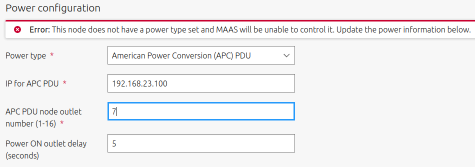
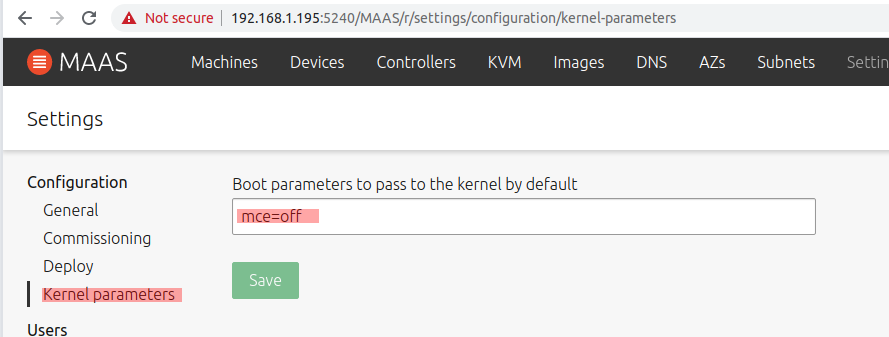
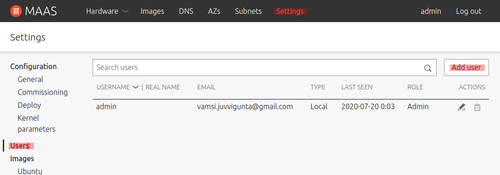
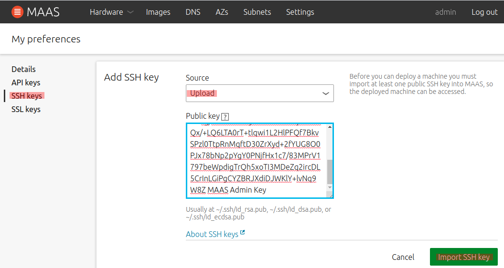
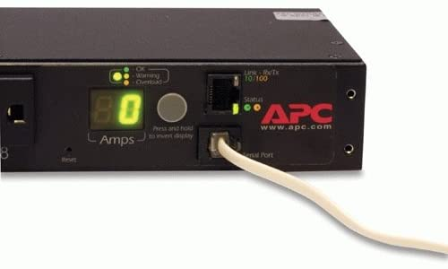

# MAAS
<!-- TOC -->

- [MAAS](#maas)
- [Basic setup on the Master Ubuntu 20.04 LTS](#basic-setup-on-the-master-ubuntu-2004-lts)
    - [Git Setup](#git-setup)
- [Setup Flow](#setup-flow)
- [Resources](#resources)
- [Cluster Specification](#cluster-specification)
- [Networking](#networking)
    - [Configuration](#configuration)
    - [Network Setup](#network-setup)
    - [Configure Network](#configure-network)
- [MAAS Setup](#maas-setup)
    - [Latest MAAS Install - 2.9](#latest-maas-install---29)
        - [Create admin](#create-admin)
        - [Initial Configure](#initial-configure)
        - [Network config](#network-config)
        - [Add machines](#add-machines)
        - [Set machine Power](#set-machine-power)
        - [Add vm](#add-vm)
        - [Commission the machines](#commission-the-machines)
    - [Older MAAS Install](#older-maas-install)
        - [As Snap](#as-snap)
        - [As Apt install](#as-apt-install)
    - [MAAS Setup Subnets](#maas-setup-subnets)
    - [MAAS Settings](#maas-settings)
    - [MAAS user config](#maas-user-config)
        - [Generate SSH Keys](#generate-ssh-keys)
        - [Create MAAS users](#create-maas-users)
        - [Load the keys into MAAS UI](#load-the-keys-into-maas-ui)
    - [MAAS DNS setup](#maas-dns-setup)
    - [MAAS Logging in](#maas-logging-in)
        - [Debugging the failing smartctl-validate](#debugging-the-failing-smartctl-validate)
        - [Revisit after a month July 2020](#revisit-after-a-month-july-2020)
        - [Revisit in Nov 2020](#revisit-in-nov-2020)
- [MAAS logs and troubleshooting](#maas-logs-and-troubleshooting)
- [MAAS Node Power](#maas-node-power)
    - [APC PDU](#apc-pdu)
    - [Resetting the PDC](#resetting-the-pdc)
- [Install Non-snap maas](#install-non-snap-maas)
    - [Enable APC Querying](#enable-apc-querying)

<!-- /TOC -->
# Basic setup on the Master (Ubuntu 20.04 LTS)
  * remove firefox, install chrome, code, gvim [../tools/README.md](../tools/README.md)

## Git Setup
 
```
> mkdir bitbucket
> cd bitbucket/
> git clone https://vamsijuvvigunta@bitbucket.org/vamsijuvvigunta/tools.git
> git clone https://vamsijuvvigunta@bitbucket.org/vamsijuvvigunta/infrastructure.git
```

# Setup Flow


# Resources
  * https://docs.google.com/document/d/15IhYDfA_32ATZzE_u0ouljlMkbVYfqn_LKVE2VYTmys/edit
  * [Using MAAS to deploy graphical desktops](https://askubuntu.com/questions/652293/using-maas-to-deploy-graphical-shell-on-office-workstations/)
  * [HOWTO setup ssh keys on Ubuntu 18.04](https://linuxize.com/post/how-to-set-up-ssh-keys-on-ubuntu-1804/)
  * [Manage multiple SSH key pairs](https://www.redhat.com/sysadmin/manage-multiple-ssh-key-pairs)


# Cluster Specification

A basic maas server will have to be setup. I have chosen a small 4-core i7 NUC for this. Will see if it suffices. It needs to handle multiple roles, some of which need their own nodes/containers. MAAS master is the important one here, MAAS nodes can change as needed.


# Networking


## Configuration
   * Cluster fabric in on the 192.1658.23.x/24 network: 8 bits for the hosts
   * Corp/Home network is on the 192.168.1.x/24 network.
   * **MAAS_Master is the gateway** between Cluster and Corp networks and routes traffic across the networks.


## Network Setup

*Hardware checklist*
 The MAAS Master needs two interfaces (one via USB in my case) which define two fabrics: one vlan each
 
  * MAAS Cloud vlan
  * Other (which is the inet)

*Update USB Names*

 Always good to do a 
 
  * 18.04: `sudo update-usbids` 
  * 20.04 `sudo apt update usb.ids`

  followed by `lsusb` to make sure the vendor IDs are updated to a recognizeable string.

*Drivers for USB ethernet*

> Usually not needed. If `ifconfig -a` does not show the two interfaces, replug the USB and it will show.

   * The one I have is the tp-link UE-300. https://www.realtek.com/en/component/zoo/category/network-interface-controllers-10-100-1000m-gigabit-ethernet-usb-3-0-software
     * Install driver (src) seems to be same as https://github.com/wget/realtek-r8152-linux *(cached on google driver under hillops*)
     * `make`
     * `make install`
     * `sudo depmod -a`
     * `sudo update-initramfs -u`  
   * Ensure `ifconfig -a` shows it and it matches the name in the netplan config.

*Workaround for TR40*

  * The *ASRock TRX40 Creator* motherboard seems to be having random headaches
    * With 18.04, the Realtek 2.5G LAN fails on PXE boot itself. Driver issues maybe. Seems to have worked ok with 20.04 but that has additional issues for the T92p machines so I am using only 18.04: (*Update: fixed as of Nov 2020 so back to 20.04*)
    * The Aquantica 10G LAN fails (`no media detected`) when machine boots up after bios boot priority is configured. However, when I use `F11` and choose the *PXE Aquantica 10G*, it works correctly. so this is the sequence for commissioning and deployment. Once that is done, PXE is no longer needed. (*Update: Nov 2020, updated to latest BIOS and with 20.04, simply works!*)

 *Networking Roles*

 **Note that users and their SSH keys must be imported before deployment for the keys to make it to the deployed machines. The key of the `owner` who requests the machine from MAAS are deployed to the machine as the `ubuntu` user**

   * Gateway machine for the MAAS vlan: routes packets between the two networks via Ip Forward (turn this on)
   * MAAS provided DNS for the maas nodes
   * Corp interface specifies
      * Gateway as internet gateway *Is this needed?* 
      * route to cluster network
      * via MAAS Master's Cluster network IP (192.168.195.1)
   * Cluster interface species  
      * Network address and host range (182.168.23.1/24)
      * no DHCP *MAAS Server will take over ?*
      * route to corp network via MAAS Master's Corp network IP (192.168.23.1)
      * route to everywhere else (internet) via the same MAAS Master's Corp network IP (192.168.23.1)

## Configure Network
   * Examine the [01-network-manager-all.yaml](configs/01-network-manager-all.yaml) file to ensure the IP and networks still make sense.
      * Ensure MAAS machine is served a fixed IP of 192.168.1.195
   * Setup Netplan
      * Originally, I followed various examples to setup netplan based routing. However, nothing really worked so I ditched that and am using iptables for the routing.
      * `sudo cp configs/01-network-manager-all.yaml /etc/netplan`
      * `sudo netplan apply` to apply it
         * Two networks
         * Routing between them, Gateways
         * MAAS IP added as DNS
      * Ensure IP settings are reflected
   * Setup IP Forwarding
      * `sudo vi /etc/sysctl.conf` and uncomment `#net.ipv4.ip_forward=1`
      * `sudo sysctl -p`
   * Setup iptables routing.
      * Copy [rc.local](configs/rc.local) to `/etc`
      * `chmod a+x /etc/rc.local`
      * run it once.
   * Ensure routing works
      * connect a pc/laptop to the switch handling *192.168.23.x* and give it a static IP
      * on the maas node, start `tcpdump`
      * on the test machine, `ping 8.8.8.8` and ensure it works. You can see the ping packets come through on the maas node.

# MAAS Setup

See the [MAAS concepts and terms](https://maas.io/docs/concepts-and-terms), our single MAAS master needs to behave like a 
- Maas region server
  - API gateway
  - Fabric configurator
  - Talks to each *rack-controller*
- MAAS Rack controller 
  - Located on the rack, close to a bunch of machines and provides services to those machines
  - Attached to each fabric
  - DHCP
  - Network boot 
  - Control the rack of nodes (power on/off etc)
  - Caches OS images (close to rack for fast transfers)

## Latest MAAS Install - 2.9

`sudo snap install maas --channel=2.9/stable`
`sudo snap install maas-test-db`
`sudo maas init region+rack`

```console
vamsi@MAAS:/snap/maas/current$ sudo maas init region+rack
Database URI [default=maas-test-db:///]: 
MAAS URL [default=http://192.168.1.195:5240/MAAS]: 
MAAS has been set up.             

If you want to configure external authentication or use
MAAS with Canonical RBAC, please run

  sudo maas configauth

To create admins when not using external authentication, run

  sudo maas createadmin
```

### Create admin

Per output above, run `sudo maas createadmin`

```console
vamsi@MAAS:/snap/maas/current$ sudo maas createadmin
Username: admin
Password: maasAdmin
Again: maasAdmin
Email: vamsi.juvvigunta@gmail.com
Import SSH keys [] (lp:user-id or gh:user-id): 
```

### Initial Configure
- Connectivity
  - Update DNS forwarders to `8.8.8.8` (192.168.1.1 also ?)
- Upload my `~/.ssh/id_rsa.pub` when asked for SSH key. Important to ssh into MAAS nodes  

### Network config


- Click on *fabric-0 192.168.1.0/24* and rename to **Corp**
- Click on *fabric-1 192.168.23.0/24* and rename to **Cluster**
- Click on **vlan** column for **Cluster** and turn DHCP on 
  - **Ensure Gateway is set correctly to 192.168.23.1**. Default is 192.168.23.254 and makes all nodes fail routing to the internet! If you get this wrong, you will have to recommision the node as updated info is not getting pushed to the nodes.


* Reserve some IPs as needed. I use a static address on the APC PDU so am reserving that range.
* Click on the Subnet column in `Cluster` fabric (192.168.23.0/24)
* Click on `Reserve Range` and go from there.


### Add machines

- Turn each machine on (Ensure already set to PXE) *PXE did not reach server: !@#!@# USB Eth from MAAS needed to be cycled*
- Once it registers, rename as needed

### Set machine Power

- Click on each machine
- Click on `Power Type`
- Choose APC
- IP is `192.168.23.100` (statically assigned in the PDU)



### Add vm

preconfigured for juju controller
- See [2-juju.md](./20juju.md) for details on setting it up and it's power type

### Commission the machines

- They start as `new`
- When you commission, they get to `ready`
- Note that without this, when you bootstrap juju, you get errors.

*Process*
 - Check the machines (all except BigBoy)
 - Under Actions, select "Commission" and on the next page, ask it to start
 - Once these are all done, select BigBoy and do that separately
   - As soon as you hit the commissio button, switch to it's console
   - F11 for boot menu
   - And repeatedly try the _Acuantia 10G PEX IPV4_ till it succeeds.

----

## Older MAAS Install
### As Snap

Snap works great in most cases as it is an overlay that does not edit the existing filesystem. However, after using it, I needed to make some edits to the apc.py power driver and realized that /snap is a ro filesystem. Have to wait for a PR to go through, packaging and all that. Simpler to use a standard install (not available for 2.9 and above I think but certainly available for 2.7)

*Update: 2.9 as of Nov 2020 has the apc power drivers fixed*

```
> sudo snap install maas --channel=2.7
> sudo maas init
 Mode (all/region+rack/region/rack/none) [default=all]? 
 MAAS URL [default=http://192.168.1.195:5240/MAAS]: 
 Create first admin account        
 Username: admin
 Password: maasAdmin
 Again: maasAdmin
 Email: vamsi.juvvigunta@gmail.com
 Import SSH keys [] (lp:user-id or gh:user-id): 

```
### As Apt install

```console
vamsi@maas:~$ sudo apt-add-repository -yu ppa:maas/2.7
vamsi@maas:~$ sudo apt install maas
vamsi@maas:~$ sudo maas init
vamsi@maas:~$ sudo maas init
Create first admin account
Username: admin
Password: 
Again: 
Email: vamsi.juvvigunta@gmail.com
Import SSH keys [] (lp:user-id or gh:user-id): 
```
*Update: As of Nov 2020, on 20.04 even the 2.7 release installs as a snap! Thankfully MAAS 2.9 beta as a snap works!*

Apt install gets an older version with some issues. During install, it ends up listing the MAAS url as http://localhost:5240/MAAS. This gets passed on to the nodes during deployment and they cannot hit it meaningfully. Needs to be updated to the actual IP.
   * During PXE boot, you'll notice errors like *handler.py. Failed to post event*

Can also be checked from `cat /etc/maas/rackd.conf`

`sudo dpkg-reconfigure maas-rack-controller`


## MAAS Setup Subnets

- Ensure that http://192.168.1.195:5240/MAAS is alive
- Loging using the admin creds provided to *maas init*
- Complete the basic stuff and click on the *Subnets* menu on top 


- Click on *fabric-0 192.168.1.0/24* and rename to **Corp**
- Click on *fabric-1 192.168.23.0/24* and rename to **Cluster**
- Click on **vlan** column for **Cluster** and turn DHCP on 
  - **Ensure Gateway is set correctly to 192.168.23.1**. Default is 192.168.23.254 and makes all nodes fail routing to the internet! If you get this wrong, you will have to recommision the node as updated info is not getting pushed to the nodes.


* Reserve some IPs as needed. I use a static address on the APC PDU so am reserving that range.


## MAAS Settings

I realized after a lot of pain that Ubuntu 18.04 simply does not boot on a Threadripper TR40 board unless `mce=off` is supplied as kernel parameters. This was very frustrating initially as it looked like a USB device error.

> Not needed with latest Ubuntu 20.04 as it supports the TRX40 natively.

Under **Settings/Kernel Parameters**, set the approp params.



## MAAS user config

### Generate SSH Keys
 
 Note: You can generate as many users as you want and generate keys for all of them. However, note that only users with Admin privileges can acquire/release machines. Usually a nuisance for the home lab. Stick with Admin is fine.

- Configure for `Admin`
- [SSH FAQ](../tools/SSH.md)

```console
vamsi@maas:/etc/default$ ssh-keygen -C "MAAS Admin Key"
Generating public/private rsa key pair.
Enter file in which to save the key (/home/vamsi/.ssh/id_rsa): /home/vamsi/.ssh/maas_admin_id_rsa
Enter passphrase (empty for no passphrase): 
Enter same passphrase again: 
Your identification has been saved in /home/vamsi/.ssh/maas_admin_id_rsa.
Your public key has been saved in /home/vamsi/.ssh/maas_admin_id_rsa.pub.
The key fingerprint is:
SHA256:WHmQe3vyvIVuVlsEoC+4vCRr7+R35geNVGftj22/J4o MAAS Admin Key
The key's randomart image is:
+---[RSA 2048]----+
|        ..  ..  .|
|        .o .  o +|
|        o.o  . = |
|       o.o...   o|
|      . S..o.o +.|
|       . .o.+.+ =|
|      . =  =.o.+.|
|      .* ..oB.+ o|
|     ..o=.E*=+ oo|
+----[SHA256]-----+
```

   * **Use id_rsa only as this is what ssh checks by default. Using -i ~/.ssh/vamsi_id_rsa did not work**
   * **ssh ubuntu@machine.maas** only. Even if *vamsi* deployed it. The **user that deployed the node** (directly or via juju) is the one whose ssh pub key is used.

### Create MAAS users

- Keep Admin separate
- Create as many users as needed. The uses come into play for requesting machine. Since only admin role reclaiming machines, it is simplest to just use admin.



### Load the keys into MAAS UI

- Log in as each-user
- Click on user name in top-right corner and under *SSH Keys* Upload the generated public key




## MAAS DNS setup

- On the comissioned machines, I can do a ping, nslookup, dig etc with other mass names and resolve works great
- On the MAAS machine however, there seems to be no connection to the maas resolver.
- [X] Needed a rearrangement of the DNS resolvers in netplan! Note that `192.168.1.195` is the maas regiond address.

```diff
       nameservers:
+       addresses: [192.168.1.195, 8.8.8.8]
-       addresses: [8.8.8.8, 192.168.1.195]
        search: [maas]
```


## MAAS Logging in 

`ssh ubuntu@box_name.maas`

From the MAAS perspective, every time the machine deploys, cloud-init imports the SSH key from MAAS allowing the user to SSH in. This is the current behavior in all versions of MAAS.

**Note**

- Setup MAAS as the DNS in order to resolve the *.maas* names.
- Always log in a *ubuntu* which will use the ssh public key of the *user that deployed the node*
- Your SSH private key should be under `~/.ssh/id_rsa` and not another specially named file.

### Debugging the failing smartctl-validate

- Asked it to run the tests but keep machine alive for ssh
- ssh ubuntu@game-ewe.maas failed
- ssh ubuntu@IP worked. I used non-standard names in ~/.ssh but it picked up the right private key
- smartctl exists, python3 exists
- smartctl --scan shows the drive
- copying and running the code for the smartctl-validate works!

 [Debugging Instructions](https://maas.io/docs/commissioning-and-hardware-testing-scripts#heading--environment-variables)
   
- run on the machine `/tmp/user_data.sh.*/bin/maas-run-remote-scripts --no-download /tmp/user_data.sh.*` fails with the exact same error!
- Need to step through the python code to see whats going on.
 

### Revisit after a month (July 2020)
  
- I had posted to https://discourse.maas.io/t/not-able-to-get-past-smartctl-validation/1713/2
- Response said, known issue at https://bugs.launchpad.net/maas/+bug/1869116
- Fixed for Beaver (18.04 LTS) but Focal Fossa fix, no ETA but hopefully soon (All for MAAS 2.7). *Glad I did not spend time going through this. Would not have been able to isolate the issue so nicely I think*
- In the meantime, I can simply start working with kubernets on bigboy ?
- Spend a couple hours and switch everything back to tried and tested 18.04 ? with `mce=off` ofcourse. Simplest I think.


**Switched back to 18.04**

### Revisit in Nov 2020

Only because I had trashed the 18.04 config with VLAN setups and wanted to revert to clean config

- 20.04 has fixed the smartctl issues as of 09/2020.
- 20.04 has fixed the APC power issues
- No mce=off headaches.
 
 **Switching to 20.04**

# MAAS logs and troubleshooting

Under snap, the notable logs are at `/var/snap/maas/common/logs/maas.log`

After spending a lot of time trying to figure things out, thought I should upgrade maas and see if it fixes the APC issue. Clearly, it is able to power on/off, just not query and there are no log items either!

https://maas.io/docs/install-from-a-snap#heading--upgrade-maas-snap
 `sudo snap refresh --channel=2.8 maas`

# MAAS Node Power

 I knew going in that MAAS could not automatically power on/off nodes unless they have a BMC (Baseband Controller) built in. This typically implies IMPI but Intel AMT would work as well. The two Lenovo T93P Micros I have come with vPro/AMT but the new TR40 board does not and neither do my existing i7 PCs or Skullcanyon NUCs. Did some research on how to work around these.

 Links
 
- [Using Wake On Lan with MAAS](https://stgraber.org/2017/04/02/using-wake-on-lan-with-maas-2-x/)
- [WOL Removed from MAAS](https://bugs.launchpad.net/maas/+bug/1589140) as they couldn't reliabily figure out if the machine was on. Hacks listed including supplmenting with `ping`
- [Power Off not working with WOL](https://askubuntu.com/questions/639474/maas-shutdown-node-issue)
- [Adding Custom hardware to MAAS](https://ubuntu.com/blog/adding-hardware-support-to-maas)

So it turns out that I might not need to throw my expensive TR40 board out or look only for IMPI server boards. APC PDU may be good enough. Turns out you have to avoid the ones marked *basic* since they do not have any snmp control ports.

No videos of how the APC thing would actually work. I understand that 

   * Setup PC to bootup when powered on, then turn on the socket will power the PC on.
   * MAAS can check if the outlet is powered on and can shut an outlet down. How does it actually shutdown the PC down though ?

I installed MAAS as a snap and cycling through available resources, turns out that

- `/etc/maas/power/templates` does not exist
- `/usr/lib/python/dist-packages/provisioningserver/drivers/power` does not exist
- but `/snap/maas/lib/current/lib/python3.6/site-packages/provisioningserver` does exist

There is a `drivers/power/apc.py` in there with these relevant functions.

```python
class APCPowerDriver(PowerDriver):
    
    ....

    def power_on(self, system_id, context):
        """Power on Apc outlet."""
        if self.power_query(system_id, context) == "on":
            self.power_off(system_id, context)
        sleep(float(context["power_on_delay"]))
        self.run_process(
            "snmpset",
            *_get_common_args(
                context["power_address"], context["node_outlet"]
            ),
            "i",
            "1",
        )

    def power_off(self, system_id, context):
        """Power off APC outlet."""
        self.run_process(
            "snmpset",
            *_get_common_args(
                context["power_address"], context["node_outlet"]
            ),
            "i",
            "2",
        )

    def power_query(self, system_id, context):
        """Power query APC outlet."""
        power_state = self.run_process(
            "snmpget",
            *_get_common_args(
                context["power_address"], context["node_outlet"]
            ),
        )
        if power_state == APCState.OFF:
            return "off"
        elif power_state == APCState.ON:
            return "on"
        else:
            raise PowerActionError(
                "APC Power Driver retrieved unknown power state: %r"
                % power_state
            )
```
From [Power Off not working with WOL](https://askubuntu.com/questions/639474/maas-shutdown-node-issue), It turns out MAAS uses `ssh -o UserKnownHostsFile=/dev/null -o StrictHostKeyChecking=no ubuntu@${ip_address} -C "echo 'sleep 2 && sudo /sbin/poweroff -f' | at now"` to power a node down but only if it knows that the machine is **on**. This seems to be the sticking point with WOL.

Since the `apc.py` driver implements a proper `power_query`, it should allow MAAS to shut it down gracefully.

## APC PDU



Lots of variables when choosing the right APC PDU

- ❌ *Basic* models do not have any control. Avoid these.
- ✔️ Should say *Switchable* and have a SNMP/RJ-45 port on the back
- ⚠️ Most have a 10/100 Port. Make sure they work with your switch.
- ⚠️ Pay attention to 208/240v vs 110v models. I needed a 110v to work with my outlets.
- ⚠️ Pay attention to the *Input Plug*
  - *15A* models have standard Nema 5-15 which will plug into your standard 110v outlets
  - *20A* models have a different L5-20P which will require you to have a different outlet rated for 20A continuos draw. 
  - Visually check the plug/socket images or use [Nema Reference](https://www.stayonline.com/product-resources/nema-straight-blade-reference-chart.asp) or similar based on the specs you find.

I purchased a [APC AP7900 Switched PDU](https://www.apc.com/shop/us/en/products/Rack-PDU-Switched-1U-15A-100-120V-8-5-15/P-AP7900) on eBay for 115$ which ticked all the boxes. If it works out, cheap way to work with non IPMI boxes (can power 8 of em with one strip). You just need to verify that the bios allows you to set a *Start on Power On* flag.


⚠️ The APC PDU Switable models do have a separate serial port (*smaller RJ-12 port*) which is needed to reset the unit's password. If you do choose to do this, you will need an approp serial cable: The AP7900 model (*and bunch of others*) use [APC PDU Serial Cable 940-0144 DB9 to RJ12](https://www.amazon.com/APC-940-0144-Configuration-Replacement-Console/dp/B00SPGCHA2/ref=sr_1_3?dchild=1&keywords=APC+Serial+cable&qid=1595614539&sr=8-3). Amazon or eBay.
- Note that the MAAS *APC PDU* configuration only asks for the *IP*. Need to see if it somehow also needs the password or expects the password to be the default *apc/apc*. Will buy the cable later on if needed. 
- Possible I need to get to the configuration just to set the IP/DHCP.
- APC FAQs and others list how to use the cable for configuration.

## Resetting the PDC

  The unit I got from eBay looks to be in great condition. Turned it on and randomly long pressed the grey button and after some flashy it listed the IP. Some 172.xx thing. Definitely need the serial cable to reset it. Will see how it goes.


# Install Non-snap maas

Turns out the snap install is a pain. You cannot edit it, the launchpad location for mass code does not have any instructions on how to build etc. It seems simplest to switch to the 2.7 non-snap edition (since that is all I need) and update apc and graceful shutdown myself as a patch.

2.8 Has this nuisance about a separate postgres db and offers no advantages for my use-case. So just stick to 2.7 for now.

`sudo apt-add-repository -yu ppa:maas/2.7`
`sudo apt install maas`

- *Update: Even if MAAS 2.8 and 2.9beta need a separate postgeSQL. They supply a snap maas-test-db for install on the same machine*
- *Update: MAAS 2.9Beta fixes the APC power drivers so everything works out of the box (Code has changed significantly as well. No queryable field any more)*

## Enable APC Querying


`/usr/lib/python3/dist-packages/provisioningserver/drivers/power/apc.py`
```diff
class APCPowerDriver(PowerDriver):

    name = "apc"
    chassis = True
    description = "American Power Conversion (APC) PDU"
    settings = [
        make_setting_field("power_address", "IP for APC PDU", required=True),
        make_setting_field(
            "node_outlet",
            "APC PDU node outlet number (1-16)",
            scope=SETTING_SCOPE.NODE,
            required=True,
        ),
        make_setting_field(
            "power_on_delay", "Power ON outlet delay (seconds)", default="5"
        ),
    ]
    ip_extractor = make_ip_extractor("power_address")
-    queryable = False
+    queryable = True
```