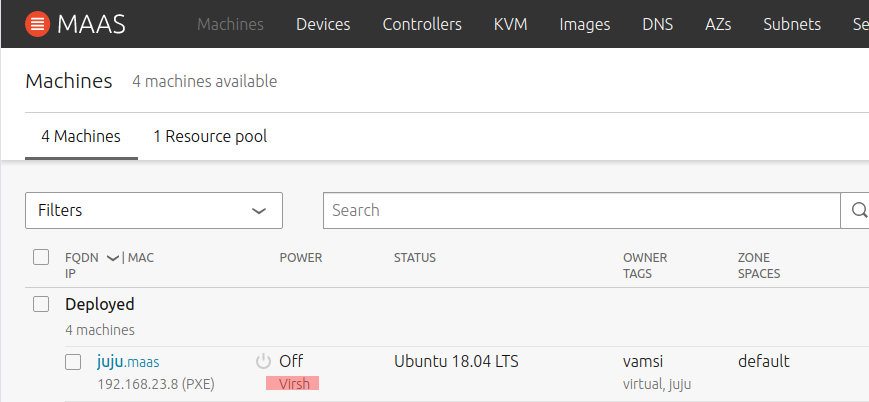
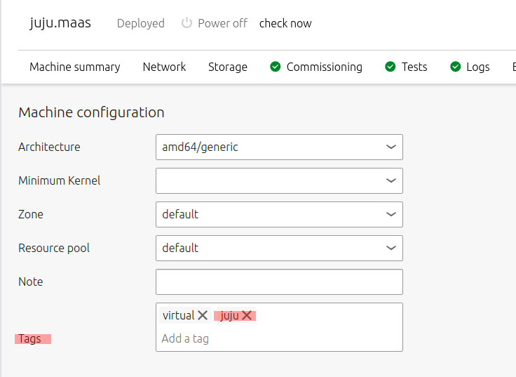
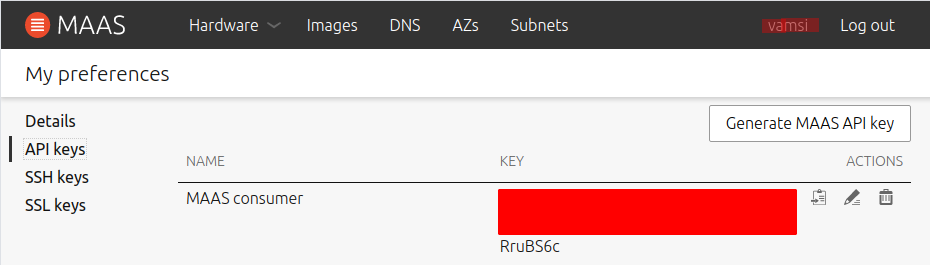

# Setup Juju

<!-- TOC -->

- [Setup Juju](#setup-juju)
- [References](#references)
- [Overview](#overview)
- [Setup VM for Juju Controller](#setup-vm-for-juju-controller)
    - [MAAS setup](#maas-setup)
        - [Problems](#problems)
    - [MAAS SSH setup](#maas-ssh-setup)
    - [Terminal problems](#terminal-problems)
- [Install and setup Juju](#install-and-setup-juju)
    - [Configure MAAS for juju](#configure-maas-for-juju)
    - [Setup Juju cloud](#setup-juju-cloud)
        - [Locate the MAAS API Key](#locate-the-maas-api-key)
        - [Attach Juju to Cloud](#attach-juju-to-cloud)
        - [Add cloud creds to juju](#add-cloud-creds-to-juju)
        - [List cloud credentials](#list-cloud-credentials)
        - [Update cloud credentials](#update-cloud-credentials)
        - [Remove cloud credentials](#remove-cloud-credentials)
    - [Bootstrap Juju](#bootstrap-juju)
        - [bootstrap](#bootstrap)
    - [Listing controllers](#listing-controllers)
    - [Removing controllers](#removing-controllers)
- [History](#history)
    - [Failed bootstrap Attempt 1](#failed-bootstrap-attempt-1)
    - [Failed bootstrap Attempt 2](#failed-bootstrap-attempt-2)

<!-- /TOC -->

MAAS handles the comissioning/deployment of hardware till the OS installation. Once the OS is installed, *juju* takes over by *using MAAS API* to manage software/packages on the deployed machines via the MAAS API.

*Juju* is a generic package manager for cloud based machines. Not just a `MAAS cloud`, presumably, many public clouds.

# References

  * https://jaas.ai/docs/maas-cloud
  * http://wiredtron.com/2016/08/18/setting-up-maas-juju-on-one-node-on-ubuntu-using-virsh/
  * https://medium.com/@madushan1000/how-to-run-kubernetes-on-bare-metal-with-maas-juju-d5ba8e981710

# Overview

MAAS_Server


Juju asks the cloud API (MAAS) to provision a controller for it within the cloud. To avoid wasting a machine for this (when you have a tiny home lab), use/adapt instructions from [Robert @ WiredTron](http://wiredtron.com/2016/08/18/setting-up-maas-juju-on-one-node-on-ubuntu-using-virsh/) to setup a VM controlled by MAAS

# Setup Sequence


# Setup VM for Juju Controller

Follow instructions at 

  * [Setup for VM](../tools/VM.md) and https://ubuntu.com/blog/quick-add-kvms-for-maas to setup the VM
    * `virt-manager` to launch the UI
    * *New Virtual Machine* and choose **Network Boot (PXE)** 
    * *OSType/Version* **Generic/Generic**
    * *RAM: 4Gib*, *CPU: 1*
    * *20GB* storage
    * *name=juju_controller*

After starting the VM (from *virt-manager*), click on the info button and change the network for the NIC to "host-bridge" *(Assuming you configured it per the notes at [Setup for VM](../tools/VM.md))*.

Now starting the VM should make PEX hit MAAS and start maas enlisting.

## MAAS setup 

   * rename node to "juju-controller" (login as admin for this)
   * powertype=`virsh`
   * Address = `qemu+ssh://vamsi@192.168.23.1/system` (*UserName on host @ IP of the machine*)
   * Password = `user login pwd`
   * Virsh VM ID = `UUID from VM Overview page`


 The power controller from MAAS needs to SSH in to control virsh. Make sure the ssh server is installed per [SSH.md](../tools/SSH.md).

 Note that https://maas.io/docs/vm-host-networking#heading--set-up-ssh says some more setup is needed to allow the *maas* user from the *rack controller* to access the VMs. But looks like it is not neeed if MAAS is supplied with user creds for the host on which the VM resides.

### Problems
  * MAAS Simply said error connecting
  * Debugging (https://maas.io/docs/vm-host-networking#heading--set-up-ssh)
    * I used a freshly commissioned machine (*asked MAAS to allow SSH and keep machine from shutting down*) to test the comnmand below.
    * `virsh -c qemu+ssh://vamsi@192.168.23.1/system list --all` said connection refused
    * Turned out, I did not have ssh enabled on the host machine.
    * Installed per [SSH.md](../tools/SSH.md), the above command worked right away
    * MAAS also reported no errors
    * **However** VM remains in *New* state only and drop down does not have any of the acquire/deploy etc menu items. Maybe I do need to add the mass user ssh keys
    * **Solution** Turns out I was doing all this from the user `vamsi` on MAAS. Switch to Admin and the *Commission* menu becomes available. Once comissioned, switch back to *vamsi* for deploying. 
  * During commissioing VM is stuck and says no bootable device
    * After acquiring somehow the VM's boot options switch to disk. Change back to the NIC for PEX.        

## MAAS SSH setup

Per instructions at https://maas.io/docs/vm-host-networking#heading--set-up-ssh for *snap MAAS install*

```console
sudo mkdir -p /var/snap/maas/current/root/.ssh
cd /var/snap/maas/current/root/.ssh
sudo ssh-keygen -f id_rsa

cat id_rsa.pub >> ~vamsi/.ssh/authorized_keys
sudo chown vamsi.vamsi ~vamsi/.ssh/authorized_keys
```

## Terminal problems

I was able to get this to work for a while but after that something went totally haywire and I am not sure what.

   * MAAS UI keeps popping up errors that it cannot connect to maas.io
   * It cannot release the VM
   * It cannot recommision the VM (fails with a cannot locate package lldp). Some hits on the net but they say the node (call to apt) is unable to reach the internet. How did it reach the first time. Some network config fuckup I am sure. All examples I have seen do seem to bridge over the MAAS interface. Maybe try this again

Unending problems: I racked my brain for what I changed to mess this up and remember the DNS settings. Not sure what I did but it is consistent with the maas ui error about temporarily not able to resolve things.

> 👉 VM on the mass network was unable to hit the ubuntu servers to download the apt package. **DNS failure** given the error msgs.

Some more research later, updated the `br0` section's `nameservers` section as followes

```diff
  bridges:
    br0:
      interfaces: [enxd037457fc945]
      addresses: [192.168.23.1/24]
      dhcp4: false
      dhcp6: false
      nameservers:
-        addresses: [192.168.23.1]
+        addresses: [8.8.8.8, 192.168.23.1]
```

Recreated the VM and this time, everything worked and in comissioning, I can see it getting the `lldp` package. All good then!

# Install and setup Juju 

  * https://juju.is/docs/installing
  * If a previous juju is messed up and you want to restart from scratch (_release and commission all nodes again in MAAS_)
     * use `sudo snap remove juju --purge` to clean it out
     * `rm -rf ~/.local/share/juju`
     * `rm -rf ~/.kube`
  * `sudo snap install juju --classic`

## Configure MAAS for juju

  juju installs a `juju-controller` in the cluster that it manages. In my case (light duty cluster), I don't want to lose an entire node to juju. So two things (See [MAAS Setup](README.md))
  
  * Create a VM on the MAAS Primary node and enlist in MAAS
  * Tag it with **juju**

 

 

## Setup Juju cloud

### Locate the MAAS API Key

  This is the key that Juju uses to authenticate itself when talking to the MAAS API. Click on the <del>*admin*</del> **vamsi** user and pick the *API Key*. Like so..

   

  The user key chosen is important
  
   * The *owned by* field is set to the user (*whose API key we are copying*) when juju uses the key
   * The owner's SSH Public Key is what gets onto the deployed machine's *ubuntu* user. You'll need that in your *.ssh/id_rsa* to be able to ssh into the deployed nodes.

### Attach Juju to Cloud 

There are command line args to use this but I have a yaml file prepared for this with the following contents to do things the gitops way.

```yaml
clouds:      # clouds key is required.
  devmaas:   # cloud's name
    type: maas
    auth-types: [oauth1]
    endpoint: http://192.168.1.195/MAAS
```

To use this, run the following. 

   * Local cloud as opposed to a public cloud
   * cloud name is *devmaas*
   * configuration for *devmaas* is picked up from the yaml file

```console
vamsi@maas:~/bitbucket/infrastructure$ juju add-cloud --local devmaas configs/juju/juju-maas-cloud.yaml
Cloud "devmaas" successfully added to your local client.
You will need to add a credential for this cloud (`juju add-credential devmaas`)
before you can use it to bootstrap a controller (`juju bootstrap devmaas`) or
to create a model (`juju add-model <your model name> devmaas`).
```

To confirm, exec

```console
vamsi@maas:~/bitbucket/infrastructure$ juju clouds --local
Only clouds with registered credentials are shown.
There are more clouds, use --all to see them.
You can bootstrap a new controller using one of these clouds...

Clouds available on the client:
Cloud      Regions  Default    Type  Credentials  Source    Description
devmaas    1        default    maas  0            local     Metal As A Service
localhost  1        localhost  lxd   0            built-in  LXD Container Hypervisor
```

### Add cloud creds to juju

   * Should I have used different creds than Admin ? Need to see how it works.
   * If machine is deployed by juju with Admin creds, then sshing into those machine will require access to Admin's ssh keys.

```console
juju add-credential devmaas
This operation can be applied to both a copy on this client and to the one on a controller.
No current controller was detected and there are no registered controllers on this client: either bootstrap one or register one.
Enter credential name: devmaas-admin-creds

Regions
  default

Select region [any region, credential is not region specific]: 

Using auth-type "oauth1".

Enter maas-oauth: <API Key From Admin user>

Credential "devmaas-admin-creds" added locally for cloud "devmaas".
```

Test by dumping out `~/.local/share/juju/credentials.yaml`

```console
vamsi@MAAS:~/bitbucket/infrastructure$ cat ~/.local/share/juju/credentials.yaml 
credentials:
  devmaas:
    devmaas-admin-creds:
      auth-type: oauth1
      maas-oauth: LEBzWzLR2fM4Yy5TeK:sxVqY69ybHewPyd4VB:XPnLcHhybYcAhgsRwn63axV8eFsZyyzM

```

### List cloud credentials

```console
vamsi@maas:~/bitbucket/kubernetes$ juju show-credentials
client-credentials:
  devmaas:
    devmaas-admin-creds:
      content:
        auth-type: oauth1
```

### Update cloud credentials

`juju update-credential [options] [<cloud name>] [<credential-name>]`

### Remove cloud credentials

`juju remove-credential devmaas demaas-admin-creds`

## Bootstrap Juju

 One special things to consider here
 
  * Specify a constraint that allows Maas to use the VM that was previously tagged with **juju**
  * VM should be in **Ready** state. If VM is already deployed, **Release** it. *Note: You will need to release from an admin user role*.

### 20.04 bootstrap

Juju by default uses an older LTS version till the new LTS version is atleast at .1 release. So even on 20.04, it still asks for bionic and might bomb. To force focal, use the folowing ([see this](https://discourse.charmhub.io/t/juju-bootstrap-on-ubuntu-20-04/2980))

 `juju bootstrap --bootstrap-series=focal --constraints tags=juju devmaas maas --debug`

## Listing controllers

`juju list-controllers`

```console
vamsi@maas:~/bitbucket/kubernetes/configs$ juju list-controllers
Use --refresh option with this command to see the latest information.

Controller        Model    User   Access     Cloud/Region     Models  Nodes  HA  Version
maas*  default  admin  superuser  devmaas/default       2      -   -  (unknown)  
```

## Removing controllers

The normal process is to use `juju destroy-controller <controller name>`. In my case, maas died because of other regions (messed up dns failed deployment) but juju seems to have recorded that there is a controller for devmaas. `destroy-controller` asks the cloud API (Maas API) to delete the controller node but that was never allocated to begin with and so fails.

 If the normal one fails, Use `juju kill-controller <controller-name>` as the last resort

 Apparently, not last enough. This still complains that the API is not connected etc. 
 

> 👉 lastest resort
  
 Apparently there is an `unregister` commands that simply removes it from a local `controllers.yaml` file

 `juju unregister <controller-name>`

# History

## Failed bootstrap Attempt 1

`juju bootstrap --constraints tags=juju devmaas juju-controller`

  * Watching MAAS, it shows the VM node deing deployed
  * Shows the owner as *vamsi* (the API Key used for juju add-credential)

```console
vamsi@maas:~/bitbucket/kubernetes/configs$ juju bootstrap --constraints tags=juju devmaas juju-controller
Creating Juju controller "juju-controller" on devmaas/default
Looking for packaged Juju agent version 2.8.1 for amd64
Launching controller instance(s) on devmaas/default...
 - wccyw3 (arch=amd64 mem=3.8G cores=1)
Installing Juju agent on bootstrap instance
Fetching Juju Dashboard 0.1.8
Waiting for address
Attempting to connect to 192.168.23.2:22
Connected to 192.168.23.2
Running machine configuration script...
``` 

Taking a very long time (15min +), so logging in to see whats going on 

`ssh ubuntu@192.168.23.2` worked right away.

Other hits on the net show that this can be because the node (juju-controller) is unable to connect to the internet to get needed packages.

I cannot even do a ping `192.168.1.195`, the local IP of the maas machine. So something bad for sure. Can't even install `tracert` to see what is going on

## Failed bootstrap Attempt 2

> 👉 I thought I had fixed DNS issues by plugging in google's DNS. However, turns out routing was completely broken. Just could not get netplan based source routing to work. [Replaced with simpler routing](../tools/Networking.md#try-masquerading) and got things to work.

```console
vamsi@maas:/etc/netplan$ !juju
juju bootstrap --constraints tags=juju devmaas juju-controller
Creating Juju controller "juju-controller" on devmaas/default
Looking for packaged Juju agent version 2.8.1 for amd64
Launching controller instance(s) on devmaas/default...
 - wccyw3 (arch=amd64 mem=3.8G cores=1)
Installing Juju agent on bootstrap instance
Fetching Juju Dashboard 0.1.8
Waiting for address
Attempting to connect to 192.168.23.3:22
Connected to 192.168.23.3
Running machine configuration script...
Bootstrap agent now started
Contacting Juju controller at 192.168.23.3 to verify accessibility...

Bootstrap complete, controller "juju-controller" is now available
Controller machines are in the "controller" model
Initial model "default" added
```