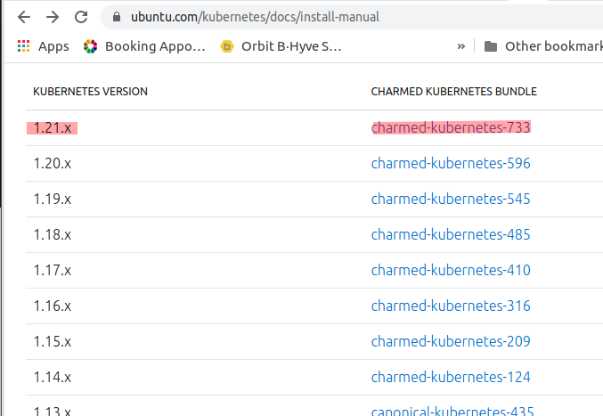
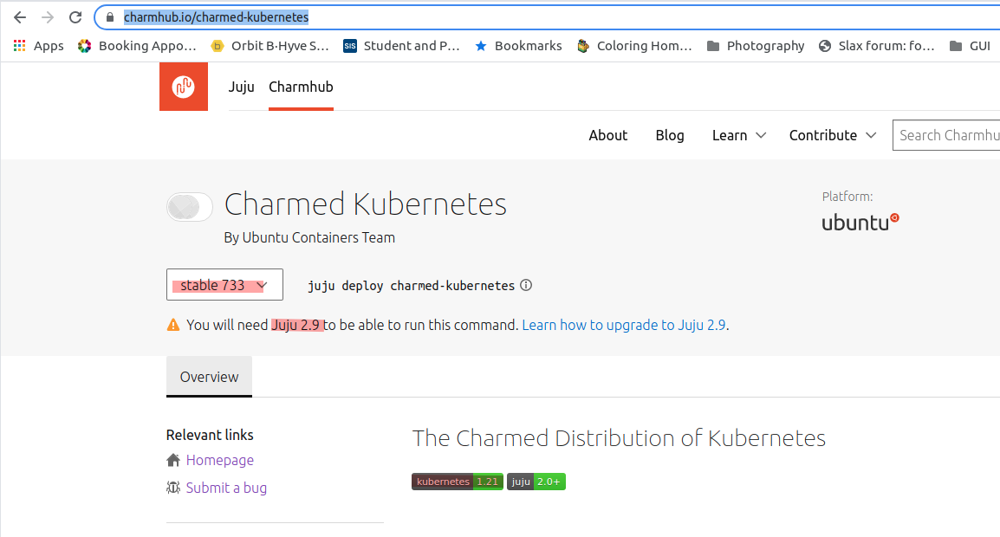
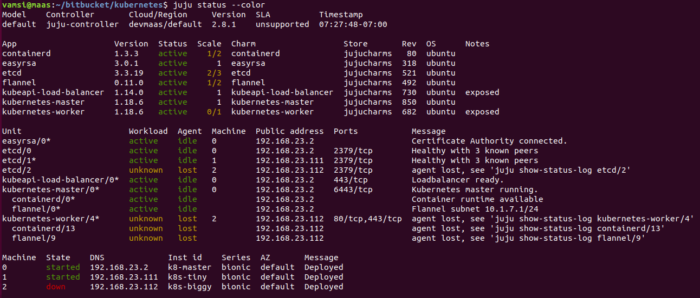
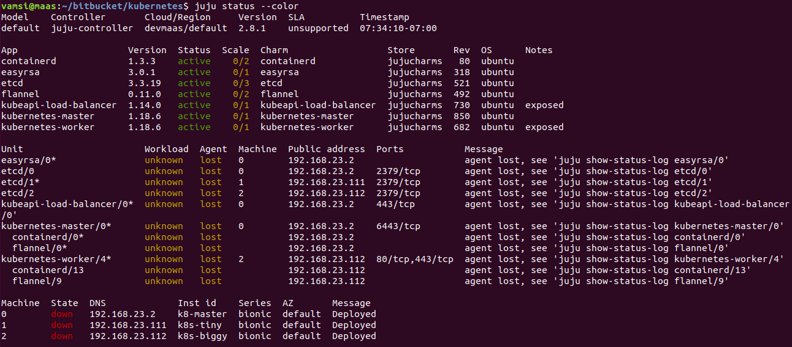
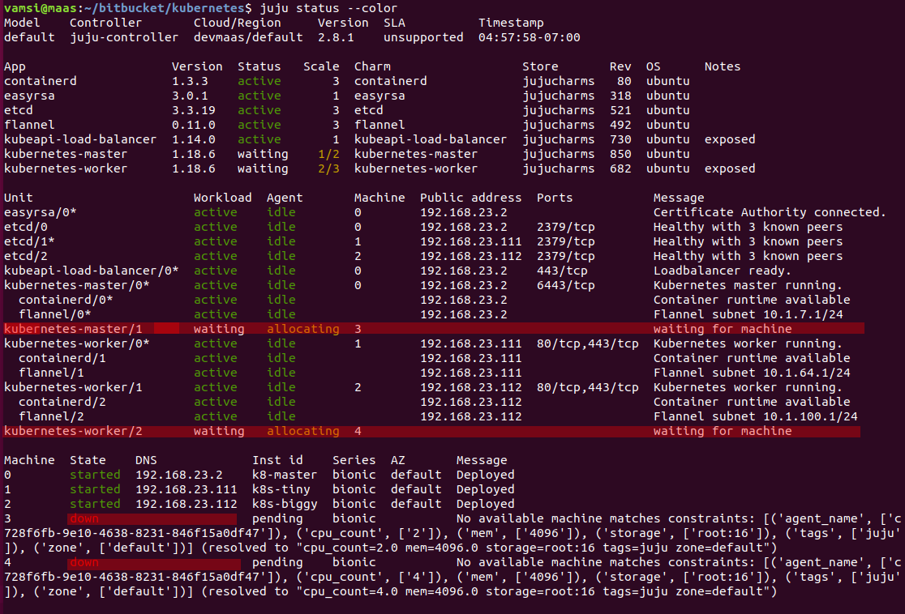
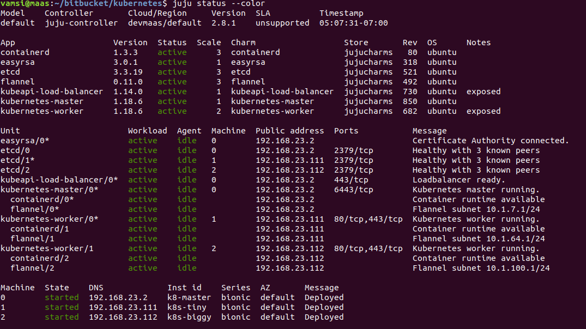

# Installing Kubernetes with Juju

<!-- TOC -->

- [Installing Kubernetes with Juju](#installing-kubernetes-with-juju)
- [Pre-Requisites](#pre-requisites)
- [Resources](#resources)
- [Latest Instructions](#latest-instructions)
    - [Bundle overlay](#bundle-overlay)
    - [Locate bundle versions](#locate-bundle-versions)
    - [Locate stable bundle](#locate-stable-bundle)
    - [Create overlay](#create-overlay)
    - [juju models](#juju-models)
        - [Create the k8s model](#create-the-k8s-model)
    - [Dry run bundle](#dry-run-bundle)
    - [Deploy](#deploy)
        - [Watch deployment progress](#watch-deployment-progress)
    - [Nvidia driver issue](#nvidia-driver-issue)
    - [Copy kube config over](#copy-kube-config-over)
    - [Verify GPU integration](#verify-gpu-integration)
        - [Verify at node level](#verify-at-node-level)
        - [Fix GPU sleep issues](#fix-gpu-sleep-issues)
    - [Complete the kubernetes client installs](#complete-the-kubernetes-client-installs)
    - [Setup k8s storage](#setup-k8s-storage)
        - [Verify storage class](#verify-storage-class)
    - [Register the kubernetes cloud with juju](#register-the-kubernetes-cloud-with-juju)
        - [Register cloud](#register-cloud)
        - [Bootstrap k8s cloud](#bootstrap-k8s-cloud)
        - [Notes](#notes)
    - [K8s dashboard](#k8s-dashboard)
- [Shutting down](#shutting-down)
    - [Destroy](#destroy)
    - [Remove Units](#remove-units)
        - [Experiment. remove-unit plus add-unit](#experiment-remove-unit-plus-add-unit)
        - [Experiment. Poweroff machine and bring it back up](#experiment-poweroff-machine-and-bring-it-back-up)
        - [Experiment. Poweroff all machines](#experiment-poweroff-all-machines)
- [Docker registry](#docker-registry)
    - [Prep to install docker community edition](#prep-to-install-docker-community-edition)
    - [Installing the latest version](#installing-the-latest-version)
    - [Verify installation works](#verify-installation-works)
    - [Install the registry](#install-the-registry)
- [Previous Install Log](#previous-install-log)
    - [Got tags wrong](#got-tags-wrong)
    - [Correcting juju mistakes](#correcting-juju-mistakes)
    - [GPU Integration sleep problems](#gpu-integration-sleep-problems)

<!-- /TOC -->


# Pre-Requisites
  * MAAS Installed and machines in 'Ready state' (`New` + Commissioning ➡ `Ready`)
  * [Juju installed and bootstrapped](2-juju.md) 


# Resources

  * https://medium.com/@madushan1000/how-to-run-kubernetes-on-bare-metal-with-maas-juju-d5ba8e981710
  * https://stackoverflow.com/questions/57824094/how-to-consume-external-mongodb-service-in-kubernetes
  * mongodb https://jaas.ai/mongodb
  * [Charm bundle references](https://discourse.charmhub.io/t/charm-bundles/1058)

# Latest Instructions

Previously I used the setup instructions from https://medium.com/@madushan1000/how-to-run-kubernetes-on-bare-metal-with-maas-juju-d5ba8e981710 but now switching to overlays to use the same effect. Overlays allow me to:
  
- Retain the original bundle file and upgrade when the original changes
- Reuse the same overlay file

My node config 

- 3 Node install
- flannel and containerd on all machines 

  | Machine | Charms |
  |:-- | :-- |
  | Tiny1 | master, kubeapi-load-balancer, etcd, easyrsa |
  | Tiny2 | worker *or later reserve for CI/CD, Docker registry etc* |
  | Big 1 | worker, gpu |


Since this will be a simple low-load cluster, I want to see if I can get away with minimal machine counts.

I can use the same setup except with just one master. Also I want to eventually publish to a private docker registry (*on Tiny 2*).
  
Note: docker-registry is to be installed after the k8s clustering is done. It is not clear if the private registry needs to store all needed docker images or if k8s will go the public registry for missing entries ? l8r.

## Bundle overlay

Wanted to create an overlay to achieve the same node-deployment as https://medium.com/@madushan1000/how-to-run-kubernetes-on-bare-metal-with-maas-juju-d5ba8e981710. However, simply copying stuff lead to various confusing errors.

 | Error | Resolution |
 |:-- | :-- |
 | `-to : '0'` | errors about not being able to parse into a []string. Took the hint and tried `-to : ['0']` and that worked |
 | service key deprecated | Painful error. Main bundle still uses 'services' but deprecated for overlays!! https://discourse.charmhub.io/t/charm-bundles/1058 says to simply use `applications:` instead. Worked even though bundle uses `services:` |

Using the same node count as https://medium.com/@madushan1000/how-to-run-kubernetes-on-bare-metal-with-maas-juju-d5ba8e981710 to get the above config. I end up with the following overlay file

## Locate bundle versions

Locate the latest bundles for each version of k8s (_may need older versions of k8s based on what KF etc wants_). Look at 
- http://charmhub.io and search
- http://ubuntu.com/kubernetes/docs/install-manual to see which versions of k8s have what bundles.




## Locate stable bundle




Used the bundle:733 from https://charmhub.io/charmed-kubernetes

## Create overlay

- download the bundle.yaml for the 733 version
- add constraints as shown below
- remove everything except apps
- customize apps so we spread things around and do a non-HA deploy

```yaml
# Deployment
# machine - 0: m93p (i7 4 Core + 16GB RAM)
#  - etcd
#  - easyrsa
#  - kubeapi-load-balancer
#  - kubernetes-master
#
# machine - 1: m93p (i7 4 Core + 16GB RAM)
#  - kubernetes-worker
#
# machine - 2: Threadripper 32 core + 64GB RAM + 2080Ti
#  - kubernetes-worker
description: overlay for dev-maas installation on 3 nodes
series: focal

machines:
  '0':
    constraints: tags=k8s,k8s_master
  '1':
    constraints: tags=k8s,k8s_worker
  '2':
    constraints: tags=k8s,k8s_worker,gpu

# https://discourse.charmhub.io/t/charm-bundles/1058 says that 'services'
# is deprecated, use applications instead.
applications:

  easyrsa:
    num_units: 1
    to: ['0']
  etcd:
    num_units: 1
    to: ['0']
  kubeapi-load-balancer:
    num_units: 1    
    to: ['0']
  kubernetes-master:    
    num_units: 1    
    to: ['0']
  kubernetes-worker:    
    num_units: 2
    to: ['1', '2']
```

## juju models

Not sure I grok the model bit fully. From what I understand

- A named entity on the controller
- A collection of deployments

Enables neat things

- Wholesale cleaup: When needed, removing all the applications is as simple as `juju destroy-model <modelName>`: Mind the need for `--destroy-storage`
- When a model is interactively built up from bundles and then we do more `add-unit` things. You can dump out the latest-model configuration as a bundle.

 Model operation | Cmd
 :-- | :--
 Adding model | `juju add-model modelName`
 Deploying to a model | `juju -m modelName .. `
 Destroying a model |  `juju destroy-model modelName`
 Switch to a model | `juju switch modelName`
 Listing models | `juju models`

### Create the k8s model

> Want to keep the nomenclature clear here. This is a model of deployment on MAAS. Later, we will have `kubernetes` deployments: pods and such which will end up on a different model which we'll call k8s-model

`juju add-model maas-k8s-model`

```console
vamsi@MAAS:~/bitbucket/infrastructure/configs/juju/bundles$ juju add-model maas-k8s-model
Added 'maas-k8s-model' model on devmaas/default with credential 'devmaas-admin-creds' for user 'admin'

vamsi@MAAS:~/bitbucket/infrastructure/configs/juju/bundles$ juju status --color
Model             Controller       Cloud/Region     Version  SLA          Timestamp
maas-k8s-model    maas             devmaas/default  2.8.6    unsupported  19:06:13-08:00

Model "admin/maas-k8s-model" is empty.
```

## Dry run bundle

*Dry run* with the downloaded bundle from https://jaas.ai/canonical-kubernetes

> Note
>- `-m maas-k8s-model` to deploy to the k8s model
>- release number retained in the bundle name. This allows me to upgrade periodically as I see newer releases.
>- I see no way to customize the default `juju-cluster` name given to this k8 cloud it creates!

```console
vamsi@MAAS:~/bitbucket/infrastructure/configs/juju/bundles$ juju deploy -m maas-k8s-model --dry-run ./charmed-k8s-focal-733-bundle.yaml --overlay ./charmed-k8s-focal-733-devmaas-overlay.yaml
WARNING "services" key found in bundle file is deprecated, superseded by "applications" key.
Located charm "containerd" in charm-store, revision 146
Located charm "easyrsa" in charm-store, revision 395
Located charm "etcd" in charm-store, revision 607
Located charm "flannel" in charm-store, revision 571
Located charm "kubeapi-load-balancer" in charm-store, revision 814
Located charm "kubernetes-master" in charm-store, revision 1034
Located charm "kubernetes-worker" in charm-store, revision 788
Changes to deploy bundle:
- upload charm containerd from charm-store for series focal with architecture=amd64
- deploy application containerd from charm-store on focal
- set annotations for containerd
- upload charm easyrsa from charm-store for series focal with architecture=amd64
- deploy application easyrsa from charm-store on focal
- set annotations for easyrsa
- upload charm etcd from charm-store for series focal with architecture=amd64
- deploy application etcd from charm-store on focal
- set annotations for etcd
- upload charm flannel from charm-store for series focal with architecture=amd64
- deploy application flannel from charm-store on focal
- set annotations for flannel
- upload charm kubeapi-load-balancer from charm-store for series focal with architecture=amd64
- deploy application kubeapi-load-balancer from charm-store on focal
- expose all endpoints of kubeapi-load-balancer and allow access from CIDRs 0.0.0.0/0 and ::/0
- set annotations for kubeapi-load-balancer
- upload charm kubernetes-master from charm-store for series focal with architecture=amd64
- deploy application kubernetes-master from charm-store on focal
- set annotations for kubernetes-master
- upload charm kubernetes-worker from charm-store for series focal with architecture=amd64
- deploy application kubernetes-worker from charm-store on focal
- expose all endpoints of kubernetes-worker and allow access from CIDRs 0.0.0.0/0 and ::/0
- set annotations for kubernetes-worker
- add new machine 0
- add new machine 1
- add new machine 2
- add relation kubernetes-master:kube-api-endpoint - kubeapi-load-balancer:apiserver
- add relation kubernetes-master:loadbalancer - kubeapi-load-balancer:loadbalancer
- add relation kubernetes-master:kube-control - kubernetes-worker:kube-control
- add relation kubernetes-master:certificates - easyrsa:client
- add relation etcd:certificates - easyrsa:client
- add relation kubernetes-master:etcd - etcd:db
- add relation kubernetes-worker:certificates - easyrsa:client
- add relation kubernetes-worker:kube-api-endpoint - kubeapi-load-balancer:website
- add relation kubeapi-load-balancer:certificates - easyrsa:client
- add relation flannel:etcd - etcd:db
- add relation flannel:cni - kubernetes-master:cni
- add relation flannel:cni - kubernetes-worker:cni
- add relation containerd:containerd - kubernetes-worker:container-runtime
- add relation containerd:containerd - kubernetes-master:container-runtime
- add unit easyrsa/0 to new machine 0
- add unit etcd/0 to new machine 0
- add unit kubeapi-load-balancer/0 to new machine 0
- add unit kubernetes-master/0 to new machine 0
- add unit kubernetes-worker/0 to new machine 1
- add unit kubernetes-worker/1 to new machine 2
```

The `add unit` lines at the end show the expected deployment

- add unit easyrsa/0 to new machine 0
- add unit etcd/0 to new machine 0
- add unit kubeapi-load-balancer/0 to new machine 0
- add unit kubernetes-master/0 to new machine 0
- add unit kubernetes-worker/0 to new machine 1
- add unit kubernetes-worker/1 to new machine 2

## Deploy

> Note the `-m maas-k8s-model` to deploy to the `maas-k8s-model` model

`juju deploy -m maas-k8s-model ./charmed-k8s-focal-733-bundle.yaml --overlay ./charmed-k8s-focal-733-devmaas-overlay.yaml`

### Watch deployment progress

- `juju status --color`
- `watch --color -n5 juju status --color`

## Nvidia driver issue

After manual successful deployments, I suddenly ran into an error with nvidia drivers. Not sure if nvidia changed something or some server has bad data. In any case, simply following the latest nvidia driver installation worked.

Specifically
 * Look at the charm agent code on the failed machine and check which packages it is installing: I saw `cuda-drivers` and `nvidia-container-runtime`
 * Follow latest nvidia setup instructioons and install those packages.

 ```console
 wget https://developer.download.nvidia.com/compute/cuda/repos/ubuntu2004/x86_64/cuda-ubuntu2004.pin
sudo mv cuda-ubuntu2004.pin /etc/apt/preferences.d/cuda-repository-pin-600
wget https://developer.download.nvidia.com/compute/cuda/11.4.1/local_installers/cuda-repo-ubuntu2004-11-4-local_11.4.1-470.57.02-1_amd64.deb
sudo dpkg -i cuda-repo-ubuntu2004-11-4-local_11.4.1-470.57.02-1_amd64.deb
sudo apt-key add /var/cuda-repo-ubuntu2004-11-4-local/7fa2af80.pub
sudo apt-get update

sudo apt-get -y install cuda-drivers
sudo apt-get -y install nvidia-container-runtime
 ```
  * Normally, juju keeps retrying failed hooks for a while. If it stops, do a `juju resolved containerd/0` or whatever the contained unit is that is failing because of the nvidia install.
  * reboot the node if `juju ssh kubernetes-worker/1 nvidia-smi` doesn't show the expected output (_maybe wait till `juju-wait` returns_)
  
## Copy kube config over

Finally, to get `kubectl` to control the kubernetes cluster (*as well as getting juju to control it*) we need to copy over a configuration that specifies the newly created cluster. Use 

* `mkdir ~/.kube`
* `juju scp kubernetes-master/0:/home/ubuntu/config ~/.kube/config`. 

_This is awesome as we address the `juju application unit` instead of the machine itself_.

## Verify GPU integration

The latest `kubernetes-worker` charm is supposed to automatically handle GPGPU integration (NVidia, Cuda). So right after k8s was installed, I tried to check this via `nvidia-smi`: 

`juju ssh kubernetes-worker/1 nvidia-smi`: got a *unable to communicate with driver* (`/var/log/juju/unit-kubernetes-worker-1.log` on that machine displayed the same thing in the logs)

> Turns out, the machine needs to be rebooted
> use `juju ssh kubernetes-worker/1 sudo poweroff` and reboot
> wait for `juju status` to show all green and try again

- Lots of searching and playing around
- Removing all nvidia, cuda and reinstalling: nope
- Rebooting : nope
- Checked BIOS (ASRock TR40) had Secure boot off. Clock was off, so fixed that. Also turned CSM (Compatibility startup mode) off : now it is finally back on and `nvidia-smi` reports things as expected.
- kubernetes-worker was supposed to keep polling for GPU and seems to have worked.

### Verify at node level

```console
vamsi@MAAS:~/bitbucket/infrastructure/configs/juju/bundles$ juju ssh kubernetes-worker/1 nvidia-smi
Fri Feb 26 17:53:17 2021       
+-----------------------------------------------------------------------------+
| NVIDIA-SMI 460.39       Driver Version: 460.39       CUDA Version: 11.2     |
|-------------------------------+----------------------+----------------------+
| GPU  Name        Persistence-M| Bus-Id        Disp.A | Volatile Uncorr. ECC |
| Fan  Temp  Perf  Pwr:Usage/Cap|         Memory-Usage | GPU-Util  Compute M. |
|                               |                      |               MIG M. |
|===============================+======================+======================|
|   0  GeForce RTX 208...  Off  | 00000000:21:00.0 Off |                  N/A |
| 24%   30C    P8    23W / 250W |     14MiB / 11019MiB |      0%      Default |
|                               |                      |                  N/A |
+-------------------------------+----------------------+----------------------+
                                                                               
+-----------------------------------------------------------------------------+
| Processes:                                                                  |
|  GPU   GI   CI        PID   Type   Process name                  GPU Memory |
|        ID   ID                                                   Usage      |
|=============================================================================|
|    0   N/A  N/A      2094      G   /usr/lib/xorg/Xorg                  8MiB |
|    0   N/A  N/A      2668      G   /usr/bin/gnome-shell                3MiB |
+-----------------------------------------------------------------------------+
Connection to 192.168.23.113 closed.
```console

### Verify at K8s level

```console
vamsi@MAAS:~/bitbucket/infrastructure/configs/juju$ kubectl get no -o wide -L cuda,gpu
NAME      STATUS   ROLES    AGE    VERSION   INTERNAL-IP      EXTERNAL-IP   OS-IMAGE             KERNEL-VERSION     CONTAINER-RUNTIME               CUDA   GPU
big-boy   Ready    <none>   6h8m   v1.20.4   192.168.23.113   <none>        Ubuntu 20.04.2 LTS   5.4.0-66-generic   containerd://1.3.3-0ubuntu2.2   true   true
tiny2     Ready    <none>   6h8m   v1.20.4   192.168.23.112   <none>        Ubuntu 20.04.2 LTS   5.4.0-66-generic   containerd://1.3.3-0ubuntu2.2          
```

### Fix GPU sleep issues

For now (Feb 2021), k8s GPU integration is performing default nvidia installations which turns the XServer on and sets graphical runlevels (See below). **This enable pwer saving sleep and the machine drops out from the cloud soon after**. Fiddling with the actual driver/cuda installs might mess up more things so am simply fixing sleep.

- `juju ssh kubernetes-worker/1 systemctl status sleep.target`
- `juju ssh kubernetes-worker/1 sudo systemctl mask sleep.target suspend.target hibernate.target hybrid-sleep.target`
- `juju ssh kubernetes-worker/1 systemctl status sleep.target`

```console
vamsi@MAAS:~$ juju ssh kubernetes-worker/1 systemctl status sleep.target
● sleep.target - Sleep
     Loaded: loaded (/lib/systemd/system/sleep.target; static; vendor preset: enabled)
     Active: inactive (dead)
       Docs: man:systemd.special(7)
Connection to 192.168.23.113 closed.
vamsi@MAAS:~$ juju ssh kubernetes-worker/1 sudo systemctl mask sleep.target suspend.target hibernate.target hybrid-sleep.target
Created symlink /etc/systemd/system/sleep.target → /dev/null.
Created symlink /etc/systemd/system/suspend.target → /dev/null.
Created symlink /etc/systemd/system/hibernate.target → /dev/null.
Created symlink /etc/systemd/system/hybrid-sleep.target → /dev/null.
Connection to 192.168.23.113 closed.
vamsi@MAAS:~$ juju ssh kubernetes-worker/1 systemctl status sleep.target
● sleep.target
     Loaded: masked (Reason: Unit sleep.target is masked.)
     Active: inactive (dead)
Connection to 192.168.23.113 closed.
```

## Complete the kubernetes client installs

- `sudo snap install kubectl --classic`

```console
vamsi@MAAS:~/bitbucket/infrastructure/configs/juju$ kubectl cluster-info
Kubernetes control plane is running at https://192.168.23.111:443
CoreDNS is running at https://192.168.23.111:443/api/v1/namespaces/kube-system/services/kube-dns:dns/proxy
Metrics-server is running at https://192.168.23.111:443/api/v1/namespaces/kube-system/services/https:metrics-server:/proxy

To further debug and diagnose cluster problems, use 'kubectl cluster-info dump'.
```

## Setup k8s storage

>- When juju controller is bootstreapped onto the k8s cloud, we need storage setup so it can request space. This must be done before bootstrapping.
>- 👉 On MAAS, check the DNS and verify the IP assigned to the NAS. Update it in the config files as needed.

I had tried various things and waster a ton of time writing my own charm (which either was broken or the kubernetes-worker relationship was broken). Finally discovered a new app from google maybe which worked out great.

**Setup steps**: see [./3-juju-k8s-storage.md](./3-juju-k8s-storage.md)

### Verify storage class

```diff
vamsi@MAAS:~/bitbucket/infrastructure/k8s/nfs$ kubectl get sc
NAME                  PROVISIONER                                   RECLAIMPOLICY   VOLUMEBINDINGMODE   ALLOWVOLUMEEXPANSION   AGE
managed-nfs-storage   k8s-sigs.io/nfs-subdir-external-provisioner   Delete          Immediate           false                  9m53s
```

## Register the kubernetes cloud with juju

So it looks like even though juju installed kubernetes as a set of bundles, it needs to be told to recognize it as a `k8s cloud`: a cloudy deployment target (_this makes sense since juju can be asked to manage any k8s cloud_). This allows juju to deploy kubernetes pods to the kubernetes cluster as well. Basically, juju can deploy apps to a machine cluster or kubernetes apps to a kubernetes cluster within a given machine cluster.

> This registration and the subsequent model creation triggers k8s specific configuration in juju.

### Register cloud
`juju add-k8s myk8scloud`

```console
vamsi@MAAS:~/bitbucket/infrastructure/k8s/nfs$ juju add-k8s myk8scloud
This operation can be applied to both a copy on this client and to the one on a controller.
Do you want to add k8s cloud myk8scloud to:
    1. client only (--client)
    2. controller "maas" only (--controller maas)
    3. both (--client --controller maas)
Enter your choice, or type Q|q to quit: 1

k8s substrate added as cloud "myk8scloud" with storage provisioned
by the existing "managed-nfs-storage" storage class.
You can now bootstrap to this cloud by running 'juju bootstrap myk8scloud'.
```

> Note that it has found the kubernetes sc and reported it.

### Bootstrap k8s cloud

`juju bootstrap myk8scloud`

```console
vamsi@MAAS:~/bitbucket/infrastructure/k8s/nfs$ juju bootstrap myk8scloud
Creating Juju controller "myk8scloud" on myk8scloud
Bootstrap to generic Kubernetes cluster
Fetching Juju Dashboard 0.8.1
Creating k8s resources for controller "controller-myk8scloud"
Downloading images
Starting controller pod
Bootstrap agent now started
Contacting Juju controller at 10.152.183.192 to verify accessibility...

Bootstrap complete, controller "myk8scloud" is now available in namespace "controller-myk8scloud"

Now you can run
	juju add-model <model-name>
to create a new model to deploy k8s workloads.
```

### Notes

Apparently (*from a lot of resources*) simply doing `juju add-k8s` should be enough, but I get a *ERROR missing k8ds name*. Maybe it can target multiple kubernetes clusters. From the config file, I see a `name: juju-cluster` field, maybe thats the one to use

 While `juju add-k8s juju-cluster` should work, [this discussion](https://discourse.charmhub.io/t/trouble-using-add-k8s-to-access-kubernetes-core-cluster-on-openstack-created-by-another-client/1528/20) states that we must use `juju add-k8s k8s-cloud --local --cloud=MAAS --region=<fake>`. Apparently this allows juju to create the correct load-balance for the controller! The previous one simply worked in the past though, now that I have storage configured correctly, the old one should work just as well. No ?


```console
vamsi@MAAS:~$ juju add-k8s juju-cluster
This operation can be applied to both a copy on this client and to the one on a controller.
Do you want to add k8s cloud juju-cluster to:
    1. client only (--client)
    2. controller "juju-controller" only (--controller juju-controller)
    3. both (--client --controller juju-controller)
Enter your choice, or type Q|q to quit: 3

k8s substrate added as cloud "juju-cluster" with storage provisioned
by the existing "default" storage class.
You can now bootstrap to this cloud by running 'juju bootstrap juju-cluster'.
```

## K8s dashboard

- `kubectl proxy` _which gives a localhost:8001_
- Visit http://localhost:8001/api/v1/namespaces/kubernetes-dashboard/services/https:kubernetes-dashboard:/proxy/#/login

On visit, it offers two ways of auth, choose the config and upload the saved `.kube/config` file.

# Shutting down

 * Not sure if this is a juju thing. 
 * Likely more of a k8s thing. Need to research, not many hits

Strangely hardly any docs. Guess everyone simply uses a cloud provider for the most part or tear-down/recreate as needed.

 * https://www.reddit.com/r/kubernetes/comments/9ykmxk/how_to_properly_shutdown_a_kubernetes_cluster/
 * https://stackoverflow.com/questions/57567609/can-we-shutdown-the-kubernetes-clusters-without-deleting-them
   * shutdown kubelet on all nodes
   * shut down docker (in my case containerd)
   * shut down etcd if running externally (not applicable to me)

From the official docs, it looks like 

 * [SO Stop Self Build Cluster](https://stackoverflow.com/questions/53973872/how-to-stop-a-self-built-kubernetes-cluster)
 * [Official k8s Teardown](https://kubernetes.io/docs/setup/production-environment/tools/kubeadm/create-cluster-kubeadm/#tear-down)

| Unit | Steps | Notes |
|:--   | :--   | :--   |
| Node | Drain | removes all pods. Subject to pod budgets so involved maybe <br> `kubectl drain <node name> --delete-local-data --force --ignore-daemonsets` |
| Node | Reset | Reset the state installed by kubeadm<br> `kubeadmn reset` |
| Node | Clear iptables | Apparently not done by reset <br> `iptables -F && iptables -t nat -F && iptables -t mangle -F && iptables -X` |
| Node | Clear ipvs | Hmm, a native linux virtual server /cluster stuff<br>`ipvsadm -C` |
| Node | Remove node | `kubectl delete node <node name>` |
| Control Pane | Reset | `kubeadm reset` on control pane node <br>Comfortingly does a best-attempt |        

Looks complex and may not work either: needs experimentation. At a minimum pods need to be drained out so that needs work.

## Destroy

Destroying the cluster is certainly an option.

    * kubectl drain all nodes
    * juju destroy model

Later bringing it up
    * MAAS set to `Ready`
    * juju deploy model

**30-45 minutes** cost to bring it up later on but guaranteed fresh.

## Remove Units

 Need to experiment
    * kubectl drain all nodes
    * juju remove-unit kubernetes-worker/0
    * juju remove-unit kubernetes-worker/1
    * juju remove-unit etcd/1
    * juju remove-unit etcd/2

Can keep the master running (small enough PC). If that needs to go as well
    * juju remove easyrsa/0
    * juju remove etcd/0
    * juju remove kubeapi-load-balancer/0
    * juju remove kubernetes-master/0

Can run basic experiments now but ideally after I have a single test app working on k8s which means building a docker container and all that.

### Experiment. remove-unit plus add-unit

**Remove Unit & Shutdown**

`juju remove-unit kubernetes-worker/0` and then status shows
    * containerd (maintenance ->stop -> terminated)    
    * kubernetes-worker/0 (maintenance -> blocked -> gone)
    * etcd/2 is *Workload:Unknown Agent:lost*
    * Node itself (*machine 2*) is still on

`juju ssh 2 sudo poweroff`
    * `juju status` shows machine as down

**Power on and Add Unit**

    * Power Cycle node k8s-biggy from MAAS UI
    * `juju add-unit kubernetes-worker --to 2`
        * installs sharm software, containerd, nvidia drivers etc again (per status: not sure how it actually could be reinstalling)
    * Then kubernetes-master stuck in *waiting for 3 kube-system pods* for a while
    * Quite slow process actually.

**Worked**. However, I see that though I have done nothing, *etcd/2* running on *k8s-biggy* also came back up. Maybe I simply have to shut the node down and bring it up ?

### Experiment. Poweroff machine and bring it back up

    * Ideally, drain the pods first
    * `juju ssh 2 sudo poweroff`



Power it back on under MAAS

**Yay**. Came back up and status was all green within 2 minutes. Definitely the best solution so far for bringing a power hungry worker down.

### Experiment. Poweroff all machines 

**Power Down**
    * Workers first
    * master last



**Power up**
    * Master first
    * Workers next
**All green in a few minutes** 
    * However, two of the `etcd` instances say **UnHealthy with two peers** while one says **Healthy with two peers**
    * All healthy in a few minutes
    * So great. I can bring the whole cluster down and up fast. If I leave master alone, I leave the etcds alone. Thought maybe I could get away with just one etcd. 

Follow progress using `watch --color juju status --color`

# Docker registry

Instead of dealing with roundtrips to docker and pulling things down from it, I thought it'd be simpler for now to have a local registry for the pods to pull their images from.    

## Prep to install docker community edition

* https://docs.docker.com/engine/install/ubuntu/    

`sudo apt update -y`

`sudo apt-get install apt-transport-https ca-certificates curl    gnupg-agent software-properties-common`

`curl -fsSL https://download.docker.com/linux/ubuntu/gpg | sudo apt-key add -`


`lsb_release -cs` returns the name of the distribution.

```
sudo add-apt-repository \
   "deb [arch=amd64] https://download.docker.com/linux/ubuntu \
   $(lsb_release -cs) \
   stable"
```   

## Installing the latest version

`sudo apt-get update`
`sudo apt-get install docker-ce docker-ce-cli containerd.io`

## Verify installation works

```console
vamsi@maas:~/bitbucket/kubernetes$ systemctl status docker
● docker.service - Docker Application Container Engine
   Loaded: loaded (/lib/systemd/system/docker.service; enabled; vendor preset: enabled)
   Active: active (running) since Sat 2020-08-01 00:46:05 PDT; 26s ago
     Docs: https://docs.docker.com
 Main PID: 26847 (dockerd)
    Tasks: 13
   CGroup: /system.slice/docker.service
           └─26847 /usr/bin/dockerd -H fd:// --containerd=/run/containerd/containerd.sock

Aug 01 00:46:05 maas dockerd[26847]: time="2020-08-01T00:46:05.009901793-07:00" level=warning msg="Your kernel does not support cgroup rt runti
Aug 01 00:46:05 maas dockerd[26847]: time="2020-08-01T00:46:05.009908104-07:00" level=warning msg="Your kernel does not support cgroup blkio we
Aug 01 00:46:05 maas dockerd[26847]: time="2020-08-01T00:46:05.009919727-07:00" level=warning msg="Your kernel does not support cgroup blkio we
Aug 01 00:46:05 maas dockerd[26847]: time="2020-08-01T00:46:05.010114868-07:00" level=info msg="Loading containers: start."
Aug 01 00:46:05 maas dockerd[26847]: time="2020-08-01T00:46:05.131581644-07:00" level=info msg="Default bridge (docker0) is assigned with an IP
Aug 01 00:46:05 maas dockerd[26847]: time="2020-08-01T00:46:05.225912455-07:00" level=info msg="Loading containers: done."
Aug 01 00:46:05 maas dockerd[26847]: time="2020-08-01T00:46:05.304930857-07:00" level=info msg="Docker daemon" commit=48a66213fe graphdriver(s)
Aug 01 00:46:05 maas dockerd[26847]: time="2020-08-01T00:46:05.305071697-07:00" level=info msg="Daemon has completed initialization"
Aug 01 00:46:05 maas dockerd[26847]: time="2020-08-01T00:46:05.360820586-07:00" level=info msg="API listen on /var/run/docker.sock"
Aug 01 00:46:05 maas systemd[1]: Started Docker Application Container Engine.
```

```console
vamsi@maas:~/bitbucket/kubernetes$ sudo docker run hello-world
Unable to find image 'hello-world:latest' locally
latest: Pulling from library/hello-world
0e03bdcc26d7: Pull complete 
Digest: sha256:49a1c8800c94df04e9658809b006fd8a686cab8028d33cfba2cc049724254202
Status: Downloaded newer image for hello-world:latest

Hello from Docker!
This message shows that your installation appears to be working correctly.

To generate this message, Docker took the following steps:
 1. The Docker client contacted the Docker daemon.
 2. The Docker daemon pulled the "hello-world" image from the Docker Hub.
    (amd64)
 3. The Docker daemon created a new container from that image which runs the
    executable that produces the output you are currently reading.
 4. The Docker daemon streamed that output to the Docker client, which sent it
    to your terminal.

To try something more ambitious, you can run an Ubuntu container with:
 $ docker run -it ubuntu bash

Share images, automate workflows, and more with a free Docker ID:
 https://hub.docker.com/

For more examples and ideas, visit:
 https://docs.docker.com/get-started/
```

## Install the registry

 **Ref**: https://geekflare.com/docker-private-registry-ubuntu/

  `docker pull registry`

```console
vamsi@maas:~/bitbucket/kubernetes$ sudo docker pull registry
Using default tag: latest
latest: Pulling from library/registry
cbdbe7a5bc2a: Pull complete 
47112e65547d: Pull complete 
46bcb632e506: Pull complete 
c1cc712bcecd: Pull complete 
3db6272dcbfa: Pull complete 
Digest: sha256:8be26f81ffea54106bae012c6f349df70f4d5e7e2ec01b143c46e2c03b9e551d
Status: Downloaded newer image for registry:latest
docker.io/library/registry:latest
```

# Previous Install Log

## Got tags wrong

Turns out I got the MAAS tags wrong in the overlay file and juju was simply searching for `kf_master` when it should have been `kubeflow`.

- Simply updated the overlay file and re-did the deploy. Nothing changed.
- Since I had the model I did the following
  - `juju destroy-model k8s`
  - `juju add-model k8s`
  - Fix the overlay yaml with the correct machine tag
  - `juju deploy -m k8s...`


## Correcting juju mistakes

After `juju deploy`, it sends information to the controller and quits. Juju-controller takes over after that I guess. A few seconds later, Maas UI shows:
    * Nodes with managed power turned on and showed a status of *Deploying Ubuntu.*
    * Nodes with manual power showed *Deploying Ubuntu* and needed me to power them on manually (and ensure PXE boot)


Check using `juju status --color` and it turns out it seems to be waiting for two more machines: a second master and a third node. I forgot to edit the **num_units** items in the bundle. Edited those and simply ran a `juju deploy ./configs/charmed-k8s-464-bundle.yaml` and it updated the config.

Took a while for everything to come up. Not sure how long as I crashed and am checking status early next day.



- Looks like my correcting the mistake (`num_units: `) in the bundle and deploying it out did not actually change things. It seems to still be expecting the two extra nodes.
- from https://juju.is/docs/scaling-applications, looks like I need to use a `remove-unit` command

```console
vamsi@maas:~/bitbucket/kubernetes$ juju remove-unit kubernetes-master/1
removing unit kubernetes-master/1
vamsi@maas:~/bitbucket/kubernetes$ juju remove-unit kubernetes-worker/2
removing unit kubernetes-worker/2
```

**and that worked**



## GPU Integration sleep problems

Started noticing wierd problems with this: after some time, the `big-boy` node would simply sleep. Initially I thought it was a crash and the power-supply or something had died: however

- `last` does not show me a crash.
- BIOS has sleep turned off, so something else is happening.
- I thought this was related to the Desktop (X) installed on that machine by my manual fiddling: so tore k8s down and redid the whole thing. Still got X!

Following online instructions, I have some options to explore:

- ❌ Wait and see if ubuntu installed drivers keeps awake. Maybe my fiddling had somethig to do with it. Nope. Still goes off.
- ✅  Instead of re-doing cuda and stuff and mess with things (god knows what else is done). Try to do some system adjustments to stop it from sleeping and try overnight
  - ✅ mask all sleep states ([Ref](https://www.unixtutorial.org/disable-sleep-on-ubuntu-server/))
- 🔳  Redo cuda/nvidia without X ?
  - remove nvidia, cuda manually
  - install it without X
  - check nvidia-smi

```console
vamsi@MAAS:~$ juju ssh kubernetes-worker/1 systemctl status sleep.target
● sleep.target - Sleep
     Loaded: loaded (/lib/systemd/system/sleep.target; static; vendor preset: enabled)
     Active: inactive (dead)
       Docs: man:systemd.special(7)
Connection to 192.168.23.113 closed.
vamsi@MAAS:~$ juju ssh kubernetes-worker/1 sudo systemctl mask sleep.target suspend.target hibernate.target hybrid-sleep.target
Created symlink /etc/systemd/system/sleep.target → /dev/null.
Created symlink /etc/systemd/system/suspend.target → /dev/null.
Created symlink /etc/systemd/system/hibernate.target → /dev/null.
Created symlink /etc/systemd/system/hybrid-sleep.target → /dev/null.
Connection to 192.168.23.113 closed.
vamsi@MAAS:~$ juju ssh kubernetes-worker/1 systemctl status sleep.target
● sleep.target
     Loaded: masked (Reason: Unit sleep.target is masked.)
     Active: inactive (dead)
Connection to 192.168.23.113 closed.
```