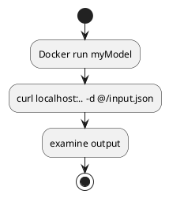

<!-- TOC -->

- [Deploying HuggingFace Inference models on KServe](#deploying-huggingface-inference-models-on-kserve)
    - [Pre Requisite](#pre-requisite)
    - [Resources](#resources)
- [Develop the server](#develop-the-server)
    - [Python pre-reqs](#python-pre-reqs)
    - [Model.py](#modelpy)
    - [Old - Containerizing](#old---containerizing)
    - [New - Containerizing](#new---containerizing)
    - [Build the container](#build-the-container)
    - [Push to local microk8s registry](#push-to-local-microk8s-registry)
- [Test Service locally](#test-service-locally)
    - [run container locally](#run-container-locally)
    - [generate test data](#generate-test-data)
    - [send test data to local server](#send-test-data-to-local-server)
        - [Positive](#positive)
        - [Negative](#negative)
        - [Failed attempt - 3](#failed-attempt---3)
        - [Failed attempt - 2](#failed-attempt---2)
        - [Failed attempt - 1](#failed-attempt---1)

<!-- /TOC -->
# Deploying HuggingFace SentimentAnalysis Inference model on KServe

## Pre Requisite

See [./AI-deploying-KServe.md](../../../../docs/AI/AI-deploying-KServe.md) for basic KFServe pre-requisites

## Resources
 - [Deploying a huggingface BERT model with KServe](https://medium.com/mlearning-ai/deploying-a-huggingface-bert-model-with-kserve-3e521d69e596)

# Building

`sudo docker build -t kserve_hf_sentiment:v1 -t localhost:32000/kserve_hf_sentiment:v1 -f model.Dockerfile .`

# Develop the server

Simply copying from the article linked above just to get it running and testable from outside the cluster. Then I'll dig into how it works by customizing, swaggerUI etc.

## Python pre-reqs

Need to get some things into my python dev-env to get started on developing the code.

 - `pip install kserve --dryrun`, there is no mamba package for this
   - Seems to be installing all new packages. Instead of creating a new mamba env for this, I installed onto my existing mamba ml env
   - `pip install kserve`. Got a few error about jupyterlab3.6.3's environment needing new stuff. Can be ignored I think.

## Model.py

```python
from typing import Dict 

import kserve
import torch

from transformers import AutoModelForSequenceClassification, AutoTokenizer
from kserve import ModelServer
import logging

class KServeBERTSentimentModel(kserve.Model):

    def __init__(self, name: str):
        super().__init__(name)
        KSERVE_LOGGER_NAME = 'kserve'
        self.logger = logging.getLogger(KSERVE_LOGGER_NAME)
        self.name = name
        self.ready = False

    def load(self):
        # Build tokenizer and model
        name = "distilbert-base-uncased-finetuned-sst-2-english"
        self.tokenizer = AutoTokenizer.from_pretrained(name)
        self.model = AutoModelForSequenceClassification.from_pretrained(name, torchscript=True)
        self.ready = True


    def predict(self, request: Dict, headers: Dict) -> Dict:
        
        sequence = request["sequence"]
        self.logger.info(f"sequence:-- {sequence}")

        inputs = self.tokenizer(
            sequence,
            return_tensors="pt",
            max_length=128,
            padding="max_length",
            truncation=True,
        )

        # run prediciton
        with torch.no_grad():
            predictions = self.model(**inputs)[0]
            scores = torch.nn.Softmax(dim=1)(predictions)

        results = [{"label": self.model.config.id2label[item.argmax().item()], "score": item.max().item()} for item in scores]
        self.logger.info(f"results:-- {results}")

        # return dictonary, which will be json serializable
        return {"predictions": results}

if __name__ == "__main__":

  model = KServeBERTSentimentModel("bert-sentiment")
  model.load()

  model_server = ModelServer(http_port=8080, workers=1)
  model_server.start([model])
```
 
From comments
 - Seems to be for REST. What about gRPC ?
   - `ModelServer` code has flags for grpc.
   - `kserve.Model` has code for grpc processing as well. So all good.
 - Quite different from a simple HF example. torchserve conversion effects ? 
 - ModelServer

 ## Old - Containerizing

  - The above link drops any mention of the dockerfile entirely
  - Search seems to want me to use [buildpacks](../../../../../infrastructure/FAQ-buildpacks.md) but I don't want to learn/debug yet another thing. Doesn't help that this being a heroku-initiated project, using heroku/.. stuff doesn't really inspire confidence when I want to build for k8s. _While this may work to automatically figure out the needed python packages and versions etc, gitOps etc demands a proper version controlled file_.
  - Found an example from [Arrikto KServe](https://docs.arrikto.com/user/kale/serving/custom-models/create-model.html#what-you-ll-need) that shows it. From there, updating to my versions
   - python 3.10
   - sub-dir of `model`
   - requirements
     - kserve=0.11
     - 

```docker
FROM python:3.10-slim

COPY model model

WORKDIR model
RUN pip install --upgrade pip && pip install -r requirements.txt

ENTRYPOINT ["python", "KServeBertSentimentModel.py"]
```

Digging into some more docs, I had to specify extra package index urls to use `cuda118` versions
 - removed tornado, rayserve and only retained these.
```
# requirements.txt
--extra-index-url https://download.pytorch.org/whl/cu118
torch
torchvision
kserve==0.11
protobuf
```

## New - Containerizing

  - The containers built as shown above result in 7.75G
  - Pushing it to dockerhub (_when tagged with `juvvi/...`_) takes forever
  - Pushing it to the microk8s registry (for later pull in pods) is much faster but still takes a non-trivial amount of time.
  - So layering it so I'll have to take the push hit just once and after that all kserve images will be just the custom serving code.


```docker
# See base layers being built up to reduce layer size
# infrastructure/docker-images/py-3.10-cu118-torch-kserve
FROM py-3.10-cu118-torch-kserve

COPY model model

WORKDIR model

ENTRYPOINT ["python", "KServeBertSentimentModel.py"]
```

## Build the container

> Note that the tag should include the dockerhub username `juvvi` if pushing to dockerhub. Can be retagged later on as well.

```shell
vamsi@hillops_dev:~/bitbucket/hillops/projects/learn/NLP/kserve-hf-sentiment$sudo docker build -t kserve-hf-sentiment:latest -f model.Dockerfile .

.
snip
.
Successfully built 4293049270a8
Successfully tagged juvvi/kserve-hf-sentiment:latest
```

👉 Builds super-fast

```shell
(ml) vamsi@hillops_dev:~/bitbucket/hillops/projects/learn/NLP/kserve-hf-sentiment$sudo docker images
REPOSITORY                                   TAG         IMAGE ID       CREATED          SIZE
kserve-hf-sentiment                          latest      76f1b27086c8   12 seconds ago   7.75GB
py-3.10-cu118-torch-kserve                   latest      2aab895be2a2   10 minutes ago   7.75GB
localhost:32000/py-3.10-cu118-torch-kserve   latest      2aab895be2a2   10 minutes ago   7.75GB
<none>                                       <none>      563ce8058845   12 minutes ago   7.25GB
py-3.10-cu118-torch                          latest      ca74d9807219   40 minutes ago   7.25GB
localhost:32000/py-3.10-cu118-torch          latest      ca74d9807219   40 minutes ago   7.25GB
<none>                                       <none>      718ad7db4922   2 hours ago      128MB
python                                       3.10-slim   629ddec3e227   5 weeks ago      128MB
juvvi/frontend-samples                       latest      4d9e10057e07   4 months ago     196MB
node                                         20-alpine   ade38d68438a   5 months ago     181MB
```

It shows the combined image size, but when pushing to the microk8s registry (still at localhost:32000 because of WSL port mapping magic), it is instantaneous: a few kB ?

## Push to local microk8s registry

> Note: Creating two heavy base layes: py-3.10-cu118-torch and py-3.10-cu118-torch-kserve (_based on py-3.10-cu118-torch) allow for a real small final container layer. Very fast to push.

  - `sudo docker tag 76f1b27086c8 localhost:32000/kserve-hf-sentiment`
  - `sudo docker push localhost:32000/kserve-hf-sentiment`

```shell
(ml) vamsi@hillops_dev:~/bitbucket/hillops/projects/learn/NLP/kserve-hf-sentiment$sudo docker push localhost:32000/kserve-hf-sentiment
Using default tag: latest
The push refers to repository [localhost:32000/kserve-hf-sentiment]
e5c2729af2b2: Pushed
3a80db614556: Mounted from py-3.10-cu118-torch-kserve
fa2760060015: Mounted from py-3.10-cu118-torch-kserve
938023a55faa: Mounted from py-3.10-cu118-torch-kserve
343912e4eb79: Mounted from py-3.10-cu118-torch-kserve
40d6e2f7a59c: Layer already exists
dbfedca961be: Layer already exists
da4afe124282: Layer already exists
e96fe707bd25: Layer already exists
571ade696b26: Layer already exists
latest: digest: sha256:2a82aa96ae0d03076faf6a42c5bbd12b892458028164ba5fc301121d80e9f5c5 size: 2419
```

# Test Service locally

[Deploying a huggingface BERT model with KServe](https://medium.com/mlearning-ai/deploying-a-huggingface-bert-model-with-kserve-3e521d69e596) did not include this step. _Leads me to think this was copied from some online exercise and simply re-packaged without any other value-add_

Using [official kserve docs - How to write a custom predictor](https://kserve.github.io/website/0.8/modelserving/v1beta1/custom/custom_model/)



## run container locally

`docker run -ePORT=8080 -p8080:8080 dockerUserOrRegistry/image:version`

 - Not sure what `ePORT` is 
 - `-p8080:8080` (_hostPort:containerPort_) creates a local port(_hostPort_) which forwards to a port inside the container (_containerPort_).
 - Likely shoud add a `-d` to run detached so I can communicate with it from the same console window. If I do, use `docker attach` to bring it to the front.

 ```shell
 (ml) 1 vamsi@hillops_dev:~$sudo docker run -p 8080:8080 kserve-hf-sentiment
 ```

 went through and fixed a whole bunch of python errors
  - missing ':'
  - missing modules 'transformers'

finally ended with it atleast launching

```shell
(ml) 1 vamsi@hillops_dev:~/bitbucket/hillops/projects/learn/NLP/kserve-hf-sentiment$sudo docker run -p 8080:8080 kserve-hf-sentiment
tokenizer_config.json: 100%|██████████| 48.0/48.0 [00:00<00:00, 386kB/s]
config.json: 100%|██████████| 629/629 [00:00<00:00, 4.66MB/s]
vocab.txt: 100%|██████████| 232k/232k [00:00<00:00, 3.31MB/s]
model.safetensors: 100%|██████████| 268M/268M [00:02<00:00, 97.9MB/s]
INFO:kserve:Registering model: bert-sentiment
INFO:kserve:Setting max asyncio worker threads as 32
INFO:kserve:Starting uvicorn with 1 workers
2024-01-26 17:51:54.497 uvicorn.error INFO:     Started server process [1]
2024-01-26 17:51:54.498 uvicorn.error INFO:     Waiting for application startup.
2024-01-26 17:51:54.507 1 kserve INFO [start():62] Starting gRPC server on [::]:8081
2024-01-26 17:51:54.508 uvicorn.error INFO:     Application startup complete.
2024-01-26 17:51:54.508 uvicorn.error INFO:     Uvicorn running on http://0.0.0.0:8080 (Press CTRL+C to quit)
```

## generate test data

from this block of python code

```python
        _sequence = request.get("sequence", "")
```

I would image a json like this (_text input_) 

```json
{
    "sequence": "The soup was awful"
}
```

## send test data to local server

Start the container this way to send the env var `LOGLEVEL=DEBUG`

`(ml) vamsi@hillops_dev:~/$sudo docker run -eLOGLEVEL="DEBUG" -p 8080:8080 kserve-hf-sentiment`

Run the positive and negative cases

### Positive

```json
{
   "sequence" : "I loved the movie"    
}
```

```shell
(ml) vamsi@hillops_dev:~$curl -H "Content-Type: application/json" localhost:8080/v1/models/bert-sentiment:predict -d @./test/input.json
{"predictions":[{"label":"POSITIVE","score":0.9998657703399658}]}
```

### Negative

```json
{
   "sequence" : "I hated the lunch"
}
```

```shell
(ml) vamsi@hillops_dev:~/bitbucket/hillops/projects/learn/NLP/kserve-hf-sentiment$curl -H "Content-Type: application/json" localhost:8080/v1/models/bert-sentiment:predict -d @./test/neg_input.json
{"predictions":[{"label":"NEGATIVE","score":0.9994094371795654}]}
```

### Failed attempt - 3

Tried to dump out the data coming in so I could see what it contained.

```python
def predict(self, request: Dict, headers: Dict) -> Dict:

        # Dump the entire request out for debugging
        self.logger.debug(
            json.dumps(request,indent=4)
        )
```

Just could not see the logs on this though. Turns out it was logging system malfunction. I had to keep the following in mind
 - `logging.basicConfig` is to be done just once. Not sure if some other piece of the code has already done it.
 - `logging.setLevel()` at the root level was ineffective. Not sure if it was something else since the formatString of the console output was different from what I eventually got
 - `logging.getLogger(..)`  to get my module logger and then setting level on this via env worked!
 - send env var via docker run's `-e`

`(ml) vamsi@hillops_dev:~$sudo docker run -eLOGLEVEL="DEBUG" -p 8080:8080 kserve-hf-sentiment`

```python
 class KServeBERTSentimentModel(kserve.Model):

    def __init__(self, name: str):
        super().__init__(name)        

        # Logging
        _KSERVE_LOGGER_NAME='KServeBERTSentimentModel'
        self._setupLogging(_KSERVE_LOGGER_NAME)
        ....
    
    # Inherit same handlers as root but allow overriding of loglevel
    def _setupLogging(self, loggerName):        
        self.logger = logging.getLogger(loggerName)
        if "LOGLEVEL" in os.environ:
            self.logger.setLevel(os.getenv("LOGLEVEL").upper())
``` 

✔️ 😁 Finally figured that the proble was that my json file was the original copy-pasted garbage which did not have my actual keys. Modified them and all was good.

Final logs that I see

```log
DEBUG:KServeBERTSentimentModel:{                                                                                            "sequence": "I loved the movie"                                                                                     }                                                                                                                       INFO:KServeBERTSentimentModel:sequence:--I loved the movie                                                              INFO:KServeBERTSentimentModel:results:-- [{'label': 'POSITIVE', 'score': 0.9998657703399658}]                           2024-01-26 23:18:32.691 kserve.trace requestId: N.A., preprocess_ms: 0.047922134, explain_ms: 0, predict_ms: 373.312473297, postprocess_ms: 0.002384186                                                               
```

### Failed attempt - 2

> Note: /v1/models/${MODEL_NAME} `:predict`

`$curl localhost:8080/v1/models/bert-sentiment:predict -d @./test/input.json`

```shell
vamsi@hillops_dev:~$curl localhost:8080/v1/models/bert-sentiment:predict -d @./test/input.json
{"error":"AttributeError : 'bytes' object has no attribute 'get'"}
```

hmm.. what is the type of `request` then ?

✔️ _Saw some other article that used content encoding via `-H "Content-Type: application/json"`. Using that make the input input a Dict rather than a byte-stream.

### Failed attempt - 1
`$curl localhost:8080/v1/models/bert-sentiment/predict -d @./test/input.json`

```shell
(ml) vamsi@hillops_dev:~$curl localhost:8080/v1/models/bert-sentiment/predict -d @./test/input.json
{"detail":"Not Found"}
```

hmm.., getting this error on the console log

```log
2024-01-26 18:16:55.215 uvicorn.access INFO:     172.17.0.1:58606 1 - "POST /v1/models/bert-sentiment/predict HTTP/1.1" 404 Not Found
```

✔️ Closer look. Messed up. should be `/v1/models/bert-sentiment:predict` instead of `/v1/models/bert-sentiment/predict`. The `404` should have alerted me to this.