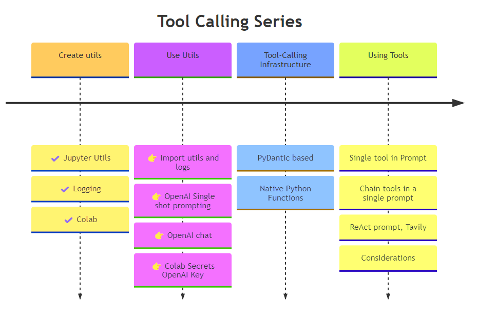
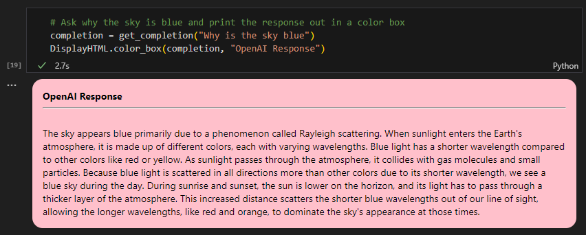
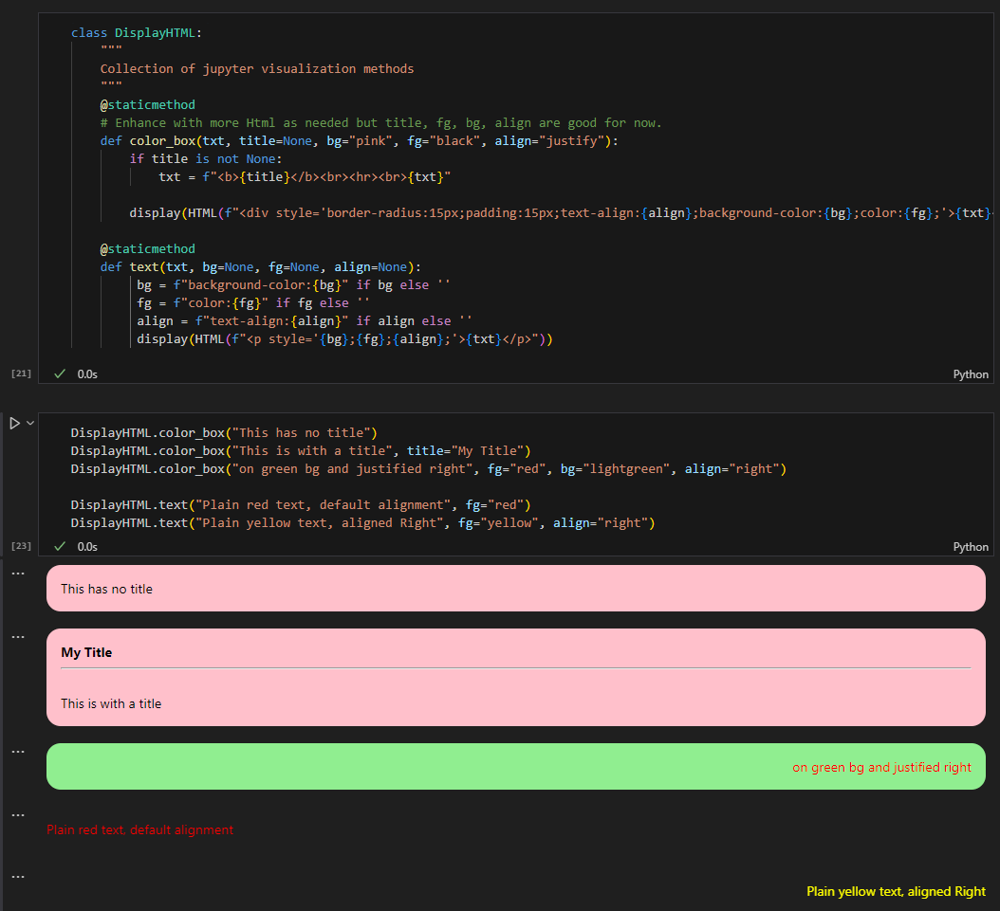
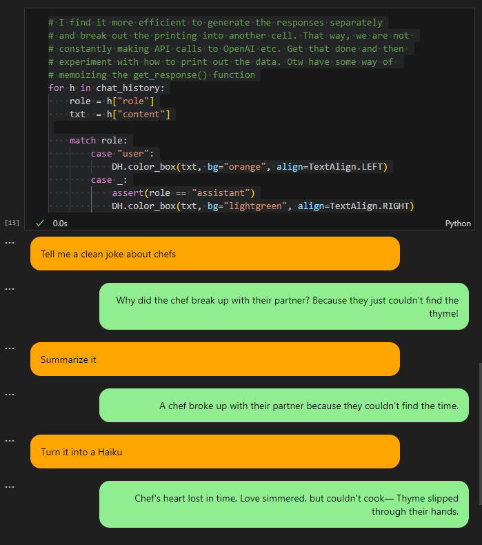
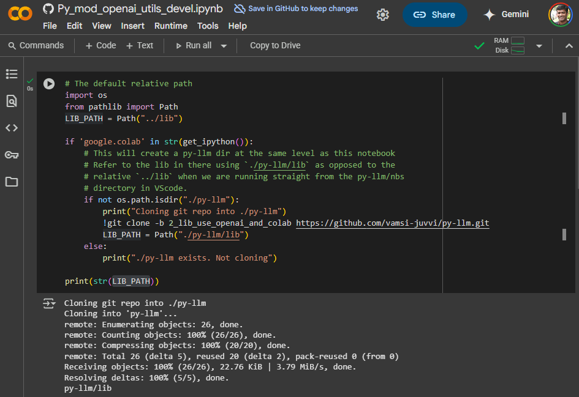

# Developing LLM Tool-calling - 2 - Importing libs, OpenAI Utils and Colab Secrets

This is part of my short series on developing LLM tool-calling and usage in Python. The previous article is [LINK NEEDED - Developing LLM Tool-calling - 1 - Code Structure and Jupyter Utilities](..).

This article will continue with the previously built `lib/utils/jupyter_utils.py` and create a basic OpenAI wrapper. We'll see how to generate text for simple one-shot prompts as well as engage in a multi-turn chat with an LLM. Calling OpenAI APIs requires the use of an API_KEY, I'll show how you expose the key in both local Jupyter and Colab contexts.



## TL;DR

- Code developed for this article is on the 🔗 [2_lib_use_openai_and_colab branch](https://github.com/vamsi-juvvi/py-llm/tree/2_lib_use_openai_and_colab)
- This article's development notebook is at 🔗[nbs/Py_mod_openai_utils_devel.ipynb](https://github.com/vamsi-juvvi/py-llm/blob/2_lib_use_openai_and_colab/nbs/Py_mod_openai_utils_devel.ipynb) and 🔗 [via Colab - nbs/Py_mod_openai_utils_devel.ipynb](https://colab.research.google.com/github/vamsi-juvvi/py-llm/blob/2_lib_use_openai_and_colab/nbs/Py_mod_openai_utils_devel.ipynb) 
- Make our repo's code available for import via `sys.path`
- Use the logging utililties in the `jupyter_util` module
- Start developing basic wrapper utilities for OpenAI calling: 🔗 [Py_mod_openai_utils_dev.ipynb](https://github.com/vamsi-juvvi/py-llm/blob/2_lib_use_openai_and_colab/nbs/Py_mod_openai_utils_devel.ipynb)
  - single-shot prompts
  - multi-turn chats
  - Updated `DisplayHTML` to control foreground color, background color, text alignment and box margins. This allows for better visualization of multi-turn chat. See 🔗 [Py_mod_jupyter_utils_devel.ipynb](https://github.com/vamsi-juvvi/py-llm/blob/2_lib_use_openai_and_colab/nbs/Py_mod_jupyter_utils_devel.ipynb)
  - The OpenAI wrapper code we build up is packaged into the 🔗 [lib/llm/openai_util.py](https://github.com/vamsi-juvvi/py-llm/blob/2_lib_use_openai_and_colab/lib/py_llm/llm/openai_util.py) module for use in the remaining articles
- Notebook execution and imports under colab is explored. We create a code block that clones git repo on colab and uses that for python imports. `ColabEnv` class is created to fetch keys from secrets _(instead of the usual environment variables)_. Launch 🔗 [via Colab - nbs/Py_mod_openai_utils_devel.ipynb](https://colab.research.google.com/github/vamsi-juvvi/py-llm/blob/2_lib_use_openai_and_colab/nbs/Py_mod_openai_utils_devel.ipynb) and try it out.

## Fix Python module tree

In the previous article: [LINK NEEDED - Developing LLM Tool-calling - 1 - Code Structure and Jupyter Utilities](..), we had created the following two notebooks:

- [nbs/Py_mod_jupyter_utils_devel.ipynb](https://github.com/vamsi-juvvi/py-llm/blob/jupyter_utils/nbs/Py_mod_jupyter_utils_devel.ipynb)
- [nbs/Py_mod_jupyter_utils_logging_devel.ipynb](https://github.com/vamsi-juvvi/py-llm/blob/jupyter_utils/nbs/Py_mod_jupyter_utils_logging_devel.ipynb)

The material from these notebooks was used to build up the module at [lib/utils/jupyter_utils.py](https://github.com/vamsi-juvvi/py-llm/blob/jupyter_utils/lib/util/jupyter_util.py) located in the following directory structure.

```
py-llm
lib
└── util
    ├── __init__.py
    └── jupyter_util.py  
``` 

The directory structure implies the following module import: `from util.jupyter_util import DisplayMarkdown`. Now, `util` is a very generic name and will clash with other `util`. I should have created a `py_llm.utils` hierarchy which would allow us to `from py_llm.util import jupyter_utils as ju`. The changes below will handle this change. Parent the directory to a new `py_llm` directory and place empty `__init__.py` files in the appropriate locations.

↓

```
lib/
├── __init__.py
└── py_llm
    ├── __init__.py
    └── util
        ├── __init__.py
        └── jupyter_util.py
```

## Development notebook

Create a new `Py_mod_openai_utils_devel.ipynb`.

- In VSCode, create a new file _(right click in the explorer)_ called `Py_mod_openai_utils_devel.ipynb`
- Click `Select Kernel` and point to your Python installation from the dropdown list. Mine is the `ml-pip : ~/mambaforge/envs/ml-pip/..` virtual env. 

> Notebook examples generally use `pip` as it is widely supported. I use `mamba` for my installations. Since `pip` and `mamba` don't play well together, I keep a `pip`-only virtual-envs so that `!pip install...` does not mess up the installation.

### Jupyter tips

To separate the notebook into _finished product_ and _experiments_, I added a Markdown section titled _Experiments_ under which I'll keep all the experimental/research cells. 

See 🔗 [Jupyter Notebook Shortcuts](https://towardsdatascience.com/jypyter-notebook-shortcuts-bf0101a98330/). _Command_ vs _Edit_ modes and the shortcuts. You can always use the buttons provided in the VSCode Jupyter interface but these shortcuts will make things go so much faster.
- When you are in a cell **AND** in **command mode** 
- `a` will add a cell **A**bove
- `b` will add a cell **B**elow
- `m` will change the cell type to _Markdown_
- `y` will change the cell type to _Code_
- `Alt` + `Enter` in a code cell runs it and move to the next cell.
- `Alt` + `Enter` in a Markdown cell that is being edited will render the Makkdown and move to the next cell.

## Importing our module library

The external modules imported by Python scripts are usually installed by a package manager, `pip` or `mamba/conda`. When we import packages from custom code, we need to integrate into the same process or modify the environment variables that affect module search.

> - PYTHONPATH: 🔗 https://docs.python.org/3/using/cmdline.html#envvar-PYTHONPATH
> - site packages: 🔗 https://docs.python.org/3/library/site.html
> - also: `PYTHONHOME`, `PYTHONSTARTUP`

In the case of Jupyter notebooks, we want them to be runnable from `Colab` or within `VSCode`. The simplest way to accomplish this is to directly manipulate the module search path in the notebook. We use these facts about the Jupyter environment:
- The directory that holds the notebook is the `cwd` that `.` refers to.
- We just need to know the location of our library dir **relative** to the notebook _(can vary with notebook)_.

The directory tree containing both `lib` and `nbs` _(for notebooks)_ is listed below. We see that to import `py_llm`, we need the relative path from `Py_mod_jupyter_utils_devel.ipynb` to `lib`: this will be `../lib`.

```shell
├── lib
│   └── py_llm
│       ├── ...
└── nbs
    ├── Py_mod_jupyter_utils_devel.ipynb
    └── Py_mod_jupyter_utils_logging_devel.ipynb   
```

Stick the following in the top-most cell of your notebook. 

```python
# Append to sys.path directly
# Make sure to `str(Path)`
# - The resolve() function converts relative paths to absolute. 
# - If you use ~ for HOME, use `Path.expand_user()`
import os, sys
from pathlib import Path

sys.path.append(str(Path("../lib").resolve()))
```

In the spirit of experimentation, after you run the cell above and correct any syntax issues, create a cell below it and verify!

```python
print("\n".join(sys.path))
```

This resolves to `/home/vamsi/github/py-llm/lib`: all good!

Then we test the actual imports of the libs we had created earlier. Run the following in a new cell to verify.

```python
from py_llm.util.jupyter_util import DisplayHTML as DH
from py_llm.util.jupyter_util import DisplayMarkdown as DM
DH.color_box("Hello in colorbox")
```

Finalize our imports and set up logging to `DEBUG`.

```python
from py_llm.util import jupyter_util
from py_llm.util.jupyter_util import DisplayHTML as DH
from py_llm.util.jupyter_util import DisplayMarkdown as DM

# Init logging at DEBUG level. Once we are done testing, 
# this can be dropped down to warning
jupyter_util.setup_logging(logging.DEBUG)
```

## Developing openai_utils

> 🔗 [OpenAI Chat end-point guide](https://platform.openai.com/docs/guides/text?api-mode=chat)

This will be very lightweight. Since I am just copying from OpenAI's documentation, there is no particular need to build it up incrementally via experiments. I am going to stick this at the top in its own cell. 


↓

```python
import os
import openai

openai.api_key = os.environ.get("OPENAI_API_KEY")

#----------------------------------------------------------------------------
def get_completion(prompt, model="gpt-4o-mini", temperature=0) -> str:
    """
    Returns the one-shot completion of a simple prompt (no tools)
    as a string response.
    """
    logging.debug(f"Prompt: {prompt}, model={model}, temp={temperature}")

    chat_history = [{"role":"user", "content":prompt}]

    response = openai.chat.completions.create(
        model=model,
        messages=chat_history,
        tools=None,
        temperature=temperature)
    
    response_text = response.choices[0].message.content

    # Could choose to log the entire response object too.    
    logging.info(f"Response Text: {response_text}")
    return response_text
```

This is all you need to get started with an LLM vendor. A vendor-specific Python module and one or two wrapper functions. 

## Prompt an OpenAI model

In a new cell, ask why the sky is blue and print the response out in a color box.



And that's all there is to it! Let's improve this a bit: aka, get chatty!

## Getting chatty with a role-playing model - now in more colors

The roles of `user` and `assistant`, i.e.

The `chat_history` argument is meant to contain a multi-turn conversation. The personas in this conversation _(don't worry about tool calling for now)_ are:

- `assistant`: The chat end-point being helpful. This is the LLM taking on a persona defined by the `system|developer` prompt. 
- `user`: The one calling the above-mentioned chat end-point. This is the code which invoked the chat API.
- `system | developer`: to specify the overall behavior of the LLM in the chat. Something along the lines of _You are a helpful executive assistant who uses very crisp text in your emails: to the point and polite_.  

Turning a single-turn prompt output into a chat could simply entail asking followup questions. The LLM will consider the previous chat hisoty before responding to any subsequent prompts. However, before we do this, let's get more colorful so the chat roles can be visually separated.

### Roles in distinct colors

- I am hoping that simply by making the `bgcolor` a parameter, our ColorBox function can visually separate the various roles. Let's see. Make some simple changes to the `color_box`
- For more complex scenarios, [gradio](https://www.gradio.app/) can be used to build a graphical interface running inside a Jupyter notebook.
- Open up the [nbs/Py_mod_jupyter_utils_devel.ipynb](https://github.com/vamsi-juvvi/py-llm/blob/2_lib_use_openai_and_colab/nbs/Py_mod_jupyter_utils_devel.ipynb) and make the changes below.

```diff
- def color_box(txt, title=None):
+ def color_box(txt, title=None, bg="pink", fg="black", align="justify"):
        if title is not None:
            txt = f"<b>{title}</b><br><hr><br>{txt}"

-        display(HTML(f"<div style='border-radius:15px;padding:15px;background-color:pink;color:black;'>{txt}</div>"))
+        display(HTML(f"<div style='border-radius:15px;padding:15px;background-color:{bg};color:{fg};text-align:{align};'>{txt}</div>"))
```

- `bg` allows us to specify background. Default is the previous hardcoded `pink`
- `fg` allows us to specify foreground color. Default is the previous hardcoded `black`
- `align` allows us to specify the CSS `text-align` property. I think in addition to color, it could be useful to align one type of text to the right and another to the left.
- With these we can consider the followign.
  - `user`: black text on light-grey aligned left
  - `assistant`: black text on `lightgreen` background aligned right
- When it all works, copy the code into the `lib/py_llm/util/jupyter_util.py` module.   
- Being over-achievers, we also create a parallel `text` function which uses an HTML `p` tag to render text without a box but the same `fg`, `bg` and `align` props.

↪


### Multi-turn chat

> 👉 Since we load the `jupyter_utils.py` module into the `Py_mod_openai_utils_devel.ipynb`, to bring in module updates with the new color params, we need to restart the kernel. Subsequent imports will fetch the module fresh from the disk. 

We have an API that allows us to supply a chat history, multi-turn chat is simply having _(and storing in chat_histpry)_ a dialogue with the LLM where the `user` and `assistant` roles take turns. The simplest version of this is to ask the LLM to transform its previous output _(it knows what was previously said only because the entire chat_history is sent to the LLM)_.

Let's do it in these steps:
- Ask the LLM to generate something
- Have it summarize it
- Then turn it into a haiku

> 📃 Each time you go back and update a cell (say adding new functions), run the cell using `Alt` + `Enter` or the UI controls. This adds those functions to the main module and the functions are then callable from any cell (above or below). Will feel strange that a bottom cell affects a top-cell's execution but that is something to exploit. You don't have to always execute the cells top-to-bottom.

First, refactor the code to split the get_completion into a method that directly takes `chat_history`.

```python
#-------------------------------------------------------------------------------------
def get_completion(prompt, model="gpt-4o-mini", temperature=0) -> str:
    """
    Returns the one-shot completion of a simple prompt (no tools)
    as a string response.
    """
    chat_history = [{"role":"user", "content":prompt}]
    response = get_response(chat_history, model, temperature)    
    return response.choices[0].message.content

#-------------------------------------------------------------------------------------
def get_response(chat_history, model="gpt-4o-mini", temperature=0):
    """
    Returns the completion given a chat_history
    """    
    return openai.chat.completions.create(
        model=model,
        messages=chat_history,
        tools=None,
        temperature=temperature)
``` 

> I did add some experiments to examine the response.choices[0].message object in the notebook. I see that there is a `role` property which I can use. Good to not hardcode `assistant`.

and then add two methods to maintain the chat_history.

```python
def chat_history_append_response(chat_history, response):
    msg = response.choices[0].message
    chat_history.append( {
        "role" : msg.role,
        "content" : msg.content
    })

    return chat_history

def chat_history_append_user_msg(chat_history, content):    
    chat_history.append( {
        "role" : "user",
        "content" : content
    })

    return chat_history
```

Now verify that this works for our use case. Yep. The following chat cell:

```python
# Try out multi-turn convo.
# Initial prompt
chat_history = [{
    "role":"user", 
    "content":"Tell me a clean joke about chefs"
    }]
r = get_response(chat_history)
chat_history_append_response(chat_history, r)

# follow up Q 1
chat_history_append_user_msg(chat_history, "Summarize it")
r = get_response(chat_history)
chat_history_append_response(chat_history, r)

# follow up Q 2
chat_history_append_user_msg(chat_history, "Turn it into a Haiku")
r = get_response(chat_history)
chat_history_append_response(chat_history, r)
```

results in this output. Printed using json dumps (`import json`) and then `print(json.dumps(chat_history, indent=4))`. 

```json
[
    {
        "role": "user",
        "content": "Tell me a clean joke about chefs"
    },
    {
        "role": "assistant",
        "content": "Why did the chef break up with their partner?\n\nBecause they just couldn't find the thyme!"
    },
    {
        "role": "user",
        "content": "Summarize it"
    },
    {
        "role": "assistant",
        "content": "A chef broke up with their partner because they couldn't find the time."
    },
    {
        "role": "user",
        "content": "Turn it into a Haiku"
    },
    {
        "role": "assistant",
        "content": "Chef's heart lost in time,  \nLove simmered, but couldn't cook—  \nThyme slipped through their hands."
    }
]
```

To show this graphically, I went back to [nbs/Py_mod_jupyter_utils_devel.py](https://github.com/vamsi-juvvi/py-llm/blob/2_lib_use_openai_and_colab/nbs/Py_mod_jupyter_utils_devel.ipynb) and enhanced `color_box` further to specify alignment. The idea was that to distinguish the two turns better, it would make sense to have one actor aligned to the right and the other to the left. The `chat_history` is printed out using the newer version of `color_box` thus:

```python
from py_llm.util.jupyter_util import TextAlign

# I find it more efficient to generate the responses separately
# and break out the printing into another cell. That way, we are not 
# constantly making API calls to OpenAI etc just because we are changing 
# the visualization of already generated prompt responses. Get the LLM 
# interaction done and then experiment with how to print out the data 
# in a new cell. Alternately, have some way of memoizing the get_response() 
# function
for h in chat_history:
    role = h["role"]
    txt  = h["content"]

    match role:
        case "user":
            DH.color_box(txt, bg="orange", align=TextAlign.LEFT)
        case _:
            assert(role == "assistant")
            DH.color_box(txt, bg="lightgreen", align=TextAlign.RIGHT)
```
↪



> 🤔 This is distracting. I think we should just have the box alignment affecting the margins but leave the text default-justified. The second cell for instance, it's weird to have the a line fill the cell horizontally and then have the last word in the second line be right justified! TODO! A new `BoxAlign` enum independent from `TextAlign`.

### Save final code to the openai_util.py module

Final step once we are done with building up in the notebook. Copy the final bits _(which you have been copying to the top of the notebook)_ into the `lib/llm/openai_util.py` module.

# Colab and Secrets

If you wish to run this notebook on Colab, there are some considerations.
- ✔️ The GitHub URL of the notebook can be mapped to Colab as shown in the previous article.
- ❓However, this notebook imports repo-local files that also need to be accessible from Colab
  - ✔️ One way to do this is to `git clone` the repo to get it onto Colab storage.
  - Depending on the size of the repo involved, you may or may not find this tolerable. At that point, you have to decide if you want it published so that a `pip install` could be used instead.
- ❓ This notebook uses an `OPENAI_API_KEY` key that is set in a local WSL/Linux environment. Need to colabify:
  - ✔️ Add the same key to Colab using it's secrets management UI
  - ✔️ Grant this notebook permission to use the key
   
> Unfortunately, the code to pull in a git repo and check if it is Colab cannot be in a library. It will have to be duplicated in each Colab-runnable notebook.

## Transform GitHub link to Colab accessible one

https://github.com/vamsi-juvvi/py-llm/blob/2_lib_use_openai_and_colab/nbs/Py_mod_openai_utils_devel.ipynb

↪

https://colab.research.google.com/github/vamsi-juvvi/py-llm/blob/2_lib_use_openai_and_colab/nbs/Py_mod_openai_utils_devel.ipynb

## Clone the GitHub lib before import

> Once you transform the GitHub link to a Colab-accessible one, you can perform the rest of the experimentations on Colab directly. Once edited though, you can only save to your local Google Drive and manually sync to your GitHub branch.

Since `py-llm` is a public repo, cloning it is straightforward. The following code _(placed at the top of the cell, before any repo-lib import)_ takes care of it. Note that for the purposes of this article, we'll clone the `2_lib_use_openai_and_colab` branch:

```python
import os
from pathlib import Path

# The default relative path when running the notebook from a cloned repo.
LIB_PATH = Path("../lib")

if 'google.colab' in str(get_ipython()):
    # This will create a py-llm dir at the same level as this notebook
    # Refer to the lib in there using `./py-llm/lib` as opposed to the 
    # relative `../lib` when we are running straight from the py-llm/nbs 
    # directory in VSCode.
    if not os.path.isdir("./py-llm"):
        print("Cloning git repo into ./py-llm")
        !git clone -b 2_lib_use_openai_and_colab https://github.com/vamsi-juvvi/py-llm.git
        LIB_PATH = Path("./py-llm/lib")
    else:
        print("./py-llm exists. Not cloning")        
```

Since we want this code to co-exist with regular lib-loading code, we replace the constant path with the `LIB_PATH` variable:

```diff
- sys.path.append(str(Path("../lib").resolve()))
+ sys.path.append(str(LIB_PATH.resolve()))
```

and this works great! 👉 The key is the `if 'google.colab' in str(get_ipython()):` check to determine if we are running under Colab.



Now that we have it, we need to get the `OPENAI_API_KEY` key into and then out of Colab. 

## Save the API key to secrets

> Pre-requisite: You already have a key from OpenAI.

There are several resources that show you how to do this. For instance: [YouTube - How to setup Secrets in Google Colab](https://www.youtube.com/watch?v=LPa51KxqUAw) by _The Machine Learning Engineer_. Essentially:
- Use the secrets menu button from the left toolbar.
- Add the key/value pair. _Note that this is associated with your Google account and is only available when you are logged in to Colab._
- 👉 You also have to **make it available to each notebook** you run. This is a security measure and puts the onus on you to make sure that the notebook you run is not stealing your key etc. Basically, do this only if you trust the notebook.

To access such a secret, Google provides a `google.colab.userdata.get(KEY)` method. I have wrapped this up in a utility class and stuck it in `ColabEnv` in the `py_llm.util.jupyter_util.py` module.

```python
#--------------------------------------------------------------
# Expected to be run in a Jupyter environment (normal or Colab)
#--------------------------------------------------------------
class ColabEnv:
    @staticmethod
    def colab_keyval(key):
     """
     Checks Colab for the specified key.
     Note that there is a checkbox in the Colab interface that explicitly 
          gives a notebook permission to access this. This has to be enabled 
          for each key on a given notebook. Otherwise, this code will never see it.
     """
     keyval = None
     if 'google.colab' in str(get_ipython()):
          from google.colab import userdata
          logging.debug(f"Trying to fetch {key} from your secrets. Remember to make it available to this notebook")            
     
          if keyval := userdata.get(key):
               logging.debug(f"Found Colab secret for {key}")
          else:
               logging.warning(f"Did not find Colab secret for {key}")
     
     return keyval

     
    @staticmethod
    def colab_keyval_or_env(key):
         return ColabEnv.colab_keyval(key) or os.environ[key]
         
    @staticmethod
    def import_api_keys(keys):
     """
     Imports the various API keys from Colab's userdata.

     These are stored in Colab secrets and you'll need to allow the notebook to access
     the keys explicitly on a key-by-key basis.
     """             
     for k in keys:
          if kv := ColabEnv.colab_keyval(k):               
               os.environ[k] = kv
```

We can then do this _(and update in openai_utils.py as well)_:

```diff
+ from py_llm.jupyter_utils import ColabEnv

- openai.api_key = os.environ.get("OPENAI_API_KEY")` 
+ openai.api_key = ColabEnv.colab_keyval_or_env("OPENAI_API_KEY")` 
```