# Developing LLM Tool-calling - 2 - Importing libs, OpenAI Utils and Colab Secrets

This is part of my short series on develop LLM tool-calling and usage in python. The previous article is [THIS ONE]().

This article will use the `lib/utils/jupyter_utils.py` and build up some simple OpenAI utilities on which I'll base the rest of the series. Since calling OpenAI APIs requires the use of an API_KEY, I'll show it's use in both a local jupyter and colab contexts.

 


## TL;DR

 - Code developed for this article is on the 🔗 [2_lib_use_openai_and_colab branch](https://github.com/vamsi-juvvi/py-llm/tree/2_lib_use_openai_and_colab)
 - This article's development notebook is at 🔗[nbs/Py_mod_openai_utils_devel.ipynb](https://github.com/vamsi-juvvi/py-llm/blob/2_lib_use_openai_and_colab/nbs/Py_mod_openai_utils_devel.ipynb) and 🔗 [via Colab - nbs/Py_mod_openai_utils_devel.ipynb](https://colab.research.google.com/github/vamsi-juvvi/py-llm/blob/2_lib_use_openai_and_colab/nbs/Py_mod_openai_utils_devel.ipynb) 
 - Setup `sys.path` to include the python modules in the repo
 - Setup logging using the `jupyter_util` module
 - Start developing basic utilities for OpenAL calling: [Py_mod_openai_utils_dev.ipynb](https://github.com/vamsi-juvvi/py-llm/blob/2_lib_use_openai_and_colab/nbs/Py_mod_openai_utils_devel.ipynb)
   - single-shot prompts
   - multi-turn chats
   - Updated `DisplayHTML` to control foregrond-color, background-color, text alignment and box margins. This allows for a better visualization of multi-turn chat. See [Py_mod_jupyter_utils_devel.ipynb](https://github.com/vamsi-juvvi/py-llm/blob/2_lib_use_openai_and_colab/nbs/Py_mod_jupyter_utils_devel.ipynb)
   - TODO: Copied openai wrapper code into the [lib/llm/openai_util.py]() module for use in the remaining articles
 - Listed some directions to investigate if the [Py_mod_openai_utils_dev.ipynb](https://github.com/vamsi-juvvi/py-llm/blob/2_lib_use_openai_and_colab/nbs/Py_mod_openai_utils_devel.ipynb) needs to be opened in Colab.

## Fix python module tree

In the previous article: [THIS ONE](), we had created the following two notebooks 

 - [nbs/Py_mod_jupyter_utils_devel.ipynb](https://github.com/vamsi-juvvi/py-llm/blob/main/nbs/Py_mod_jupyter_utils_logging_devel.ipynb)
 - [nbs/Py_mod_jupyter_utils_logging_devel.ipynb](https://github.com/vamsi-juvvi/py-llm/blob/main/nbs/Py_mod_jupyter_utils_logging_devel.ipynb)

which built up the module at [lib/utils/jupyter_utils.py](https://github.com/vamsi-juvvi/py-llm/blob/main/lib/util/jupyter_util.py) reflected in the following directory structure.

```
py-llm
lib
└── util
    ├── __init__.py
    └── jupyter_util.py  
``` 

The directory structure implies the following import: `from util.jupyter_util import DisplayMarkdown`. Now, `util` is a very generic name: will clash with other `utils`. I should have creates a `py_llm.utils` hierarchy which'll allow us to `from py_llm.util import jupyter_utils as ju`. The changes below will handle the change. Move the dir and place empty, `__init__.py` files in the approp locations.

↓

```
lib/
├── __init__.py
└── py_llm
    ├── __init__.py
    └── util
        ├── __init__.py
        └── jupyter_util.py
```

## Development notebook

Create a new `Py_mod_openai_utils_devel.ipynb`. This will be a small one and I can walk through the iterative process.

 - In VSCode, create a new file _(right click in the explorer)_ called `Py_mod_openai_utils_devel.ipynb`
 - Click `Select Kernel` and point to your python installation from the dropdown list. Mine is the `ml-pip : ~/mambaforge/envs/ml-pip/..` virtual env. Since `pip` and `mamba` cannot co-exist, I like to keep `pip` only venvs as the colab env likes `pip` and we can install dependencies from within our notebooks using `!pip install...`

### Jupyter tips

To separate the notebook into _finished product_ and _experiments_, I added a Markdown section titled _Experiments_ under which I'll keep all the experimental/research cells. 

See 🔗 [Jupyter Notebook Shortcuts](https://towardsdatascience.com/jypyter-notebook-shortcuts-bf0101a98330/). _Command_ vs _Edit_ modes and the shortcuts. You can always use the buttons provided in the VSCode Jupyter interface but these will make things go so much faster.
 - When you are in a cell **AND** in **command mode** 
 - Hotkey `a` will add a cell **A**bove
 - Hotkey `b` will add a cell **B**elow
 - Hotkey `m` will change the cell type to _Markdown_
 - Hotkey `y` will change the cell type to _Code_


## Importing our libs

Python scripts import any number of external modules they need to use. These are usually installed by your package manager, `pip` or `mambda/conda`. When we install package from custom code, we need to integrate into the same process or modify the environment variables that affect module search.

> - PYTHONPATH: 🔗 https://docs.python.org/3/using/cmdline.html#envvar-PYTHONPATH
> - site packages: 🔗 https://docs.python.org/3/library/site.html
> - also : `PYTHONHOME`, `PYTHONSTARTUP`

In the case of Jupyter notebooks, since they can be run from `Colab` or within `VSCode`. We cannot depend on environment variables being set for us or the bother of dealing with manipulating those for each project. For simple cases, we can go native and set our lib paths directly in the notebook. We use this fact:
 - The directory that holds the notebook is the `cwd` that `.` refers to.
 - We just need to know the location of our library dir **relative** to the notebook _(can vary with notebook)_.

The dir tree containing both `lib` and `nbs` _(for notebooks)_ is listed below. We see that to import `py_llm`, we need the relative path from `Py_mod_jupyter_utils_devel.ipynb` to `lib`: this will be `../lib`.

```shell
├── lib
│   └── py_llm
│       ├── ...
└── nbs
    ├── Py_mod_jupyter_utils_devel.ipynb
    └── Py_mod_jupyter_utils_logging_devel.ipynb   
```

Stick the following in the top-most cell of your notebook. 

```python
# Append to sys.path directly
# Make sure to `str(Path)`
# - The resolve() converts relative to absolute. 
# - If you use ~ for HOME, use `Path.expand_user()`
import os, sys
from pathlib import Path

sys.path.append(str(Path("../lib").resolve()))
```

In the spirit of experimentation, after you run the cell above and correct any syntax issues, create a cell below it and verify!

```python
print("\n".join(sys.path))
```

This resolve to `/home/vamsi/github/py-llm/lib`. I always have trouble imagining directory navigation in my head and usually get it wrong! 

Now test the actual imports of the libs we had created earlier. Run the following in a new cell to verify.

```python
from py_llm.util.jupyter_util import DisplayHTML as DH
from py_llm.util.jupyter_util import DisplayMarkdown as DM
DH.color_box("Hello in colorboox")
```

Finalize our imports and setup logging to `INFO`.

```python
from py_llm.util import jupyter_util
from py_llm.util.jupyter_util import DisplayHTML as DH
from py_llm.util.jupyter_util import DisplayMarkdown as DM

# Init logging at DEBUG. Once we are done testing, this can drop 
# down to warning
jupyter_util.setup_logging(logging.INFO)
```

## Developing openai_utils

This will be very lightweight. Since I am just copying from OpenAI's documentation, there is no need particular need to build it up incrementally via experiments. I am going to stick this at the top in it's own cell. You could however conduct experiments on this.

 - Take the code out of the function
 - examine the contents of `response.choices` and `response.choices[0].message` for instance.

> 🔗 [OpenAI Chat end-point guide](https://platform.openai.com/docs/guides/text?api-mode=chat)

```plantuml
@startmindmap
* OpenAI Utils

left side

** allow one-shot prompts
** allow memory with chat history 
**:👉 You'll need an OPENAI_API_KEY
google it and get one. Free 
service tier is good enough 
for now;

right side

** 1️⃣ Get OpenAI Key
**://role:system// is how you 
specify the overall expected 
behavior of the LLM for your 
conversation. Since we are 
asking it for a factual response, 
we can leave it out.

Seems to be renamed to 
//role:developer// per current docs;
** 2️⃣ our prompt is a //role:user// item
**: 3️⃣ LLm response will be a 
//role: assistant// msg;
@endmindmap
```



↓

```python
import os
import openai

openai.api_key = os.environ.get("OPENAI_API_KEY")

#----------------------------------------------------------------------------
def get_completion(prompt, model="gpt-4o-mini", temperature=0) -> str:
    """
    Returns the one-shot completion of a simple prompt (no tools)
    as a string response.
    """
    logging.debug(f"Prompt : {prompt}, model={model}, temp={temperature}")

    chat_history = [{"role":"user", "content":prompt}]

    response = openai.chat.completions.create(
        model=model,
        messages=chat_history,
        tools=None,
        temperature=temperature)
    
    response_text = response.choices[0].message.content

    # Could choose to log the entire response object too.    
    logging.info(f"Response Text: {response_text}")
    return response_text
```

> - This is all you need to get started with an LLM vendor. A vendor specific python module and one or two wrapper functions. 
> - Even here, we can keep it `DRY`: `get_completion` calls `get_response`

## prompt an OpenAI model

In a new cell, ask why the sky is blue and print the response out in a color box. Works!


And thats all there is to it! Lets improve this a bit: aka, get chatty!

## getting chatty with a role-playing model - now in more colors

The roles of `user` and `assistant` i.e.

The `chat_history` argument is meant to contain a multi-turn conversation. The personas in this conversation _(don't worry about tool calling for now)_ are:

 - `assistant` : The chat end-point being helpful. Think of this as just OpenAI. In general though, this will be a `LLM` that has been fine-tuned for multi-turn conversations, or chats.
 - `user` : The one calling the above-mentioned chat-end-point. This is the code which is invokving the chat API.
 - `system | developer` : to specify the overall behavior of the LLM in the chat. Something along the lines of a _You are a helpful executive assistant who uses very crisp text in your emails: to the point and polite_. When your prompts respond to 

We can build on the previous : `why is the sky blue` with a followup. However, before we do this. Lets get more colorful.

### roles in distinct colors

 - You can use [gradio](https://www.gradio.app/) to build an interactive app inside a Jupyter notebook.
 - I am hoping that simply by making the `bgcolor` a parameter, our ColorBox function can visually separate the various roles. Lets see. Make some simple change to the `color_box`
 - Open up the [Py_mod_jupyter_utils_devel.ipynb](LINK) and make the changes below. Also exercise the code.

```diff
- def color_box(txt, title=None):
+ def color_box(txt, title=None, bg="pink", fg="black", align="justify"):
        if title is not None:
            txt = f"<b>{title}</b><br><hr><br>{txt}"

-        display(HTML(f"<div style='border-radius:15px;padding:15px;background-color:pink;color:black;'>{txt}</div>"))
+        display(HTML(f"<div style='border-radius:15px;padding:15px;background-color:{bg};color:{fg};text-align:{align};'>{txt}</div>"))
```

 - `bg` allows to specify background. Default is the previous hardcoded `pink`
 - `fg` allows to specify foreground color. Default is the previous hardcoded `black`
 - `align` allows us to specify the CSS `text-align` property. I think in addition to color, could be useful to align one type of text to the right and another to the left.
 - With these we could consider
   - `user`: black text on light-grey aligned left
   - `assistant` : black text on 'lightgreen` background aligned right
 - When it all works, copy the code into the `lib/py_llm/util/jupyter_util.py` module.   
 - Being over-achievers, we also create a parallell `text` function which uses a HTML `p` tag to render text without a box but the same `fg`, `bg` and `align` props.

↪


### multi turn chat

> 👉 Since we load the jupyter_utils.py module into the Py_mod_openai_utils_devel.ipynb, to bring in changes for the new color params, we need to restart the kernel. 

Once we have an API that allows us to supply a chat-history, multi-turn chat is simply having a dialogue with the LLM where the `user` and `aasistant` roles take turns. The simplest version of this is to ask the LLM to transform it's previous output.

Lets do it in these steps
 - Ask the LLM to generate something
 - Have it summarize it
 - Then turn it in a haiku

> 📃 Each time you go back and update a cell (say adding new functions), run the cell using `Alt` + `Enter` or the UI controls. This adds those functions to the main module and the functions are then callble from any cell (above or below)

First, refactor the code to split the get_completion into a method that directly takes `chat_history`.

```python
#-------------------------------------------------------------------------------------
def get_completion(prompt, model="gpt-4o-mini", temperature=0) -> str:
    """
    Returns the one-shot completion of a simple prompt (no tools)
    as a string response.
    """
    chat_history = [{"role":"user", "content":prompt}]
    response = get_response(chat_history, model, temperature)    
    return response.choices[0].message.content

#-------------------------------------------------------------------------------------
def get_response(chat_history, model="gpt-4o-mini", temperature=0):
    """
    Returns the completion given a chat_history
    """    
    return openai.chat.completions.create(
        model=model,
        messages=chat_history,
        tools=None,
        temperature=temperature)
``` 

> I did add some experiments to examine the response.choices[0].message object in the notebook. I see that there is a `role` property which I can use.

and then add two methods to maintain the chat_history.

```python
def chat_history_append_response(chat_history, response):
    msg = response.choices[0].message
    chat_history.append( {
        "role" : msg.role,
        "content" : msg.content
    })

    return chat_history

def chat_history_append_user_msg(chat_history, content):    
    chat_history.append( {
        "role" : "user",
        "content" : content
    })

    return chat_history
```

Now verify that this works for our use-case. Yup. The following chat cell

```python
# Try out multi-turn convo out.
chat_history = [{
    "role":"user", 
    "content":"Tell me a clean joke about chefs"
    }]

r = get_response(chat_history)
chat_history_append_response(chat_history, r)
chat_history_append_user_msg(chat_history, "Summarize it")
r = get_response(chat_history)
chat_history_append_response(chat_history, r)
chat_history_append_user_msg(chat_history, "Turn it into a Haiku")
r = get_response(chat_history)
chat_history_append_response(chat_history, r)
```

results in this output. Printed using json dumps (`import json`) and then `print(json.dumps(chat_history, indent=4))`. 

```json
[
    {
        "role": "user",
        "content": "Tell me a clean joke about chefs"
    },
    {
        "role": "assistant",
        "content": "Why did the chef break up with their partner?\n\nBecause they just couldn't find the thyme!"
    },
    {
        "role": "user",
        "content": "Summarize it"
    },
    {
        "role": "assistant",
        "content": "A chef broke up with their partner because they couldn't find the time."
    },
    {
        "role": "user",
        "content": "Turn it into a Haiku"
    },
    {
        "role": "assistant",
        "content": "Chef's heart lost in time,  \nLove simmered, but couldn't cook\u2014  \nThyme slipped through their hands."
    }
]
```

To show this better, visually, I went back to [Py_mod_jupyter_utils_devel.py](LINK) and enhanced color-box further to specify alignment. The idea was that to distinguish the two turns better, it'd make sense to have one actor aligned to the right and the other to the left. The chat_history is printed out using the newer version of `color_box` thus:

```python
from py_llm.util.jupyter_util import TextAlign

# I find it more efficient to generate the responses separately
# and break out the printing into another cell. That way, we are not 
# constantly making API calls to OpenAI etc. Get that done and then 
# experiment with how to print out the data. Otw have some way of 
# memoizing the get_response() function
for h in chat_history:
    role = h["role"]
    txt  = h["content"]

    match role:
        case "user":
            DH.color_box(txt, bg="orange", align=TextAlign.LEFT)
        case _:
            assert(role == "assistant")
            DH.color_box(txt, bg="lightgreen", align=TextAlign.RIGHT)
```
↪


> 🤔 this is distracting. I think we should just have the box-alignment affecting the margins but leave the text justified. The second cell for instance, weird to have the first sentence fill the cell and then that one word be right justified! TODO!

### save final code to the openai_util.py module


# Colab and Secrets

If you wish to run this notebook on colab, there are some considerations.
 - ✔️ The github URL of the notebook can be mapped to colab as show in the previous article.
 - ❓However, this notebook imports files that also need to be accessible from colab
   - ✔️ One way to do this is to `git clone` the rep to get it onto colab storage.
   - Depending on the size of the repo involved, you may or may not find this tolerable. At that point, you gotta decide if you want it published so that a `pip install` could be used instead.
 - ❓ This notebook uses a `OPENAI_API_KEY` key that is set in a local WSL/linux environment   
   - ✔️ Add the same key to Colab
   - ✔️ Give this notebook permission to use the key
   
> Unfortunately, the code to pull in a git-repo and check if it is Colab cannot be in a library. It will have to be duplicated in each colab runnable notebook.

## Transform github link to colab accessible one

https://github.com/vamsi-juvvi/py-llm/blob/2_lib_use_openai_and_colab/nbs/Py_mod_openai_utils_devel.ipynb

↪

https://colab.research.google.com/github/vamsi-juvvi/py-llm/blob/2_lib_use_openai_and_colab/nbs/Py_mod_openai_utils_devel.ipynb

## Clone the github lib before import

> Once you transform the github link to a colab accessible one, you can perform the rest of the experimentations on Colab directly. Once edited though, you can only save to your local google drive and manually sync to your github branch.

Since `py-llm` is a public repo, cloning it is straightforward. The following code at the top of the cell takes care of it. Note that for the purposes of this article, we'll clone the `2_lib_use_openai_and_colab` branch

```python
# The default relative path
import os
from pathlib import Path
LIB_PATH = Path("../lib")

if 'google.colab' in str(get_ipython()):
    # This will create a py-llm dir at the same level as this notebook
    # Refer to the lib in there using `./py-llm/lib` as opposed to the 
    # relative `../lib` when we are running straight from the py-llm/nbs 
    # directory in VScode.
    if not os.path.isdir("./py-llm"):
        print("Cloning git repo into ./py-llm")
        !git clone -b 2_lib_use_openai_and_colab https://github.com/vamsi-juvvi/py-llm.git
        LIB_PATH = Path("./py-llm/lib")
    else:
        print("./py-llm exists. Not cloning")        
```

since we want this code to co-exist with regular lib-loading code, we replace the constant path with the `LIB_PATH` variable. and 

```diff
- sys.path.append(str(Path("../lib").resolve()))
+ sys.path.append(str(LIB_PATH.resolve()))
```

and this works great! 👉 The key is the `if 'google.colab' in str(get_ipython()):` check to determine if we are running under Colab.


Now that we have it, we need to get the `OPENAI_API_KEY` key from Colab. 

## Save the API key to secrets

> You should already have a key from the vendor.

There are several resources that show you how to do this. For instance: [Youtube - How to setup Secrets in Google Colab](https://www.youtube.com/watch?v=LPa51KxqUAw) by _The Machine Learning Engineer_.

To recap
 - Use the secrets menu on the left
 - Add the key/value pair. _Note that this is associated with the google account you have logged into colab with and is only available when you are logged in._
 - 👉 You also have to **make it available to each notebook** you run. This is a security measure and puts the onus on you to make sure that the notebook you run is not stealing your key etc. Basically, do this only if you trust the notebook.

To access such a secret, google provides a ` google.colab.userdata.get(KEY)` method. I have wrapped this up in a utility class and stuck it in `ColabEnv` in the `jupyter_util.py` module.

```python
#--------------------------------------------------------------
# Expected to be run in a Jupyter environment (normal or Colab)
#--------------------------------------------------------------
class ColabEnv:
    @staticmethod
    def colab_keyval(key):
     """
     Checks colab for the specified key.
     Note that there is a checkbox in the Colab interface that explicitly 
          gives a notebook permission to access this. This has to be enabled on 
          for each key on a given notebook. Otw, this code will never see it.
     """
     keyval = None
     if 'google.colab' in str(get_ipython()):
          from google.colab import userdata
          logging.debug(f"Trying to fetch {key} from your secrets. Remember to make it available to this notebook")            
     
          if keyval := userdata.get(key):
               logging.debug(f"Found colab secret for {key}")
          else:
               logging.warning(f"Did not find colab secret for {key}")
     
     return keyval

     
    @staticmethod
    def colab_keyval_or_env(key):
         return ColabEnv.colab_keyval(key) or os.environ[key]
         
    @staticmethod
    def import_api_keys(keys):
     """
     Imports the various API keys from cloab's userdata.

     These are stored in colab secrets and you'll need to allow the notebook to access
     the keys explicitly on a key-by-key basis.
     """             
     for k in keys:
          if kv := ColabEnv.colab_keyval(k):               
               os.environ[k] = kv
```

We can then do this _(and update in openai_utils.py as well)_.

```diff
+ from py_llm.jupyter_utils import ColabEnv

- openai.api_key = os.environ.get("OPENAI_API_KEY")` 
+ openai.api_key = ColabEnv.colab_keyval_or_env("OPENAI_API_KEY")` 
```

