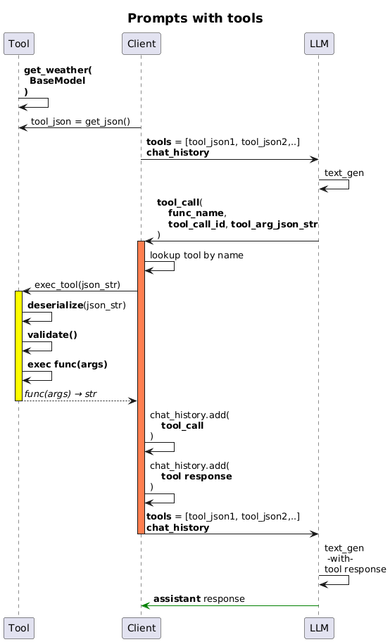

# LLM Tool-calling - 3 - Developing LLM tools

This is the third article in my short series about developing LLM tool-calling in Python. The previous one is at [LINK - Previous medium article](..). 

> The jump from basic prompting _(why is the sky blue)_ directly to tools may be too large. I will attempt to create a bridge article about my notes on LLM prompting. That will provide better motivation for tools, and then agents.

The first two articles were mostly about getting the process and the infrastructure ready. This is where we get to the heart of the matter: Tools in LLM prompting and why they matter!

## Series roadmap


It was a huge deal when LLM tool usage was introduced around 2023. There are many more recent papers and articles that summarize or survey the landscape, but these are some of the earliest papers. Note that these are 2 years old and while tremendous progress has been made since, they are foundational and still a relevant read.

  - [📃 2023 - Toolformer: Language Models Can Teach Themselves to Use Tools](https://arxiv.org/pdf/2302.04761)
  - [📃 2023 - ToolLLM: Facilitating LLMs to master 16000+ real world APIs](https://arxiv.org/pdf/2307.16789)

> The 2 years since introduction of very basic tool-calling has seen an explosion of development in the tool-calling space. If you were to start now, writing tools from scratch would be quite primitive compared to the much higher-level [OpenAI Agents SDK](https://openai.github.io/openai-agents-python/) and similar.
>
> Nevertheless, I think that the concepts are simple enough and worthwhile. Understanding of the lower-level mechanism gives you the confidence to drop-down into basics if and when higher level toolkits (`langchain` and its cousins, `LlamaIndex`, `OpenAI Agent SDK`, etc.) frustrate you.

## TL;DR

 - Build a rationale for why tools needed to be developed and how a language model might interact with them.
 - Build `Tool` and `ToolCollection` classes which convert Python functions into the form usable by the LLMs.
 - Build a `chat_loop` that resolves all tool_calls in a chat until the LLM can generate its final output.
 - Exercise two use cases: The `get_weather` example and an `increase temperature by 10` example.
 - Development notebooks: [Py_mod_llm_tools_devel.ipynb](https://github.com/vamsi-juvvi/py-llm/blob/3_llm_tools_and_support/nbs/Py_mod_llm_tools_devel.ipynb) and [Py_mod_llm_controller_tools_devel.ipynb](https://github.com/vamsi-juvvi/py-llm/blob/3_llm_tools_and_support/nbs/Py_mod_llm_controller_tools_devel.ipynb)
 - Colab runnable notebooks: [Colab - Py_mod_llm_tools_devel.ipynb](https://colab.research.google.com/github/vamsi-juvvi/py-llm/blob/3_llm_tools_and_support/nbs/Py_mod_llm_tools_devel.ipynb) and [Colab - Py_mod_llm_controller_tools_devel.ipynb](https://colab.research.google.com/github/vamsi-juvvi/py-llm/blob/3_llm_tools_and_support/nbs/Py_mod_llm_controller_tools_devel.ipynb)
 - Python module code at [py_llm/llm/tools.py](https://github.com/vamsi-juvvi/py-llm/blob/3_llm_tools_and_support/lib/py_llm/llm/tools.py) and [py_llm/llm/controller/tool_calling.py](https://github.com/vamsi-juvvi/py-llm/blob/3_llm_tools_and_support/lib/py_llm/llm/controller/tool_calling.py)

Read on for more details.

## Aren't prompts enough? Why do I need tools?

In trying to solution around LLMs, I wanted to build an overview of what the limitations were and what might mitigate them. If some critical area had risks with no known mitigation, I might have to abandon the use of LLMs! My analysis is listed in the following mindmap with the tool-use motivation in green. _(I will get to the coding specifics of these tools in the next section.)_

> The classification of the various limitations and the mind-map splits are all a reflection of my particular goals and the information I had digested. You should personalize it along the axes of your concerns.


At the end of this exercise, I concluded that LLM tools promised mitigation of all the major limitations I had identified. _Additionally, the map also identifies where `agentic networks`, aka, systems of connected LLM prompters, might expand the capabilities beyond a single LLM._

## How does a text generator LLM know about and use tools exactly!


A text generator can learn to use new concepts as long as it is in terms of the linguistic rules it already understands. While this is simple to state, it did take many years of research and fine-tuning to get to it. A tool call could be considered to be:
 - a verb
 - with the semantics of a function call
 - and when delegated to the API caller, can be satisfied in any way imaginable as long as it responds back to the LLM with some text.

## Alright, alright! Show me the tool already!

There you go ↓

```json
{
    "type": "function",
    "function": {
        "name": "get_weather",
        "description": "Get current temperature for a given location.",
        "strict": true,
        "parameters": {
            "properties": {
                "location": {
                    "description": "City and country e.g. San Jose, USA",
                    "title": "Location",
                    "type": "string"
                }
            },
            "required": [
                "location"
            ],
            "title": "GetWeather",
            "type": "object",
            "additionalProperties": false
        }
    }
}
```

Wait! What ⁉️

Right! This is the _Hello World_ of tool calling. This was all the rage in 2023 and 2024.
 - [OpenAI's version of get_weather](https://cookbook.openai.com/examples/o-series/o3o4-mini_prompting_guide)
 - [Anthropic's version of get_weather](https://docs.anthropic.com/en/docs/agents-and-tools/tool-use/overview)

What you see above is the **JSON declaration of a tool** which looks like a function.
 - The `JSON` representation is neutral: it doesn't specify or care about the implementation language.
 - The `LLM` treats this like a tool named **get_weather** which takes a **string parameter called location**. 👉 The return value is not specified, however, being a Language model, the _return is expected to be text_.
 - The `Client` exercises this tool when the LLM asks for it _(you'll see how in a bit)_. If your client language is Python, a declaration of this tool might look like `def get_weather(location: str) -> str`.

The above tool specification is more properly a `JSON schema` of a function that contains the `function name`, `parameter list` and `type of each of the parameters`. In addition, any `documentation` of the function and its parameters is also included. The LLM being text oriented makes use of **all the text**: names and documentation to decide when to use which tool!

The second part of the tool calling process is the new protocol that was introduced: listed here in terms of the _roles_ involved: `user`, `tool_call`, `tool` and `assistant`.


With this conceptual structure in place, we get to actually writing code to extend our prompting into tool-calling.

# Developing the code - Tool portion

There are two distinct aspects to tool support development.
 - Start with Python functions and be able to generate OpenAI compatible schemas for them. This is carried out in the [Py_mod_llm_tools_devel.ipynb]() notebook. This notebook was long and the code evolved significantly. I wanted to keep all versions so decided to break it down into three sections: **Bottom-to-top**, these are
   - **Scratch Pad** The experiments with introspection, JSON serialization/deserialization, bugs and fixes along the way, etc. Each setup that works made it into the upper _Final API_ section
   - **Evolution** Each major change to _Final API_ would add the previous to _Evolution_. This is meant to track major design changes along the way in case I want to backtrack.
   - **Final API** This is where the final code meant for the Python module would go
     - **Tests** where the various test-cases were to be run, based on the code in _Final API_. Every change to the _Final API_ or an in-repo dependency, I re-run all the test cells. 


 - Implement the conversation with OpenAI in terms of `tool_calls` and `tools` which is carried out in the []() notebook.

See the [Py_mod_llm_tools_devel.ipynb](https://github.com/vamsi-juvvi/py-llm/blob/3_llm_tools_and_support/nbs/Py_mod_llm_tools_devel.ipynb) for development. I will only go into details for some notable bits of code and decisions.

**Tip**: To follow the evolution of the code, collapse the _Final API_ section at the top of [Py_mod_llm_tools_devel.ipynb](https://github.com/vamsi-juvvi/py-llm/blob/3_llm_tools_and_support/nbs/Py_mod_llm_tools_devel.ipynb) and read through the _Evolution & Experimentation_ section. 

The evolution of the code is along these lines:


The code is all at [Py_mod_llm_tools_devel.ipynb](https://github.com/vamsi-juvvi/py-llm/blob/3_llm_tools_and_support/nbs/Py_mod_llm_tools_devel.ipynb)

The code we'll develop will have to work with the protocols that OpenAI has created _(and luckily all other vendors are staying compatible)_. The protocol is translated to the following sequence diagram.



 - Pydantic was an easy choice:
   - declarative model creation
   - JSON serialization/deserialization/validation
   - attach docstrings to fields

## The Tool class

### Init
```python
class Tool:    
    # tool_fn: fn(PyDanticObject) -> str
    def __init__(self, tool_fn):
        
        logging.debug(f"Tool : {tool_fn.__name__}, Initialization")
        _items = Tool.build_tool_call_items(tool_fn)
        assert(len(_items) == 3)

        # Name of the tool taken from function name.
        self.name                  = tool_fn.__name__

        # Tool Schema suitable for OpenAI tool calls. 
        # `tools=[schema1, schema2,..]``
        self.tool_schema           = _items[0]        
        logging.debug(f"Tool : {tool_fn.__name__}, Schema=\n{self.tool_schema}\n")

        # Lambda to deserialize from string
        self.tool_arg_deserializer = _items[1] 

        # lambda to call function with deserialized arg (if any) 
        # or empty arg-list
        self.tool_func             = _items[2]        
```

This class wraps a function-as-tool and generates the following members.
 - `name`: from the function's name. _Could potentially enhance to supply an override. Since the name is used by the LLM to figure out semantic applicability, we could see a case where the same function could need to be supplied to the LLM with different names in each scenario_.
 - `tool_schema`: the final OpenAI compatible schema. The `Tool.build_tool_call_items` creates this and will be described in a subsequent section.
 - `tool_arg_deserializer`: a Python lambda that eventually calls the underlying BaseModel's methods to deserialize the serialized JSON supplied by the LLM's tool_call. The `Tool.build_tool_call_items` creates this and will be described in a subsequent section.
 - `tool_func`: A Python lambda that executes the supplied `tool_fn` init parameter with the deserialized JSON. The `Tool.build_tool_call_items` creates this and will be described in a subsequent section.

### build_tool_call_items 

```python
class Tool:        
    def __init__(self, tool_fn):        
        ...      

    @staticmethod
    def build_tool_call_items(f:F):
        """
        f: A function of the form 'func(arg:BaseModel)` | `func()`
        Max of 1 argument and it should be a class deriving from PyDantic BaseModel  

        Returns a tuple: (tool_schema, arg_schema, arg_deserializer, func_call)
            tool_schema      - JSON representing the function/tool schema required by OpenAI etc
            arg_schema       - JSON representing the arg portion of the schema required by OpenAI etc
                               Meant for use inside prompts (ReAct prompts)
            arg_deserializer - f(str) -> PyDanticObj. Lambda to deserialize from string to the 
                               arg type used by the function
            func_call        - f(obj) -> str. Lambda to invoke the function with the deserialized json

        Eg.

        @dataclass
        class GetWeather(BaseModel):        
            location : str = Field(description="City and country e.g. San Jose, USA")

        def get_weather(args: GetWeather) -> float:
            '''
            Get current temperature for a given location.
            '''
            return 10    

        And use this thus:
        
            (tool_schema, arg_schema, arg_deserializer, fn_call) = build_tool_call_items(get_weather)
        """    
        if not inspect.isfunction(f):
            raise TypeError(f"{str(f)} should be a python function")

        sig = inspect.signature(f)
        num_params = len(sig.parameters)

        if num_params == 0:
            # 0 args case            
            return Tool._build_tool_call_items_0_args(f)

        else:            
            params = list(sig.parameters.items())
            p_ann   = params[0][1].annotation            
            p_class = p_ann.__class__

            # Special: 1 arg case with BaseModel argument. We directly use it's serialization
            # Special power to add docs per-field etc.
            if num_params == 1 and "pydantic._internal._model_construction.ModelMetaclass" in str(p_class):
                return Tool._build_tool_call_items_1_arg_pydantic(f) 
            else:
                # Dynamically create the BaseModel 
                # and build the rest from that                
                return Tool._build_tool_call_items_n_arg_dynamic(f)
    
      ....
```

  - considers three cases and each of them are delegated. Ultimately they create a `BaseModel` and use its built-in methods to deserialize the incoming stringified-JSON arguments from the LLM.
  - `f()` - calls `Tool._build_tool_call_items_0_args`
  - `f(BaseModel)` - function with a single-parameter that is derived from a PyDantic `BaseModel` object. This is delegated to `Tool._build_tool_call_items_1_arg_pydantic`
  - `f(a,b,c,..)` - function that has 1 or more args of any type. This is delegated to `Tool._build_tool_call_items_n_arg_dynamic` which dynamically builds a `BaseModel` with all the params as fields.

### build_tool_call_items - json_schema generation

All the tool-building scenarios use the `_build_tool_schema_json` method. There are a few different cases being handled.

```python
class Tool:        
    ...
    
    def _build_tool_call_items_0_args(fn):        
        """
        Helper for build_tool_call_items
        """
        # See https://platform.openai.com/docs/guides/function-calling
        # Note: OpenAI does not like it if we send a parameters key with null
        #       so not using that key at all.        
        tool_schema = Tool._build_tool_schema_json(fn, None)        
        ...

    def _build_tool_call_items_1_arg_pydantic(fn):
        """
        Helper for build_tool_call_items when there is 1 arg 
        and it is a Pydantic BaseModel
        """
        sig = inspect.signature(fn)
        assert(len(sig.parameters) == 1)
        
        params = list(sig.parameters.items())
        p_ann   = params[0][1].annotation            
        p_class = p_ann.__class__
        assert("pydantic._internal._model_construction.ModelMetaclass" in str(p_class))

        # exec the class method to generate the json schema
        arg_schema = getattr(p_ann, 'model_json_schema').__call__()
        arg_schema = jsonref.replace_refs(arg_schema)

        # 👉 OpenAI enforces that "additionalProperties" : False is set!
        arg_schema["additionalProperties"] = False
        tool_schema = Tool._build_tool_schema_json(fn, arg_schema)        
        ....
    
    def _build_tool_call_items_n_arg_dynamic(fn):
        ...
        # Schema ----------
        arg_schema = dyn_model.model_json_schema()
        arg_schema = jsonref.replace_refs(arg_schema)                
        arg_schema["additionalProperties"] = False   # 👉 OpenAI needs this.

        tool_schema = Tool._build_tool_schema_json(fn, arg_schema)
        ....

    def _build_tool_schema_json(fn, arg_schema):
        .....
```

👆 **Build schema for the parameters**
 - `0 params` case: nothing is done
 - `single BaseModel` case: model's `model_json_schema` method is used to generate it and this is piped through `jsonref.replace_refs` to resolve all internal schema references. OpenAI doesn't specify this but the calls fail for any schema that contains references.
 - `non BaseModel or multiple args`: A dynamic `BaseModel` is created from introspection of the params and then it is treated the same as the `single BaseModel` case above.

----
```python
class Tool:        
    ...
    
    def _build_tool_schema_json(fn, arg_schema):
        # See https://platform.openai.com/docs/guides/function-calling
        tool_schema = {
            "type"       : "function",
            "function"   : {
                "name"       : fn.__name__,
                "description": fn.__doc__.strip() if fn.__doc__ else f"function {fn.__name__}",                
                "strict"     : True
            }
        }            

        if arg_schema:
            tool_schema["function"]["parameters"] = arg_schema
        else:
            # empty args is not accepted. Seems to vary by mood of OpenAI
            # this works
            # 👉 OpenAI enforces that "additionalProperties" : False is set!
            tool_schema["function"]["parameters"] = {
                "type" : "object",
                "properties" : {},
                "required"   : [],
                "additionalProperties" : False
            }

        return tool_schema      
```

👆 **Build schema for the function**
 - The function schema is a pretty simple wrapper once we have a schema for the parameters.
 - `_build_tool_schema_json` takes the schema for the parameters and builds it from the name of the function, etc.  


### build_tool_call_items - deserializer lambda via PyDantic

```python
class Tool:        
    def __init__(self, tool_fn):        
        ...
    
    def exec(self, json_arg: str) -> str:
        if self.tool_arg_deserializer:
            try:
                logging.debug(f"Attempting to deserialize {json_arg} for tool: {self.name}")

                arg_obj = self.tool_arg_deserializer(json_arg)
                logging.debug(f"✔️ deserialized to {arg_obj}. Calling function")
                ....

            except ValidationError as e:
                logging.error(f"JSON string {json_arg} is not valid for {self.name}:{e}")
        ....    
    
    def _build_tool_call_items_0_args(fn):
        ...
        func_arg_deserializer = None
        ...
    
    def _build_tool_call_items_1_arg_pydantic(fn):
        """
        Helper for build_tool_call_items when there is 1 arg 
        and it is a Pydantic BaseModel
        """
        sig = inspect.signature(fn)
        assert(len(sig.parameters) == 1)
        
        params = list(sig.parameters.items())
        p_ann   = params[0][1].annotation            

        ....

        # generate lambda to deserialize from stringified json
        # use pydantic's model_validate_json method
        des_callable = getattr(p_ann, 'model_validate_json')
        func_arg_deserializer = lambda json_str: des_callable.__call__(json_str)
        ...
    
    def _build_tool_call_items_n_arg_dynamic(fn):
        ....
        dyn_model = eval(cmd)
        ....
        func_arg_deserializer = lambda jstr: dyn_model.model_validate_json(jstr)
        ....    
```

The above code slice shows the `self.tool_arg_deserializer` in use
 - `exec` uses it to deserialize the `stringified-JSON` from the LLM tool_call into a model object.
 - `_build_tool_call_items_0_args`: no args so the deserializer is `None`.
 - `_build_tool_call_items_1_arg_pydantic` and `_build_tool_call_items_n_arg_dynamic`: the Pydantic model's `model_validate_json` is used. This method deserializes the incoming string and on error raises a `ValidationError`.

### build_tool_call_items - function executor lambda 

```python
class Tool:        
    def __init__(self, tool_fn):                        
        ...
        _items = Tool.build_tool_call_items(tool_fn)      
        ...
→       self.tool_func             = _items[2]        
    
    def exec(self, json_arg: str) -> str:
        if self.tool_arg_deserializer:
            try:
                logging.debug(f"Attempting to deserialize {json_arg} for tool: {self.name}")

                arg_obj = self.tool_arg_deserializer(json_arg)
                logging.debug(f"✔️ deserialized to {arg_obj}. Calling function")

→               func_result = self.tool_func(arg_obj)
                logging.debug(f"✔️ function returned {func_result}")

                return func_result

            except ValidationError as e:
                logging.error(f"JSON string {json_arg} is not valid for {self.name}:{e}")
        else:            
            logging.debug(f"Calling no-arg function: {self.name}")            
            assert(json_arg == '{}' or json_arg == "" or json_arg is None)
            
            func_result = self.tool_func()
            logging.debug(f"✔️ function returned {func_result}")
            return func_result    

    def _build_tool_call_items_0_args(fn):
        ...
→       func_call             = lambda : fn()        
        ...        
    
    def _build_tool_call_items_1_arg_pydantic(fn):
        ...
→       func_call = lambda deserialized: fn(deserialized)   
        ...
    
    def _build_tool_call_items_n_arg_dynamic(fn):
        """
        Helper for build_tool_call_items when there are more than one
        args of any type. 

        a Pydantic BaseModel is built dynamically from the signature
        """
        sig = inspect.signature(fn)        
        ...
→       call_args_vec  = []
        for p in sig.parameters.values():    
            ...
            # build arg to call fn using model fields
            # Assumes deserialized model-object will be called `des_obj`
            # (deserialized object)
→           call_arg = f"{p.name} = des_obj.{p.name}"
→           call_args_vec.append(call_arg)            
        
        ...      
        # caller ---------
        # This is a bit complex. What I want for `func_call` is 
        # lambda deserialized_object : fn(deserialized_object)
        # However, when this is built using eval, it does not close over fn!
        # only globals. So we need a second level of indirection with a function 
        # that does close over fn
→       call_eval_str = f"lambda des_obj, fn: fn({", ".join(call_args_vec)})" 
→       call_fn_2 = eval(call_eval_str)                   # does not close over fn, so sending fn as arg
→       func_call= lambda des_obj: call_fn_2(des_obj, fn) # this closes over fn and can call call_fn_2
        ...
```

 - `init`: The Python function supplied is used as param to internal methods.
 - `_build_tool_call_items_0_args`: This is simple, simply use a `lambda : fn()` to wrap the supplied function in a lambda that takes no args.
 - `_build_tool_call_items_1_arg_pydantic`: This is also straightforward. The `deserializer` is built from the BaseModel param and will generate a `BaseModel` instance. `lambda deserialized: fn(deserialized)` will work.
 - `_build_tool_call_items_n_arg_dynamic`: This is the most complex implementation
   - Since all the params are packed into a dynamically created BaseObject, we need to unroll them during execution. 
     - The `call_args_vec` builds the string rep of each of these params as named params via the `{p.name} = des_obj.{p.name}` where _des_obj_ is the name we expect for the deserialized BaseModel instance.
     - `p` is in scope in this loop.
     - `call_eval_str` is the joined form of this array and meant to be `eval`'d. 
     - `call_fn_2` holds the `eval`'d version of this which will be lambda. `eval` has this limitation that it can only close over globals. Since it does not close over `fn`, `call_fn_2` fails at runtime.
     - To get over this limitation, a second lambda is created which does close over everything it uses and we have it close over both `call_fn_2` and `fn`. If there is a better way of doing this, I would appreciate it if you'd leave a comment.
    


### build_tool_call_items - 0 arg special case

The code described above has some special handling for the `0 parameters` case. Such special handling is described in the comments and built-up based on errors seen during use.

### The Tool collection class

This class would simplify the LLM control loop as well as allow us to later build ways to:
 - Filter only some tools for a given prompting scenario
 - Rename some tools on the fly. Same implementation but context specific semantics indicated by a new name.

```python
class ToolCollection:
    def __init__(self, tools= None):
        """
        tools is a list of Tool or callable
        """
        # {name : Tool}
        self.tool_dict = {}

        if tools:
            for t in tools:
                self.register_tool(t)

    def register_tool(self, tool):
        """
         Register's a tool by name for later use
         tool : Tool | python function.
        """
        if inspect.isfunction(tool):            
            tool = Tool(tool)

        if tool.name in self.tool_dict:
            logging.warn(f"Tool {tool.name} has already been registered. Overwriting!")
        
        assert(tool.tool_func)
        assert(tool.tool_schema)
        self.tool_dict[tool.name] = tool
        
    def exec_tool(self, name: str, args: str) -> str :
        if not name in self.tool_dict:
            raise KeyError(f"Tool: {name} is not registered! Cannot call!")
        else:            
            tool = self.tool_dict[name]
            logging.debug(f"Executing tool: {tool.name}")
            return tool.exec(args)
        
    def get_tool_names(self):
        return [key for key in self.tool_dict.keys()]
    
    def get_schemas(self, mapper=None) :
        mapper = mapper if mapper else lambda x: x
        return [mapper(tool.tool_schema) for tool in self.tool_dict.values()]        
```


### Testing the code

The following Python cell is a test fixture of sorts. It exercises tools given a bunch of parameters and generates a markdown report out of it.

#### Tool test suite

```python
#----------------------------------------------------------------------------
# Test schema generation static methods in Tool
def exercise_tool_methods(test_nm, test_fn, json_str, expect_eval):

    items = Tool.build_tool_call_items(test_fn)
    assert(len(items) == 3)
    (tool_schema, arg_deserializer, fn_caller) = items

    DM.md(f"""
## Testing Tool methods directly - {test_nm}
    
### tool schema output - {test_nm}

{DM.json_fmt(tool_schema)}

### Deserialized from string - {test_nm}

Deserializing {json_str}
↪

{DM.code_fmt(arg_deserializer(json_str)) if arg_deserializer else "⚠️ deserializer is NONE"}

### Function called with deserialized - {test_nm}

 - 👉 Expecting **{expect_eval}**
 - 👉 Got **{str(fn_caller(arg_deserializer(json_str))) if arg_deserializer else str(fn_caller())}** 
""")

#----------------------------------------------------------------------------
# Test deserialization and calling via Tool
def exercise_tool_api(test_nm, test_fn, json_str, expect_eval):

        tool = Tool(test_fn)
        DM.md(f"""
----     
## Testing Tool API - {test_nm}
               
### Tool: tool schema output - {test_nm}

{DM.json_fmt(tool.tool_schema)}

### Tool: Function called with deserialized - {test_nm}

 - Deserializing {json_str}
 - Expecting **{expect_eval}**
 - Got ↓
 
{str(tool.exec(json_str))}
""")
```

#### ToolCollection test suite

```python
# Test schema_generation and calling via ToolCollection
def exercise_toolcollection_api(test_nm, test_fn, json_str, expect_eval):

     # Register in the tool dictionary
     # Note that one could evolve this further to make the tool_dict the single 
     # source and use it to the tool descriptions as well.
     gw_tools = ToolCollection()
     gw_tools.register_tool(            
         tool=Tool(test_fn)
     )                        

     DM.md(f"""
----     
## Testing ToolCollection API - {test_nm}
           
### ToolCollection: exec with serialized string - {test_nm}

 - Deserializing {json_str} for {test_fn.__name__}
 - **Expecting** {expect_eval}
 - **Got** ↓

{gw_tools.exec_tool(test_fn.__name__, json_str)}
""")                              
```

#### Test driver
     
```python
#----------------------------------------------------------------------------
# Driver to run all the tests
def exercise_all(test_nm, test_fn, json_str, expect_eval):
     exercise_tool_methods(test_nm, test_fn, json_str, expect_eval)
     exercise_tool_api(test_nm, test_fn, json_str, expect_eval)
     exercise_toolcollection_api(test_nm, test_fn, json_str, expect_eval)    
```


### Test case - Single PyDantic arg

```python
# Exercise 
# fn(arg) where arg is a Pydantic model
from pydantic import BaseModel, Field
from dataclasses import dataclass

@dataclass
class GetWeather(BaseModel):        
    location : str = Field(description="City and country e.g. San Jose, USA")

def get_weather(args: GetWeather) -> float:
    """
    Get current temperature for a given location.
    """
    return "10"    

SERIALIZED_DATA_SAMPLE = "{\"location\":\"Paris, France\"}"
EXPECTED = "10"

exercise_all(test_nm="fn(pydantic)",              
             test_fn=get_weather, 
             json_str = SERIALIZED_DATA_SAMPLE, 
             expect_eval=EXPECTED)
```

### Test case - No args

```python
# Exercise 0 arg functions
# Also has no doc_string
def get_cookie():    
    return "all out!"

SERIALIZED_DATA_SAMPLE = ""
EXPECTED = "all out!"

exercise_all(test_nm="fn()", 
             test_fn=get_cookie, 
             json_str = SERIALIZED_DATA_SAMPLE, 
             expect_eval=EXPECTED)
```

### Test case - Multi args non pydantic

```python
def double_me(a:int):
    """
    Doubles the value of the supplied number
    """
    return str(2*a)

SERIALIZED_DATA_SAMPLE = "{\"a\" : 2}"
EXPECTED = "4"

exercise_all(test_nm="fn(a:int)", 
             test_fn=double_me, 
             json_str = SERIALIZED_DATA_SAMPLE, 
             expect_eval=EXPECTED)
```

## Developing the code - LLM plus tool control loop portion

This portion of the code is developed in a different notebook: [Py_mod_llm_controller_tools_devel](https://github.com/vamsi-juvvi/py-llm/blob/3_llm_tools_and_support/nbs/Py_mod_llm_controller_tools_devel.ipynb). It pretty much implements the `LLM + Tools` control logic. With `Tool` and `ToolCollection` in place, this is fairly straightforward.


> This exact same code makes it into the `py_llm.llm.controller.tool_calling.py` module. We just take the `DH` class usage for displaying HTML in the Jupyter notebook.

```python
def run_chat_loop(prompt:str, tools : ToolCollection):
    """
    Runs a chat loop with an initial prompt and supplied tools
    Resolves all tool_calls made until a final assistant response is provided
    """
    # Initialize
    chat_history = [
        {
            "role" : "system",
            "content" : "You are a helpful assistant that uses the supplied tools to respond to the user's questions."
        }]

    tool_schemas = tools.get_schemas()

    # Run the loop
    msgs = [{
        "role":"user", 
        "content": prompt}]

    DH.color_box(prompt, title="Prompt", bg="yellow")
    
    while len(msgs):
        chat_history.extend(msgs)
        msgs = []

        response = oai.get_response(
            chat_history=chat_history,
            tools = tool_schemas)

        # tool-call
        # Note: The OpenAI example is outdated
        # tool_calls is no longer a JSON object but an array of 
        # `ChatCompletionMessageToolCall` objects
        if response.choices[0].message.tool_calls:

            # The tool-call set needs to be added back to the chat_history
            msgs.append(response.choices[0].message)

            # Process all the tool calls
            for tool_call in response.choices[0].message.tool_calls:
                logging.debug(f"Executing tool_call: {tool_call}")            

                DH.color_box(f"{tool_call.function.name}({tool_call.function.arguments})", 
                             title="LLM Tool Call",
                             bg="lightgreen",
                             align = TextAlign.RIGHT)

                tool_result = tools.exec_tool(
                    tool_call.function.name,
                    tool_call.function.arguments)

                assert(isinstance(tool_result, str))

                # along with its response. The response will be linked to the tool_call's 
                # via the ID        
                msgs.append({
                    "role" : "tool",
                    "tool_call_id" : tool_call.id,
                    "content"      : tool_result
                })
        else:
            # Assistant response
            chat_response = response.choices[0].message.content
            DH.color_box(chat_response, title="Final LLM Response", align=TextAlign.LEFT)
```            

### tool_call_loop - get_weather

We are simply repeating the basic `get_weather` example with our infrastructure.

```python
from pydantic import BaseModel, Field
from dataclasses import dataclass

@dataclass
class GetWeather(BaseModel):        
    location : str = Field(description="City and country e.g. San Jose, USA")

def get_weather(args: GetWeather) -> float:
    """
    Get current temperature for a given location.
    """
    retval = "10"
    logging.debug(f"get_weather called with {args}. Returning hardcoded value {retval}")
    return retval

# Register in the tool dictionary
# Note that one could evolve this further to make the tool_dict the single 
# source and use it to the tool descriptions as well.
gw_tools = ToolCollection()
gw_tools.register_tool(Tool(get_weather))

run_chat_loop(
    prompt="What is the weather in San Jose, USA?",
    tools = gw_tools
)
```
↪


Works great! Note the debug logs 
 - incoming serialized JSON
 - deserialization
 - actual function call
 - final `assistant` response that incorporates our tool call response.

### tool_call_loop - increase temperature

This is a more complex scenario. We provide two functions `get_temperature` and `set_temperature`. We then proceed to ask an `IoT` use-case of `increase temperature` and expect the LLM to:

 - Know that there is no direct `increase_temperature` tool
 - However, it can do a `set_temperature( increase + get_temperature())`: advanced chaining of two methods. In 2023, `o3-mini` did this very well while Groq's `llama-tool-preview` failed.

```python
@dataclass
class SetTemperature(BaseModel):        
    temp : float = Field(description="The temperature value in Fahrenheit to set the thermostat to")

def set_thermostat_temperature(args: SetTemperature) -> str:
    """
    Sets the current temperature for a given location."
    """
    logging.debug(f"set_thermostat_temperature called with {args}")
    return ""

def get_thermostat_temperature() -> str:
    """
    Returns the current temperature setting of the thermostat."
    """
    retval = "60"
    logging.debug(f"get_thermostat_temperature called. Returning hardcoded {retval}")
    return retval

# Register in the tool dictionary
iot_tools = ToolCollection()
iot_tools.register_tool(Tool(set_thermostat_temperature))
iot_tools.register_tool(Tool(get_thermostat_temperature))

run_chat_loop(
    prompt="Increase the temperature by 10 degrees",
    tools = iot_tools
)
``` 
↪


So
 - We asked to increase temp by 10
 - It called `get_temp` and got `60`
 - It subsequently called `set_temp(70)`
 - and finally reported that it set the temp to 70.
 - Fantastic!