# Developing LLM Tool-calling - 1 - Structure and Utilities

This is the second of my short series about developing LLM tool-calling in python, the next one in the series is at [NEXT ONE HERE](..).

When I started exploring the LLMs, it became very clear, very soon, that tool/function-calling was a fundamental enabler. The following two maps illustrate the differences as I understand them.

```plantuml
@startmindmap
title LLMs all by their Lonesome
* = LLM APIs
** == Prompting
*** Simple
*** Intermediate
****_ COT
****_ TOT
****_ Etc
*** Advanced
**** multi persona
**** Auto optimizing
**[#lightyellow] == Limits
*** Complexity of prompt
*** Token cost of multi-shot examples
*** Costs in💲and latency
*** Limited by innovation from vendors

@endmindmap
```




 - I will take you from basics all the way to `ReAct`
 - I will point you the value of indirection in how you write your tools
 - All this using simple to use Jupyter and python dev practices that will keep your code structured and reusable.

## Tl;DR

 - 

## Aren't prompts enough ? why do I need tools ?

LLMs are very powerful in generating text and each successive release is erasing previous limitations and significantly increasing their capabilities. When I things of solutioning using LLMs, the following scenarios crop up.

```plantuml
@startmindmap

@endmindmap
```

When I started working with public LLM APIs, it became clear, very soon, that tool/function-calling was a fundamental enabler. Exploring tools and how they are used in LLM prompts gives us a vocabulary: we can then talk in terms of `problem_solution = LLM + tool1 + tool2`. While the details will be written about in the next few posts in the series, I'm providing a brief overview of what this is all about: give you a reason to continue reading.


The following mind-map _(also an informal sequence doagram)_ shows how tool-calls are incorporated into an LLM's `prompt → response` chain.

```plantuml
@startmindmap
title = LLM + Tools = Off you go!

* = Tools
**:Add //verbs// to the LLM prompt context

//LLM has to be tool enabled though//
//Mid 2025, all the mainstream ones are//
//tool-call enabled//;

** LLM → 🤔 need output of //verb(params)//
** LLM ↪ prompter: call //verb(parameters)// for me 
** Prompter → Sure.. //def verb(parameters)//
***[#lightgreen]:This is where the **power** is!
Any relevant data can be 
fetched/generated. Interpret the 
//verb(params)// however you like;
****_ It only looks like //function(params)//
****_ call a person ?
****_ execute function call ?
****_ search Internal docs ?
****_ DB Query ?
****_ Third party API ?
****_: //RAG// ish: respond 
 with relevant docs ?;

** Prompter ↩ Here you go 📃
**: LLM 
   → ⬜⬜⬛ incorporating tool output     
   → ⬜⬛⬛ more tool calls if needed
   → ⬛⬛⬛ generate final response

↩ Here you go 📃;

@endmindmap
```



Tools allos us to expand an LLM's capabilities along the directions of our particular business needs. it is super flexible.
