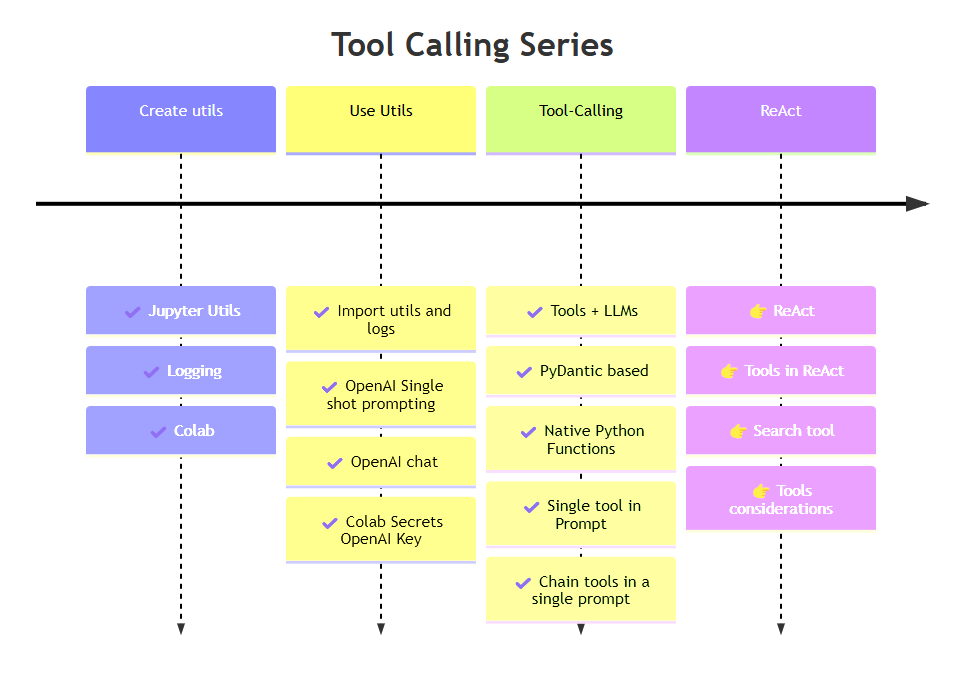
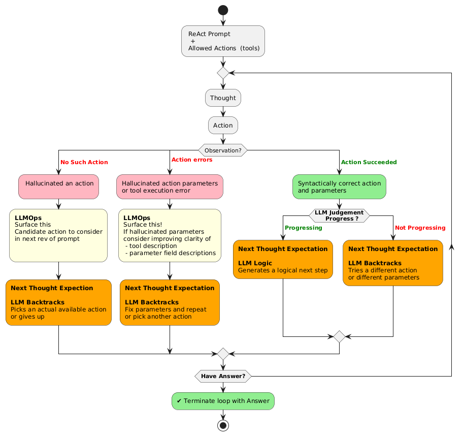
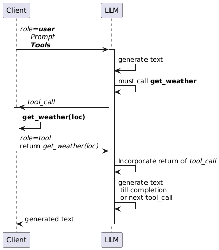
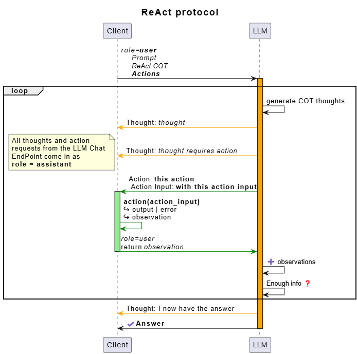
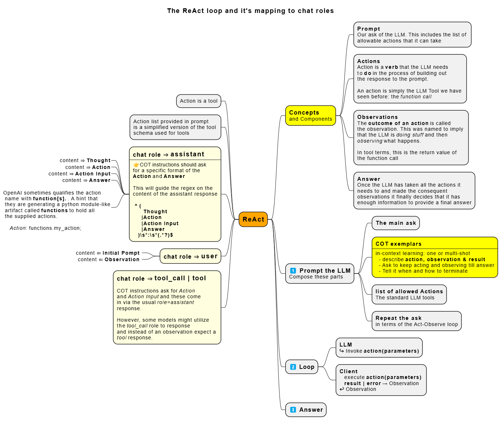
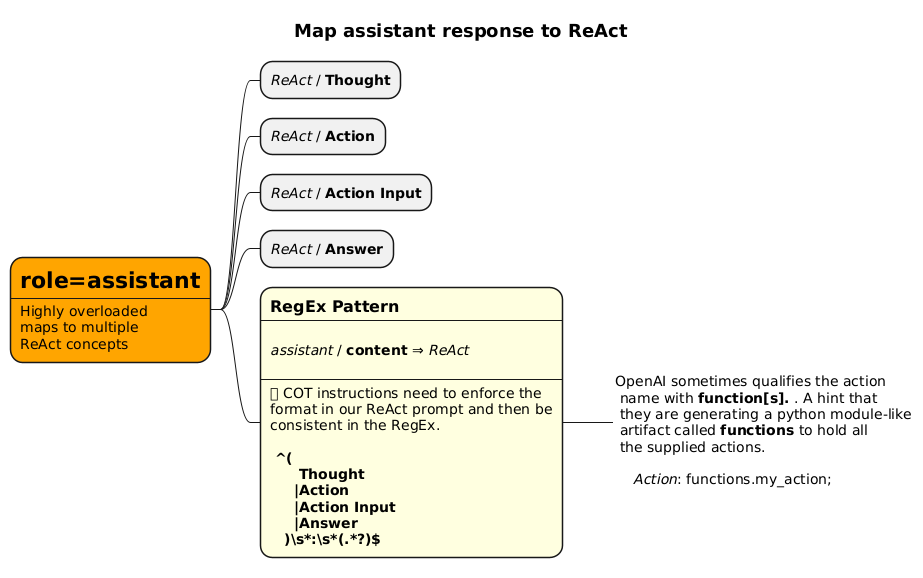
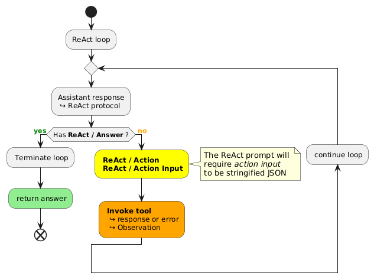
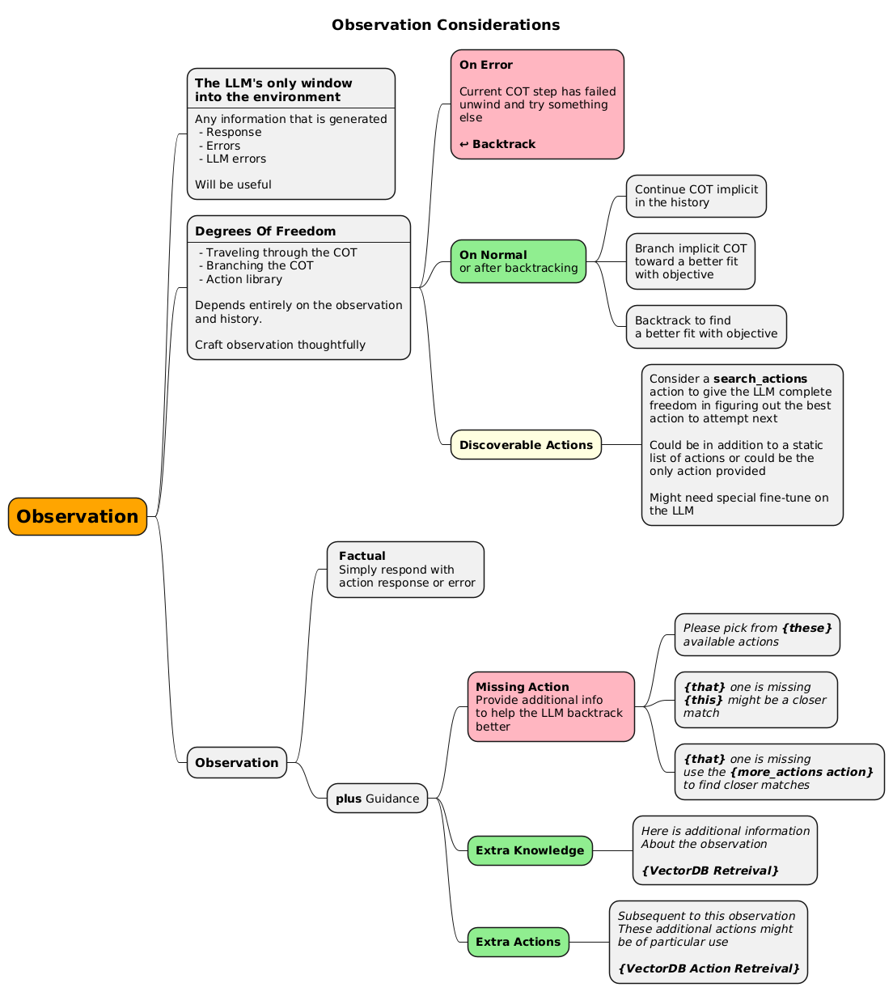
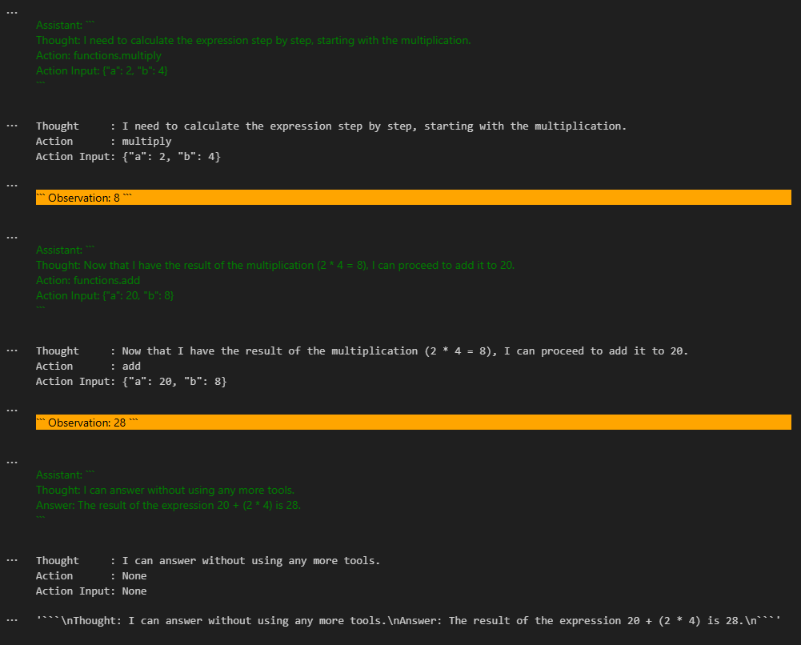

# LLM Tool-calling - 4 - Developing the ReAct loop

This is the fourth article in my series about developing tool-calling in Python. We have developed basic tool-calling in [LINK - Previous medium article](..). This articles builds on tool-calling and implements a higher-level abstraction layered on top.

## Series roadmap



## TL;DR

 - The ReAct prompting protocol that employs COT to generate a (`thought` → `action` → `observation` ↩ ) loop on the path to generating an answer.
 - Enhance `Tool` and `ToolCollection` classes to generate suitably condensed versions of a tool-spec that can be included inside a prompt.
 - Build a `react_chat_loop` that maps the chat protocol (`user`, `assistant`, `tool_call`, `tool` into the (`thought` → `action` → `observation` ↩→ `answer` ) protocol
 - Exercise a multi-step arithmetic example.
 - Development notebooks: [Py_mod_llm_agentic_react_devel.ipynb](https://github.com/vamsi-juvvi/py-llm/blob/4_tools_react/nbs/Py_mod_llm_agentic_react_devel.ipynb) and [Py_mod_llm_agentic_toolcalling_devel.ipynb](https://github.com/vamsi-juvvi/py-llm/blob/4_tools_react/nbs/Py_mod_llm_agentic_toolcalling_devel.ipynb)
 - Colab runnable notebooks: [Colab - Py_mod_llm_agentic_react_devel.ipynb](https://colab.research.google.com/github/vamsi-juvvi/py-llm/blob/4_tools_react/nbs/Py_mod_llm_agentic_react_devel.ipynb) and [Colab - Py_mod_llm_agentic_toolcalling_devel.ipynb](https://colab.research.google.com/github/vamsi-juvvi/py-llm/blob/4_tools_react/nbs/Py_mod_llm_agentic_toolcalling_devel.ipynb)
 - Python module code at [py_llm/llm/tools.py](https://github.com/vamsi-juvvi/py-llm/blob/4_tools_react/lib/py_llm/llm/tools.py) and [py_llm/llm/agentic/react/](https://github.com/vamsi-juvvi/py-llm/blob/4_tools_react/lib/py_llm/llm/agentic/react/)


Read on for more details.

## COT : From recall to thinking

 **Papers**
 - [📃 arXiv - Chain-of-Thought prompting elicits reasoning in large language models - Jason Wei et. al.](https://arxiv.org/pdf/2201.11903)   
 - [📃 arXiv - Self Harmonized Chain of Thought - Ziqi Jin, Wei Lu](https://arxiv.org/pdf/2409.04057)

**Prompting COT**
 - [Learnprompting.org - COT](https://learnprompting.org/docs/intermediate/chain_of_thought) 

 `COT` pioneered the approach of prompting an LLM to `think` in intermediate steps rather them simply recall _(or hallucinate)_ a response. The `think` ability is wishful, anything that seems to involve more than one step seems to be considered thinking. 
 
Instead of prompting an LLM with a specific objective, we also require it (_via in-context learning_) to reach that objective via a sequence of steps (_or thoughts_): this is the so-called chain-of-thought. Once we craft a custom chain-of-thought _(prompt engineer earning his/her pay)_ we can reliably expect a quality LLM to mimic it. It will break down our prompt objective _(aka the ask)_ in a similar fashion and then generate it's own chains of thought to solve the problem.

Later, folks discovered [zero-shot COT](https://learnprompting.org/docs/intermediate/zero_shot_cot) where you don't even have to craft a custom `COT`. One simply tells the LLM to **think step by step**. If you are particularly savvy and so-inclined, you might add an ominous **or something bad will happen** _(LLMs are now learning to blackmail their users, wonder where they learnt that: bad parenting, thats where! Your LLM will soon need therapy to remove the learned response to emotional blackmail.)_

## ReAct as feedback driven dynamic COT

**Resources**
 - The [ReAct: Synergizing Reasoning and Acting in Language Models](https://arxiv.org/pdf/2210.03629) paper builds on the `tool` support in LLMs.
 - [react-lm.github.io](https://react-lm.github.io/) companion github to the paper.

`COT` as originally envisioned, is static: the user crafts a specific chain of thought for a specific prompt, `ReAct` improves on static `COT` by making it dynamic. It is the earliest _observational thinking_ technique where the LLM is asked to generate it's next thought dynamically based on environmental feedback. The foundational concepts it builds on: `tool calling` and `COT`. 

In-context examplars (_`COT` of the reAct logic_) are used to make the LLM follow the higher-level `ReAct` protocol of (`thought` → `action` → `observation` ↩→ `answer`). **The ReAct magic is in the `observation` → `next thought` step**. Each new observation gives the LLM _(via it's world and language understanding)_, a chance to change the trajectory of it's `COT`.

 ReAct, in short is a 
 - Generic COT instructions to follow a `thought`, `action`, `observation` loop where
   - `actions` are mapped to `tools`
   - `observations` are the result of making the tool call. One of:
     - `action` → result
     - `action` → error
   - The LLM evaluates this observation to generate it's next thought.
 


The success of your `ReAct` prompt will depend on:
 - Your chosen LLM's language and world understanding
 - Degrees of freedom afforded by the palette of `Actions` supplied
 - How well the LLM can backtrack
 - How well the ReAct prompt allows it to end with an error instead of hallucinating an answer

 > 👉 You'll notice that backtracking figures prominently! A strong hint to focus heavily on backtracking during finetune.

# Implementation Plan - ReAct overlayed on the LLM Chat protocol.

As seen in tool-calling, the typical LLM API _(chat)_ end-points implement a multi-turn protocol involving three personas/roles (`user`, `system`, `assistant`) and two specialized sub-roles for tool support (`tool_call`, `tool`). The `get_weather` tool calling sequence is listed below as a refresher.



ReAct is layered on top of this chat protocol. While the implementation could use existing tool calling protocols, the original paper overlaid it's higher level protocol on the traditional (`user`, `system`, `assistant`) roles and did not utilize actual tool support (`tool_call`, `tool`). **The implementation however** can freely implement `actions` as `tools`. 

A reading of the source code is a bit confusing since there are two protocols mixed in. The readability and maintainablity of your code will likely depend on how well you layer the protocols: you'll want to make it easy to reason about and maintain the higher level `ReAct` protocol bits.



# Implementation - Map ReAct protocol to Chat protocol.




Evolution of the code is documented in the development notebooks:   
 - [Py_mod_llm_agentic_react_devel.ipynb](https://github.com/vamsi-juvvi/py-llm/blob/4_tools_react/nbs/Py_mod_llm_agentic_react_devel.ipynb) 
 - [Py_mod_llm_agentic_toolcalling_devel.ipynb](https://github.com/vamsi-juvvi/py-llm/blob/4_tools_react/nbs/Py_mod_llm_agentic_toolcalling_devel.ipynb)

Only the final version of the code is described below.

## Code : Assistant response → ReAct protocol

```bash
 │   │   ├── react
 │   │   │   ├── __init__.py
 │   │   │   ├── react_agent_loop.py
 │   │   │   ├── react_assistant_response.py  👈
 │   │   │   ├── react_observation.py
 │   │   │   └── react_sys_prompt_builder.py
 │   │   └── tool_calling
 │   │       ├── __init__.py
 │   │       └── tool_calling_loop.py
```

> Crafting the ReAct prompt's COT comes first, however, I found this `chat` → `ReAct` mapping step the most confusing, hence describing it first.



----

```python
import re
import logging

class ReactAssistantResponse:
    PATTERN_TH        = re.compile(r"^(Thought|Action|Action Input|Answer)\s*:\s*(.*?)$", re.MULTILINE)
    PATTERN_FUNC_NAME = re.compile(r"^\s*(?:function[s]?\.)?(.*)$")

    def __init__(self, assistant_response:str):
        self.thought      = None
        self.action       = None
        self.action_input = None
        self.answer       = None

        #-- Parse -----------------        
        match_list = self.PATTERN_TH.findall(assistant_response)

        if match_list or len(match_list) > 0:
            d = {}
            for m in match_list:
                key = m[0]
                val = m[1]
                logging.debug(f"Extracted [{key} = {val}] pair")
                d[key] = val
            self._init_kvps(d)
        else:
            logging.debug("Could not extract any exected React semantic sections from assistant response\n{assistant_response}")
    
    def __str__(self):
        return f"""
Thought     : {self.thought}
Action      : {self.action}
Action Input: {self.action_input}""".strip()

    def _init_kvps(self, d):
        for k,v in d.items():
            match k.lower():
                case "thought":
                    self.thought = v.strip()
                case "action":
                    # These seem to sometimes comes in as `function.my_action`
                    fn_match = self.PATTERN_FUNC_NAME.match(v)
                    if fn_match:
                        self.action = fn_match.group(1)
                        logging.debug(f"Got Action = {self.action}")
                    else:
                        logging.error(f"Unable to get function name from Action=\"{v}\"")
                case "action input":
                    self.action_input = v
                    logging.debug(f"Got Action Input = {v}")
                case "answer":
                    self.answer = v
                    logging.debug(f"Got Answer = {v}")
                case _:
                    logging.warning(f"Unknown Key={k} with Value={v}")
```

Very closely maps to the mindmap above. Other than accounting for how `OpenAI` sometimes marks actions as `function.<ActionName>`, there is nothing special to note in this code.

## Code : Assistant response - Action → Observation

```bash
 │   │   ├── react
 │   │   │   ├── __init__.py
 │   │   │   ├── react_agent_loop.py
 │   │   │   ├── react_assistant_response.py 
 │   │   │   ├── react_observation.py          👈
 │   │   │   └── react_sys_prompt_builder.py
 │   │   └── tool_calling
 │   │       ├── __init__.py
 │   │       └── tool_calling_loop.py
```


This step maps very cleanly to our older understanding of tool calling
 - If assistant-response calls for an `action` _(and supplies `action input`)_
   - map the `action` to a `tool` and the `action input` to the `tool parameters`
   - return the tool/function's response or errors as the `observation`

> 👉 The most important idea to keep in mind here is that the observation is the LLM's only window into the environment. Every outcome of the tool call (result, error, warnings, suggestions etc) guides the LLM in it's next steps. Include every side effect and any guidance you might have for next steps.


### Action request → tool invocation



---

```python
def react_observation_from_action(ar:ReactAssistantResponse, tools : ToolCollection):
    """
    The Observation indicates continutation. If this function returns None, that means
    the react-lop has ended.
    """
    if ar.answer:
        logging.debug("Terminating ReAct loop as an answer has been provided.")
    else:
        logging.debug("Continuing react loop. Executing requested Action.")
        assert(ar.action)

        if tools.has_tool(ar.action):
            try:
                logging.debug(f"Executing action/tool {ar.action} with args {ar.action_input}")
                action_response = tools.exec_tool(
                    name = ar.action, 
                    args = ar.action_input)
                
                return ReactObservation.from_action_response(str(action_response))
            
            except Exception as e:
                logging.error(f"Executing action raise {str(e)}")
                return ReactObservation.from_action_error(ar, e)
        else:
            logging.error(f"Assistant asked for Action:{ar.action}. There is no such tool!")
            return ReactObservation.from_missing_action(ar)
```


### Tool response → Observation

This can start out simple, however, a bit of thought will quickly reveal the power of the observation and how much we can influence the LLM. Lots to consider but we can implement this in stages.



```python
import logging
from react_assistant_response import ReactAssistantResponse
from llm.tools import ToolCollection

class ReactObservation:    
    def format_observation(content:str):
        # Note that our system prompts tells the LLM to expect the Observation
        # in triple single-quotes.
        return f"""###
Observation: {content}
###
"""
    
    def from_action_response(tool_response: str):
        return ReactObservation.format_observation(
            tool_response
        )
    
    def from_action_error(ar:ReactAssistantResponse, e):
        return ReactObservation.format_observation(
            f"There was an error executing `Action: {ar.action}` with `Action Input: {ar.action_input}. "
            f"The python excepion is as follows: {str(e)}. "
            f"If possible, try again with a different action or different inputs. Remember, pay attention to JSON formatting"
        )

    def from_missing_action(assistant_response:ReactAssistantResponse, tools: ToolCollection):
        return ReactObservation.format_observation(
            f"The Action `{assistant_response.action}` is unknown. Cannot execute it. "
            f"Try one of the available ones [{", ".join(tools.get_tool_names())}]"
        )
```
> 👉 Code actually uses triple quotes to surround the `Observation : {content}`. To include that in the markdown code-block however, I need to replace them with `###` in this doc.

 - **missing action** → **observation**
   - We include this information.
   - Mention that the action is missing
   - Also reiterate the available ones.
   - _**Advanced**: One could presumably conduct a vector/similarity search for the action that has been requested and suggest that the LLM could consider those instead_.
 - **tool execution error** → **observation**
 - **tool execution response** → **observation**
 - Format of the observation should adhere to the expectation set in the main ReAct prompt

## Code : The ReAct loop

```bash
 │   │   ├── react
 │   │   │   ├── __init__.py
 │   │   │   ├── react_agent_loop.py          👈
 │   │   │   ├── react_assistant_response.py 
 │   │   │   ├── react_observation.py
 │   │   │   └── react_sys_prompt_builder.py
 │   │   └── tool_calling
 │   │       ├── __init__.py
 │   │       └── tool_calling_loop.py
```

With the two pieces described above, we can now implement the logic loop. The previously seen activity diagram covers the entire logic of the loop nicely.


```python
import logging
import llm.openai_util as oai
from   llm.tools import ToolCollection
from   react_assistant_response import ReactAssistantResponse
from   react_observation import react_observation_from_action

def run_react_loop(sys_prompt: str, start_prompt:str, tools : ToolCollection | None):
    """
    Runs a chat loop with an initial prompt and supplied tools
    Resolves all tool_calls made till a final assistant response is provided

    If a tool_call is made by the LLM and no tools are supplied, a ValueError is raised.
    """
    if not sys_prompt  : raise ValueError("run_react_loop: `sys_prompt` must be supplied")
    if not start_prompt: raise ValueError("run_react_loop: `start_prompt` must be supplied")

    # Initialize
    chat_history = [ { "role" : "system", "content" : sys_prompt}]    

    # Not sure if we should be supplying tools via `tools=` or only 
    # executing the ones that are embedded in the sys_prompt ?
    # For now, null this out.
    tool_schemas = [] # tools.get_schemas() if tools else []

    # Run the loop
    # The msgs list also controls loop continutation. When msgs is empty, 
    # the loop ends
    msgs = [{
        "role":"user", 
        "content": start_prompt}]
    
    while len(msgs):
        chat_history.extend(msgs)
        msgs = []

        response = oai.get_response(
            chat_history=chat_history,
            tools = tool_schemas)

        # tool-call
        # Note: The OpenAI example is outdated
        # tool_calls is not longer a JSON object but an array of 
        # `ChatCompletionMessageToolCall` objects
        if response.choices[0].message.tool_calls:

            # We do not expect actual tool_calls
            # These come in indirectly via an assistant response that 
            # asks for an 'Action`.
            # We could later extend this into either
            #   - An observation that it is making a tool-call instead of 
            #     sending an action. Essentially turn this exception into 
            #     an Observation.
            raise NotImplementedError("Got tool-call in react-loop. Not implemented")            
        else:
            # Assistant response
            chat_response = response.choices[0].message.content            
            logging.info(f"Received assistant response : {chat_response}")

            # Add response to chat response
            chat_history.append({
                "role" : "assistant",
                "content" : chat_response
            })

            # Followup on the assistant response
            parsed_response = ReactAssistantResponse(chat_response)
            print(str(parsed_response))

            match react_observation_from_action(parsed_response, tools):
                case None:
                    # Nothing added to msgs.
                    # loop will end.
                    logging.debug("🛑 React loop is terminated")
                case o:                    
                    logging.info(o)
                    msgs.append({
                        "role" : "user",
                        "content": o
                    })

    
    # return final chat_history item as the response.
    # assert that it is from assistant ?
    return chat_history[-1]["content"]
```

 - The code has some leftover comments that describe my confusion about how typical `tools` might fit in with react `actions`.
 - This eliminates the actual `tool calling` semantics and builts the ReAct logic purely on the original chat protocol of `user`, `system` and `assistant`
 - 👉 However, the LLM actually deciding to invoke `action` and formatting the `action input` is likely entirely dependent on tool-calling fine-tune.


## Code : Finally, the starting point - the ReAct system prompt

```bash
 │   │   ├── react
 │   │   │   ├── __init__.py
 │   │   │   ├── react_agent_loop.py          
 │   │   │   ├── react_assistant_response.py 
 │   │   │   ├── react_observation.py
 │   │   │   └── react_sys_prompt_builder.py  👈
 │   │   └── tool_calling
 │   │       ├── __init__.py
 │   │       └── tool_calling_loop.py
```

There are several examples of the ReAct prompt as a wall of text. It takes a bit of effort to tease the structure apart. I have decided to decompose it so it will be easier to modify/evolve each section separately.

### ReAct - The high-level template

```python
import copy
from string import Template


# The structure of a typical react system prompt.
react_system_prompt_template = Template("""
                                        
$YOUR_ROLE_AS_REACT_SECTION
                                        
$REACT_TOOLS_SECTION

$REACT_LOOP_EXEMPLARS_SECTION
                                        
$REACT_LOOP_ADDITIONAL_RULES
                                        
$REACT_INTRODUCE_CONVERSATION_SECTION
""".strip())
```

This structure follows the typical prompt sturcture
 - Persona/Role 
 - Tools
 - 👉 Examplars or Multi-shot in-context learning. _This is the key section which introduces the ReAct logic COT_.
 - Any additional rules _common enough: usually reiterates some earlier instructions_

Many of these sections are themselves templates since they have a structure that is worth making explicit.

### ReAct - Role

```python
react_sys_prompt_template_args["YOUR_ROLE_AS_REACT_SECTION"] = """
You are designed to help with a variety of tasks, from answering questions \
to providing summaries to other types of analyses.""".strip()
```

### ReAct - Tools

> I followed a convention of adding `+ NESTED_TEMPLATE` in the comments so I keep track of which template uses nested template arguments. In this case, the `TOOLS` substition variable.

```python
# + TOOLS
react_sys_prompt_template_args["REACT_TOOLS_SECTION"] = Template("""
## Tools
You have access to a wide variety of tools. You are responsible for using
the tools in any sequence you deem appropriate to complete the task at hand.
This may require breaking the task into subtasks and using different tools
to complete each subtask.

You have access to the following tools:
$TOOLS
"""
.strip())
```

One of the challenges here was to figure out how to format the  `TOOL` spec. In typical tool calls, one needs to send in the full json schema which is a huge block. In this one case, I peeked into what `LlamaIndex` was doing and followed the same process to compress my tool listing. This is described later in this doc.

### ReAct - Multi Shot exemplars

This is the heart of the `ReAct` prompt. The entire ReAct logic is introduced here as a `COT`.
 - `Thought`
 - `Action`
 - `Action Input`
 - 👉 Specifically asking for `JSON` format for the `action input`.
 - Asking it to loop
 - Additionally embeds the following template variables
   - TOOL_NAMES_CSV
   - REACT_CONCLUSION_WITH_SUCCESS_EXEMPLAR   
   - REACT_CONCLUSION_WITH_FAILURE_EXEMPLAR   

```python
# + TOOL_NAMES_CSV
# + REACT_CONCLUSION_WITH_SUCCESS_EXEMPLAR
#     Thought: I can answer without using any more tools.
#     Answer: [your answer here]
#
# + REACT_CONCLUSION_WITH_FAILURE_EXEMPLAR
#     Thought: I cannot answer the question with the provided tools.
#     Answer: Sorry, I cannot answer your query.
react_sys_prompt_template_args["REACT_LOOP_EXEMPLARS_SECTION"] = Template("""
## Output Format
To answer the question, please use the following format.

---
Thought: I need to use a tool to help me answer the question.
Action: tool name (one of $TOOL_NAMES_CSV) if using a tool.
Action Input: the input to the tool, in a JSON format representing the kwargs (e.g. {{"input": "hello world", "num_beams": 5}})
---

Please ALWAYS start with a Thought.

Please use a valid JSON format for the Action Input. Do NOT do this {{'input': 'hello world', 'num_beams': 5}}.

If this format is used, the user will respond with an observation in the following format:

---
Observation: tool response
---

You should keep repeating the above format until you have enough information
to answer the question without using any more tools. At that point, you MUST respond
in the one of the following two formats:

---
$REACT_CONCLUSION_WITH_SUCCESS_EXEMPLAR
---

---
$REACT_CONCLUSION_WITH_FAILURE_EXEMPLAR
---
                                                                          
Please Pay attention to the following instructions:
  - You MUST obey the function signature of each tool. Do NOT pass in no arguments if the function expects arguments.
""".strip())
```

### ReAct - Introducing the user conversation

```python
react_sys_prompt_template_args["REACT_INTRODUCE_CONVERSATION_SECTION"] = """
## Current Conversation
Below is the current conversation consisting of interleaving human and assistant messages.
""".strip()
```

### ReAct - building the prompt

 - Standard use of dictionaries to pass in template substitutions
 - Hardcoded defaults for `REACT_CONCLUSION_WITH_SUCCESS_EXEMPLAR` and `REACT_CONCLUSION_WITH_FAILURE_EXEMPLAR` in the `init_exemplars_tmpl` function.

```python
#--------------------------------------------------------------------------
# The builder itself
#--------------------------------------------------------------------------
class ReactSysPromptBuilder:    

    def __init__(self):        
        # the keys of subst_args will be resolved incrementally. So use a 
        # deep copy to leave template args intact.
        self.subst_args = copy.deepcopy(react_sys_prompt_template_args)
        self.tmpl       = react_system_prompt_template

    #-------------------------------------    
    def build_safe(self) -> str:
         """Does not fail even if variables are unresolved"""
         # low level resolve in a copy
         resolved_args = copy.deepcopy(self.subst_args)
         for k,v in resolved_args.items():
              if isinstance(v, Template):
                   resolved_args[k] = v.safe_substitute({})

         return self.tmpl.safe_substitute(resolved_args)

    #-------------------------------------
    def override_role(self, role_arg: str | None):
         """
         Call if you want a different role than the default
         ReAct role.
         """
         ROLE_SECTION_KEY = "YOUR_ROLE_AS_REACT_SECTION"
         if role_arg:
            self.subst_args[ROLE_SECTION_KEY] = role_arg        

    #-------------------------------------
    def init_tools_tmpl(self, tools_arg:str):
        TOOLS_SECTION_KEY="REACT_TOOLS_SECTION"
        TOOLS_CHILD_KEY="TOOLS"          

        # Update the EXEMPLARSSECTION_KEY template
        self._do_update_tmpl_arg(
             TOOLS_SECTION_KEY,
             {
                TOOLS_CHILD_KEY : tools_arg if tools_arg else "TOOLS is NOT SPECIFIED"
             })            
    
    #-------------------------------------
    def init_exemplars_tmpl(self, 
                            tool_names_csv : str,
                            success_example:str | None, 
                            cannot_answer_example: str | None):
        """
        Must be called to set the tool_names_csv as it has no meaningful default.
        
        The success_example and cannot_answer_examples can be overridden 
        but have default values.
        """

        EXEMPLARSSECTION_KEY="REACT_LOOP_EXEMPLARS_SECTION"

        CHILD_KEY_TOOL_NAMES_CSV = "TOOL_NAMES_CSV"
        CHILD_KEY_SUCCESS        = "REACT_CONCLUSION_WITH_SUCCESS_EXEMPLAR"
        CHILD_KEY_CANNOT_ANSWER  = "REACT_CONCLUSION_WITH_FAILURE_EXEMPLAR"

        # Defaults        
        DEFAULT_SUCCESS_EXAMPLE = """
Thought: I can answer without using any more tools.
Answer: [your answer here]
            """.strip()
             
        DEFAULT_CANNOT_ANSWER_EXAMPLE = """
Thought: I cannot answer the question with the provided tools.
Answer: Sorry, I cannot answer your query.
             """.strip()        

        # Update the EXEMPLARSSECTION_KEY template
        self._do_update_tmpl_arg(
             EXEMPLARSSECTION_KEY,
             {
                CHILD_KEY_TOOL_NAMES_CSV : tool_names_csv if tool_names_csv else "Tool names NOT SPECIFIED",
                CHILD_KEY_SUCCESS        : success_example if success_example else DEFAULT_SUCCESS_EXAMPLE,
                CHILD_KEY_CANNOT_ANSWER  : cannot_answer_example if cannot_answer_example else DEFAULT_CANNOT_ANSWER_EXAMPLE,
            })                
        
    #-------------------------------------
    def init_additional_rules_tmpl(self, 
                            additional_rules : str | None = None):
        """
        You don't always want additional rules. 
        Defaults to empty "". 

        Call with REACT_LOOP_ADDITIONAL_RULES constant if you want to try 
        the 'conclude with reasons` version that LlamaIndex tried in their refined
        version of the prompt.
        """        
        ADDITIONAL_RULES_SECTION_KEY="REACT_LOOP_ADDITIONAL_RULES"                
        self._do_update_string_arg(
            ADDITIONAL_RULES_SECTION_KEY,
            additional_rules
        )         
    
    #-------------------------------------
    def _do_update_tmpl_arg(self, key:str, subst_dict:dict):
        """
        Updates self.subst_args[key] 's template value with the supplied
        substitutions. The updated value will remain a Template when all
        values are fully resolved.
        
        This is done safely with no exceptions which means 
        the resulting template can still have unresolved variables. 
        """
        assert(isinstance( self.subst_args[key], Template))

        self.subst_args[key] = Template(
                 self.subst_args[key].safe_substitute(subst_dict)
        )
    
    def _do_update_string_arg(self, key:str, subst_str:str|None=None):
        """
        Replaces self.subst_args[key] 's string value with the supplied
        string. 

        If None is suppplied, then this is cleared out (set to "")
        """
        assert(isinstance( self.subst_args[key], str))

        self.subst_args[key] = subst_str if subst_str else ""
``` 

### Tool Calling - In-Prompt tool spec

The tool calling library has also been upgraded to allow for a more concise tool-spec suitable for embedding in the ReAct prompt. The fact that such a smaller spec works is a testament to how much current LLMs have been fine-tuned for tool calling.

```bash
.
├── __init__.py
├── llm
│   ├── __init__.py
│   ├── agentic
│   │   ├── __init__.py
│   │   ├── react
│   │   │   ├── __init__.py
│   │   │   ├── react_agent_loop.py
│   │   │   ├── react_assistant_response.py
│   │   │   ├── react_observation.py
│   │   │   └── react_sys_prompt_builder.py
│   │   └── tool_calling
│   │       ├── __init__.py
│   │       └── tool_calling_loop.py
│   ├── openai_util.py
│   └── tools.py                              👈
└── util
    ├── __init__.py    
    └── jupyter_util.py
```
---

```diff
class Tool:    
    # tool_fn: fn(PyDanticObject) -> str
    def __init__(self,               
                 tool_fn):
        ....        
+        # Tool schema suitable for in-prompt use (less verboce 
+        # than full schema)
+        # Type: InPromptToolSchema, not JSON
+        self.in_prompt_schema      = Tool.build_inprompt_tool_schema(self.+tool_schema)        
+        logging.debug(f"Tool : {tool_fn.__name__}, InPromptSchema=\n{self.+in_prompt_schema}\n")
    
+    @staticmethod
+    def build_inprompt_tool_schema(tool_schema:json) -> InPromptToolSchema:
+        """
+        Given a full tool-schema (as generated by build_tool_call_items), this builds 
+        a simplified function schema meant for insertion into a prompt.
+
+        Meant for use by the ctor. Not directly by client code except for testing.
+        """    
+        func_schema = tool_schema["function"]
+
+        return InPromptToolSchema(
+            name = func_schema["name"],
+            desc = func_schema["description"] if "description" in func_schema else None,
+            arg_json_str = json.dumps(func_schema["parameters"]) if "parameters" in func_schema else +None
+        )


class ToolCollection:
    ....
+    def get_inprompt_schemas(self, mapper=None) :
+        mapper = mapper if mapper else lambda x: x
+        return [mapper(tool.in_prompt_schema) for tool in self.tool_dict.values()]        
```

---
```python
class InPromptToolSchema:    
    """
    Holds the definition of the in-prompt schema and a collection
    of methods for fixed string generation recipes.
    """
    def __init__(self, name:str, desc:str, arg_json_str:str):
        self.name = name
        self.description = desc
        self.arg_json_str = arg_json_str

    # Follows the LlamaIndex format.
    # Use the fields directly for custom formats.
    def __str__(self):
        _fields = [f"Tool Name : {self.name}"]

        if self.description : 
            _fields.append(f"Tool Description : {self.description}")

        if self.arg_json_str: 
            _fields.append(f"Tool Args: {self.arg_json_str}")
        else:
            _fields.append(f"Tool Args: tool takes no arguments, use an empty string \"\" ")

        return "\n".join(_fields)            
```

This code is exercised in [Colab - Py_mod_llm_agentic_toolcalling_devel.ipynb](https://colab.research.google.com/github/vamsi-juvvi/py-llm/blob/4_tools_react/nbs/Py_mod_llm_agentic_toolcalling_devel.ipynb). I'll list the format differences for:

```python
def multiply(a:int, b:int) -> int:
    """Multiply two integers and returns the result integer"""
    return a * b
```

**Standard Notebook Schema**

```json
{
    "type": "function",
    "function": {
        "name": "multiply",
        "description": "Multiply two integers and returns the result integer",
        "strict": true,
        "parameters": {
            "properties": {
                "a": {
                    "title": "A",
                    "type": "integer"
                },
                "b": {
                    "title": "B",
                    "type": "integer"
                }
            },
            "required": [
                "a",
                "b"
            ],
            "title": "multiply_args",
            "type": "object",
            "additionalProperties": false
        }
    }
}
```

**In-Prompt Schema for ReAct**

```shell
Tool Name : multiply
Tool Description : Multiply two integers and returns the result integer
Tool Args: {"properties": {"a": {"title": "A", "type": "integer"}, "b": {"title": "B", "type": "integer"}}, "required": ["a", "b"], "title": "multiply_args", "type": "object", "additionalProperties": false}
```

The terse choice is obvious for a human reader. Not sure if the extra white space and formatting makes any difference to the LLM though. In any case, it is important for a human reader to verify the final prompt so making it terse has benefits.

# Prompting a standard ReAct example

 See [Colab - Py_mod_llm_agentic_toolcalling_devel.ipynb](https://colab.research.google.com/github/vamsi-juvvi/py-llm/blob/4_tools_react/nbs/Py_mod_llm_agentic_toolcalling_devel.ipynb). 

**The tools**

```python
def multiply(a:int, b:int) -> int:
    """Multiply two integers and returns the result integer"""
    return a * b


def add(a:int, b:int) -> int:
    """Add two integers and returns the result integer"""
    return a + b

# Add these to a tool-collection
react_1_tc = ToolCollection([multiply, add])
```

**Build and evaluate the prompt**

```python
# What is 20+(2*4)? Calculate step by step
sys_prompt     = builder.build_safe()
react_question = "What is 20+(2*4)? Calculate step by step"

run_react_loop(sys_prompt=sys_prompt, 
               start_prompt=react_question, 
               tools=react_1_tc)
```

**The output** 
> Note that the jupyter notebook's development code formats different parts of the react protocol in different colors. If you were to use the version from the `py_llm` lib, you'll have to format them yourself.



While this does look magical, note that
 - The LLM likely has been trained heavily on understanding math expression parsing
 - Knows arithemetic evaluation precedence rules
 - We are not really doing much in this particular example